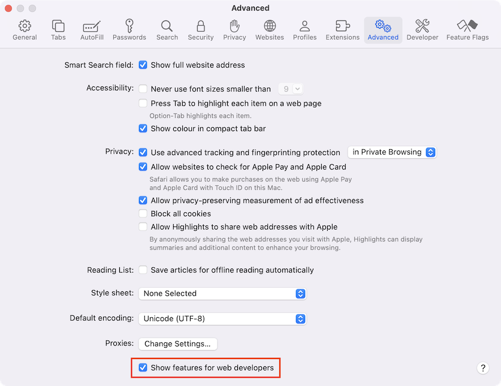

# Dasturchi konsoli

Kod hatolarga moyil. Siz dasturlash jarayonida ehtimol hatolar qilasiz... Voy, men nima haqida gapiryapman? Siz _albatta_ hatolar qilasiz, agar siz inson bo'lsangiz, [robot](<https://en.wikipedia.org/wiki/Bender_(Futurama)>) emas.

Ammo brauzerda foydalanuvchilar standart ravishda xatolarni ko'rmaydilar. Shunday qilib, agar skriptda biror narsa noto'g'ri bo'lsa, biz buzilgan narsani ko'rmaymiz va uni tuzata olmaymiz.

Xatolarni ko'rish va skriptlar haqida ko'plab boshqa foydali ma'lumotlarga ega bo'lish uchun brauzerlarda "dasturchilar uchun vositalar" joylashtirilgan.

Ko'pchilik dasturchilar Chrome yoki Firefox brauzerlarini ishlatadilar, chunki ular eng yaxshi dasturchilar uchun vositalar bilan jihozlangan. Boshqa brauzerlar ham ba'zan maxsus xususiyatlarga ega va dasturchilar uchun vositalar bilan ta'minlangan, lekin odatda Chrome yoki Firefox ishlatiladi. Ko'pchilik dasturchilar "sevimli" brauzerga ega va agar muammo brauzerga xos bo'lsa, boshqalarga o'tadilar.

Dasturchilar uchun vositalar juda kuchli; ular ko'p xususiyatlarga ega. Boshlash uchun biz ularni qanday ochishni o'rganamiz, xatolarni ko'ramiz va JavaScript buyruqlarini ishga tushiramiz.

## Google Chrome

[bug.html](bug.html) sahifasini oching.

Unda JavaScript kodida xatolik bor. Bu oddiy foydalanuvchining ko'zidan yashirin, shuning uchun uni ko'rish uchun dasturchilar uchun vositalarni ochaylik.

`key:F12` ni bosing yoki, agar Mac ishlatsangiz, `key:Cmd+Opt+J` ni bosing.

Dasturchilar uchun vositalar standart ravishda Console yorlig'ida ochiladi.

Bu shunday ko'rinadi:


Dasturchilar vositalarining aniq ko'rinishi sizning Chrome versiyangizga bog'liq. U vaqti-vaqti bilan o'zgarib turadi, ammo shunga o'xshash bo'lishi kerak.

- Bu yerda biz qizil rangli xato xabarini ko'rishimiz mumkin. Bunday holda, skriptda noma'lum "lalala" buyrug'i mavjud.
- O'ng tomonda xato yuzaga kelgan satr raqami bilan `bug.html:12` manbasiga bosish mumkin bo'lgan havola mavjud.

Xato xabari ostida ko'k `>` belgisi mavjud. Bu biz JavaScript buyruqlarini kiritishimiz mumkin bo'lgan "buyruqlar satrini" belgilaydi. Ularni ishga tushirish uchun `key:Enter` tugmasini bosing. (Ko'p qatorli buyruqlarni kiritish uchun `key:Shift+Enter` tugmasini bosing).

Endi biz xatolarni ko'rishimiz mumkin va bu boshlash uchun etarli. Biz keyinchalik dasturchilar uchun vositalariga qaytamiz va <info:debugging-chrome> bo'limida debugging (dastur kodidagi xatolarni topish va tuzatish) ni batafsil ko'rib chiqamiz.

```smart header="Ko'p qatorli kiritish"
Odatda, biz konsolga kod satrini qo'yib, keyin `key:Enter` ni bossak, u amalga oshadi.

Bir nechta qatorni kiritish uchun `key:Shift+Enter` ni bosing. Shu tarzda JavaScript kodining uzun qismlarini kiritish mumkin.
```

## Firefox, Edge va boshqalar

Ko'pchilik boshqa brauzerlar dasturchilar uchun vositalarni ochish uchun `key:F12` dan foydalanadilar.

Ularning tashqi ko'rinishi va hissi o'xshash. Ushbu vositalardan birini qanday ishlatishni bilsangiz (Chrome dan boshlashingiz mumkin), boshqasiga osongina o'tishingiz mumkin.

## Safari

Safari (Windows/Linux tomonidan qo'llab-quvvatlanmaydigan Mac brauzeri) bu yerda biroz o'ziga xosdir. Avval "Dasturchi menyusini" yoqishimiz kerak.

Preferences ni oching va "Advanced" oynasiga o'ting. Pastki qismida belgilash katakchasi mavjud:



Endi `key:Cmd+Opt+C` tugmasini bosib konsolni faollashtirish mumkin. Bundan tashqari, "Develop" deb nomlangan yangi yuqori menyu elementiga e'tibor bering. Bu juda ko'p buyruqlar va variantlarga ega.

## Xulosa

- Dasturchilar uchun vositalar bizga xatolarni ko'rish, buyruqlarni ishga tushirish, o'zgaruvchilarni tekshirish va boshqa ko'p narsalarni qilish imkonini beradi.
- Ular ko'pchilik brauzerlarda `key:F12` tugmasi bilan ochilishi mumkin. Chrome Mac uchun `key:Cmd+Opt+J`, Safari: `key:Cmd+Opt+C` (avval "Dasturchi menyusini" yoqishingiz kerak).

Hozir bizda muhit tayyor. Keyingi bo'limda JavaScriptga kirishamiz.
