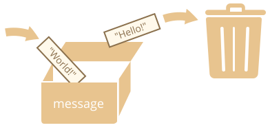

# O'zgaruvchilar

Ko'pincha JavaScript ilovasi ma'lumotlar bilan ishlashi kerak. Mana ikkita misol:
1. Onlayn do'kon -- ma'lumotlar sotiladigan tovarlar va xarid savatchasini o'z ichiga olishi mumkin.
2. Chat ilovasi -- ma'lumotlar foydalanuvchilar, xabarlar va boshqa ko'p narsalarni o'z ichiga olishi mumkin.

O'zgaruvchilar bu ma'lumotlarni saqlash uchun ishlatiladi.

## O'zgaruvchi

[O'zgaruvchi](https://en.wikipedia.org/wiki/Variable_(computer_science)) - bu ma'lumotlar uchun "nomli xotira". Biz o'zgaruvchilardan tovarlar, tashrif buyuruvchilar va boshqa ma'lumotlarni saqlash uchun foydalanishimiz mumkin.

JavaScript da o'zgaruvchi yaratish uchun `let` kalit so'zidan foydalaning.

Quyidagi bayonot "message" nomli o'zgaruvchini yaratadi (boshqacha qilib aytganda: *e'lon qiladi*):

```js
let message;
```

Endi biz unga tayinlash operatori `=` yordamida ma'lumot kiritishimiz mumkin:

```js
let message;

*!*
<<<<<<< HEAD
message = 'Hello'; // 'Hello' stringini message nomli o'zgaruvchiga saqlash
=======
message = 'Hello'; // store the string 'Hello' in the variable named message
>>>>>>> 5e893cffce8e2346d4e50926d5148c70af172533
*/!*
```

String endi o'zgaruvchi bilan bog'langan xotira maydoniga saqlandi. Biz unga o'zgaruvchi nomi orqali murojaat qilishimiz mumkin:

```js run
let message;
message = 'Hello!';

*!*
alert(message); // o'zgaruvchi mazmunini ko'rsatadi
*/!*
```

Qisqalik uchun biz o'zgaruvchini e'lon qilish va tayinlashni bitta satrga birlashtirishimiz mumkin:

```js run
let message = 'Hello!'; // o'zgaruvchini aniqlash va qiymat berish

alert(message); // Hello!
```

Shuningdek, bir satrda bir nechta o'zgaruvchini e'lon qilishimiz mumkin:

```js no-beautify
let user = 'John', age = 25, message = 'Hello';
```

Bu qisqaroq ko'rinishi mumkin, ammo biz buni tavsiya qilmaymiz. Yaxshiroq o'qish uchun har bir o'zgaruvchi uchun alohida satr ishlatishni so'raymiz.

Ko'p satrli variant biroz uzunroq, ammo o'qish osonroq:

```js
let user = 'John';
let age = 25;
let message = 'Hello';
```

<<<<<<< HEAD
Ba'zi odamlar ko'p satrli uslubda bir nechta o'zgaruvchilarni aniqlaydi:
=======
Some people also define multiple variables in this multiline style:
>>>>>>> 5e893cffce8e2346d4e50926d5148c70af172533

```js no-beautify
let user = 'John',
  age = 25,
  message = 'Hello';
```

Yoki hatto "vergul-birinchi" uslubida:

```js no-beautify
let user = 'John'
  , age = 25
  , message = 'Hello';
```

Texnik jihatdan, bu variantlarning barchasi bir xil ishni bajaradi. Demak, bu shaxsiy did va estetika masalasi.

````smart header="`let` o'rniga `var`"
Eski skriptlarda siz boshqa kalit so'zni ham topishingiz mumkin: `let` o'rniga `var`:

```js
*!*var*/!* message = 'Hello';
```

<<<<<<< HEAD
`var` kalit so'zi `let` bilan *deyarli* bir xil. U ham o'zgaruvchini e'lon qiladi, ammo biroz boshqacha, "eski maktab" usulida.

`let` va `var` orasida nozik farqlar bor, ammo ular bizga hali muhim emas. Biz ularni <info:var> bobida batafsil ko'rib chiqamiz.
=======
The `var` keyword is *almost* the same as `let`. It also declares a variable but in a slightly different, "old-school" way.

There are subtle differences between `let` and `var`, but they do not matter to us yet. We'll cover them in detail in the chapter <info:var>.
>>>>>>> 5e893cffce8e2346d4e50926d5148c70af172533
````

## Hayotiy o'xshashlik

Agar uni ma'lumotlar uchun "quti" sifatida tasavvur qilsak, unda noyob nomlangan stiker yopishtirilgan bo'lsa, "o'zgaruvchi" tushunchasini osongina tushunishimiz mumkin.

<<<<<<< HEAD
Masalan, `message` o'zgaruvchisini ichida `"Hello!"` qiymati bo'lgan `"message"` yorlig'i bilan qutiga o'xshatish mumkin:
=======
For instance, the variable `message` can be imagined as a box labelled `"message"` with the value `"Hello!"` in it:
>>>>>>> 5e893cffce8e2346d4e50926d5148c70af172533


Biz qutiga istalgan qiymatni qo'yishimiz mumkin.

Shuningdek, uni xohlagancha marta o'zgartirishimiz mumkin:

<<<<<<< HEAD
=======
We can also change it as many times as we want:

>>>>>>> 5e893cffce8e2346d4e50926d5148c70af172533
```js run
let message;

message = 'Hello!';

message = 'World!'; // qiymat o'zgartirildi

alert(message);
```

Qiymat o'zgartirilganda, eski ma'lumotlar o'zgaruvchidan olib tashlanadi:



Shuningdek, biz ikkita o'zgaruvchini e'lon qilishimiz va biridan ikkinchisiga ma'lumotlarni nusxalashimiz mumkin.

```js run
let hello = 'Hello world!';

let message;

*!*
// 'Hello world' ni hello dan message ga nusxalash
message = hello;
*/!*

// endi ikkita o'zgaruvchi bir xil ma'lumotni saqlaydi
alert(hello); // Hello world!
alert(message); // Hello world!
```

````warn header="Ikki marta e'lon qilish xatolikka olib keladi"
O'zgaruvchi faqat bir marta e'lon qilinishi kerak.

Bir xil o'zgaruvchining takroriy e'lon qilinishi xato hisoblanadi:

```js run
let message = "This";

// takroriy 'let' xatolikka olib keladi
let message = "That"; // SyntaxError: 'message' has already been declared
```
Demak, biz o'zgaruvchini bir marta e'lon qilishimizdan keyin unga `let` ishlatmasdan murojaat qilishimiz kerak.
````

<<<<<<< HEAD
```smart header="Funksional tillar"
Qiziq tomoni shundaki, [sof funksional](https://en.wikipedia.org/wiki/Purely_functional_programming) dasturlash tillari mavjud, masalan [Haskell](https://en.wikipedia.org/wiki/Haskell), ular o'zgaruvchi qiymatlarini o'zgartirishni taqiqlaydi.
=======
```smart header="Functional languages"
It's interesting to note that there exist so-called [pure functional](https://en.wikipedia.org/wiki/Purely_functional_programming) programming languages, such as [Haskell](https://en.wikipedia.org/wiki/Haskell), that forbid changing variable values.
>>>>>>> 5e893cffce8e2346d4e50926d5148c70af172533

Bunday tillarda qiymat "qutiga" saqlangandan so'ng, u abadiy u yerda qoladi. Agar biz boshqa narsani saqlashimiz kerak bo'lsa, til bizni yangi quti yaratishga (yangi o'zgaruvchi e'lon qilishga) majbur qiladi. Eskisini qayta ishlatib bo'lmaydi.

<<<<<<< HEAD
Dastlabki qarashda biroz g'alati tuyulishi mumkin bo'lsa-da, bu tillar jiddiy ishlanmaga juda qodir. Bundan tashqari, parallel hisoblashlar kabi sohalar mavjud bo'lib, bu cheklov ma'lum afzalliklarni beradi.
=======
Though it may seem a little odd at first sight, these languages are quite capable of serious development. More than that, there are areas like parallel computations where this limitation confers certain benefits.
>>>>>>> 5e893cffce8e2346d4e50926d5148c70af172533
```

## O'zgaruvchilarni nomlash [#variable-naming]

JavaScript da o'zgaruvchi nomlari uchun ikkita cheklov mavjud:

1. Nom faqat harflar, raqamlar yoki `$` va `_` belgilarini o'z ichiga olishi kerak.
2. Birinchi belgi raqam bo'lmasligi kerak.

To'g'ri nomlar misollari:

```js
let userName;
let test123;
```

Nom bir nechta so'zdan iborat bo'lganda, odatda [camelCase](https://en.wikipedia.org/wiki/CamelCase) dan foydalaniladi. Ya'ni: so'zlar ketma-ket keladi, birinchisidan tashqari har bir so'z bosh harf bilan boshlanadi: `myVeryLongName`.

Qiziq tomoni -- dollar belgisi `'$'` va pastki chiziq `'_'` ham nomlarda ishlatilishi mumkin. Ular oddiy belgilar, xuddi harflar kabi, hech qanday maxsus ma'nosiz.

Bu nomlar to'g'ri:

```js run untrusted
let $ = 1; // "$" nomli o'zgaruvchi e'lon qilindi
let _ = 2; // va endi "_" nomli o'zgaruvchi

alert($ + _); // 3
```

Noto'g'ri o'zgaruvchi nomlari misollari:

```js no-beautify
let 1a; // raqam bilan boshlanishi mumkin emas

let my-name; // defislar '-' nomda ruxsat etilmagan
```

<<<<<<< HEAD
```smart header="Katta-kichik harflar muhim"
`apple` va `APPLE` nomli o'zgaruvchilar ikki xil o'zgaruvchidir.
```

````smart header="Lotin bo'lmagan harflarga ruxsat berilgan, ammo tavsiya etilmaydi"
Kirill harflari, xitoy logogrammalar va hokazo har qanday tildan foydalanish mumkin:
=======
```smart header="Case matters"
Variables named `apple` and `APPLE` are two different variables.
```

````smart header="Non-Latin letters are allowed, but not recommended"
It is possible to use any language, including Cyrillic letters, Chinese logograms and so on, like this:
>>>>>>> 5e893cffce8e2346d4e50926d5148c70af172533

```js
let имя = '...';
let 我 = '...';
```

<<<<<<< HEAD
Texnik jihatdan bu yerda xato yo'q. Bunday nomlar ruxsat etilgan, ammo o'zgaruvchi nomlarida ingliz tilidan foydalanish xalqaro konventsiya hisoblanadi. Kichik skript yozsak ham, uning oldida uzoq hayot bo'lishi mumkin. Boshqa mamlakatlardan odamlar uni o'qishlari kerak bo'lishi mumkin.
=======
Technically, there is no error here. Such names are allowed, but there is an international convention to use English in variable names. Even if we're writing a small script, it may have a long life ahead. People from other countries may need to read it sometime.
>>>>>>> 5e893cffce8e2346d4e50926d5148c70af172533
````

````warn header="Zaxiralangan nomlar"
Tilning o'zi tomonidan ishlatiladigan [zaxiralangan so'zlar ro'yxati](https://developer.mozilla.org/en-US/docs/Web/JavaScript/Reference/Lexical_grammar#Keywords) mavjud, ularni o'zgaruvchi nomi sifatida ishlatib bo'lmaydi.

Masalan: `let`, `class`, `return` va `function` zaxiralangan.

Quyidagi kod sintaksis xatosini beradi:

```js run no-beautify
let let = 5; // o'zgaruvchini "let" deb nomlab bo'lmaydi, xato!
let return = 5; // uni "return" deb ham nomlab bo'lmaydi, xato!
```
````

````warn header="`use strict` ishlatishdan tayinlash"

Odatda, o'zgaruvchini ishlatishdan oldin uni aniqlashimiz kerak. Ammo eski davrlarda `let` ishlatmasdan shunchaki qiymat tayinlash orqali o'zgaruvchi yaratish texnik jihatdan mumkin edi. Bu eski skriptlar bilan muvofiqlikni ta'minlash uchun skriptlarimizga `use strict` qo'ymasak, hali ham ishlaydi.

```js run no-strict
// e'tibor bering: bu misolda "use strict" yo'q

num = 5; // agar "num" o'zgaruvchisi mavjud bo'lmasa, u yaratiladi

alert(num); // 5
```

Bu yomon amaliyot va qattiq rejimda xatolikka olib keladi:

```js
"use strict";

*!*
num = 5; // xato: num aniqlanmagan
*/!*
```
````

## Konstantalar

O'zgarmas (o'zgarmaydigan) o'zgaruvchini e'lon qilish uchun `let` o'rniga `const` dan foydalaning:

```js
const myBirthday = '18.04.1982';
```

`const` yordamida e'lon qilingan o'zgaruvchilar "konstanta" deb ataladi. Ularni qayta tayinlab bo'lmaydi. Bunga urinish xatolikka olib keladi:

```js run
const myBirthday = '18.04.1982';

myBirthday = '01.01.2001'; // xato, konstantani qayta tayinlab bo'lmaydi!
```

<<<<<<< HEAD
Dasturchi o'zgaruvchi hech qachon o'zgarmasligiga ishonchi komil bo'lsa, bu faktni kafolatlash va hammaga etkazish uchun uni `const` bilan e'lon qilishi mumkin.

### Bosh harfli konstantalar
=======
When a programmer is sure that a variable will never change, they can declare it with `const` to guarantee and communicate that fact to everyone.
>>>>>>> 5e893cffce8e2346d4e50926d5148c70af172533

Bajarilishdan oldin ma'lum bo'lgan, eslab qolish qiyin bo'lgan qiymatlar uchun takma nom sifatida konstantalardan foydalanish keng tarqalgan amaliyot.

<<<<<<< HEAD
Bunday konstantalar bosh harflar va pastki chiziqlar yordamida nomlanadi.
=======
There is a widespread practice to use constants as aliases for difficult-to-remember values that are known before execution.
>>>>>>> 5e893cffce8e2346d4e50926d5148c70af172533

Masalan, "veb" (o'n oltilik) formatda ranglar uchun konstantalar yarataylik:

```js run
const COLOR_RED = "#F00";
const COLOR_GREEN = "#0F0";
const COLOR_BLUE = "#00F";
const COLOR_ORANGE = "#FF7F00";

// ...rang tanlashimiz kerak bo'lganda
let color = COLOR_ORANGE;
alert(color); // #FF7F00
```

Foydalar:

- `COLOR_ORANGE` ni `"#FF7F00"` dan ko'ra yodlash osonroq.
- `"#FF7F00"` da `COLOR_ORANGE` ga qaraganda xato qilish osonroq.
- Kodni o'qiyotganda `COLOR_ORANGE` `#FF7F00` dan ko'ra ancha mazmunli.

Konstanta uchun qachon bosh harflardan foydalanishimiz va qachon oddiy nomlashimiz kerak? Keling, buni aniqlashtiriruylik.

<<<<<<< HEAD
"Konstanta" bo'lish shunchaki o'zgaruvchining qiymati hech qachon o'zgarmasligini anglatadi. Ammo ba'zi konstantalar bajarilishdan oldin ma'lum (qizil uchun o'n oltilik qiymat kabi) va ba'zi konstantalar ish vaqtida, bajarilish davomida *hisoblanadi*, lekin boshlang'ich tayinlashdan keyin o'zgarmaydi.

Masalan:

=======
Being a "constant" just means that a variable's value never changes. But some constants are known before execution (like a hexadecimal value for red) and some constants are *calculated* in run-time, during the execution, but do not change after their initial assignment.

For instance:

>>>>>>> 5e893cffce8e2346d4e50926d5148c70af172533
```js
const pageLoadTime = /* veb-sahifa yuklanish vaqti */;
```

<<<<<<< HEAD
`pageLoadTime` ning qiymati sahifa yuklanishidan oldin ma'lum emas, shuning uchun u oddiy nomlanadi. Ammo bu hali ham konstanta, chunki tayinlashdan keyin o'zgarmaydi.

Boshqacha qilib aytganda, bosh harfli konstantalar faqat "qattiq kodlangan" qiymatlar uchun takma nom sifatida ishlatiladi.
=======
The value of `pageLoadTime` is not known before the page load, so it's named normally. But it's still a constant because it doesn't change after the assignment.

In other words, capital-named constants are only used as aliases for "hard-coded" values.
>>>>>>> 5e893cffce8e2346d4e50926d5148c70af172533

## Narsalarni to'g'ri nomlash

O'zgaruvchilar haqida gapirganda, yana bir juda muhim narsa bor.

O'zgaruvchi nomi toza, aniq ma'noga ega bo'lishi va u saqlaydigan ma'lumotlarni tasvirlashi kerak.

<<<<<<< HEAD
O'zgaruvchilarni nomlash dasturlashtirining eng muhim va murakkab ko'nikmalaridan biridir. O'zgaruvchi nomlariga bir qarash yangi boshlovchi yoki tajribali dasturchi tomonidan yozilgan kodni aniqlash mumkin.

Haqiqiy loyihada vaqtning ko'p qismi noldan butunlay alohida narsa yozishdan ko'ra mavjud kod bazasini o'zgartirish va kengaytirishga sarflanadi. Bir muddat boshqa ish bilan shug'ullanganimizdan keyin qandaydir kodga qaytsak, yaxshi belgilangan ma'lumotni topish ancha oson. Boshqacha qilib aytganda, o'zgaruvchilarning yaxshi nomlari bo'lganda.
=======
Variable naming is one of the most important and complex skills in programming. A glance at variable names can reveal which code was written by a beginner versus an experienced developer.

In a real project, most of the time is spent modifying and extending an existing code base rather than writing something completely separate from scratch. When we return to some code after doing something else for a while, it's much easier to find information that is well-labelled. Or, in other words, when the variables have good names.
>>>>>>> 5e893cffce8e2346d4e50926d5148c70af172533

O'zgaruvchini e'lon qilishdan oldin uning to'g'ri nomi haqida o'ylashga vaqt ajrating. Buni qilish sizga katta foyda keltiradi.

Bajarilishi kerak bo'lgan qoidalar:

<<<<<<< HEAD
- `userName` yoki `shoppingCart` kabi inson o'qiy oladigan nomlardan foydalaning.
- Nima qilayotganingizni bilmasangiz, `a`, `b` va `c` kabi qisqartmalar yoki qisqa nomlardan qoching.
- Nomlarni maksimal darajada tavsiflovchi va qisqa qiling. Yomon nomlar misollari `data` va `value`. Bunday nomlar hech narsa demaydi. Ularni faqat kod konteksti o'zgaruvchi qaysi ma'lumot yoki qiymatga ishora qilayotganini juda aniq qilsa ishlatish mumkin.
- Jamoangizdagi va fikringizdagi atamalar bo'yicha kelishing. Agar sayt tashrif buyuruvchisi "user" deb atalsa, biz tegishli o'zgaruvchilarni `currentVisitor` yoki `newManInTown` o'rniga `currentUser` yoki `newUser` deb nomlashimiz kerak.
=======
- Use human-readable names like `userName` or `shoppingCart`.
- Stay away from abbreviations or short names like `a`, `b`, and `c`, unless you know what you're doing.
- Make names maximally descriptive and concise. Examples of bad names are `data` and `value`. Such names say nothing. It's only okay to use them if the context of the code makes it exceptionally obvious which data or value the variable is referencing.
- Agree on terms within your team and in your mind. If a site visitor is called a "user" then we should name related variables `currentUser` or `newUser` instead of `currentVisitor` or `newManInTown`.
>>>>>>> 5e893cffce8e2346d4e50926d5148c70af172533

Oddiy eshitiladimi? Haqiqatan ham shunday, ammo amalda tavsiflovchi va qisqa o'zgaruvchi nomlari yaratish unchalik oson emas. Harakat qiling.

```smart header="Qayta ishlatish yoki yaratish?"
Va oxirgi eslatma. Ba'zi dangasa dasturchilar yangi o'zgaruvchilar e'lon qilish o'rniga mavjudlarini qayta ishlatishga moyil.

Natijada, ularning o'zgaruvchilari odamlar stikerlarini o'zgartirmasdan turli narsalarni tashlaydigan qutilarga o'xshaydi. Qutida hozir nima bor? Kim biladi? Yaqinroq kelib tekshirishimiz kerak.

Bunday dasturchilar o'zgaruvchi e'lon qilishda ozgina tejashadi, ammo disk raskadrovkada o'n barobar ko'proq yo'qotishadi.

Qo'shimcha o'zgaruvchi yaxshi, yomon emas.

Zamonaviy JavaScript minifikatorlari va brauzerlar kodni yetarlicha yaxshi optimallashtiradi, shuning uchun bu ishlash muammolarini yaratmaydi. Turli qiymatlar uchun turli o'zgaruvchilardan foydalanish hatto dvigatelga kodingizni optimallashtirashda yordam berishi mumkin.
```

## Xulosa

Biz `var`, `let` yoki `const` kalit so'zlari yordamida ma'lumotlarni saqlash uchun o'zgaruvchilar e'lon qilishimiz mumkin.

- `let` -- zamonaviy o'zgaruvchi e'loni.
- `var` -- eski maktab o'zgaruvchi e'loni. Odatda biz uni umuman ishlatmaymiz, ammo agar kerak bo'lsa, <info:var> bobida `let` dan nozik farqlarni ko'rib chiqamiz.
- `const` -- `let` ga o'xshaydi, ammo o'zgaruvchining qiymatini o'zgartirib bo'lmaydi.

O'zgaruvchilar ichida nima borligini osongina tushunishga imkon beradigan tarzda nomlanishi kerak.