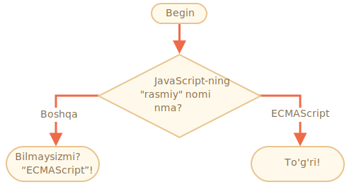

importance: 2

---

# JavaScript-ning nomi

"If..else" konstruktsiyasidan foydalanib, quyidagi kodni yozing: 'JavaScript-ning "rasmiy" nomi nima?'

<<<<<<< HEAD
Agar mehmon "ECMAScript" ni kiritsa, u holda "To'g'ri!", Aks holda: "Bilmadizmi? ECMAScript!" ni chiqarsin.
=======
If the visitor enters "ECMAScript", then output "Right!", otherwise -- output: "You don't know? ECMAScript!"
>>>>>>> fb4fc33a2234445808100ddc9f5e4dcec8b3d24c

[demo src="ifelse_task2"]
