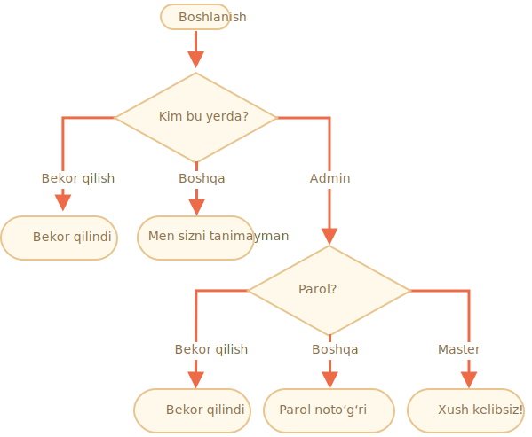

importance: 3

---

# Kirishni tekshiring

`prompt` bilan kirish uchun kod yozing.

Agar mehmon `"Admin"` matnini kiritsa, u holda parol `prompt` orqali so'raladi, agar bo'sh satr yoki `key:Esc` bolsa -- "Bekor qilindi" ko'rsatiladi, agar boshqa satr bo'lsa -- "Men sizni tanimayman" ko'rsatiladi.

Parol quyidagicha tekshiriladi:

- Agar u "Master" ga teng bo'lsa, unda "Xush kelibsiz!",
- Boshqa satr -- "Noto'g'ri parol" ko'rsatiladi,
- Bo'sh satr yoki bekor qilingan kiritish uchun "Bekor qilingdi" ko'rsatiladi.

Sxema:

Iltimos, ichki `if` bloklaridan foydalaning. Kodning umumiy o'qilishini yodda tuting.

Maslahat: so'rovga bo'sh matni kiritish, bo'sh matni `''` qaytaradi. So'rov vaqtida `key:ESC` tugmasi bosish `null` ni qaytaradi.

[demo]
