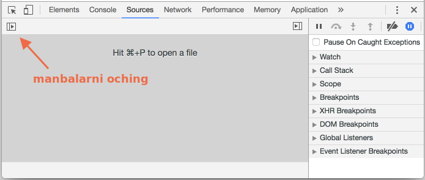
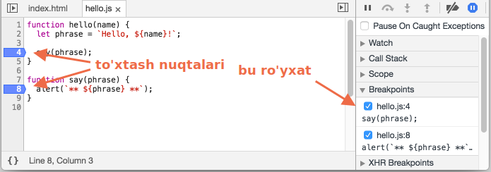
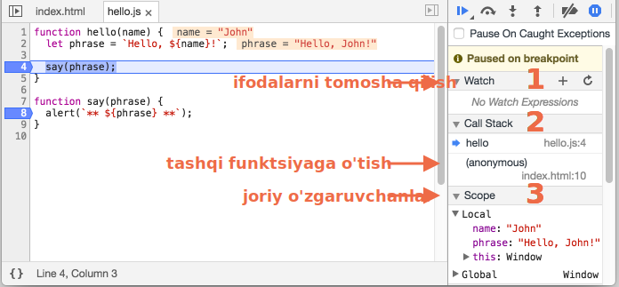
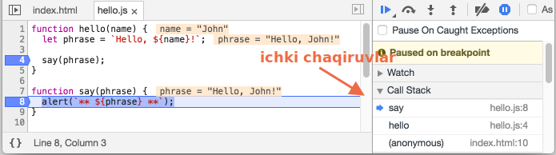

<<<<<<< HEAD
# Chrome da koddagi nosozliklarni tuzatish
=======
# Debugging in the browser
>>>>>>> fb4fc33a2234445808100ddc9f5e4dcec8b3d24c

Keyinchalik murakkab kodni yozishdan oldin, koddagi nosozliklar haqida gapiraylik.

<<<<<<< HEAD
Barcha zamonaviy brauzerlar va boshqa ko'pgina muhitlar "koddagi nosozliklarni tuzatish" ni qo'llab-quvvatlaydi -- ishlab chiquvchi vositalaridagi maxsus interfeys, bu xatolarni topish va tuzatishni ancha osonlashtiradi.

Biz bu erda Chrome-dan foydalanamiz, chunki u bu jihatlarga ko'ra eng boy xususiyatlarga ega.

## "Manbalar" oynasi («Sources»)
=======
[Debugging](https://en.wikipedia.org/wiki/Debugging) is the process of finding and fixing errors within a script. All modern browsers and most other environments support debugging tools -- a special UI in developer tools that makes debugging much easier. It also allows to trace the code step by step to see what exactly is going on.

We'll be using Chrome here, because it has enough features, most other browsers have a similar process.

## The "Sources" panel
>>>>>>> fb4fc33a2234445808100ddc9f5e4dcec8b3d24c

Chrome versiyangiz biroz boshqacha ko'rinishi mumkin, ammo u yerda nima borligi aniq bo'lishi kerak.

<<<<<<< HEAD
- Chrome-da [misol sahifasini](debugging/index.html) oching.
- Dastruchi vositalarini oching `key:F12` (Mac: `key:Cmd+Opt+I`).
- `manbalar` panelini tanlang.
=======
- Open the [example page](debugging/index.html) in Chrome.
- Turn on developer tools with `key:F12` (Mac: `key:Cmd+Opt+I`).
- Select the `Sources` panel.
>>>>>>> fb4fc33a2234445808100ddc9f5e4dcec8b3d24c

Agar buni birinchi marta qilsangiz, nimani ko'rishingiz kerak:



<<<<<<< HEAD
Radio tugmasi <span class="devtools" style="background-position:-168px -76px"></span> fayllar ro'yxati bilan yorliqni ochadi.

Keling, uni bosing va `index.html` ni tanlang va keyin daraxt ko'rinishida `hello.js` ni tanlang. Mana nimani ko'rsatishi kerak:


Bu yerda uchta zonani ko'rishimiz mumkin:

1. **Resurslar zonasi** HTML, JavaScript, CSS va boshqa fayllarni, shu jumladan sahifaga biriktirilgan rasmlarni ro'yxatlaydi. Chrome kengaytmalari bu yerda ham paydo bo'lishi mumkin.
2. **Manba zonasi** manba kodini ko'rsatadi.
3. **Axborot va boshqaruv zonasi** koddagi nosozliklarni tuzatish uchun mo'ljallangan, biz uni tez orada o'rganib chiqamiz.

Resurslar ro'yxatini yashirish va manba kodi uchun ekran maydonini bo'shatish uchun usha radio tugmasini bosing <span class="devtools" style="background-position:-200px -76px"></span>
=======
The toggler button <span class="devtools" style="background-position:-172px -98px"></span> opens the tab with files.

Let's click it and select `hello.js` in the tree view. Here's what should show up:


The Sources panel has 3 parts:

1. The **File Navigator** pane lists HTML, JavaScript, CSS and other files, including images that are attached to the page. Chrome extensions may appear here too.
2. The **Code Editor** pane shows the source code.
3. The **JavaScript Debugging** pane is for debugging, we'll explore it soon.

Now you could click the same toggler <span class="devtools" style="background-position:-172px -122px"></span> again to hide the resources list and give the code some space.
>>>>>>> fb4fc33a2234445808100ddc9f5e4dcec8b3d24c

## Konsol

<<<<<<< HEAD
Agar biz `Esc` tugmachasini bossak, u holda konsol quyida ochiladi. Biz u erga buyruqlar yozib, `key:Enter` tugma yordamida bajarishimiz mumkin.
=======
If we press `key:Esc`, then a console opens below. We can type commands there and press `key:Enter` to execute.
>>>>>>> fb4fc33a2234445808100ddc9f5e4dcec8b3d24c

Ifoda bajarilgandan so'ng uning natijasi quyida ko'rsatiladi.

<<<<<<< HEAD
Masalan, bu yerda `1+2` ning natijasi `3` ga teng, va `hello("debugger")` hech narsa qaytarmaydi, shuning uchun natijasi `undefined`:
=======
For example, here `1+2` results in `3`, while the function call `hello("debugger")` returns nothing, so the result is `undefined`:
>>>>>>> 34a80e70f8cce5794be259d25f815d7a7db7cbe3


## To'xtash nuqtalari

Keling, [misol sahifasi](debugging/index.html) kodida nimalar bo'layotganini ko'rib chiqaylik. `Hello.js` dagi `4` chi satrni bosing. Ha, kodda emas, balki `4` raqamni.

Tabriklaymiz! Siz to'xtash nuqtasini o'rnatdingiz. Iltimos, shuningdek, `8` satr raqamini bosing.

Bu shunday ko'rinishi kerak (ko'k bu bosish kerak bo'lgan joy):



*To'xtash nuqtasi* - bu koddagi nosozliklarni tuzatuvchi JavaScript-ni bajarilishini avtomatik ravishda to'xtatib turadigan kod nuqtasi.

Kod to'xtatib turilsa, biz mavjud o'zgaruvchanlarni tekshirib ko'rishimiz, konsolda buyruqlar bajarishimiz va h.k. Boshqacha qilib aytganda, koddagi nosozliklarni tuzatishimiz mumkin.

<<<<<<< HEAD
Biz har doim o'ng oynada to'xtash nuqtalarining ro'yxatini topishimiz mumkin. Bu turli xil fayllarda juda ko'p to'xtash nuqtalari mavjud bo'lganda foydalidir. Bu bizga quyidagilarga imkon beradi:
- Koddagi to'xtash nuqtasiga tezda o'tish (o'ng oynada uni bosish orqali).
- Tekshirish nuqtasini olib tashlab, uni o'chirib qo'yish.
- Sichqonchaning o'ng tugmachasini bosib, remove(o'chirish)-ni tanlab, to'xtash nuqtasini olib tashlash.
- ...Va hokazo.
=======
We can always find a list of breakpoints in the right panel. That's useful when we have many breakpoints in various files. It allows us to:
- Quickly jump to the breakpoint in the code (by clicking on it in the right panel).
- Temporarily disable the breakpoint by unchecking it.
- Remove the breakpoint by right-clicking and selecting Remove.
- ...And so on.
>>>>>>> fb4fc33a2234445808100ddc9f5e4dcec8b3d24c

<<<<<<< HEAD
```smart header="Shartli to'xtash nuqtalari"
Satr raqamidagi *o'ng tugmachani* bosish *shartli* to'xtash nuqtasini yaratishga imkon beradi. Bu faqat berilgan ifoda haqiqat bo'lganda boshlanadi.
=======
```smart header="Conditional breakpoints"
*Right click* on the line number allows to create a *conditional* breakpoint. It only triggers when the given expression, that you should provide when you create it, is truthy.
>>>>>>> 34a80e70f8cce5794be259d25f815d7a7db7cbe3

Bu faqat ma'lum bir o'zgaruvchan qiymat yoki funktsiya parametrlari uchun to'xtashimiz kerak bo'lganda qulay.
```

<<<<<<< HEAD
## Koddagi nosozliklarni tuzatuvchi buyrug'i
=======
## The command "debugger"
>>>>>>> 34a80e70f8cce5794be259d25f815d7a7db7cbe3

<<<<<<< HEAD
Kodni quyidagi kabi `koddagi nosozliklarni tuzatuvchi` buyrug'i yordamida to'xtatib turishimiz mumkin:
=======
We can also pause the code by using the `debugger` command in it, like this:
>>>>>>> fb4fc33a2234445808100ddc9f5e4dcec8b3d24c

```js
function hello(name) {
  let phrase = `Salom, ${name}!`;

*!*
  debugger;  // <-- koddagi nosozliklarni tuzatuvchi shu yerda to'xtaydi
*/!*

  say(phrase);
}
```

<<<<<<< HEAD
Bu biz kod muharririda bo'lganimizda va brauzerga o'tishni xohlamasak va to'xtash nuqtasini o'rnatish uchun ishlab chiquvchi vositalarida skriptni qidirishni istamasak, bu juda qulay.

=======
Such command works only when the development tools are open, otherwise the browser ignores it.
>>>>>>> 34a80e70f8cce5794be259d25f815d7a7db7cbe3

## Kodni to'xtatib turing va atrofga nazar tashlang

<<<<<<< HEAD
Bizning misolimizda sahifani yuklash paytida `hello()` chaqiriladi, shuning uchun koddagi nosozliklarni tuzatuvchi faollashtirishning eng oson usuli bu sahifani qayta yuklashdir. Keling, `key:F5` (Windows, Linux) yoki `key:Cmd+R` (Mac) bosing.
=======
In our example, `hello()` is called during the page load, so the easiest way to activate the debugger (after we've set the breakpoints) is to reload the page. So let's press `key:F5` (Windows, Linux) or `key:Cmd+R` (Mac).
>>>>>>> fb4fc33a2234445808100ddc9f5e4dcec8b3d24c

To'xtash nuqtasi o'rnatilganda, ijro 4-satrda to'xtatiladi:



Iltimos, ma'lumotlar ochiladigan sahifalarni o'ng tomonga oching (o'qlar bilan belgilangan). Ular sizga joriy kod holatini tekshirishga imkon beradi:

1. **`Watch` -- har qanday ifodalar uchun joriy qiymatlarni ko'rsatadi.**

<<<<<<< HEAD
    Siz ortiqcha `+` tugmachasini bosishingiz va ifodani kiritishingiz mumkin. Koddagi nosozliklarni tuzatuvchi har qanday vaqtda o'z qiymatini ko'rsatadi, uni bajarish jarayonida avtomatik ravishda qayta hisoblab chiqadi.
=======
    You can click the plus `+` and input an expression. The debugger will show its value, automatically recalculating it in the process of execution.
>>>>>>> 34a80e70f8cce5794be259d25f815d7a7db7cbe3

2. **`Call Stack` -- ulanish chaqiruvlar zanjirini ko'rsatadi.**

    Hozirgi vaqtda koddagi nosozliklarni tuzatuvchi `hello()` chaqiruvi ichida `index.html` dagi skript bilan chaqirilgan (u erda hech qanday funktsiya yo'q, shuning uchun "anonim" deb nomlanadi).

<<<<<<< HEAD
    Agar siz stek elementini bosgan bo'lsangiz, koddagi nosozliklarni tuzatuvchi mos keladigan kodga o'tadi va uning barcha o'zgaruvchanlari ham tekshirishi mumkin.
3. **`Scope` -- joriy o'zgaruvchanlar.**
=======
    If you click on a stack item (e.g. "anonymous"), the debugger jumps to the corresponding code, and all its variables can be examined as well.
3. **`Scope` -- current variables.**
>>>>>>> fb4fc33a2234445808100ddc9f5e4dcec8b3d24c

    `Local` ichki funktsiya o'zgaruvchanlarini ko'rsatadi. Shuningdek, ularning ta'kidlangan qiymatlarini manba ustida ko'rishingiz mumkin.

    `Global` global o'zgaruvchanlarga ega (har qanday funktsiyalardan tashqari).

    U erda biz hali o'rganmagan `this` kalit so'z ham bor, lekin buni tez orada o'rganamiz.

## Ijro etilishini kuzatish

Endi skriptni *ijro etilishini kuzatish* vaqti keldi.

<<<<<<< HEAD
O'ng oynaning yuqori qismida buning uchun tugmalar mavjud. Keling, ularni o'rganib chiqaylik.

<span class="devtools" style="background-position:-7px -76px"></span> -- ijro etishni davom eting, tezkor tugma `key:F8`.
: Ijro etishni davom ettiradi. Agar qo'shimcha to'xtash nuqtalari bo'lmasa, unda bajarish davom etadi va koddagi nosozliklarni tuzatuvchi boshqaruvni yo'qotadi.
=======
There are buttons for it at the top of the right panel. Let's engage them.
<!-- https://github.com/ChromeDevTools/devtools-frontend/blob/master/front_end/Images/src/largeIcons.svg -->
<span class="devtools" style="background-position:-146px -168px"></span> -- "Resume": continue the execution, hotkey `key:F8`.
: Resumes the execution. If there are no additional breakpoints, then the execution just continues and the debugger loses control.
>>>>>>> fb4fc33a2234445808100ddc9f5e4dcec8b3d24c

    Uni bosgandan keyin nimani ko'rishimiz mumkin:

    
<<<<<<< HEAD

    Ijro etilish davom ettirilib, `say()` ichidagi boshqa to'xtash nuqtasiga yetdi va u yerda to'xtab qoldi. O'ng tarafdagi "Chaqiruvlar to'plami" ga qarang. Bu yana bitta chaqiruvga ko'paygan. Biz hozir `say()` ni ichidamiz.

<span class="devtools" style="background-position:-137px -76px"></span> -- qadam qo'yish (keyingi buyruqni bajaring), lekin *funktsiyasiga kirmang*, tezkor tugma `key:F10`.
: Agar hozir uni bossak, `alert` ko'rsatiladi. Muhimi shundaki, `alert` har qanday funktsiya bo'lishi mumkin, ijro etish "undan sakrab o'tadi", ichki funktsiyalarni o'tkazib yuboradi.

<span class="devtools" style="background-position:-72px -76px"></span> -- qadam qo'yish, tezkor tugma `key:F11`.
: Oldingi bilan bir xil, ammo ichki qadam vazifalariga "qadam qo'yadi". Buni bosish barcha skript harakatlariga birma-bir qadam qo'yadi.

<span class="devtools" style="background-position:-104px -76px"></span> -- joriy funktsiyani oxirigacha bajarishni davom etish, tezkor tugma `key:Shift+F11`.
: Ijro etilish joriy funktsiyalarning oxirgi satrda to'xtaydi. Biz tasodifan <span class="devtools" style="background-position:-72px -76px"></span> yordamida ichki chaqiruvni kiritganimizda bu juda qulay, ammo bu bizni qiziqtirmaydi va biz oxirigacha davom etishni imkoni boricha tezda xohlaymiz.

<span class="devtools" style="background-position:-7px -28px"></span> -- barcha to'xtash nuqtalarini yoqish/o'chirish.
: Ushbu tugma ijro etishni harakatga keltirmaydi. To'xtash nuqtalarni faqat yoqadi/o'chiradi.

<span class="devtools" style="background-position:-264px -4px"></span> -- xatolik yuz berganda avtomatik to'xtatishni yoqish/o'chirish.
: Yoqilganda va dasturchi vositalari ochiq bo'lsa, skript xatosi avtomatik ravishda bajarilishini to'xtatadi. Keyin nima o'zgarganligini ko'rish uchun o'zgaruvchanlarni tahlil qilishimiz mumkin. Shunday qilib, agar bizning skriptimiz xato bilan to'xtasa, biz koddagi nosozliklarni tuzatuvchi vositasini ochib, ushbu parametrni yoqib, sahifani qayta yuklashimiz mumkin, u qayerda to'xtashini va o'sha paytda qanday qiymatda ekanligini bilib olishimiz mumkin.
=======

    The execution has resumed, reached another breakpoint inside `say()` and paused there. Take a look at the "Call Stack" at the right. It has increased by one more call. We're inside `say()` now.

<span class="devtools" style="background-position:-200px -190px"></span> -- "Step": run the next command, hotkey `key:F9`.
: Run the next statement. If we click it now, `alert` will be shown.

    Clicking this again and again will step through all script statements one by one.

<span class="devtools" style="background-position:-62px -192px"></span> -- "Step over": run the next command, but *don't go into a function*, hotkey `key:F10`.
: Similar to the previous "Step" command, but behaves differently if the next statement is a function call (not a built-in, like `alert`, but a function of our own).

    If we compare them, the "Step" command goes into a nested function call and pauses the execution at its first line, while "Step over" executes the nested function call invisibly to us, skipping the function internals.

    The execution is then paused immediately after that function call.

    That's good if we're not interested to see what happens inside the function call.

<span class="devtools" style="background-position:-4px -194px"></span> -- "Step into", hotkey `key:F11`.
: That's similar to "Step", but behaves differently in case of asynchronous function calls. If you're only starting to learn JavaScript, then you can ignore the difference, as we don't have asynchronous calls yet.

    For the future, just note that "Step" command ignores async actions, such as `setTimeout` (scheduled function call), that execute later. The "Step into" goes into their code, waiting for them if necessary. See [DevTools manual](https://developers.google.com/web/updates/2018/01/devtools#async) for more details.

<span class="devtools" style="background-position:-32px -194px"></span> -- "Step out": continue the execution till the end of the current function, hotkey `key:Shift+F11`.
: Continue the execution and stop it at the very last line of the current function. That's handy when we accidentally entered a nested call using <span class="devtools" style="background-position:-200px -190px"></span>, but it does not interest us, and we want to continue to its end as soon as possible.

<span class="devtools" style="background-position:-61px -74px"></span> -- enable/disable all breakpoints.
: That button does not move the execution. Just a mass on/off for breakpoints.

<span class="devtools" style="background-position:-90px -146px"></span> -- enable/disable automatic pause in case of an error.
<<<<<<< HEAD
: When enabled, and the developer tools is open, a script error automatically pauses the execution. Then we can analyze variables to see what went wrong. So if our script dies with an error, we can open debugger, enable this option and reload the page to see where it dies and what's the context at that moment.
>>>>>>> fb4fc33a2234445808100ddc9f5e4dcec8b3d24c
=======
: When enabled, if the developer tools is open, an error during the script execution automatically pauses it. Then we can analyze variables in the debugger to see what went wrong. So if our script dies with an error, we can open debugger, enable this option and reload the page to see where it dies and what's the context at that moment.
>>>>>>> 34a80e70f8cce5794be259d25f815d7a7db7cbe3

```smart header="Bu erda davom eting"
Kod satriga sichqonchaning o'ng tugmasi bilan bosish kontekst menyusini "Bu erda davom eting" ochadi.

<<<<<<< HEAD
Bu biz bir necha qadam oldinga siljishni xohlaganimizda qulay, ammo biz to'xtash nuqtasini o'rnatishga dangasa bo'lsak.
=======
That's handy when we want to move multiple steps forward to the line, but we're too lazy to set a breakpoint.
>>>>>>> fb4fc33a2234445808100ddc9f5e4dcec8b3d24c
```

## Konsolga chiqarish

<<<<<<< HEAD
Konsolga biror narsa chiqarish uchun `console.log` funktsiyasi mavjud.
=======
To output something to console from our code, there's `console.log` function.
>>>>>>> fb4fc33a2234445808100ddc9f5e4dcec8b3d24c

Masalan, bu konsolga `0` dan `4` gacha bo'lgan qiymatlarni chiqaradi:

```js run
// ko'rish uchun konsolni oching
for (let i = 0; i < 5; i++) {
<<<<<<< HEAD
  console.log("qiymat", i);
}
```

Muntazam foydalanuvchilar ushbu chiqishni ko'rmaydilar, u konsolda. Buni ko'rish uchun dasturchi vositalarining konsol yorlig'ini oching yoki boshqa tugmachada: tugmachani ochadigan `key:Esc` tugmachasini bosing.
=======
  console.log("value,", i);
}
```

Regular users don't see that output, it is in the console. To see it, either open the Console panel of developer tools or press `key:Esc` while in another panel: that opens the console at the bottom.
>>>>>>> fb4fc33a2234445808100ddc9f5e4dcec8b3d24c

Agar bizning kodimizga kiritish yetarli bo'lsa, biz nima sodir bo'layotganini koddagi nosozliklarni tuzatuvchisiz ko'rishimiz mumkin.

## Xulosa

<<<<<<< HEAD
Ko'rib turganimizdek, skriptni to'xtatib turishning uchta asosiy usuli mavjud:
1. To'xtash nuqtasi.
2. "Koddagi nosozliklarni tuzatuvchi" ifodalari.
3. Xato (agar dasturchi vositalari ochiq bo'lsa va <span class ="devtools" style ="background-position: -264px -4px"></span> tugmasi "yoqilgan" bo'lsa)

Keyin biz o'zgaruvchanlarni ko'rib chiqamiz va bajarilish qayerda noto'g'ri ketayotganini bilib olamiz.
=======
As we can see, there are three main ways to pause a script:
1. A breakpoint.
2. The `debugger` statements.
3. An error (if dev tools are open and the button <span class="devtools" style="background-position:-90px -146px"></span> is "on").

<<<<<<< HEAD
When paused, we can debug - examine variables and trace the code to see where the execution goes wrong.
>>>>>>> fb4fc33a2234445808100ddc9f5e4dcec8b3d24c
=======
When paused, we can debug: examine variables and trace the code to see where the execution goes wrong.
>>>>>>> 34a80e70f8cce5794be259d25f815d7a7db7cbe3

Dasturchi vositalarda bu yerda ko'rib chiqilganidan ko'ra ko'proq imkoniyatlar mavjud. To'liq qo'llanma <https://developers.google.com/web/tools/chrome-devtools>.

Ushbu bobdan olingan ma'lumotlar koddagi nosozliklarni tuzatishni boshlash uchun yetarli, ammo keyinroq, ayniqsa brauzerda juda ko'p narsalarni qilsangiz, iltimos, u yerga o'ting va dasturchi vositalarning yanada rivojlangan imkoniyatlarini ko'rib chiqing.

<<<<<<< HEAD
Eh, shuningdek, siz dasturchi vositalarning turli joylarini bosishingiz va nima ko'rinishini bilishingiz mumkin. Bu, ehtimol, dasturchi vositalarini o'rganish uchun eng tez marshrut. Sichqonchaning o'ng tugmachasini bosishni ham unutmang!
=======
Oh, and also you can click at various places of dev tools and just see what's showing up. That's probably the fastest route to learn dev tools. Don't forget about the right click and context menus!
>>>>>>> fb4fc33a2234445808100ddc9f5e4dcec8b3d24c
