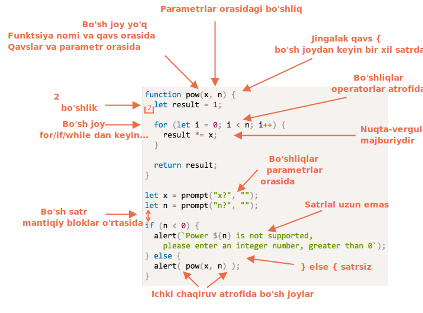

# Kodlash uslubi

Bizning kodimiz iloji boricha toza va oson o'qilishi kerak.

<<<<<<< HEAD
Aslida bu dasturlash san'ati -- murakkab vazifani bajarish, uni to'g'ri va odam tushunadigan tarzda kodlash.
=======
That is actually the art of programming -- to take a complex task and code it in a way that is both correct and human-readable. A good code style greatly assists in that.  
>>>>>>> fb4fc33a2234445808100ddc9f5e4dcec8b3d24c

## Sintaksis

<<<<<<< HEAD
Bu erda ba'zi bir tavsiya etilgan qoidalar bilan rasm mavjud (batafsil ma'lumot uchun pastga qarang):
=======
Here is a cheat sheet with some suggested rules (see below for more details):
>>>>>>> fb4fc33a2234445808100ddc9f5e4dcec8b3d24c


<!--
```js
function pow(x, n) {
  let result = 1;

  for (let i = 0; i < n; i++) {
    result *= x;
  }

  return result;
}

let x = prompt("x?", "");
let n = prompt("n?", "");

if (n < 0) {
<<<<<<< HEAD
  alert(`${n} darajasi  qo'llab-quvvatlanmaydi,
  iltimos, noldan katta sonni kiriting`);
=======
  alert(`Power ${n} is not supported,
    please enter a non-negative integer number`);
>>>>>>> fb4fc33a2234445808100ddc9f5e4dcec8b3d24c
} else {
  alert( pow(x, n) );
}
```

-->

Endi ularning qoidalari va sabablarini batafsil muhokama qilaylik.

<<<<<<< HEAD
```warn header="Hech qanday qoida qat'iy majburiy emas"
Bu yerda qat'iy qoidalar yo'q. Bu diniy dogmalar emas, balki uslubiy imtiyozlar.
=======
```warn header="There are no \"you must\" rules"
Nothing is set in stone here. These are style preferences, not religious dogmas.
>>>>>>> fb4fc33a2234445808100ddc9f5e4dcec8b3d24c
```

### Jingalak qavslar

Ko'pgina JavaScript loyihalarida jingalak qavslar "misrcha" uslubda yozilgan bo'lib, yangi satrda emas, balki mos keladigan kalit so'z bilan bir xil satrda ochiladi. Shuningdek, ochilish qavsidan oldin bo'sh joy bo'lishi kerak:

```js
if (shart) {
  // buni qiling
  // ...va buni
  // ...va buni
}
```

<<<<<<< HEAD
Bitta satrli qurilish muhim ahamiyatga ega. Qavslarni har doim ishlatishimiz kerakmi? Agar yo'q bo'lsa, unda qayerda?
=======
A single-line construct, such as `if (condition) doSomething()`, is an important edge case. Should we use braces at all?
>>>>>>> fb4fc33a2234445808100ddc9f5e4dcec8b3d24c

Quyida bir nechta izohli variantlar keltirilgan, ularning o'zingiz o'qilishini baholashingiz mumkin:

<<<<<<< HEAD
<!--
```js no-beautify
if (n < 0) {alert(`${n} darajasi qollab-quvvatlanmaydi`);}

if (n < 0) alert(`${n} darajasi qollab-quvvatlanmaydi`);

if (n < 0)
  alert(`${n} darajasi qollab-quvvatlanmaydi`);

if (n < 0) {
  alert(`${n} darajasi qollab-quvvatlanmaydi`);
}
```
-->


Xulosa uchun:
- Juda qisqa kod uchun bitta satr qabul qilinadi. Masalan: `if (cond) return null`.
- Ammo qavsdagi har bir ifoda uchun alohida satr o'qilish uchun odatda osonroq.

### Satr uzunligi

Kodning uzun gorizontal satrini o'qishni hech kim yoqtirmaydi. Ularni ajratish va chiziqlar uzunligini cheklash eng yaxshi amaliyotdir.
=======
1. 😠 Beginners sometimes do that. Bad! Curly braces are not needed:
    ```js
    if (n < 0) *!*{*/!*alert(`Power ${n} is not supported`);*!*}*/!*
    ```
2. 😠 Split to a separate line without braces. Never do that, easy to make an error when adding new lines:
    ```js
    if (n < 0)
      alert(`Power ${n} is not supported`);
    ```
3. 😏 One line without braces - acceptable, if it's short:
    ```js
    if (n < 0) alert(`Power ${n} is not supported`);
    ```
4. 😃 The best variant:
    ```js
    if (n < 0) {
      alert(`Power ${n} is not supported`);
    }
    ```

For a very brief code, one line is allowed, e.g. `if (cond) return null`. But a code block (the last variant) is usually more readable.

### Line Length

No one likes to read a long horizontal line of code. It's best practice to split them.

For example:
```js
// backtick quotes ` allow to split the string into multiple lines
let str = `
  ECMA International's TC39 is a group of JavaScript developers,
  implementers, academics, and more, collaborating with the community
  to maintain and evolve the definition of JavaScript.
`;
```

And, for `if` statements:

```js
if (
  id === 123 &&
  moonPhase === 'Waning Gibbous' &&
  zodiacSign === 'Libra'
) {
  letTheSorceryBegin();
}
```
>>>>>>> fb4fc33a2234445808100ddc9f5e4dcec8b3d24c

Satrning maksimal uzunligi jamoa darajasida kelishilgan bo'lishi kerak. Odatda 80 yoki 120 ta belgidan iborat.

### Satr boshidagi bo'shliqlar

Ikkita satr boshidagi bo'shliqlar mavjud:

- **Gorizontal satr boshidagi bo'shliqlar: 2 yoki 4 bo'shliqlar.**

<<<<<<< HEAD
    Gorizontal satr boshidagi bo'shliqlar 2 yoki 4 joy yoki "Tab" belgisi yordamida amalga oshiriladi. Qaysi birini tanlash - bu sizning ixtiyoringiz. Hozirgi kunda bo'shliqlar keng tarqalgan.

    Satr boshidagi bo'shliqlarning tabdan afzalliklaridan biri shundaki, bo'shliqlar "Tab" belgisiga qaraganda chuqurroq moslashuvchan konfiguratsiyalarga imkon beradi.

    Masalan, biz argumentlarni ochuvchi qavs bilan moslashtirishimiz mumkin, masalan:
=======
    A horizontal indentation is made using either 2 or 4 spaces or the horizontal tab symbol (key `key:Tab`). Which one to choose is an old holy war. Spaces are more common nowadays.

    One advantage of spaces over tabs is that spaces allow more flexible configurations of indents than the tab symbol.

    For instance, we can align the parameters with the opening bracket, like this:
>>>>>>> fb4fc33a2234445808100ddc9f5e4dcec8b3d24c

    ```js no-beautify
    show(parametrlar,
         birin,  
         ketin,
         yozilgan
      ) {
      // ...
    }
    ```

- **Vertikal satr boshidagi bo'shliqlar: kodni mantiqiy bloklarga bo'lish uchun bo'sh satrlar.**

    Hatto bitta funktsiyani ham ko'pincha mantiqiy bloklarga bo'lish mumkin. Quyidagi misolda o'zgaruvchanlarni ishga tushirish, asosiy tsikl va natijani qaytarish vertikal ravishda bo'linadi:

    ```js
    function pow(x, n) {
      let result = 1;
      //              <--
      for (let i = 0; i < n; i++) {
        result *= x;
      }
      //              <--
      return result;
    }
    ```

    Kodni yanada o'qilishi oson qilish qo'shimcha yangi satrni kiriting. Vertikal satr boshidagi bo'shliqsiz to'qqiz qatordan ortiq kod bo'lmasligi kerak.

### Nuqta-vergular

Har bir ifodadan keyin, hatto uni o'tkazib yuborish mumkin bo'lsa ham, nuqta-vergul bo'lishi kerak.

<<<<<<< HEAD
Nuqta-vergul haqiqatan ham ixtiyoriy bo'lgan tillar mavjud va u kamdan kam qo'llaniladi. JavaScript-da, kengi satrga o'tish nuqta-vergul sifatida talqin qilinmaydigan holatlar mavjud, bu esa kodni xatolarga olib keladi.

Dasturchi sifatida yetuk bo'lishingiz bilan siz [StandardJS](https://standardjs.com/) kabi nuqta-vergulsiz uslubni tanlashingiz mumkin. O'sha vaqtga qadar yuzaga kelishi mumkin bo'lgan tuzoqlardan qochish uchun nuqta-verguldan foydalanish yaxshidir.
=======
There are languages where a semicolon is truly optional and it is rarely used. In JavaScript, though, there are cases where a line break is not interpreted as a semicolon, leaving the code vulnerable to errors. See more about that in the chapter <info:structure#semicolon>.

If you're an experienced JavaScript programmer, you may choose a no-semicolon code style like [StandardJS](https://standardjs.com/). Otherwise, it's best to use semicolons to avoid possible pitfalls. The majority of developers put semicolons.
>>>>>>> fb4fc33a2234445808100ddc9f5e4dcec8b3d24c

### Ulanish darajalari

Ulanish darajasi biroz bo'lishi kerak.

<<<<<<< HEAD
Ba'zan qo'shimcha ulanishdan saqlanish uchun ["continue"](info:while-for#continue) direktivasini tsiklda ishlatish yaxshi bo'ladi.
=======
For example, in the loop, it's sometimes a good idea to use the [`continue`](info:while-for#continue) directive to avoid extra nesting.
>>>>>>> fb4fc33a2234445808100ddc9f5e4dcec8b3d24c

Masalan, `if` ichki ulanish o'rniga:

```js
for (let i = 0; i < 10; i++) {
  if (cond) {
    ... // <- yana bitta ulanish darajasi
  }
}
```

Biz yozishimiz mumkin:

```js
for (let i = 0; i < 10; i++) {
  if (!cond) *!*continue*/!*;
  ...  // <- qo'shimcha ulanish darajasi yo'q
}
```

Shunga o'xshash narsani `if/else` va `return` bilan bajarish mumkin.

Misol uchun, quyidagi ikkita konstruktsiya bir xil.

Variant 1:

```js
function pow(x, n) {
  if (n < 0) {
    alert("Salbiy 'n' qo'llab-quvvatlanmaydi");
  } else {
    let result = 1;

    for (let i = 0; i < n; i++) {
      result *= x;
    }

    return result;
  }  
}
```

Variant 2:

```js
function pow(x, n) {
  if (n < 0) {
    alert("Salbiy 'n' qo'llab-quvvatlanmaydi");
    return;
  }

  let result = 1;

  for (let i = 0; i < n; i++) {
    result *= x;
  }

  return result;
}
```

<<<<<<< HEAD
Ikkinchisi `n < 0` ning "chekka ishi" erta ishlov berilganligi uchun osonro o'qiladi. Tekshirish amalga oshirilgach, qo'shimcha joylashtirish kerak bo'lmasdan "asosiy" kod oqimiga o'tishimiz mumkin.
=======
The second one is more readable because the "special case" of `n < 0` is handled early on. Once the check is done we can move on to the "main" code flow without the need for additional nesting.
>>>>>>> fb4fc33a2234445808100ddc9f5e4dcec8b3d24c

## Funktsiyalarni joylashtirish

Agar siz bir nechta "yordamchi" funktsiyalarni va ulardan foydalanadigan kodni yozayotgan bo'lsangiz, funktsiyalarni tartibga solishning uchta usuli mavjud.

<<<<<<< HEAD
1. Ulardan foydalanadigan kod yuqorida e'lon qilingan funktsiyalar:
=======
1. Declare the functions *above* the code that uses them:
>>>>>>> fb4fc33a2234445808100ddc9f5e4dcec8b3d24c

    ```js
    // *!*funktsiya deklaratsiyalari*/!*
    function createElement() {
      ...
    }

    function setHandler(elem) {
      ...
    }

    function walkAround() {
      ...
    }

    // *!*funktsiyalardan foydalanadigan kod*/!*
    let elem = createElement();
    setHandler(elem);
    walkAround();
    ```
2. Avval kod, keyin funktsiyalar

    ```js
    // *!*funktsiyalardan foydalanadigan kod*/!*
    let elem = createElement();
    setHandler(elem);
    walkAround();

    // --- *!*yordamchi funktsiyalar*/!* ---
    function createElement() {
      ...
    }

    function setHandler(elem) {
      ...
    }

    function walkAround() {
      ...
    }
    ```
3. Aralash: funktsiya birinchi ishlatilgan joyda e'lon qilinadi.

Ko'pincha, ikkinchi variantga afzallik beriladi.

<<<<<<< HEAD
Buning sababi shundaki, kodni o'qiyotganda, avvalo kod *nima qilayotganini* bilishni istaymiz. Agar kod birinchi bo'lsa, u holda u ma'lumot beradi. Shunda, funktsiyalarni umuman o'qib chiqishga hojat qolmaydi, ayniqsa, ularning ismlari aslida nima qilishlarini tavsiflovchi bo'lsa.
=======
That's because when reading code, we first want to know *what it does*. If the code goes first, then it becomes clear from the start. Then, maybe we won't need to read the functions at all, especially if their names are descriptive of what they actually do.
>>>>>>> fb4fc33a2234445808100ddc9f5e4dcec8b3d24c

## Uslublar bo'yicha qo'llanmalar

<<<<<<< HEAD
Uslubiy qo'llanmada kodni "qanday yozish kerak" haqida umumiy qoidalar mavjud, masalan, qaysi qoshtirnoqlardan foydalanish kerak, qancha bo'sh joy ajratish kerak, keyingi satrga o'tishlarni qaerga qo'yish va ko'pgina shunga o'xshash narsalar.
=======
A style guide contains general rules about "how to write" code, e.g. which quotes to use, how many spaces to indent, the maximal line length, etc. A lot of minor things.
>>>>>>> fb4fc33a2234445808100ddc9f5e4dcec8b3d24c

Jamoaning barcha a'zolari bir xil uslubiy qo'llanmani ishlatganda, qaysi jamoa a'zosi yozganidan qat'i nazar, kod bir xil ko'rinadi.

<<<<<<< HEAD
Albatta, jamoa har doim o'z uslubiy qo'llanmasini yozishi mumkin. Ko'pincha, bunga hojat yo'q. Tanlash uchun ko'plab mavjud va to'g'ri variantlar mavjud, shuning uchun ulardan birini qabul qilish sizning eng yaxshi tanlovingizdir.
=======
Of course, a team can always write their own style guide, but usually there's no need to. There are many existing guides to choose from.
>>>>>>> fb4fc33a2234445808100ddc9f5e4dcec8b3d24c

Ba'zi mashhur tanlovlar:

- [Google JavaScript Style Guide](https://google.github.io/styleguide/jsguide.html)
- [Airbnb JavaScript Style Guide](https://github.com/airbnb/javascript)
- [Idiomatic.JS](https://github.com/rwaldron/idiomatic.js)
- [StandardJS](https://standardjs.com/)
- (yana ko'p)

<<<<<<< HEAD
Agar siz boshlang'ich dasturchi bo'lsangiz, ushbu bobning boshidagi yordamchi qo'llanmalardan boshlang. O'rganganizdan so'ng, umumiy tamoyillarni tanlash va qaysi biri sizga ko'proq yoqishini hal qilish uchun boshqa uslubiy qo'llanmalarni ko'rib chiqish sizning qo'lingizda.
=======
If you're a novice developer, start with the cheat sheet at the beginning of this chapter. Then you can browse other style guides to pick up more ideas and decide which one you like best.
>>>>>>> fb4fc33a2234445808100ddc9f5e4dcec8b3d24c

## Avtomatlashtirilgan tekshirish vositalari (linters)

<<<<<<< HEAD
Linterslar - bu sizning kodingiz uslubini avtomatik ravishda tekshiradigan va qayta ishlash bo'yicha takliflar beradigan vositalar.

Ularning eng yaxshi tomoni shundaki, uslublarni tekshirishda o'zgaruvchan yoki funktsiya nomlaridagi xatolarni topish mumkin. Ushbu xususiyat uchun, ma'lum bir "kod uslubiga" yopishib olishni xohlamasangiz ham, linterni o'rnatish tavsiya etiladi.

Bu erda eng taniqli linting vositalari:
=======
Linters are tools that can automatically check the style of your code and make improving suggestions.

The great thing about them is that style-checking can also find some bugs, like typos in variable or function names. Because of this feature, using a linter is recommended even if you don't want to stick to one particular "code style".

Here are some well-known linting tools:
>>>>>>> fb4fc33a2234445808100ddc9f5e4dcec8b3d24c

<<<<<<< HEAD
- [JSLint](http://www.jslint.com/) -- birinchi lintlardan biri.
- [JSHint](http://www.jshint.com/) -- JSLint-dan ko'proq sozlamalar.
- [ESLint](http://eslint.org/) -- ehtimol eng yangi.

Ularning barchasi ishni bajarishi mumkin. Muallif [ESLint](http://eslint.org/) dan foydalanadi.
=======
- [JSLint](https://www.jslint.com/) -- one of the first linters.
- [JSHint](https://jshint.com/) -- more settings than JSLint.
- [ESLint](https://eslint.org/) -- probably the newest one.

All of them can do the job. The author uses [ESLint](https://eslint.org/).
>>>>>>> 0f748275e20a81700c8514f22a7cc80c4422d09c

Aksariyat linterslar ko'plab taniqli muharrirlar bilan birlashtirilgan: muharriridagi plaginni yoqing va uslubni sozlang.

Masalan, ESLint uchun quyidagilarni bajarishingiz kerak:

1. [Node.js](https://nodejs.org/) o'rnating.
2. ESLint-ni `npm install -g eslint` buyrug'i bilan o'rnating (npm - bu JavaScript to'plamini o'rnatuvchi)
3. JavaScript loyihangizning ildizida (barcha fayllaringizni o'z ichiga olgan papkada) `.eslintrc` nomli konfiguratsiya faylini yarating.
4. ESLint bilan birlashtirilgan muharriringiz uchun plaginni o'rnating/yoqing. Aksariyat muharrirlarning bittasi bor.

`.eslintrc`" faylining namunasi:

```js
{
  "extends": "eslint:recommended",
  "env": {
    "browser": true,
    "node": true,
    "es6": true
  },
  "rules": {
    "no-console": 0,
    "indent": 2
  }
}
```

Bu erda `"extends"` direktivasi "eslint:recommended" sozlamalar to'plamiga asoslanganligini bildiradi. Shundan so'ng biz o'zimiznikini aniqlaymiz.

Shuningdek, uslublar qoidalari to'plamlarini Internetdan yuklab olish va oldingilarni o'rniga ularni kengaytirish mumkin. O'rnatish haqida batafsil ma'lumot uchun <http://eslint.org/docs/user-guide/getting-started> ga qarang.

<<<<<<< HEAD
Shuningdek, ba'zi bir IDE-larda ichki linting mavjud, bu qulay, ammo ESLint kabi moslashtirilmaydi.
=======
It is also possible to download style rule sets from the web and extend them instead. See <https://eslint.org/docs/user-guide/getting-started> for more details about installation.
>>>>>>> 0f748275e20a81700c8514f22a7cc80c4422d09c

## Xulosa

<<<<<<< HEAD
Ushbu bobda tavsiflangan barcha sintaksis qoidalari (va uslubiy qo'llanmalarda) sizning kodingizning o'qilishini oshirishga qaratilgan, ammo ularning barchasi munozarali.

"Yaxshi" kod yozish haqida o'ylashimiz kerak bo'lgan savollar: "Kodni nima o'qilishini va tushunishni osonlashtiradi?" va "Xatolardan qochishimizga nima yordam beradi?" Kod uslublarini tanlash va muhokama qilishda bularni yodda tutish kerak bo'lgan asosiy narsalar.
=======
All syntax rules described in this chapter (and in the style guides referenced) aim to increase the readability of your code. All of them are debatable.

When we think about writing "better" code, the questions we should ask ourselves are: "What makes the code more readable and easier to understand?" and "What can help us avoid errors?" These are the main things to keep in mind when choosing and debating code styles.
>>>>>>> fb4fc33a2234445808100ddc9f5e4dcec8b3d24c

Ommabop uslubiy qo'llanmalarni o'qish sizga kod uslubi tendentsiyalari va eng yaxshi amaliyotlar haqidagi so'nggi g'oyalar bilan tanishishingizga imkon beradi.
