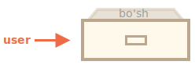

# Obyektlar

<info:types> bobidan ma'lum bo'lganidek, JavaScript-da sakkizta ma'lumot turi mavjud. Ulardan yettitasi "primitiv" deb ataladi, chunki ularning qiymatlari faqat bitta narsani o'z ichiga oladi (satr, raqam yoki boshqa narsa bo'lsin).

Aksincha, obyektlar turli ma'lumotlarning kalitli to'plamlarini va murakkabroq obyektlarni saqlash uchun ishlatiladi. JavaScript-da obyektlar tilning deyarli har bir jihatiga kiradi. Shuning uchun biz boshqa joylarga chuqur kirishdan oldin avval ularni tushunishimiz kerak.

Obyekt `{…}` jingalak qavslar bilan _xossalar_ ning ixtiyoriy ro'yxati bilan yaratilishi mumkin. Xossa - bu "kalit: qiymat" juftligi, bu yerda `kalit` satr ("xossa nomi" deb ham ataladi), `qiymat` esa har qanday narsa bo'lishi mumkin.

Biz obyektni imzolangan fayllari bo'lgan shkaf sifatida tasavvur qilishimiz mumkin. Har bir ma'lumot o'z faylida kalit orqali saqlanadi. Faylni nomi bilan topish yoki fayl qo'shish/olib tashlash oson.


Bo'sh obyekt ("bo'sh shkaf") ikki sintaksisdan birini ishlatib yaratilishi mumkin:

```js
let user = new Object(); // "obyekt konstruktor" sintaksisi
let user = {}; // "obyekt literal" sintaksisi
```



Odatda jingalak qavslar `{...}` ishlatiladi. Bu e'lon _obyekt literal_ deb ataladi.

## Literallar va xossalar

Biz darhol `{...}` ichiga "kalit: qiymat" juftligi sifatida ba'zi xossalarni qo'yishimiz mumkin:

```js
let user = {
  // obyekt
  name: "John", // "name" kaliti orqali "John" qiymatini saqlash
  age: 30, // "age" kaliti orqali 30 qiymatini saqlash
};
```

Xossa ikki nuqta `":"` dan oldin kalitga (shuningdek "nom" yoki "identifikator" deb ham tanilgan) va uning o'ng tomonida qiymatga ega.

`user` obyektida ikkita xossa mavjud:

1. Birinchi xossaning nomi `"name"` va qiymati `"John"`.
2. Ikkinchisining nomi `"age"` va qiymati `30`.

Natijada olingan `user` obyektini "name" va "age" yorliqlari bilan belgilangan ikkita imzolangan fayl bo'lgan shkaf sifatida tasavvur qilish mumkin.


Biz undan istalgan vaqtda fayllarni qo'shish, olib tashlash va o'qishimiz mumkin.

Xossa qiymatlari nuqta notation orqali kirish mumkin:

```js
// obyektning xossa qiymatlarini olish:
alert(user.name); // John
alert(user.age); // 30
```

Qiymat har qanday tipda bo'lishi mumkin. Keling, boolean qo'shamiz:

```js
user.isAdmin = true;
```


Xossani olib tashlash uchun `delete` operatoridan foydalanishimiz mumkin:

```js
delete user.age;
```


Shuningdek, ko'p so'zli xossa nomlaridan foydalanishimiz mumkin, lekin ular qo'shtirnoq ichida bo'lishi kerak:

```js
let user = {
  name: "John",
  age: 30,
  "likes birds": true, // ko'p so'zli xossa nomi qo'shtirnoq ichida bo'lishi kerak
};
```


Ro'yxatdagi oxirgi xossa vergul bilan tugashi mumkin:

```js
let user = {
  name: "John",
  age: 30*!*,*/!*
}
```

Bu "ortiqcha" yoki "osilgan" vergul deb ataladi. Xossalarni qo'shish/olib tashlash/ko'chirish osonlashadi, chunki barcha qatorlar bir xil bo'ladi.

## Kvadrat qavslar

Ko'p so'zli xossalar uchun nuqta kirish ishlamaydi:

```js run
// bu sintaksis xatosini beradi
user.likes birds = true
```

JavaScript buni tushunmaydi. U bizning `user.likes` ga murojaat qilayotganimizni o'ylaydi va kutilmagan `birds` ga duch kelganda sintaksis xatosini beradi.

Nuqta kalitning to'g'ri o'zgaruvchi identifikatori bo'lishini talab qiladi. Bu shuni anglatadi: bo'shliqlar yo'q, raqam bilan boshlanmaydi va maxsus belgilarni o'z ichiga olmaydi (`$` va `_` ruxsat etilgan).

Har qanday satr bilan ishlaydigan muqobil "kvadrat qavs notation" mavjud:

```js run
let user = {};

// o'rnatish
user["likes birds"] = true;

// olish
alert(user["likes birds"]); // true

// o'chirish
delete user["likes birds"];
```

Endi hammasi yaxshi. E'tibor bering, qavslar ichidagi satr to'g'ri qo'shtirnoq ichida (har qanday turdagi qo'shtirnoq mos keladi).

Kvadrat qavslar shuningdek xossa nomini har qanday ifoda natijasi sifatida olish usulini taqdim etadi -- literal satrdan farqli o'laroq -- masalan o'zgaruvchidan quyidagicha:

```js
let key = "likes birds";

// user["likes birds"] = true; bilan bir xil;
user[key] = true;
```

Bu yerda `key` o'zgaruvchisi bajarilish vaqtida hisoblanishi yoki foydalanuvchi kirishiga bog'liq bo'lishi mumkin. Va keyin biz uni xossaga kirish uchun ishlatamiz. Bu bizga katta moslashuvchanlik beradi.

Masalan:

```js run
let user = {
  name: "John",
  age: 30,
};

let key = prompt("Foydalanuvchi haqida nimani bilmoqchisiz?", "name");

// o'zgaruvchi orqali kirish
alert(user[key]); // John (agar "name" kiritilsa)
```

Nuqta notation shunga o'xshash tarzda ishlatilishi mumkin emas:

```js run
let user = {
  name: "John",
  age: 30,
};

let key = "name";
alert(user.key); // undefined
```

### Hisoblangan xossalar

Obyekt yaratishda obyekt literalida kvadrat qavslardan foydalanishimiz mumkin. Bu _hisoblangan xossalar_ deb ataladi.

Masalan:

```js run
let fruit = prompt("Qaysi mevani sotib olish kerak?", "apple");

let bag = {
*!*
  [fruit]: 5, // xossa nomi fruit o'zgaruvchisidan olinadi
*/!*
};

alert( bag.apple ); // agar fruit="apple" bo'lsa 5
```

Hisoblangan xossa ma'nosi oddiy: `[fruit]` xossa nomini `fruit` dan olish kerakligini anglatadi.

Shunday qilib, agar tashrif buyuruvchi `"apple"` ni kiritsa, `bag` `{apple: 5}` ga aylanadi.

Asosan, bu quyidagi bilan bir xil ishlaydi:

```js run
let fruit = prompt("Qaysi mevani sotib olish kerak?", "apple");
let bag = {};

// xossa nomini fruit o'zgaruvchisidan olish
bag[fruit] = 5;
```

...Lekin chiroyliroq ko'rinadi.

Kvadrat qavslar ichida murakkabroq ifodalardan foydalanishimiz mumkin:

```js
let fruit = "apple";
let bag = {
  [fruit + "Computers"]: 5, // bag.appleComputers = 5
};
```

Kvadrat qavslar nuqta notationdan ancha kuchliroq. Ular har qanday xossa nomlari va o'zgaruvchilarga ruxsat beradi. Lekin ular yozish uchun ham noqulayroq.

Shuning uchun ko'p hollarda, xossa nomlari ma'lum va oddiy bo'lganda, nuqta ishlatiladi. Va agar bizga murakkabroq narsa kerak bo'lsa, kvadrat qavslarga o'tamiz.

## Xossa qiymati qisqartmasi

Haqiqiy kodda biz ko'pincha mavjud o'zgaruvchilarni xossa nomlari uchun qiymat sifatida ishlatamiz.

Masalan:

```js run
function makeUser(name, age) {
  return {
    name: name,
    age: age,
    // ...boshqa xossalar
  };
}

let user = makeUser("John", 30);
alert(user.name); // John
```

Yuqoridagi misolda xossalar o'zgaruvchilar bilan bir xil nomlarga ega. O'zgaruvchidan xossa yaratish holati shunchalik keng tarqalganki, uni qisqaroq qilish uchun maxsus _xossa qiymati qisqartmasi_ mavjud.

`name:name` o'rniga biz shunchaki `name` yozishimiz mumkin:

```js
function makeUser(name, age) {
*!*
  return {
    name, // name: name bilan bir xil
    age,  // age: age bilan bir xil
    // ...
  };
*/!*
}
```

Bir xil obyektda oddiy xossalar va qisqartmalardan foydalanishimiz mumkin:

```js
let user = {
  name, // name:name bilan bir xil
  age: 30,
};
```

## Xossa nomlari cheklovlari

Bizga ma'lumki, o'zgaruvchi "for", "let", "return" va hokazo kabi tilning zahiralangan so'zlariga teng nomga ega bo'la olmaydi.

Lekin obyekt xossasi uchun bunday cheklov yo'q:

```js run
// bu xossalar yaxshi
let obj = {
  for: 1,
  let: 2,
  return: 3,
};

alert(obj.for + obj.let + obj.return); // 6
```

Qisqacha, xossa nomlarida hech qanday cheklov yo'q. Ular har qanday satrlar yoki symbollar (identifikatorlar uchun maxsus tip, keyinroq yoritiladi) bo'lishi mumkin.

Boshqa tiplar avtomatik ravishda satrlarga aylantiriladi.

Masalan, `0` raqami xossa kaliti sifatida ishlatilganda `"0"` satriga aylanadi:

```js run
let obj = {
  0: "test", // "0": "test" bilan bir xil
};

// ikkala alert ham bir xil xossaga kiradi (0 raqami "0" satriga aylantiriladi)
alert(obj["0"]); // test
alert(obj[0]); // test (bir xil xossa)
```

`__proto__` nomli maxsus xossa bilan kichik muammo bor. Biz uni obyekt bo'lmagan qiymatga o'rnatib bo'lmaydi:

```js run
let obj = {};
obj.__proto__ = 5; // raqam tayinlash
alert(obj.__proto__); // [object Object] - qiymat obyekt, mo'ljallangan tarzda ishlamadi
```

Koddan ko'rib turganimizdek, `5` primitiviga tayinlash e'tiborga olinmaydi.

Biz `__proto__` ning maxsus tabiatini [keyingi boblarda](info:prototype-inheritance) ko'rib chiqamiz va bunday xatti-harakatni [tuzatish usullarini](info:prototype-methods) taklif qilamiz.

## Xossa mavjudligi testi, "in" operatori

JavaScript-dagi obyektlarning ko'plab boshqa tillar bilan solishtirganda diqqatga sazovor xususiyati shundaki, har qanday xossaga kirish mumkin. Agar xossa mavjud bo'lmasa, xato bo'lmaydi!

Mavjud bo'lmagan xossani o'qish shunchaki `undefined` qaytaradi. Shunday qilib, xossa mavjudligini osongina tekshirishimiz mumkin:

```js run
let user = {};

alert(user.noSuchProperty === undefined); // true "bunday xossa yo'q" degan ma'noni bildiradi
```

Buning uchun maxsus `"in"` operatori ham mavjud.

Sintaksis:

```js
"key" in object;
```

Masalan:

```js run
let user = { name: "John", age: 30 };

alert("age" in user); // true, user.age mavjud
alert("blabla" in user); // false, user.blabla mavjud emas
```

E'tibor bering, `in` ning chap tomonida _xossa nomi_ bo'lishi kerak. Bu odatda qo'shtirnoqli satr.

Agar qo'shtirnoqlarni tashlab qo'ysak, bu o'zgaruvchi tekshirilishi kerak bo'lgan haqiqiy nomni o'z ichiga olishi kerakligini anglatadi. Masalan:

```js run
let user = { age: 30 };

let key = "age";
alert( *!*key*/!* in user ); // true, "age" xossasi mavjud
```

Nima uchun `in` operatori mavjud? `undefined` bilan solishtirish yetarli emasmi?

Ko'pchilik hollarda `undefined` bilan solishtirish yaxshi ishlaydi. Lekin u muvaffaqiyatsiz bo'lgan, lekin `"in"` to'g'ri ishlaydigan maxsus holat bor.

Bu obyekt xossasi mavjud, lekin `undefined` ni saqlagan payt:

```js run
let obj = {
  test: undefined,
};

alert(obj.test); // bu undefined, demak - bunday xossa yo'qmi?

alert("test" in obj); // true, xossa mavjud!
```

Yuqoridagi kodda `obj.test` xossasi texnik jihatdan mavjud. Shuning uchun `in` operatori to'g'ri ishlaydi.

Bunday vaziyatlar juda kam uchraydi, chunki `undefined` aniq tayinlanmasligi kerak. Biz asosan "noma'lum" yoki "bo'sh" qiymatlar uchun `null` dan foydalanamiz. Shuning uchun `in` operatori koddagi ekzotik mehmon hisoblanadi.

## "for..in" tsikli [#forin]

Obyektning barcha kalitlari bo'ylab yurish uchun tsiklning maxsus shakli mavjud: `for..in`. Bu biz ilgari o'rgangan `for(;;)` konstruksiyasidan butunlay boshqa narsa.

Sintaksis:

```js
for (key in object) {
  // obyekt xossalari orasidagi har bir kalit uchun tanani bajaradi
}
```

Masalan, `user` ning barcha xossalarini chiqaramiz:

```js run
let user = {
  name: "John",
  age: 30,
  isAdmin: true,
};

for (let key in user) {
  // kalitlar
  alert(key); // name, age, isAdmin
  // kalitlar uchun qiymatlar
  alert(user[key]); // John, 30, true
}
```

E'tibor bering, barcha "for" konstruksiyalari bizga tsikl ichida tsikl o'zgaruvchisini e'lon qilishga imkon beradi, bu yerda `let key` kabi.

Shuningdek, biz bu yerda `key` o'rniga boshqa o'zgaruvchi nomidan foydalanishimiz mumkin. Masalan, `"for (let prop in obj)"` ham keng ishlatiladi.

### Obyekt kabi tartiblangan

Obyektlar tartiblanganmi? Boshqacha qilib aytganda, agar biz obyekt bo'ylab tsikl qilsak, barcha xossalarni ular qo'shilgan tartibda olamizmi? Bunga ishonishimiz mumkinmi?

Qisqa javob: "maxsus tarzda tartiblangan": butun son xossalari saralanadi, boshqalar yaratilish tartibida paydo bo'ladi. Tafsilotlar quyida.

Misol sifatida, telefon kodlari bilan obyektni ko'rib chiqaylik:

```js run
let codes = {
  "49": "Germaniya",
  "41": "Shveytsariya",
  "44": "Buyuk Britaniya",
  // ..,
  "1": "AQSH"
};

*!*
for (let code in codes) {
  alert(code); // 1, 41, 44, 49
}
*/!*
```

Obyekt foydalanuvchiga variantlar ro'yxatini taklif qilish uchun ishlatilishi mumkin. Agar biz asosan nemis auditoriyasi uchun sayt yaratayotgan bo'lsak, ehtimol `49` birinchi bo'lishini xohlaymiz.

Lekin kodni ishga tushirsak, butunlay boshqa rasmni ko'ramiz:

- AQSH (1) birinchi o'rinda
- keyin Shveytsariya (41) va hokazo.

Telefon kodlari o'sish tartibida saralanadi, chunki ular butun sonlar. Shuning uchun biz `1, 41, 44, 49` ni ko'ramiz.

````smart header="Butun son xossalari? Bu nima?"
Bu yerdagi "butun son xossasi" atamasi o'zgarishsiz butun songa aylantirilishi va undan qaytarilishi mumkin bo'lgan satrni anglatadi.

Shunday qilib, `"49"` butun son xossa nomi, chunki u butun son raqamiga aylantirilganda va orqaga qaytarilganda, u bir xil bo'lib qoladi. Lekin `"+49"` va `"1.2"` emas:

```js run
// Number(...) aniq ravishda raqamga aylantiradi
// Math.trunc kasr qismini olib tashlaydigan o'rnatilgan funksiya
alert( String(Math.trunc(Number("49"))) ); // "49", bir xil, butun son xossasi
alert( String(Math.trunc(Number("+49"))) ); // "49", bir xil emas "+49" ⇒ butun son xossasi emas
alert( String(Math.trunc(Number("1.2"))) ); // "1", bir xil emas "1.2" ⇒ butun son xossasi emas
```
````

...Boshqa tomondan, agar kalitlar butun son bo'lmasa, ular yaratilish tartibida ro'yxatlanadi:

```js run
let user = {
  name: "John",
  surname: "Smith"
};
user.age = 25; // yana birini qo'shish

*!*
// butun son bo'lmagan xossalar yaratilish tartibida ro'yxatlanadi
*/!*
for (let prop in user) {
  alert( prop ); // name, surname, age
}
```

Shunday qilib, telefon kodlari bilan muammoni hal qilish uchun biz kodlarni butun son bo'lmagan qilib "aldashimiz" mumkin. Har bir kod oldiga plus `"+"` belgisini qo'shish kifoya.

Quyidagicha:

```js run
let codes = {
  "+49": "Germaniya",
  "+41": "Shveytsariya",
  "+44": "Buyuk Britaniya",
  // ..,
  "+1": "AQSH",
};

for (let code in codes) {
  alert(+code); // 49, 41, 44, 1
}
```

Endi u mo'ljallangan tarzda ishlaydi.

## Xulosa

Obyektlar bir nechta maxsus xususiyatlarga ega assotsiativ massivlardir.

Ular xossalarni (kalit-qiymat juftliklarini) saqlaydi, bu yerda:

- Xossa kalitlari satrlar yoki symbollar bo'lishi kerak (odatda satrlar).
- Qiymatlar har qanday tipda bo'lishi mumkin.

Xossaga kirish uchun biz quyidagilardan foydalanishimiz mumkin:

- Nuqta notation: `obj.property`.
- Kvadrat qavslar notation `obj["property"]`. Kvadrat qavslar kalitni o'zgaruvchidan olishga imkon beradi, masalan `obj[varWithKey]`.

Qo'shimcha operatorlar:

- Xossani o'chirish uchun: `delete obj.prop`.
- Berilgan kalit bilan xossa mavjudligini tekshirish uchun: `"key" in obj`.
- Obyekt bo'ylab iteratsiya qilish uchun: `for (let key in obj)` tsikli.

Ushbu bobda o'rgangan narsa "oddiy obyekt" yoki shunchaki `Object` deb ataladi.

JavaScript-da ko'plab boshqa obyekt turlari mavjud:

- `Array` tartiblangan ma'lumotlar to'plamini saqlash uchun,
- `Date` sana va vaqt haqidagi ma'lumotlarni saqlash uchun,
- `Error` xato haqidagi ma'lumotlarni saqlash uchun.
- ...Va hokazo.

Ularning o'zlarining maxsus xususiyatlari bor, biz ularni keyinroq o'rganamiz. Ba'zan odamlar "Array turi" yoki "Date turi" kabi narsalarni aytishadi, lekin rasman ular o'zlarining turlari emas, balki bitta "obyekt" ma'lumot turiga tegishli. Va ular uni turli yo'llar bilan kengaytiradilar.

JavaScript-dagi obyektlar juda kuchli. Bu yerda biz haqiqatan ham katta mavzuning faqat yuzasini tirnagandik. Biz o'quv qo'llanmasining keyingi qismlarida obyektlar bilan yaqindan ishlaymiz va ular haqida ko'proq bilib olamiz.
