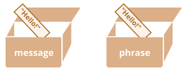

# Obyekt havolalari va nusxalash

Obyektlar va primitivlar o'rtasidagi asosiy farqlardan biri shundaki, obyektlar "havola bo'yicha" saqlanadi va nusxalanadi, primitivlar esa: satrlar, raqamlar, boolean va hokazo -- har doim "to'liq qiymat" sifatida nusxalanadi.

Qiymat nusxalanganda nima sodir bo'lishini biroz chuqurroq ko'rsak, buni tushunish oson.

Satr kabi primitiv bilan boshlaylik.

Bu yerda biz `message` ning nusxasini `phrase` ga qo'yamiz:

```js
let message = "Salom!";
let phrase = message;
```

Natijada bizda ikkita mustaqil o'zgaruvchi bor, har biri `"Salom!"` satrini saqlaydi.



Aniq natija, to'g'rimi?

Obyektlar bunday emas.

**Obyektga tayinlangan o'zgaruvchi obyektning o'zini emas, balki uning "xotiradagi manzilini" -- boshqacha qilib aytganda, unga "havolani" saqlaydi.**

Bunday o'zgaruvchining misolini ko'ramiz:

```js
let user = {
  name: "John",
};
```

Va u xotirada qanday saqlanishi:


Obyekt xotirada biror joyda saqlanadi (rasmning o'ng tomonida), `user` o'zgaruvchisi (chap tomonda) esa unga "havola" qiladi.

<<<<<<< HEAD
`user` kabi obyekt o'zgaruvchisini obyektning manzili yozilgan qog'oz varaq deb tasavvur qilishimiz mumkin.
=======
We may think of an object variable, such as `user`, like a sheet of paper with the address of the object on it.
>>>>>>> ff804bc19351b72bc5df7766f4b9eb8249a3cb11

Obyekt bilan amallarni bajarganimizda, masalan `user.name` xossasini olganimizda, JavaScript dvigateli o'sha manzilda nima borligini ko'radi va haqiqiy obyektda operatsiyani bajaradi.

Endi bu nima uchun muhimligi.

**Obyekt o'zgaruvchisi nusxalanganda, havola nusxalanadi, lekin obyektning o'zi takrorlanmaydi.**

Masalan:

```js no-beautify
let user = { name: "John" };

let admin = user; // havolani nusxalash
```

Endi bizda ikkita o'zgaruvchi bor, har biri bir xil obyektga havola qiladi:


Ko'rib turganingizdek, hali ham bitta obyekt bor, lekin endi unga havola qiluvchi ikkita o'zgaruvchi bor.

Obyektga kirish va uning tarkibini o'zgartirish uchun har qanday o'zgaruvchidan foydalanishimiz mumkin:

```js run
let user = { name: 'John' };

let admin = user;

*!*
admin.name = 'Pete'; // "admin" havolasi orqali o'zgartirildi
*/!*

alert(*!*user.name*/!*); // 'Pete', o'zgarishlar "user" havolasidan ko'rinadi
```

Bu xuddi bizda ikkita kaliti bo'lgan shkaf bo'lgandek va ulardan birini (`admin`) ishlatib unga kirib o'zgarishlar qildik. Keyin, agar boshqa kalitni (`user`) ishlatsak, biz hali ham bir xil shkafdamiz va o'zgartirilgan tarkibga kira olamiz.

## Havola bo'yicha solishtirish

Ikki obyekt faqat bir xil obyekt bo'lsagina teng hisoblanadi.

Masalan, bu yerda `a` va `b` bir xil obyektga havola qiladi, shuning uchun ular teng:

```js run
let a = {};
let b = a; // havolani nusxalash

alert(a == b); // true, ikkala o'zgaruvchi bir xil obyektga havola qiladi
alert(a === b); // true
```

Va bu yerda ikkita mustaqil obyekt teng emas, garchi ular o'xshash ko'rinsa ham (ikkalasi ham bo'sh):

```js run
let a = {};
let b = {}; // ikkita mustaqil obyekt

alert(a == b); // false
```

`obj1 > obj2` kabi solishtirishlar uchun yoki primitiv bilan solishtirish `obj == 5` uchun, obyektlar primitivlarga aylantiriladi. Obyekt aylantirishlari qanday ishlashini tez orada o'rganamiz, lekin rostini aytganda, bunday solishtirishlar juda kam kerak bo'ladi -- odatda ular dasturlash xatosi natijasida paydo bo'ladi.

<<<<<<< HEAD
````smart header="Const obyektlarni o'zgartirish mumkin"
Obyektlarni havola sifatida saqlashning muhim yon ta'siri shundaki, `const` sifatida e'lon qilingan obyektni o'zgartirish *mumkin*.

Masalan:
=======
````smart header="Const objects can be modified"
An important side effect of storing objects as references is that an object declared as `const` *can* be modified.

For instance:
>>>>>>> ff804bc19351b72bc5df7766f4b9eb8249a3cb11

```js run
const user = {
  name: "John"
};

*!*
user.name = "Pete"; // (*)
*/!*

alert(user.name); // Pete
```

`(*)` qatori xato keltirib chiqarishi kerak bo'lgandek tuyuladi, lekin bunday emas. `user` qiymati doimiy, u har doim bir xil obyektga havola qilishi kerak, lekin o'sha obyektning xossalari erkin o'zgarishi mumkin.

Boshqacha qilib aytganda, `const user` faqat biz `user=...` ni butunlay o'rnatishga harakat qilganimizda xato beradi.

Shuni aytish kerakki, agar biz haqiqatan ham doimiy obyekt xossalarini yaratishimiz kerak bo'lsa, bu ham mumkin, lekin butunlay boshqa usullardan foydalanib. Buni <info:property-descriptors> bobida eslatamiz.
````

<<<<<<< HEAD
## Klonlash va birlashtirish, Object.assign [#cloning-and-merging-object-assign]
=======
## Cloning and merging, Object.assign [#cloning-and-merging-object-assign]

So, copying an object variable creates one more reference to the same object.

But what if we need to duplicate an object?

We can create a new object and replicate the structure of the existing one, by iterating over its properties and copying them on the primitive level.

Like this:

```js run
let user = {
  name: "John",
  age: 30
};

*!*
let clone = {}; // the new empty object

// let's copy all user properties into it
for (let key in user) {
  clone[key] = user[key];
}
*/!*

// now clone is a fully independent object with the same content
clone.name = "Pete"; // changed the data in it

alert( user.name ); // still John in the original object
```

We can also use the method [Object.assign](https://developer.mozilla.org/en-US/docs/Web/JavaScript/Reference/Global_Objects/Object/assign).

The syntax is:

```js
Object.assign(dest, ...sources)
```

- The first argument `dest` is a target object.
- Further arguments is a list of source objects.

It copies the properties of all source objects into the target `dest`, and then returns it as the result.

For example, we have `user` object, let's add a couple of permissions to it:

```js run
let user = { name: "John" };

let permissions1 = { canView: true };
let permissions2 = { canEdit: true };

*!*
// copies all properties from permissions1 and permissions2 into user
Object.assign(user, permissions1, permissions2);
*/!*

// now user = { name: "John", canView: true, canEdit: true }
alert(user.name); // John
alert(user.canView); // true
alert(user.canEdit); // true
```

If the copied property name already exists, it gets overwritten:

```js run
let user = { name: "John" };

Object.assign(user, { name: "Pete" });

alert(user.name); // now user = { name: "Pete" }
```

We also can use `Object.assign` to perform a simple object cloning:

```js run
let user = {
  name: "John",
  age: 30
};

*!*
let clone = Object.assign({}, user);
*/!*

alert(clone.name); // John
alert(clone.age); // 30
```

Here it copies all properties of `user` into the empty object and returns it.

There are also other methods of cloning an object, e.g. using the [spread syntax](info:rest-parameters-spread) `clone = {...user}`, covered later in the tutorial.

## Nested cloning

Until now we assumed that all properties of `user` are primitive. But properties can be references to other objects.

Like this:
```js run
let user = {
  name: "John",
  sizes: {
    height: 182,
    width: 50
  }
};

alert( user.sizes.height ); // 182
```

Now it's not enough to copy `clone.sizes = user.sizes`, because `user.sizes` is an object, and will be copied by reference, so `clone` and `user` will share the same sizes:

```js run
let user = {
  name: "John",
  sizes: {
    height: 182,
    width: 50
  }
};

let clone = Object.assign({}, user);

alert( user.sizes === clone.sizes ); // true, same object

// user and clone share sizes
user.sizes.width = 60;    // change a property from one place
alert(clone.sizes.width); // 60, get the result from the other one
```

To fix that and make `user` and `clone` truly separate objects, we should use a cloning loop that examines each value of `user[key]` and, if it's an object, then replicate its structure as well. That is called a "deep cloning" or "structured cloning". There's [structuredClone](https://developer.mozilla.org/en-US/docs/Web/API/structuredClone) method that implements deep cloning.


### structuredClone

The call `structuredClone(object)` clones the `object` with all nested properties.

Here's how we can use it in our example:

```js run
let user = {
  name: "John",
  sizes: {
    height: 182,
    width: 50
  }
};

*!*
let clone = structuredClone(user);
*/!*

alert( user.sizes === clone.sizes ); // false, different objects

// user and clone are totally unrelated now
user.sizes.width = 60;    // change a property from one place
alert(clone.sizes.width); // 50, not related
```

The `structuredClone` method can clone most data types, such as objects, arrays, primitive values.

It also supports circular references, when an object property references the object itself (directly or via a chain or references).

For instance:

```js run
let user = {};
// let's create a circular reference:
// user.me references the user itself
user.me = user;

let clone = structuredClone(user);
alert(clone.me === clone); // true
```

As you can see, `clone.me` references the `clone`, not the `user`! So the circular reference was cloned correctly as well.

Although, there are cases when `structuredClone` fails.

For instance, when an object has a function property:

```js run
// error
structuredClone({
  f: function() {}
});
```

Function properties aren't supported.

To handle such complex cases we may need to use a combination of cloning methods, write custom code or, to not reinvent the wheel, take an existing implementation, for instance [_.cloneDeep(obj)](https://lodash.com/docs#cloneDeep) from the JavaScript library [lodash](https://lodash.com).

## Summary
>>>>>>> ff804bc19351b72bc5df7766f4b9eb8249a3cb11

Shunday qilib, obyekt o'zgaruvchisini nusxalash bir xil obyektga yana bir havola yaratadi.

Lekin agar bizga obyektni takrorlash kerak bo'lsa-chi?

<<<<<<< HEAD
Biz yangi obyekt yaratishimiz va mavjud obyektning tuzilmasini takrorlashimiz mumkin, uning xossalari bo'ylab iteratsiya qilib va ularni primitiv darajada nusxalash orqali.

Quyidagicha:

```js run
let user = {
  name: "John",
  age: 30
};

*!*
let clone = {}; // yangi bo'sh obyekt

// keling, user ning barcha xossalarini unga nusxalaylik
for (let key in user) {
  clone[key] = user[key];
}
*/!*

// endi clone bir xil tarkibga ega to'liq mustaqil obyekt
clone.name = "Pete"; // undagi ma'lumotni o'zgartirdik

alert( user.name ); // asl obyektda hali ham John
```

Shuningdek, biz [Object.assign](https://developer.mozilla.org/en-US/docs/Web/JavaScript/Reference/Global_Objects/Object/assign) usulidan ham foydalanishimiz mumkin.

Sintaksis:

```js
Object.assign(dest, ...sources);
```

- Birinchi argument `dest` - maqsadli obyekt.
- Keyingi argumentlar - manba obyektlar ro'yxati.

U barcha manba obyektlarning xossalarini maqsadli `dest` ga nusxalaydi va keyin natija sifatida uni qaytaradi.

Masalan, bizda `user` obyekt bor, unga bir nechta ruxsatlar qo'shamiz:

```js run
let user = { name: "John" };

let permissions1 = { canView: true };
let permissions2 = { canEdit: true };

*!*
// permissions1 va permissions2 ning barcha xossalarini user ga nusxalaydi
Object.assign(user, permissions1, permissions2);
*/!*

// endi user = { name: "John", canView: true, canEdit: true }
alert(user.name); // John
alert(user.canView); // true
alert(user.canEdit); // true
```

Agar nusxalangan xossa nomi allaqachon mavjud bo'lsa, u qayta yoziladi:

```js run
let user = { name: "John" };

Object.assign(user, { name: "Pete" });

alert(user.name); // endi user = { name: "Pete" }
```

Shuningdek, biz `Object.assign` dan oddiy obyekt klonlash uchun ham foydalanishimiz mumkin:

```js run
let user = {
  name: "John",
  age: 30
};

*!*
let clone = Object.assign({}, user);
*/!*

alert(clone.name); // John
alert(clone.age); // 30
```

Bu yerda u `user` ning barcha xossalarini bo'sh obyektga nusxalaydi va uni qaytaradi.

Obyektni klonlashning boshqa usullari ham bor, masalan [spread sintaksisi](info:rest-parameters-spread) `clone = {...user}` dan foydalanish, o'quv qo'llanmasida keyinroq yoritilgan.

## Ichma-ich klonlash

Hozirgacha biz `user` ning barcha xossalari primitiv deb faraz qildik. Lekin xossalar boshqa obyektlarga havolalar bo'lishi mumkin.

Quyidagicha:

```js run
let user = {
  name: "John",
  sizes: {
    height: 182,
    width: 50,
  },
};

alert(user.sizes.height); // 182
```

Endi `clone.sizes = user.sizes` ni nusxalash yetarli emas, chunki `user.sizes` obyekt va havola bo'yicha nusxalanadi, shuning uchun `clone` va `user` bir xil sizes ni bo'lishadi:

```js run
let user = {
  name: "John",
  sizes: {
    height: 182,
    width: 50,
  },
};

let clone = Object.assign({}, user);

alert(user.sizes === clone.sizes); // true, bir xil obyekt

// user va clone sizes ni bo'lishadi
user.sizes.width = 60; // bir joydan xossani o'zgartirish
alert(clone.sizes.width); // 60, natijani boshqa joydan olish
```

Buni tuzatish va `user` bilan `clone` ni haqiqatan ham alohida obyektlar qilish uchun biz `user[key]` ning har bir qiymatini tekshiradigan va agar u obyekt bo'lsa, uning tuzilmasini ham takrorlaydigan klonlash tsiklidan foydalanishimiz kerak. Bu "chuqur klonlash" yoki "tuzilmaviy klonlash" deb ataladi. Chuqur klonlashni amalga oshiradigan [structuredClone](https://developer.mozilla.org/en-US/docs/Web/API/structuredClone) usuli mavjud.

### structuredClone

`structuredClone(object)` chaqiruvi `object` ni barcha ichma-ich xossalar bilan klonlaydi.

Misolimizda qanday foydalanishni ko'ramiz:

```js run
let user = {
  name: "John",
  sizes: {
    height: 182,
    width: 50
  }
};

*!*
let clone = structuredClone(user);
*/!*

alert( user.sizes === clone.sizes ); // false, turli obyektlar

// user va clone endi butunlay bog'liq emas
user.sizes.width = 60;    // bir joydan xossani o'zgartirish
alert(clone.sizes.width); // 50, bog'liq emas
```

`structuredClone` usuli obyektlar, massivlar, primitiv qiymatlar kabi ko'pchilik ma'lumot turlarini klonlay oladi.

U shuningdek obyekt xossasi obyektning o'ziga havola qilgan (bevosita yoki havolalar zanjiri orqali) aylanma havolalarni ham qo'llab-quvvatlaydi.

Masalan:

```js run
let user = {};
// keling, aylanma havola yarataylik:
// user.me user ning o'ziga havola qiladi
user.me = user;

let clone = structuredClone(user);
alert(clone.me === clone); // true
```

Ko'rib turganingizdek, `clone.me` `user` ga emas, `clone` ga havola qiladi! Shunday qilib, aylanma havola ham to'g'ri klonlandi.

Garchi, `structuredClone` muvaffaqiyatsiz bo'lgan holatlar ham bor.

Masalan, obyektda funksiya xossasi bo'lganda:

```js run
// xato
structuredClone({
  f: function () {},
});
```

Funksiya xossalari qo'llab-quvvatlanmaydi.

Bunday murakkab holatlarni hal qilish uchun bizga klonlash usullarining kombinatsiyasidan foydalanish, maxsus kod yozish yoki g'ildirakni qayta ixtiro qilmaslik uchun mavjud implementatsiyani olish kerak bo'lishi mumkin, masalan [lodash](https://lodash.com) JavaScript kutubxonasidagi [\_.cloneDeep(obj)](https://lodash.com/docs#cloneDeep).

## Xulosa

Obyektlar havola bo'yicha tayinlanadi va nusxalanadi. Boshqacha qilib aytganda, o'zgaruvchi "obyekt qiymati" ni emas, balki qiymat uchun "havola" (xotiradagi manzil) ni saqlaydi. Shunday qilib, bunday o'zgaruvchini nusxalash yoki uni funksiya argumenti sifatida uzatish obyektning o'zini emas, o'sha havolani nusxalaydi.

Nusxalangan havolalar orqali barcha amallar (xossalar qo'shish/olib tashlash kabi) bir xil obyektda amalga oshiriladi.

"Haqiqiy nusxa" (klon) yaratish uchun biz "sayoz nusxa" (ichma-ich obyektlar havola bo'yicha nusxalanadi) uchun `Object.assign` dan yoki "chuqur klonlash" funksiyasi `structuredClone` dan yoki [\_.cloneDeep(obj)](https://lodash.com/docs#cloneDeep) kabi maxsus klonlash implementatsiyasidan foydalanishimiz mumkin.
=======
To make a "real copy" (a clone) we can use `Object.assign` for the so-called "shallow copy" (nested objects are copied by reference) or a "deep cloning" function `structuredClone` or use a custom cloning implementation, such as [_.cloneDeep(obj)](https://lodash.com/docs#cloneDeep).
>>>>>>> ff804bc19351b72bc5df7766f4b9eb8249a3cb11
