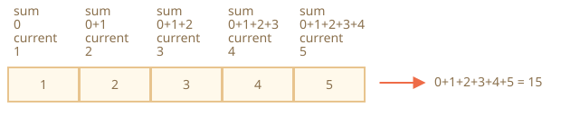

# Massiv usullari

<<<<<<< HEAD
Massivlar juda ko'p usullarni taqdim etadi. Ishlarni engillashtirish uchun ushbu bobda ular guruhlarga bo'lingan.
=======
Arrays provide a lot of methods. To make things easier, in this chapter, they are split into groups.
>>>>>>> ff804bc19351b72bc5df7766f4b9eb8249a3cb11

## Elementlarni qo'shish/olib tashlash

Biz allaqachon elementlarni boshidan yoki oxiridan qo'shib olib tashlaydigan usullarni bilamiz:

- `arr.push(...items)` -- oxiriga narsalarni qo'shadi,
- `arr.pop()` -- oxiridan elementni ajratib oladi,
- `arr.shift()` -- boshidan elementni ajratib oladi,
- `arr.unshift(...items)` -- elementlarni boshiga qo'shadi.

Mana boshqalar.

### splice

Massivdan elementni qanday o'chirish mumkin?

Massivlar obyektlardir, shuning uchun biz `delete` dan foydalanishga urinib ko'rishimiz mumkin:

```js run
let arr = ["I", "go", "home"];

delete arr[1]; // "go" olib tashlash

alert(arr[1]); // undefined

// hozir arr = ["I",  , "home"];
alert(arr.length); // 3
```

Element o'chirildi, ammo massivda hali ham 3 ta element mavjud, biz buni ko'rishimiz mumkin `arr.length == 3`.

<<<<<<< HEAD
Bu tabiiy, chunki `obj.key` ni o'chirish `key` yordamida qiymatni olib tashlaydi. Hammasi shu. Obyektlar uchun yaxshi. Ammo massivlar uchun biz odatda qolgan elementlarning siljishini va bo'sh joyni egallashini istaymiz. Biz hozirda qisqaroq massivga ega bo'lishni kutmoqdamiz.
=======
That's natural, because `delete obj.key` removes a value by the `key`. It's all it does. Fine for objects. But for arrays we usually want the rest of the elements to shift and occupy the freed place. We expect to have a shorter array now.
>>>>>>> ff804bc19351b72bc5df7766f4b9eb8249a3cb11

Shunday qilib, maxsus usullardan foydalanish kerak.

<<<<<<< HEAD
[arr.splice(str)](mdn:js/Array/splice) usuli - bu massivlar uchun "Shveytsariya armiyasining pichog'i". U hamma narsani qilishi mumkin: elementlarni qo'shish, olib tashlash va kiritish.
=======
The [arr.splice](mdn:js/Array/splice) method is a Swiss army knife for arrays. It can do everything: insert, remove and replace elements.
>>>>>>> ff804bc19351b72bc5df7766f4b9eb8249a3cb11

Sintaksis:

```js
arr.splice(start[, deleteCount, elem1, ..., elemN])
```

U `indeks` pozitsiyasidan boshlanadi: `deleteCount` elementlarini olib tashlaydi va keyin ularning o'rniga `elem1, ..., elemN` qo'shadi. O'chirilgan elementlar masssivini qaytaradi.

Ushbu usulni misollar yordamida tushunish oson.

O'chirish bilan boshlaymiz:

```js run
let arr = ["I", "study", "JavaScript"];

*!*
arr.splice(1, 1); // 1-indeksdan 1 ta elementni olib tashlang
*/!*

alert( arr ); // ["I", "JavaScript"]
```

Oson, to‘g‘rimi? `1` indeksidan boshlab, u `1` elementni olib tashladi.

<<<<<<< HEAD
Keyingi misolda biz uchta elementni olib tashlaymiz va ularni qolgan ikkitasi bilan almashtiramiz:
=======
In the next example, we remove 3 elements and replace them with the other two:
>>>>>>> ff804bc19351b72bc5df7766f4b9eb8249a3cb11

```js run
let arr = [*!*"I", "study", "JavaScript",*/!* "right", "now"];

// birinchi uchta elementni olib tashlang va ularni boshqasiga almashtiring
arr.splice(0, 3, "Let's", "dance");

alert( arr ) // hozir [*!*"Let's", "dance"*/!*, "right", "now"]
```

Bu erda `splice` o'chirilgan elementlar massivini qaytarishini ko'rishimiz mumkin:

```js run
let arr = [*!*"I", "study",*/!* "JavaScript", "right", "now"];

// birinchi ikkita elementni olib tashlang
let removed = arr.splice(0, 2);

alert( removed ); // "I", "study" <-- o'chirilgan elementlarning massivi
```

<<<<<<< HEAD
`splice` usuli elementlarni hech qanday olib tashlamasdan kiritishga qodir. Buning uchun biz `deleteCount` ni `0` ga o'rnatishimiz kerak:
=======
The `splice` method is also able to insert the elements without any removals. For that, we need to set `deleteCount` to `0`:
>>>>>>> ff804bc19351b72bc5df7766f4b9eb8249a3cb11

```js run
let arr = ["I", "study", "JavaScript"];

// indeks 2 dan
// o'chirish 0
// keyin "complex" va "language" ni kiriting
arr.splice(2, 0, "complex", "language");

alert(arr); // "I", "study", "complex", "language", "JavaScript"
```

````smart header="Salbiy indekslarga ruxsat berilgan"
Bu yerda va boshqa massiv usullarida salbiy indekslarga yo'l qo'yiladi. Ular massiv oxiridan pozitsiyani quyidagicha ko'rsatadilar:

```js run
let arr = [1, 2, 5];

// from index -1 (oxiridan bir qadam)
// 0 elementni o'chirish,
// keyin 3 va 4 ni kiriting
arr.splice(-1, 0, 3, 4);

alert( arr ); // 1,2,3,4,5
```
````

### slice

<<<<<<< HEAD
[arr.slice](mdn:js/Array/slice) usuli o'xshash `arr.splice` ga qaraganda ancha sodda.
=======
The method [arr.slice](mdn:js/Array/slice) is much simpler than the similar-looking `arr.splice`.
>>>>>>> ff804bc19351b72bc5df7766f4b9eb8249a3cb11

Sintaksis:

```js
arr.slice([start], [end]);
```

U `"start"` dan `"end"` gacha (`"end"` hisobga olinmagan) barcha elementlarni o'z ichiga olgan yangi massivni qaytaradi. Har ikkala `start` va `end` ham salbiy bo'lishi mumkin, bu holda massiv oxiridan pozitsiya qabul qilinadi.

<<<<<<< HEAD
U `str.slice` kabi ishlaydi, lekin submatnlar o'rniga submassivlar yaratadi.
=======
It's similar to a string method `str.slice`, but instead of substrings, it makes subarrays.
>>>>>>> ff804bc19351b72bc5df7766f4b9eb8249a3cb11

Masalan:

```js run
let arr = ["t", "e", "s", "t"];

alert(arr.slice(1, 3)); // e,s (copy from 1 to 3)

alert(arr.slice(-2)); // s,t (copy from -2 till the end)
```

We can also call it without arguments: `arr.slice()` creates a copy of `arr`. That's often used to obtain a copy for further transformations that should not affect the original array.

### concat

Metod [arr.concat](mdn:js/Array/concat) massivni boshqa massivlar va/yoki elementlar bilan birlashtiradi.

Sintaksis:

```js
arr.concat(arg1, arg2...)
```

U har qanday argumentlarni qabul qiladi -- yoki massivlar, yoki qiymatlar.

Natijada `arr`, keyin `arg1`, `arg2` va hokazolarni o'z ichiga olgan yangi massiv hosil bo'ladi.

Agar argument massiv bo'lsa yoki `Symbol.isConcatSpreadable` xususiyatiga ega bo'lsa, unda uning barcha elementlari ko'chiriladi. Aks holda, argumentning o'zi ko'chiriladi.

Masalan:

```js run
let arr = [1, 2];

// arr ni [3,4] bilan birlashtirish
alert(arr.concat([3, 4])); // 1,2,3,4

// arr ni [3,4] va [5,6] bilan birlashtirish
alert(arr.concat([3, 4], [5, 6])); // 1,2,3,4,5,6

// arr ni [3,4] bilan birlashtirish, so'ngra 5 va 6 qiymatlarini qo'shish
alert(arr.concat([3, 4], 5, 6)); // 1,2,3,4,5,6
```

Odatda, u faqat elementlarni massivlardan ko'chiradi (ularni "tarqatadi"). Boshqa obyektlar, hatto ular massivga o'xshash bo'lsa ham, umuman qo'shiladi:

```js run
let arr = [1, 2];

let arrayLike = {
  0: "something",
  length: 1,
};

alert(arr.concat(arrayLike)); // 1,2,[object Object]
```

...Agar massivga o'xshash obyektda `Symbol.isConcatSpreadable` xususiyati bo'lsa, uning o'rniga uning elementlari qo'shiladi:

```js run
let arr = [1, 2];

let arrayLike = {
  0: "something",
  1: "else",
*!*
  [Symbol.isConcatSpreadable]: true,
*/!*
  length: 2
};

alert( arr.concat(arrayLike) ); // 1,2,something,else
```

## Takrorlash: forEach

[arr.forEach](mdn:js/Array/forEach) usuli massivning har bir elementi uchun funktsiyani bajarishga imkon beradi.

Sintaksis:

```js
<<<<<<< HEAD
arr.forEach(function (item, index, array) {
  // ... item bilan biror narsa qilish
=======
arr.forEach(function(item, index, array) {
  // ... do something with an item
>>>>>>> ff804bc19351b72bc5df7766f4b9eb8249a3cb11
});
```

Masalan, bu massivning har bir elementini ko'rsatadi:

```js run
// har bir element uchun ogohlantirish
["Bilbo", "Gandalf", "Nazgul"].forEach(alert);
```

Va ushbu kod maqsadli massivda ularning pozitsiyalari haqida batafsilroq ma'lumot berilgan:

```js run
["Bilbo", "Gandalf", "Nazgul"].forEach((item, index, array) => {
  alert(`${item} ${array} massivida ${index} indeksida`);
});
```

Funktsiya natijasi (agar u biron bir narsani qaytarsa) tashlanadi va e'tiborga olinmaydi.

## Massivda qidirish

Bu massivda biror narsani qidirish usullari.

### indexOf/lastIndexOf va includes

[arr.indexOf](mdn:js/Array/indexOf), [arr.lastIndexOf](mdn:js/Array/lastIndexOf) va [arr.includes](mdn:js/Array/include) usullari bir xil sintaksisga ega. va aslida ularning matnga o'xshashadi, lekin belgilar o'rniga elementlarda ishlashadi:

<<<<<<< HEAD
- `arr.indexOf(item, from)` `from` indeksdan boshlab `item` ni qidiradi va topilgan joyning indeksini qaytaradi, aks holda `-1`.
- `arr.lastIndexOf(item, from)` -- xuddi shunday, lekin o'ngdan chapga qidiradi.
- `arr.includes(item, from)` -- `from` indeksdan boshlab `item` ni izlaydi, agar topilsa `true` qiymatini beradi.

Masalan:
=======
The methods [arr.indexOf](mdn:js/Array/indexOf) and [arr.includes](mdn:js/Array/includes) have the similar syntax and do essentially the same as their string counterparts, but operate on items instead of characters:

- `arr.indexOf(item, from)` -- looks for `item` starting from index `from`, and returns the index where it was found, otherwise `-1`.
- `arr.includes(item, from)` -- looks for `item` starting from index `from`, returns `true` if found.

Usually, these methods are used with only one argument: the `item` to search. By default, the search is from the beginning.

For instance:
>>>>>>> ff804bc19351b72bc5df7766f4b9eb8249a3cb11

```js run
let arr = [1, 0, false];

alert(arr.indexOf(0)); // 1
alert(arr.indexOf(false)); // 2
alert(arr.indexOf(null)); // -1

alert(arr.includes(1)); // true
```

<<<<<<< HEAD
E'tibor bering, usullarda `===` taqqoslash qo'llaniladi. Shunday qilib, agar biz `false` ni qidirsak, u nolni emas, balki `false` ni topadi.

Agar biz inklyuziyani tekshirishni istasak va aniq indeksni bilmoqchi bo'lmasak, u holda `arr.includes` afzal.

Bundan tashqari, `include` ning juda oz farqi shundaki, u `indexOf/lastIndexOf` dan farqli o'laroq, `NaN` da to'g'ri ishlaydi.

```js run
const arr = [NaN];
alert(arr.indexOf(NaN)); // -1 (0 bo'lishi kerak, lekin === tenglik NaN uchun ishlamaydi)
alert(arr.includes(NaN)); // true (to'g'ri)
=======
Please note that `indexOf` uses the strict equality `===` for comparison. So, if we look for `false`, it finds exactly `false` and not the zero.

If we want to check if `item` exists in the array and don't need the index, then `arr.includes` is preferred.

The method [arr.lastIndexOf](mdn:js/Array/lastIndexOf) is the same as `indexOf`, but looks for from right to left.

```js run
let fruits = ['Apple', 'Orange', 'Apple']

alert( fruits.indexOf('Apple') ); // 0 (first Apple)
alert( fruits.lastIndexOf('Apple') ); // 2 (last Apple)
```

````smart header="The `includes` method handles `NaN` correctly"
A minor, but noteworthy feature of `includes` is that it correctly handles `NaN`, unlike `indexOf`:

```js run
const arr = [NaN];
alert( arr.indexOf(NaN) ); // -1 (wrong, should be 0)
alert( arr.includes(NaN) );// true (correct)
>>>>>>> ff804bc19351b72bc5df7766f4b9eb8249a3cb11
```
That's because `includes` was added to JavaScript much later and uses the more up-to-date comparison algorithm internally.
````

<<<<<<< HEAD
### find va findIndex

Bizda bir obyektlar massivi mavjudligini tasavvur qiling. Muayyan shartli obyektni qanday topishimiz mumkin?
=======
### find and findIndex/findLastIndex

Imagine we have an array of objects. How do we find an object with a specific condition?
>>>>>>> ff804bc19351b72bc5df7766f4b9eb8249a3cb11

Bu yerda [arr.find](mdn:js/Array/find) usuli foydalidir.

Sintaksis:

```js
let result = arr.find(function (item, index, array) {
  // agar true qaytarilsa, element qaytariladi va takrorlash to'xtatiladi
  // false senariy uchun undefined qaytariladi
});
```

Funktsiya massivning har bir elementi uchun takroriy ravishda chaqiriladi:

- `item` element hisoblanadi.
- `index` bu uning indeksidir.
- `array` massivning o'zi.

<<<<<<< HEAD
Agar u `true` ni qaytarsa, qidiruv to'xtatiladi, `item` qaytariladi. Hech narsa topilmasa, `undefined` qaytariladi.
=======
If it returns `true`, the search is stopped, the `item` is returned. If nothing is found, `undefined` is returned.
>>>>>>> ff804bc19351b72bc5df7766f4b9eb8249a3cb11

Masalan, bizda foydalanuvchilar massivi bor, ularning har biri `id` va `name` argumentlariga ega. Keling, `id == 1` bilan topamiz:

```js run
let users = [
  { id: 1, name: "John" },
  { id: 2, name: "Pete" },
  { id: 3, name: "Mary" },
];

let user = users.find((item) => item.id == 1);

alert(user.name); // John
```

<<<<<<< HEAD
Haqiqiy hayotda obyektlar massivi odatiy holdir, shuning uchun `find` usuli juda foydali.
=======
In real life, arrays of objects are a common thing, so the `find` method is very useful.
>>>>>>> ff804bc19351b72bc5df7766f4b9eb8249a3cb11

E'tibor bering, biz misolda `item => item.id == 1` funktsiyasini bitta argument bilan `topish` ni ta'minlaymiz. Ushbu funktsiyaning boshqa argumentlari kamdan kam qo'llaniladi.

<<<<<<< HEAD
[arr.findIndex](mdn:js/Array/findIndex) usuli asosan bir xil, ammo u elementning o'zi o'rniga element topilgan indeksni qaytaradi va hech narsa topilmaganda `-1` qaytariladi.
=======
The [arr.findIndex](mdn:js/Array/findIndex) method has the same syntax but returns the index where the element was found instead of the element itself. The value of `-1` is returned if nothing is found.

The [arr.findLastIndex](mdn:js/Array/findLastIndex) method is like `findIndex`, but searches from right to left, similar to `lastIndexOf`.

Here's an example:

```js run
let users = [
  {id: 1, name: "John"},
  {id: 2, name: "Pete"},
  {id: 3, name: "Mary"},
  {id: 4, name: "John"}
];

// Find the index of the first John
alert(users.findIndex(user => user.name == 'John')); // 0

// Find the index of the last John
alert(users.findLastIndex(user => user.name == 'John')); // 3
```
>>>>>>> ff804bc19351b72bc5df7766f4b9eb8249a3cb11

### filter

`find` usuli funktsiyani `true` qaytaradigan yagona (birinchi) elementni qidiradi.

Agar ko'p bo'lsa, biz [arr.filter(fn)](mdn:js/Array/filter) dan foydalanishimiz mumkin.

Sintaksis `find` ga o'xshaydi, lekin `true` allaqachon qaytarilgan bo'lsa ham, massivning barcha elementlari uchun filtr takrorlashni davom ettiradi:

```js
let results = arr.filter(function (item, index, array) {
  // agar true element natijalarga chiqarilsa va takrorlanish davom etsa
  // false senariy uchun bo'sh qatorni qaytaradi
});
```

Masalan:

```js run
let users = [
  { id: 1, name: "John" },
  { id: 2, name: "Pete" },
  { id: 3, name: "Mary" },
];

// dastlabki ikkita foydalanuvchi massivini qaytaradi
let someUsers = users.filter((item) => item.id < 3);

alert(someUsers.length); // 2
```

## Massivni o'zgartirish

Ushbu bo'lim massivni o'zgartirish yoki qayta tartiblash usullari haqida.

### map

[arr.map](mdn:js/Array/map) usuli eng foydali va tez-tez ishlatiladigan usullardan biridir.

Sintaksis:

```js
let result = arr.map(function (item, index, array) {
  // element o'rniga yangi qiymatni qaytaradi
});
```

U massivning har bir elementi uchun funktsiyani chaqiradi va natijalar massivini qaytaradi.

Masalan, biz har bir elementni uning uzunligiga aylantiramiz:

```js run
let lengths = ["Bilbo", "Gandalf", "Nazgul"].map((item) => item.length);
alert(lengths); // 5,7,6
```

### sort(fn)

[arr.sort](mdn:js/Array/sort) usuli massivni _joyida_ tartiblaydi.

Masalan:

```js run
let arr = [1, 2, 15];

// usul arr tarkibini qayta tartibga soladi (va uni qaytaradi)
arr.sort();

alert(arr); // *!*1, 15, 2*/!*
```

Natijada qandaydir g'alati narsani sezdingizmi?

Tartib `1, 15, 2` bo'ldi. Noto'g'ri. Lekin nega?

**Sukut bo'yicha elementlar matn sifatida tartiblangan.**

To'g'ridan-to'g'ri, barcha elementlar matnlarga aylantiriladi va keyin taqqoslanadi. Shunday qilib, leksikografik tartib qo'llaniladi va haqiqatan ham `"2" > "15"`.

O'zimizning tartiblash usulimizdan foydalanish uchun biz ikkita argumentning funktsiyasini `array.sort()` argumenti sifatida ta'minlashimiz kerak.

Funktsiya shunday ishlashi kerak:

<<<<<<< HEAD
=======
The function should compare two arbitrary values and return:

>>>>>>> ff804bc19351b72bc5df7766f4b9eb8249a3cb11
```js
function compare(a, b) {
  if (a > b) return 1; // if the first value is greater than the second
  if (a == b) return 0; // if values are equal
  if (a < b) return -1; // if the first value is less than the second
}
```

Masalan:

```js run
function compareNumeric(a, b) {
  if (a > b) return 1;
  if (a == b) return 0;
  if (a < b) return -1;
}

let arr = [ 1, 2, 15 ];

*!*
arr.sort(compareNumeric);
*/!*

alert(arr);  // *!*1, 2, 15*/!*
```

Endi u maqsadga muvofiq ishlaydi.

<<<<<<< HEAD
Keling, chetga chiqib, nima bo'layotganini o'ylab ko'raylik. `arr` har qanday narsaning massivi bo'lishi mumkin, shunday emasmi? Unda raqamlar yoki matnlar yoki HTML elementlari yoki boshqa narsalar bo'lishi mumkin. Bizda _bir narsa_ to'plami mavjud. Uni saralash uchun uning elementlarini taqqoslashni biladigan _tartiblash funktsiyasi_ kerak. Sukut bo'yicha matn tartibi.
=======
Let's step aside and think about what's happening. The `arr` can be an array of anything, right? It may contain numbers or strings or objects or whatever. We have a set of *some items*. To sort it, we need an *ordering function* that knows how to compare its elements. The default is a string order.
>>>>>>> ff804bc19351b72bc5df7766f4b9eb8249a3cb11

`arr.sort(fn)` usuli tartiblash algoritmini o'rnatilgan dasturiga ega. Biz uning qanday ishlashiga ahamiyat berishimiz shart emas (ko'pincha optimallashtirilgan [quicksort](https://en.wikipedia.org/wiki/Quicksort)). U massivda yuradi, taqdim etilgan funktsiya yordamida elementlarini taqqoslaydi va ularni tartibini o'zgartiradi, bizga taqqoslashni amalga oshiradigan `fn` kerak bo'ladi.

<<<<<<< HEAD
Aytgancha, qaysi elementlar taqqoslanganligini bilmoqchi bo'lsak -- ularni ogohlantirishga hech narsa to'sqinlik qilmaydi:
=======
By the way, if we ever want to know which elements are compared -- nothing prevents us from alerting them:
>>>>>>> ff804bc19351b72bc5df7766f4b9eb8249a3cb11

```js run
[1, -2, 15, 2, 0, 8].sort(function (a, b) {
  alert(a + " <> " + b);
  return a - b;
});
```

Algoritm bu jarayonda elementni bir necha marta taqqoslashi mumkin, ammo iloji boricha kamroq taqqoslashga harakat qiladi.

````smart header="Taqqoslash funktsiyasi istalgan raqamni qaytarishi mumkin"
Aslida, taqqoslash funktsiyasi faqat ijobiy sonni "kattaroq", manfiy raqamni "kamroq" deb qaytarish uchun talab qilinadi.

Bu qisqa funktsiyalarni yozishga imkon beradi:

```js run
let arr = [ 1, 2, 15 ];

arr.sort(function(a, b) { return a - b; });

alert(arr);  // *!*1, 2, 15*/!*
```
````

````smart header="O'q funktsiyalari eng yaxshisi"
Esingizdami [o'q funktsiyalar](info:function-expressions-arrows#arrow-functions)? Biz ularni bu yerda chiroyli tartiblash uchun ishlatishimiz mumkin:

```js
arr.sort( (a, b) => a - b );
```

Bu yuqoridagi boshqa, uzoqroq versiya bilan bir xil ishlaydi.
````

### reverse

[arr.reverse](mdn:js/Array/reverse) usuli `arr` dagi elementlarning tartibini o'zgartiradi.

Masalan:

```js run
let arr = [1, 2, 3, 4, 5];
arr.reverse();

alert(arr); // 5,4,3,2,1
```

Bu, shuningdek, `arr` massivni qaytaradi.

### split va join

Mana, hayotdagi holat. Biz xabar almashish dasturini yozmoqdamiz va odam qabul qiluvchilarning vergul bilan ajratilgan ro'yxatini kiritdi: `John, Pete, Mary`. Ammo biz uchun ismlar massivi bitta matnga qaraganda ancha qulayroq bo'lar edi. Qanday qilib olish mumkin?

[str.split(delim)](mdn:js/String/split) usuli aynan shu narsani qiladi. U matnni berilgan massivga ajratadi `delim`.

<<<<<<< HEAD
Quyidagi misolda biz vergul bilan bo'sh joyni bo'ldik:
=======
In the example below, we split by a comma followed by a space:
>>>>>>> ff804bc19351b72bc5df7766f4b9eb8249a3cb11

```js run
let names = "Bilbo, Gandalf, Nazgul";

let arr = names.split(", ");

for (let name of arr) {
  alert(`A message to ${name}.`); // A message to Bilbo  (va boshqa ismlar)
}
```

`split` usuli ixtiyoriy ikkinchi raqamli argumentga ega -- bu massiv uzunligining chegarasi. Agar u taqdim etilsa, unda qo'shimcha elementlar e'tiborga olinmaydi. Amalda u kamdan-kam hollarda qo'llaniladi:

```js run
let arr = "Bilbo, Gandalf, Nazgul, Saruman".split(", ", 2);

alert(arr); // Bilbo, Gandalf
```

````smart header="Harflarga bo'lish"
Bo'sh `s` bilan `split(s)` ni chaqirish matnni harflar massiviga ajratadi:

```js run
let str = "test";

alert( str.split('') ); // t,e,s,t
```
````

[arr.join(separator)](mdn:js/Array/join) chaqiruvi `split` ga teskari harakat qiladi. U orasida `separator` bilan yopishtirilgan `arr` matnini yaratadi.

Masalan:

```js run
let arr = ["Bilbo", "Gandalf", "Nazgul"];

let str = arr.join(";"); // glue the array into a string using ;

alert(str); // Bilbo;Gandalf;Nazgul
```

### reduce/reduceRight

Biz massivni takrorlashimiz kerak bo'lganda -- `forEach`, `for` yoki `for..of` dan foydalanishimiz mumkin.

Har bir element uchun ma'lumotlarni takrorlash va qaytarish kerak bo'lganda biz `map` dan foydalanishimiz mumkin.

[arr.reduce](mdn:js/Array/reduce) va [arr.reduceRight](mdn:js/Array/reduceRight) usullari ham ushbu zotga tegishli, ammo biroz murakkabroq. Ular massiv asosida bitta qiymatni hisoblash uchun ishlatiladi.

Sintaksis:

```js
let value = arr.reduce(
  function (accumulator, item, index, array) {
    // ...
  },
  [initial]
);
```

Funktsiya elementlarga qo'llaniladi. Siz 2-dan boshlab tanish bo'lgan argumentlarni ko'rishingiz mumkin:

- `item` -- joriy massiv elementi.
- `index` -- uning pozitsiyasi.
- `array` -- bu massiv.

Hozircha, `forEach/map` kabi. Ammo yana bir argument bor:

<<<<<<< HEAD
- `previousValue` -- oldingi funktsiya chaqiruvining natijasidir, birinchi chaqiruv uchun `boshlang'ich`.

Buni tushunishning eng oson usuli, bu misol.
=======
As the function is applied, the result of the previous function call is passed to the next one as the first argument.

So, the first argument is essentially the accumulator that stores the combined result of all previous executions. And at the end, it becomes the result of `reduce`.
>>>>>>> ff804bc19351b72bc5df7766f4b9eb8249a3cb11

Bu erda biz bitta satrda massiv yig'indisini olamiz:

```js run
let arr = [1, 2, 3, 4, 5];

let result = arr.reduce((sum, current) => sum + current, 0);

alert(result); // 15
```

Bu erda biz faqat 2 ta argumentdan foydalanadigan `reduce` ning eng keng tarqalgan variantini qo'lladik.

Keling, nima bo'layotganini batafsil ko'rib chiqamiz.

1. Birinchi bajarilishda `sum` - boshlang'ich qiymat (`reduce` ning so'nggi argumenti), `0` ga teng, va `joriy` qiymat - bu birinchi massiv elementi, `1` ga teng. Shunday qilib natija `1` dir.
2. Ikkinchi bajarilishda `sum = 1`, unga ikkinchi massiv elementini (`2`) qo'shamiz va qaytaramiz.
3. Uchinchi bajarilishda `sum = 3` va unga yana bitta element qo'shamiz va hokazo...

Hisoblash oqimi:



Yoki jadval shaklida, bu yerda har bir satr keyingi qator elementidagi funktsiya chaqiruvini ifodalaydi:

|                     | `sum` | `current` | result |
| ------------------- | ----- | --------- | ------ |
| birinchi chaqiruv   | `0`   | `1`       | `1`    |
| ikkinchi chaqiruvl  | `1`   | `2`       | `3`    |
| uchinchi chaqiruv   | `3`   | `3`       | `6`    |
| to'rtinchi chaqiruv | `6`   | `4`       | `10`   |
| beshinchi chaqiruv  | `10`  | `5`       | `15`   |

Ko'rib turganimizdek, avvalgi qo'ng'iroq natijasi keyingisining birinchi argumentiga aylanadi.

Shuningdek, biz dastlabki qiymatni qoldirib yuborishimiz mumkin:

```js run
let arr = [1, 2, 3, 4, 5];

// reduce dan boshlang'ich qiymat o'chirildi (0 yo'q)
let result = arr.reduce((sum, current) => sum + current);

alert(result); // 15
```

Natija bir xil. Buning sababi shundaki, agar boshlang'ich bo'lmasa, unda `reduce` massivning birinchi elementini boshlang'ich qiymati sifatida qabul qiladi va takrorlashni 2-elementdan boshlaydi.

Hisoblash jadvali yuqoridagi kabi, birinchi qatorni olib tashlagach.

Ammo bunday foydalanish juda ehtiyotkorlik talab qiladi. Agar massiv bo'sh bo'lsa, u holda `reduce` chaqiruvi xatolikka olib keladi.

Mana bir misol:

```js run
let arr = [];

// Xato: boshlang'ich qiymati bo'lmagan bo'sh massivni kamaytirish
// agar boshlang'ich qiymat mavjud bo'lsa, reduce uni bo'sh arr uchun qaytaradi.
arr.reduce((sum, current) => sum + current);
```

<<<<<<< HEAD
Shuning uchun har doim boshlang'ich qiymatni ko'rsatish tavsiya etiladi.

[arr.reduceRight](mdn:js/Array/reduceRight) usuli ham xuddi shunday qiladi, lekin o'ngdan chapga ishlaydi.
=======
So it's advised to always specify the initial value.

The method [arr.reduceRight](mdn:js/Array/reduceRight) does the same but goes from right to left.
>>>>>>> ff804bc19351b72bc5df7766f4b9eb8249a3cb11

## Array.isArray

Massivlar alohida til turini hosil qilmaydi. Ular obyektlarga asoslangan.

Shunday qilib, `typeof` oddiy obyektni massivdan ajratishga yordam bermaydi:

```js run
<<<<<<< HEAD
alert(typeof {}); // obyekt
alert(typeof []); // bir xil
=======
alert(typeof {}); // object
alert(typeof []); // object (same)
>>>>>>> ff804bc19351b72bc5df7766f4b9eb8249a3cb11
```

...Ammo massivlar shu qadar tez-tez ishlatiladiki, buning uchun maxsus usul mavjud: [Array.isArray(value)](mdn:js/Array/isArray). Agar `value` massiv bo'lsa, `true`, aks holda `false` ni qaytaradi.

```js run
alert(Array.isArray({})); // false

alert(Array.isArray([])); // true
```

## Ko'p usullar "thisArg" ni qo'llab-quvvatlaydi

`find`, `filter`, `map` kabi funktsiyalarni chaqiradigan deyarli barcha massiv usullari, `sort` dan tashqari, `thisArg` qo'shimcha parametrlarini qabul qiladi.

<<<<<<< HEAD
Ushbu parametr yuqoridagi bo'limlarda tushuntirilmagan, chunki u kamdan kam qo'llaniladi. Ammo to'liqlik uchun biz buni qoplashimiz kerak.
=======
That parameter is not explained in the sections above, because it's rarely used. But for completeness, we have to cover it.
>>>>>>> ff804bc19351b72bc5df7766f4b9eb8249a3cb11

Mana ushbu usullarning to'liq sintaksisi:

```js
arr.find(func, thisArg);
arr.filter(func, thisArg);
arr.map(func, thisArg);
// ...
// thisArg ixtiyoriy oxirgi argument
```

`thisArg` parametrining qiymati `func` uchun `this` ga aylanadi.

Masalan, bu erda biz filtr sifatida obyekt usulidan foydalanamiz va `thisArg` foydalidir:

```js run
let army = {
  minAge: 18,
  maxAge: 27,
  canJoin(user) {
    return user.age >= this.minAge && user.age < this.maxAge;
  }
};

let users = [
  {age: 16},
  {age: 20},
  {age: 23},
  {age: 30}
];

*!*
// barcha user userdan yoshroq deb toping
let youngerUsers = users.filter(user.younger, user);
*/!*

alert(soldiers.length); // 2
alert(soldiers[0].age); // 20
alert(soldiers[1].age); // 23
```

Yuqoridagi qo'ng'iroqda biz `user.younger` dan filtr sifatida foydalanamiz va buning uchun kontekst sifatida `user` ni taqdim etamiz. Agar biz kontekstni taqdim qilmagan bo'lsak, `users.filter(user.younger)` `user.younger` ni mustaqil funktsiya sifatida `this = undefined` bilan chaqiradi. Bu darhol xato degani.

## Xulosa

Massiv usullaridan qo'llanma:

- Elementlarni qo'shish/olib tashlash uchun:

  - `push(...items)` -- oxiriga elementlarni qo'shadi,
  - `pop()` -- elementni oxiridan ajratib oladi,
  - `shift()` -- boshidan elementni ajratib oladi,
  - `unshift(...items)` -- elementlarni boshiga qo'shadi.
  - `splice(pos, deleteCount, ...items)` -- `pos` indeksda `deleteCount` elementlarni o'chirish va `items` ni qo'shish.
  - `slice(start, end)` -- yangi massiv yaratadi, elementlarni `start` dan `end` gacha (shu jumladan emas) massivga ko'chiradi.
  - `concat(...items)` -- yangi massivni qaytaradi: mavjud bo'lgan barcha a'zolarni nusxalaydi va unga `items` larni qo'shadi. Agar `items` ning birortasi massiv bo'lsa, unda uning elementlari olinadi.

<<<<<<< HEAD
- Elementlar orasida qidirish uchun:
  - `indexOf/lastIndexOf(item, pos)` -- `pos` holatidan boshlab `item` ni qidiradi, va indeksni qaytaradi, topilmasa `-1` ni.
  - `includes(value)` -- agar massivda `value` bo'lsa `true`, aks holda `false` qaytariladi.
  - `find/filter(func)` -- funktsiya orqali elementlar filtrlaniladi, `true` qaytaradigan barcha qiymatlarni qaytaradi.
  - `findIndex` `find` ga o'xshaydi, lekin qiymat o'rniga indeksni qaytaradi.
- Elementlar ustida takrorlash uchun:
=======
- To search among elements:
  - `indexOf/lastIndexOf(item, pos)` -- look for `item` starting from position `pos`, and return the index or `-1` if not found.
  - `includes(value)` -- returns `true` if the array has `value`, otherwise `false`.
  - `find/filter(func)` -- filter elements through the function, return first/all values that make it return `true`.
  - `findIndex` is like `find`, but returns the index instead of a value.
>>>>>>> ff804bc19351b72bc5df7766f4b9eb8249a3cb11

  - `forEach(func)` -- har bir element uchun `func` ni chaqiradi, hech narsa qaytarmaydi.

- Massivni o'zgartirish uchun:

<<<<<<< HEAD
  - `map(func)` -- har bir element uchun `func` ni chaqirish natijalaridan yangi massiv yaratadi.
  - `sort(func)` -- massivni joyida saralaydi, keyin qaytaradi.
  - `reverse()` -- massivni teskariga o'zgartiradi, keyin qaytaradi.
  - `split/join` -- matnni massivga va orqaga aylantiradi.
  - `reduce(func, initial)` -- har bir element uchun `func` chaqirib, chaqiruvlar orasidagi oraliq natijani berib, massiv ustida bitta qiymatni hisoblaydi.
=======
- Additionally:
  - `Array.isArray(value)` checks `value` for being an array, if so returns `true`, otherwise `false`.
>>>>>>> ff804bc19351b72bc5df7766f4b9eb8249a3cb11

- Qo'shimcha:
  - `Array.isArray(arr)` `arr` massiv ekanligini tekshiradi.

Iltimos e'tibor bering, `sort`, `reverse` va `splice` usullari massivni o'zini o'zgartiradi.

Ushbu usullar eng ko'p ishlatiladigan usullar bo'lib, ular 99% holatlarni qamrab oladi. Ammo boshqalar ham bor:

- [arr.some(fn)](mdn:js/Array/some)/[arr.every(fn)](mdn:js/Array/every) massivni tekshiradi.

  `fn` funktsiyasi massivning har bir elementida `map` ga o'xshash chaqiriladi. Agar natijala/natijalar `true` bo'lsa, `true`, aks holda `false` ni qaytaradi.

<<<<<<< HEAD
- [arr.fill(value, start, end)](mdn:js/Array/fill) -- qatorni `start` dan `end` gacha takrorlanadigan `value` bilan to'ldiradi.
=======
  We can use `every` to compare arrays:

  ```js run
  function arraysEqual(arr1, arr2) {
    return arr1.length === arr2.length && arr1.every((value, index) => value === arr2[index]);
  }
>>>>>>> ff804bc19351b72bc5df7766f4b9eb8249a3cb11

- [arr.copyWithin(target, start, end)](mdn:js/Array/copyWithin) -- uning elementlarini `start` pozitsiyasidan `end` pozitsiyasiga _o'ziga_, `target` pozitsiyasida nusxalash (mavjudligini qayta yozish).

To'liq ro'yxat uchun [qo'llanma](mdn:js/Array) ga qarang..

Birinchi qarashdan juda ko'p usullar borligi esga olinishi qiyin tuyulishi mumkin. Ammo aslida bu ko'rinadiganidan ancha osonroq.

Ulardan xabardor bo'lish uchun qo'llanmani ko'rib chiqing. Keyin ushbu bobning vazifalarini amaliy ravishda hal qiling, shunda siz massiv usullari bilan tajribangizga ega bo'lasiz.

<<<<<<< HEAD
Keyinchalik, qachondir siz massiv bilan biror narsa qilishingiz kerak bo'lsa va qanday qilishni bilmasangiz - bu yerga keling, qo'llanmaga qarang va to'g'ri usulni toping. Uni to'g'ri yozishga misollar yordam beradi. Yaqinda siz usullarni avtomatik ravishda eslab qolasiz.
=======
For the full list, see the [manual](mdn:js/Array).

At first sight, it may seem that there are so many methods, quite difficult to remember. But actually, that's much easier.

Look through the cheat sheet just to be aware of them. Then solve the tasks of this chapter to practice, so that you have experience with array methods.

Afterwards whenever you need to do something with an array, and you don't know how -- come here, look at the cheat sheet and find the right method. Examples will help you to write it correctly. Soon you'll automatically remember the methods, without specific efforts from your side.
>>>>>>> ff804bc19351b72bc5df7766f4b9eb8249a3cb11
