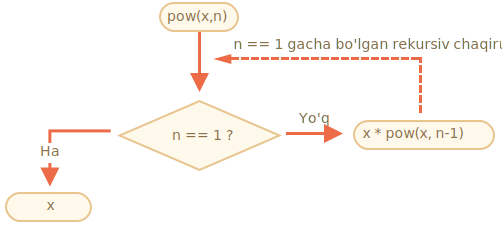
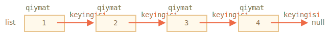
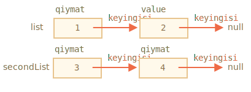
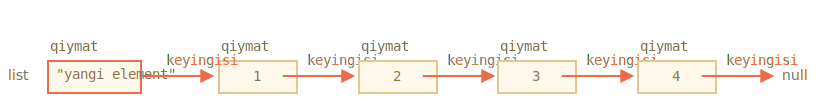
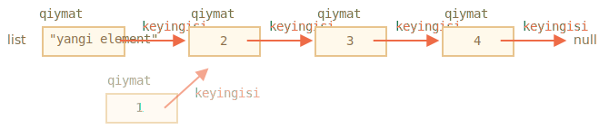

# Rekursiya va stek

Keling, funktsiyalarga qaytamiz va ularni yanada chuqurroq o'rganamiz.

Bizning birinchi mavzuimiz *rekursiya* bo'ladi.

Agar siz dasturlash bilan yangi tanish bo'lmasangiz, ehtimol u sizga tanish va siz ushbu bobni o'tkazib yuborishingiz mumkin.

Rekursiya - bu vazifa tabiiy ravishda bir nechta o'xshash, ammo oddiy vazifalarga bo'linishi mumkin bo'lgan hollarda foydali bo'lgan dasturiy ta'minot usuli. Yoki vazifa oddiy ishlarga, shuningdek, bir xil vazifaning oddiy versiyasiga soddalashtirilishi mumkin. Yoki yaqinda ko'rib chiqamiz, muayyan ma'lumotlar tuzilmalari bilan ishlash.

Funktsiya vazifani bajarganda, u boshqa ko'plab funktsiyalarni chaqirishi mumkin. Buning qisman holati shundaki, funktsiya *o'zini* chaqiradi. Bunga *rekursiya* deyiladi.

## Fikrlashning ikkita usuli

Biron bir oddiy narsadan boshlash uchun -- keling, `x` ni `n` ning natural darajasiga ko'taradigan `pow(x,n)` funktsiyasini yozaylik. Boshqacha qilib aytganda, `x` o'z-o'zini `n` marta ko'paytiradi.

```js
pow(2, 2) = 4
pow(2, 3) = 8
pow(2, 4) = 16
```

Uni amalga oshirishning ikki yo'li mavjud.

1. Takroriy fikrlash: `for` tsikli:

    ```js run
    function pow(x, n) {
      let result = 1;

      // natijani ko'chadan x n marta ko'paytirish
      for (let i = 0; i < n; i++) {
        result *= x;
      }

      return result;
    }

    alert( pow(2, 3) ); // 8
    ```

2. Rekursiv fikrlash: vazifani soddalashtiring va o'zini chaqiring:

    ```js run
    function pow(x, n) {
      if (n == 1) {
        return x;
      } else {
        return x * pow(x, n - 1);
      }
    }

    alert( pow(2, 3) ); // 8
    ```

Iltimos, rekursiv variant qanday fundamental farq qilishiga e'tibor bering.

`pow(x,n)` chaqirilganda, ijro ikkita shoxga bo'linadi:

```js
              if n==1  = x
             /
pow(x, n) =
             \
              else     = x * pow(x, n - 1)
```

1. Agar `n == 1` bo'lsa, unda hamma narsa ahamiyatsiz. U rekursiyaning *bazasi* deb nomlanadi, chunki u darhol aniq natijani beradi: `pow (x, 1)` teng `x`.
2. Aks holda, biz `pow(x, n)` ni `x * pow (x, n - 1)` sifatida ifodalashimiz mumkin. Matematikada <code>x<sup>n</sup> = x * x<sup>n-1</sup></code> yozish mumkin. Bu *rekursiv qadam* deyiladi: biz vazifani oddiyroq harakatga aylantiramiz (`x` ga ko'paytirish) va xuddi shu vazifani oddiyroq chaqiruviga (`pow` pastroq `n` bilan). Keyingi qadamlar uni yanada soddalashtiradi va `n` `1` ga yetguncha.

Shuni ham aytishimiz mumkinki, `pow` *rekursiv ravishda o'zini* `n == 1` gacha chaqiradi.




Yoki masalan, `pow(2, 4)` ni hisoblash uchun rekursiv variant quyidagi bosqichlarni bajaradi:

1. `pow(2, 4) = 2 * pow(2, 3)`
2. `pow(2, 3) = 2 * pow(2, 2)`
3. `pow(2, 2) = 2 * pow(2, 1)`
4. `pow(2, 1) = 2`

Shunday qilib, rekursiya funktsiya chaqiruvini sodda chaqiruvchiga, so'ngra yanada soddalashtirishga va hokazo natija aniq bo'lguncha kamaytiradi.

````smart header="Rekursiya odatda qisqaroq"
Rekursiv yechim odatda takrorlanuvchiga qaraganda qisqaroq bo'ladi.

<<<<<<< HEAD
Bu yerda biz `pow(x, n)` funktsiya kodini yanada qisqartirish, ammo oson o'qilishi uchun `if` o'rniga uchlik `?` operatoridan foydalangan holda qayta yozishimiz mumkin:
=======
Here we can rewrite the same using the conditional operator `?` instead of `if` to make `pow(x, n)` more terse and still very readable:
>>>>>>> fb4fc33a2234445808100ddc9f5e4dcec8b3d24c

```js run
function pow(x, n) {
  return (n == 1) ? x : (x * pow(x, n - 1));
}
```
````

Ichki chaqiruvlarning maksimal soni (birinchisini ham qo'shganda) *rekursiya chuqurligi* deb nomlanadi. Bizning holatda, bu aniq `n` bo'ladi.

<<<<<<< HEAD
Maksimal rekursiya chuqurligi JavaScript interpretatori bilan cheklangan. 10000 ga yaqin ekanligiga ishonch hosil qilishimiz mumkin, ba'zi interpretatorlar ko'proq narsalarga imkon beradi, ammo 100000 ularning aksariyati uchun cheklangan bo'lishi mumkin. Buni engillashtirishga yordam beradigan avtomatik optimallashtirishlar mavjud ("quyruq chaqiruvlar optimallashtirish"), ammo ular hali hamma joyda qo'llab-quvvatlanmaydi va faqat oddiy holatlarda ishlaydi.
=======
The maximal recursion depth is limited by JavaScript engine. We can rely on it being 10000, some engines allow more, but 100000 is probably out of limit for the majority of them. There are automatic optimizations that help alleviate this ("tail calls optimizations"), but they are not yet supported everywhere and work only in simple cases.
>>>>>>> fb4fc33a2234445808100ddc9f5e4dcec8b3d24c

Bu rekursiyani qo'llashni cheklaydi, ammo u hali ham juda keng bo'lib qolmoqda. Rekursiv fikrlash uslubi sodda kod beradi, uni saqlash osonroq.

<<<<<<< HEAD
## Ijro to'plami
=======
## The execution context and stack
>>>>>>> fb4fc33a2234445808100ddc9f5e4dcec8b3d24c

Endi rekursiv chaqiruvlar qanday ishlashini ko'rib chiqamiz. Buning uchun biz funktsiyalarning "qopqog' ostini" ko'rib chiqamiz.

<<<<<<< HEAD
Funksiyaning ishlashi haqida ma'lumot uning *bajarilish kontekstida* saqlanadi.
=======
The information about the process of execution of a running function is stored in its *execution context*.
>>>>>>> fb4fc33a2234445808100ddc9f5e4dcec8b3d24c

[Ijro etish konteksti](https://tc39.github.io/ecma262/#sec-execution-contexts) - bu funktsiyalarning bajarilishi to'g'risidagi ma'lumotlarni o'z ichiga olgan ichki ma'lumotlar tuzilishi: boshqaruv oqimi hozir bo'lgan joyda, hozirgi o'zgaruvchanlar , `this` qiymati (biz bu yerda ishlatmaymiz) va boshqa bir nechta ichki tafsilotlar.

Bitta funktsiya chaqiruvi u bilan bog'liq bo'lgan bitta ijro kontekstiga ega.

Funktsiya ichki chaqiruvni amalga oshirganda, quyidagilar sodir bo'ladi:

- Joriy funktsiya to'xtatildi.
- U bilan bog'liq bo'lgan ijro konteksti *ijro kontekst steki* deb nomlangan maxsus ma'lumotlar tuzilmasida eslab qolinadi.
- Ichki chaqiruv amalga oshiriladi.
- U tugagandan so'ng, stekdan eski ijro konteksti olinadi va tashqi funktsiya to'xtagan joyidan tiklanadi.

Keling, `pow(2, 3)` chaqiruvi paytida nima sodir bo'lishini ko'rib chiqaylik.

### pow(2, 3)

`pow(2, 3)` chaqiruvining boshida bajarilish konteksti o'zgaruvchanlarni saqlaydi: `x = 2, n = 3`, ijro oqimi funktsiyaning `1` satrida.

Biz uni quyidagicha chizishimiz mumkin:

<ul class="function-execution-context-list">
  <li>
    <span class="function-execution-context">Kontekst: { x: 2, n: 3, 1-satrda}</span>
    <span class="function-execution-context-call">pow(2, 3)</span>
  </li>
</ul>

<<<<<<< HEAD
Ana shunda funktsiya bajarila boshlaydi. `n == 1` sharti noto'g'ri, shuning uchun oqim `if` ning ikkinchi shoxiga o'tadi:
=======
That's when the function starts to execute. The condition `n == 1` is falsy, so the flow continues into the second branch of `if`:
>>>>>>> fb4fc33a2234445808100ddc9f5e4dcec8b3d24c

```js run
function pow(x, n) {
  if (n == 1) {
    return x;
  } else {
*!*
    return x * pow(x, n - 1);
*/!*
  }
}

alert( pow(2, 3) );
```


O'zgaruvchanlar bir xil, ammo satr o'zgaradi, shuning uchun kontekst hozir:

<ul class="function-execution-context-list">
  <li>
    <span class="function-execution-context">Kontekst: { x: 2, n: 3, 5-satrda }</span>
    <span class="function-execution-context-call">pow(2, 3)</span>
  </li>
</ul>

`x * pow (x, n - 1)` ni hisoblash uchun biz yangi `pow(2, 2)` argumentlari bilan `pow` subchaqiruvini qilishimiz kerak.

### pow(2, 2)

Ichki chaqiruvni amalga oshirish uchun JavaScript *ijro kontekst stekidagi* joriy ijro kontekstini eslab qoladi.

Bu yerda biz xuddi shu funktsiyani `pow` deb ataymiz, ammo bu mutlaqo muhim emas. Jarayon barcha funktsiyalar uchun bir xil:

1. Joriy kontekst stekning yuqori qismida "eslab qolinadi".
2. Subchaqiruv uchun yangi kontekst yaratilinadi.
3. Subchaqiruv tugagandan so'ng -- avvalgi kontekst stekdan chiqadi va uning bajarilishi davom etadi.

`pow(2, 2)` subchaqiruvga kirganimizda kontekst to'plami:

<ul class="function-execution-context-list">
  <li>
    <span class="function-execution-context">Kontekst: { x: 2, n: 2, 1-satrda}</span>
    <span class="function-execution-context-call">pow(2, 2)</span>
  </li>
  <li>
    <span class="function-execution-context">Kontekst: { x: 2, n: 3, 5-satrda }</span>
    <span class="function-execution-context-call">pow(2, 3)</span>
  </li>
</ul>

Yangi joriy ijro konteksti tepada (va qalin) va avval eslab olingan kontekstlar quyida keltirilgan.

<<<<<<< HEAD
Subchaqiruv tugatgandan so'ng - avvalgi kontekstni davom ettirish oson, chunki u ikkala o'zgaruvchanni va kodning to'xtagan joyini saqlaydi. Bu yerda rasmda biz "satr" so'zini ishlatmoqdamiz, ammo bu aniqroq.
=======
When we finish the subcall -- it is easy to resume the previous context, because it keeps both variables and the exact place of the code where it stopped.

```smart
Here in the picture we use the word "line", as in our example there's only one subcall in line, but generally a single line of code may contain multiple subcalls, like `pow(…) + pow(…) + somethingElse(…)`.

So it would be more precise to say that the execution resumes "immediately after the subcall".
```
>>>>>>> fb4fc33a2234445808100ddc9f5e4dcec8b3d24c

### pow(2, 1)

Jarayon takrorlanadi: `5` satrda yangi subchaqiruv bajarilindi, endi `x = 2`, `n = 1` argumentlari bilan.

Yangi ijro konteksti yaratildi, oldingisi stekning tepasiga surildi:

<ul class="function-execution-context-list">
  <li>
    <span class="function-execution-context">Kontekst: { x: 2, n: 1, 1-satrda }</span>
    <span class="function-execution-context-call">pow(2, 1)</span>
  </li>
  <li>
    <span class="function-execution-context">Kontekst: { x: 2, n: 2, 5-satrda }</span>
    <span class="function-execution-context-call">pow(2, 2)</span>
  </li>
  <li>
    <span class="function-execution-context">Kontekst: { x: 2, n: 3, 5-satrda }</span>
    <span class="function-execution-context-call">pow(2, 3)</span>
  </li>
</ul>

Hozirda 2 ta eski kontekst mavjud va joriy `pow(2, 1)` uchun 1 tasi ishlayapti.

### Chiqish

`pow(2, 1)` ni bajarish paytida, avvalgidan farqli o'laroq, `n == 1` sharti haqiqatdir, shuning uchun `if` ning birinchi shoxi ishlaydi:

```js
function pow(x, n) {
  if (n == 1) {
*!*
    return x;
*/!*
  } else {
    return x * pow(x, n - 1);
  }
}
```

Boshqa ichki chaqiruvlar yo'q, shuning uchun funktsiya tugaydi va `2` qaytariladi.

Funktsiya tugagandan so'ng, uning bajarilish konteksti endi kerak emas, shuning uchun u xotiradan o'chiriladi. Oldingisi stekning yuqori qismidan tiklanadi:


<ul class="function-execution-context-list">
  <li>
    <span class="function-execution-context">Kontekst: { x: 2, n: 2, 5-satrda }</span>
    <span class="function-execution-context-call">pow(2, 2)</span>
  </li>
  <li>
    <span class="function-execution-context">Context: { x: 2, n: 3, 5-satrda }</span>
    <span class="function-execution-context-call">pow(2, 3)</span>
  </li>
</ul>

`pow(2, 2)` ning ijrosi tiklandi. Bu `pow(2, 1)` subchaqiruvning natijasiga ega, shuning uchun u `x * pow(x, n - 1)` ni baholashni tugatib, `4` ni qaytaradi.

So'ngra oldingi kontekst tiklanadi:

<ul class="function-execution-context-list">
  <li>
    <span class="function-execution-context">Kontekst: { x: 2, n: 3, 5-satrda }</span>
    <span class="function-execution-context-call">pow(2, 3)</span>
  </li>
</ul>

U tugagach, bizda `pow(2, 3) = 8` natijasi bo'ladi.

Bu holda rekursiya chuqurligi: **3**.

Yuqoridagi illyustratsiyalardan ko'rinib turibdiki, rekursiya chuqurligi stekdagi kontekstning maksimal soniga teng.

Xotira talablariga e'tibor bering. Kontekstlar xotirani oladi. Bizning holatda, `n` darajasiga ko'tarish, aslida `n` kontekstlari uchun, `n` ning barcha pastki qiymatlari uchun xotira talab qiladi.

Tsiklga asoslangan algoritm xotirani tejashga ko'proq mos keladi:

```js
function pow(x, n) {
  let result = 1;

  for (let i = 0; i < n; i++) {
    result *= x;
  }

  return result;
}
```

Qayta takrorlanadigan `pow` takrorlash jarayonida `i` va `natija` ni o'zgartiriladi va bitta kontekst ishlatilinadi. Uning xotiraga bo'lgan talablari kichik, qat'iy va `n` ga bog'liq emas.

**Har qanday rekursiyani tsikl sifatida qayta yozish mumkin. Tsikl variantini odatda samaraliroq qilish mumkin.**

<<<<<<< HEAD
...Ammo ba'zida qayta yozish ahamiyatsiz bo'ladi, ayniqsa funktsiya sharoitga qarab turli xil rekursiv subchaqiruvlardan foydalanganda va ularning natijalarini birlashtirganda yoki tarmoqlanish murakkabroq bo'lganda. Va optimallashtirish kerak bo'lmasligi va bu umuman harakatlarga loyiq emas bo'lishi mumkin.
=======
...But sometimes the rewrite is non-trivial, especially when a function uses different recursive subcalls depending on conditions and merges their results or when the branching is more intricate. And the optimization may be unneeded and totally not worth the efforts.
>>>>>>> 6236eb8c3cdde729dab761a1d0967a88a1a6197e

Rekursiya kodni qisqartirishi mumkin, uni tushunish va qo'llab-quvvatlash osonroq. Har bir joyda optimallashtirish talab qilinmaydi, asosan bizga yaxshi kod kerak, shuning uchun u ishlatiladi.

## Rekursiv o'tish

Rekursiyaning yana bir ajoyib qo'llanilishi - bu rekursiv o'tish.

Tasavvur qiling, bizning kompaniyamiz bor. Xodimlar tarkibi obyekt sifatida taqdim etilishi mumkin:

```js
let company = {
  sales: [{
    name: 'John',
    salary: 1000
  }, {
    name: 'Alice',
    salary: 1600
  }],

  development: {
    sites: [{
      name: 'Peter',
      salary: 2000
    }, {
      name: 'Alex',
      salary: 1800
    }],

    internals: [{
      name: 'Jack',
      salary: 1300
    }]
  }
};
```

Boshqacha qilib aytganda, kompaniyada bo'limlar mavjud.

<<<<<<< HEAD
- Bo'limda bir massiv xodimlar bo'lishi mumkin. Masalan, `savdo` bo'limida ikkita xodim ishlaydi: Aziza va Elbek.
- Yoki kompaniya bo'linmalarga bo'linishi mumkin, masalan, `rivojlanish` ning ikkita shoxi mavjud: `saytlar` va `ichki dasturals`. Ularning har birida o'z shaxsiy xodimlari mavjud.
- Bundan tashqari, agar bo'linma o'sib chiqsa, u pastki bo'limlarga (yoki jamoalarga) bo'linishi mumkin.
=======
- A department may have an array of staff. For instance, `sales` department has 2 employees: John and Alice.
- Or a department may split into subdepartments, like `development` has two branches: `sites` and `internals`. Each of them has their own staff.
- It is also possible that when a subdepartment grows, it divides into subsubdepartments (or teams).
>>>>>>> fb4fc33a2234445808100ddc9f5e4dcec8b3d24c

    Masalan, kelajakda saytlar bo'limi `siteA` va` siteB` uchun jamoalarga bo'linishi mumkin. Va ular, ehtimol, ko'proq bo'linishi mumkin. Faqat bu rasmda emas, balki bu narsani yodda tutish kerak.

Keling, barcha ish haqlarining yig'indisini olish funktsiyasini xohlaymiz deylik. Buni qanday qilishimiz mumkin?

<<<<<<< HEAD
Takroriy yondashish oson emas, chunki tuzilish oddiy emas. Birinchi g'oya, birinchi darajali bo'limlar ustidan ichki subtsikl bilan `for` tsikl qilishdir. Ammo keyin biz `saytlar` kabi 2-darajali bo'limlarda ishlaydigan xodimlarni takrorlash uchun ko'proq ichki subtsiklarga muhtojmiz. ...Va keyin kelajakda paydo bo'lishi mumkin bo'lgan uchinchi darajali bo'limlar uchun yana bitta subtsiklmi? 3 darajasida to'xtashimiz kerakmi yoki 4 darajali tsikl qilishimiz kerakmi? Agar bitta obyektni ustidan takrorlash uchun kodga 3-4 ta ichki ichki tsiklni qo'ysak, u juda xunuk bo'ladi.
=======
An iterative approach is not easy, because the structure is not simple. The first idea may be to make a `for` loop over `company` with nested subloop over 1st level departments. But then we need more nested subloops to iterate over the staff in 2nd level departments like `sites`... And then another subloop inside those for 3rd level departments that might appear in the future? If we put 3-4 nested subloops in the code to traverse a single object, it becomes rather ugly.
>>>>>>> fb4fc33a2234445808100ddc9f5e4dcec8b3d24c

Rekursiyani sinab ko'raylik.

Ko'rib turganimizdek, bizning funktsiyamiz bo'limni yig'ib olganda, ikkita holat mavjud:

<<<<<<< HEAD
1. Yoki bu "oddiy" *odamlar massiviga ega* bo'lim -- biz ish haqini oddiy tsiklda yig'ishimiz mumkin.
2. Yoki bu *`N` bo'linmalariga ega bo'lgan obyekt* - biz subdepslarning har biri uchun yig'indini olish va natijalarni birlashtirish uchun `N` rekursiv chaqiruvlarini amalga oshirishimiz mumkin.

(1) - bu rekursiyaning asosi, muhim holat.

(2) - bu rekursiv qadam. Murakkab vazifa kichik bo'limlar uchun subvazifalrga bo'linadi. Ular o'z navbatida yana bo'linishi mumkin, ammo ertami-kechmi bo'linish (1) da tugaydi.
=======
1. Either it's a "simple" department with an *array* of people -- then we can sum the salaries in a simple loop.
2. Or it's *an object* with `N` subdepartments -- then we can make `N` recursive calls to get the sum for each of the subdeps and combine the results.

The 1st case is the base of recursion, the trivial case, when we get an array.

The 2nd case when we get an object is the recursive step. A complex task is split into subtasks for smaller departments. They may in turn split again, but sooner or later the split will finish at (1).
>>>>>>> fb4fc33a2234445808100ddc9f5e4dcec8b3d24c

Algoritmni koddan o'qish yanada osonroq bo'lishi mumkin:


```js run
<<<<<<< HEAD
let company = { // qisqartirish uchun siqilgan bir xil obyekt
  sales: [{name: 'John', salary: 1000}, {name: 'Alice', salary: 600 }],
=======
let company = { // the same object, compressed for brevity
  sales: [{name: 'John', salary: 1000}, {name: 'Alice', salary: 1600 }],
>>>>>>> fb4fc33a2234445808100ddc9f5e4dcec8b3d24c
  development: {
    sites: [{name: 'Peter', salary: 2000}, {name: 'Alex', salary: 1800 }],
    internals: [{name: 'Jack', salary: 1300}]
  }
};

// Ishni bajarish funktsiyasi
*!*
function sumSalaries(department) {
  if (Array.isArray(department)) { // hodisa (1)
    return department.reduce((prev, current) => prev + current.salary, 0); // massivni yig'ish
  } else { // hodisa (2)
    let sum = 0;
    for (let subdep of Object.values(department)) {
      sum += sumSalaries(subdep); // rekursiv ravishda bo'limlarni chaqirish, natijalarni yig'ish
    }
    return sum;
  }
}
*/!*

alert(sumSalaries(company)); // 7700
```

Kod qisqa va tushunarli (umid qilaman:)). Rekursiyaning kuchi shunda. Bundan tashqari, har qanday ichki bo'limni joylashtirish uchun ishlaydi.

Chaqiruvlarning diagrammasi:


Biz printsipni osongina ko'rishimiz mumkin: obyekt uchun `{...}` subchaqiruvlari amalga oshiriladi, `[...]` massivlari esa rekursiya daraxtning "barglari" dir, ular darhol natija beradi.

Kodda biz ilgari ko'rib chiqqan aqlli xususiyatlardan foydalanilganligiga e'tibor bering:

- Massiv yig'indisini olish uchun <info:array-methods> bobida tushuntirilgan `arr.reduce` usuli.
- Obyekt qiymatlari bo'yicha takrorlash uchun `for(val of Object.values(obj))`: `Object.values` ularning massivini qaytaradi.


## Rekursiv tuzilmalar

Ma'lumotlarning rekursiv (rekursiv aniqlangan) tuzilishi - bu qismlarga bo'linib takrorlanadigan tuzilma.

Buni biz yuqoridagi kompaniya tuzilmasi misolida ko'rdik.

Kompaniya *bo'limi* bu:
- Yoki bir massiv odamlar.
- Yoki *bo'limlarga* ega bo'lgan obyekt.

Veb-ishlab chiquvchilar uchun juda yaxshi ma'lum bo'lgan misollar mavjud: HTML va XML hujjatlar.

HTML-hujjatda *HTML-teg* quyidagilar ro'yxatini o'z ichiga olishi mumkin:
- Matn qismlari.
- HTML-sharhlar.
- Boshqa *HTML-teglar* (bu o'z navbatida matn parchalarini/izohlarni yoki teglarni va boshqalarni o'z ichiga olishi mumkin).

Bu yana bir bor rekursiv ta'rif.

Yaxshi tushunish uchun biz "bog'langan ro'yxat" deb nomlangan yana bir rekursiv tuzilmani ko'rib chiqamiz, bu ba'zi hollarda massivlar uchun yaxshi alternativ bo'lishi mumkin.

### Bog'langan ro'yxat

Tasavvur qiling, biz tartib qilingan obyektlar ro'yxatini saqlamoqchimiz.

Tabiiy tanlov massiv bo'lishi mumkin:

```js
let arr = [obj1, obj2, obj3];
```

...Ammo massivlarda muammo bor. "Elementni o'chirish" va "elementni kiritish" operatsiyalari qimmatga tushadi. Masalan, `arr.unshift(obj)` operatsiyasi yangi `obj` ga joy ajratish uchun barcha elementlarning raqamlarini o'zgartirishi kerak va agar massiv katta bo'lsa, vaqt talab etiladi. `arr.shift()` bilan bir xil.

<<<<<<< HEAD
Ommaviy raqamlarni o'zgartirishni talab qilmaydigan yagona tizimli o'zgartirishlar massiv oxirida ishlaydiganlardir: `arr.push/pop`. Shunday qilib, massiv katta navbatlarda juda sekin bo'lishi mumkin.
=======
The only structural modifications that do not require mass-renumbering are those that operate with the end of array: `arr.push/pop`. So an array can be quite slow for big queues, when we have to work with the beginning.
>>>>>>> fb4fc33a2234445808100ddc9f5e4dcec8b3d24c

Shu bilan bir qatorda, agar biz haqiqatan ham tezkor kiritish/o'chirishga muhtoj bo'lsak, biz [bog'langan ro'yxat](https://en.wikipedia.org/wiki/Linked_list) deb nomlangan boshqa ma'lumotlar tuzilishini tanlashimiz mumkin.

*Bog'langan ro'yxat elementi* quyidagicha obyekt sifatida rekursiv ravishda aniqlanadi:
- `value`.
- `next` keyingi *bog'langan ro'yxat elementiga* havola qilingan xususiyat yoki agar bu oxiri bo'lsa `null`.

Masalan:

```js
let list = {
  value: 1,
  next: {
    value: 2,
    next: {
      value: 3,
      next: {
        value: 4,
        next: null
      }
    }
  }
};
```

Ro'yxatning grafik tasviri:



Yaratish uchun muqobil kod:

```js no-beautify
let list = { value: 1 };
list.next = { value: 2 };
list.next.next = { value: 3 };
list.next.next.next = { value: 4 };
list.next.next.next.next = null;
```

<<<<<<< HEAD
Bu erda biz bir nechta ob'ektlar borligini yanada aniqroq ko'rishimiz mumkin, ularning har biri `qiymati` va `keyingi` qo'shniga ishora qiladi. `list` o'zgaruvchisi zanjirning birinchi obyekti, shuning uchun undan `keyingi` ko'rsatgichlardan so'ng istalgan elementga erishishimiz mumkin.
=======
Here we can even more clearly see that there are multiple objects, each one has the `value` and `next` pointing to the neighbour. The `list` variable is the first object in the chain, so following `next` pointers from it we can reach any element.
>>>>>>> fb4fc33a2234445808100ddc9f5e4dcec8b3d24c

Ro'yxat osongina bir nechta qismlarga bo'linishi va keyinchalik birlashtirilishi mumkin:

```js
let secondList = list.next.next;
list.next.next = null;
```



Qo'shish:

```js
list.next.next = secondList;
```

Va, albatta, biz har qanday joyga elementlarni qo'shishimiz yoki olib tashlashimiz mumkin.

Masalan, yangi qiymatni oldindan belgilash uchun ro'yxatning bosh qismini yangilashimiz kerak:

```js
let list = { value: 1 };
list.next = { value: 2 };
list.next.next = { value: 3 };
list.next.next.next = { value: 4 };

*!*
// ro'yxatdagi yangi qiymatni oldindan belgilang
list = { value: "new item", next: list };
*/!*
```



O'rtadan qiymatni olib tashlash uchun avvalgisining `keyingisini` o'zgartiring:

```js
list.next = list.next.next;
```



`list.next` `1` dan `2` qiymatiga sakrab chiqdi. `1` qiymati endi zanjirdan chiqarildi. Agar u boshqa joyda saqlanmasa, u xotiradan avtomatik ravishda o'chiriladi.

Massivlardan farqli o'laroq, ommaviy raqamlarni o'zgartirish mumkin emas, biz elementlarni osongina o'zgartiramiz.

Tabiiyki, ro'yxatlar har doim ham massivlardan yaxshiroq emas. Aks holda hamma faqat ro'yxatlardan foydalanar edi.

Asosiy kamchilik shundaki, biz elementga uning soniga ko'ra osonlikcha kira olmaymiz. Bu massivda oson erishiladi: `arr[n]` - bu to'g'ridan-to'g'ri ma'lumotdir. Ammo ro'yxatda biz birinchi elementdan boshlashimiz va `N` elementni olish uchun `keyingi` `N` marta o'tishimiz kerak.

<<<<<<< HEAD
...Lekin biz har doim bunday operatsiyalarga muhtoj emasmiz. Misol uchun, biz navbatga yoki hatto [ikki tomonlama](https://en.wikipedia.org/wiki/Double-ended_queue) muhtojmiz –- bu har ikki uchidan ham elementlarni juda tez qo'shish/o'chirish imkonini beruvchi tartibli tuzilishdir, lekin o'rtada kirishga iloji yo'q.

Ba'zan ro'yxatning oxirgi elementini kuzatib borish uchun `quyruq` nomli boshqa o'zgaruvchanni qo'shishga to'g'ri keladi (elementlarni oxiriga qo'shish/olib tashlash va yangilash uchun). Katta elementlar to'plami uchun tezlik farqi massivga nisbatan katta.
=======
...But we don't always need such operations. For instance, when we need a queue or even a [deque](https://en.wikipedia.org/wiki/Double-ended_queue) -- the ordered structure that must allow very fast adding/removing elements from both ends, but access to its middle is not needed.

Lists can be enhanced:
- We can add property `prev` in addition to `next` to reference the previous element, to move back easily.
- We can also add a variable named `tail` referencing the last element of the list (and update it when adding/removing elements from the end).
- ...The data structure may vary according to our needs.
>>>>>>> fb4fc33a2234445808100ddc9f5e4dcec8b3d24c

## Xulosa

<<<<<<< HEAD
Shartlar:
- *Rekursiya* - bu "o'zini o'zi chaqirish" funktsiyasini anglatadigan dasturlash atamasi. Bunday funktsiyalar yordamida ba'zi vazifalarni nafis usullar bilan hal qilish mumkin.
=======
Terms:
- *Recursion*  is a programming term that means calling a function from itself. Recursive functions can be used to solve tasks in elegant ways.
>>>>>>> fb4fc33a2234445808100ddc9f5e4dcec8b3d24c

    Agar funktsiya o'zini o'zi chaqirsa, bu *rekursiya qadami* deb nomlanadi. Rekursiyaning *asosi* vazifani shu qadar soddalashtiradigan funktsiya argumentlari bo'lib, funktsiya qo'shimcha chaqiruvlarni amalga oshirmaydi.

- [Rekursiv ravishda belgilangan](https://en.wikipedia.org/wiki/Recursive_data_type) ma'lumotlar tuzilishi - bu o'zi yordamida aniqlanishi mumkin bo'lgan ma'lumotlar tuzilishi.

    Masalan, bog'langan ro'yxat (yoki null) ga havola qilingan obyektdan tashkil topgan ma'lumotlar tuzilishi sifatida aniqlanishi mumkin.

    ```js
    list = { value, next -> list }
    ```

<<<<<<< HEAD
    Ushbu bobdagi HTML elementlari daraxti yoki bo'lim daraxti kabi daraxtlar ham tabiiy ravishda rekursivdir: ular shoxlanadi va har bir shox boshqa shoxlarga ega bo'lishi mumkin.
=======
    Trees like HTML elements tree or the department tree from this chapter are also naturally recursive: they have branches and every branch can have other branches.
>>>>>>> 6236eb8c3cdde729dab761a1d0967a88a1a6197e

    Rekursiv funktsiyalar yordamida ularning ustida yurish uchun foydalanish mumkin, buni biz `sumSalary` misolida ko'rdik.

Har qanday rekursiv funktsiyani ketma-ket saraluvhanga qayta yozish mumkin. Va bu ba'zida narsalarni optimallashtirish uchun talab qilinadi. Ammo ko'pgina vazifalar uchun rekursiv yechim juda tez yozish va qo'llab-quvvatlash osonroq.
