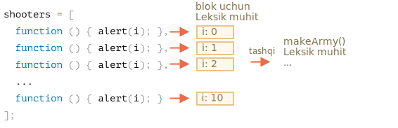

Keling, `makeArmy` ichida nima bo'lganini ko'rib chiqamiz, va yechim aniq bo'ladi.

1. Bu bo'sh massivni yaratadi `shooters`:

    ```js
    let shooters = [];
    ```
2. Uni `shooters.push(function...)` orqali tsikldan to'ldiradi.

    Har bir element funktsiyadir, shuning uchun olingan massiv quyidagicha ko'rinadi:

    ```js no-beautify
    shooters = [
      function () { alert(i); },
      function () { alert(i); },
      function () { alert(i); },
      function () { alert(i); },
      function () { alert(i); },
      function () { alert(i); },
      function () { alert(i); },
      function () { alert(i); },
      function () { alert(i); },
      function () { alert(i); }
    ];
    ```

3. Massiv funktsiyadan qaytariladi.

Keyinchalik, `army[5]()` chaqiruvi massivdan `army[5]` elementini oladi (bu funktsiya bo'ladi) va uni chaqiradi.

Endi nima uchun bunday funktsiyalarning barchasi bir xil bo'ladi?

Buning sababi `shooter` funktsiyalarida mahalliy `i` o'zgaruvchani yo'q. Bunday funktsiya chaqirilganda, uning tashqi leksik muhitidan `i` olinadi.

`i` qiymati qanday bo'ladi?

Agar manbaga qarasak:

```js
function makeArmy() {
  ...
  let i = 0;
  while (i < 10) {
    let shooter = function() { // shooter funktsiya
      alert( i ); // uning raqamini ko'rsatishi kerak
    };
    ...
  }
  ...
}
```

...Uning amaldagi `makeArmy()` ishlashi bilan bog'liq bo'lgan leksik muhitda yashayotganini ko'rishimiz mumkin. Ammo `army[5]()` chaqirilganda, `makeArmy` allaqachon o'z ishini tugatib bo'ladi va `i` oxirgi qiymatga ega: `10` (`while` ning oxirisi).

Natijada, barcha `shooter` funktsiyalari tashqi leksik muhitdan bir xil narsa oladi, oxirgi qiymat `i = 10`.

O'zgaruvchan ta'rifni tsiklga ko'chirish orqali uni tuzatishimiz mumkin:

```js run demo
function makeArmy() {

  let shooters = [];

*!*
  for(let i = 0; i < 10; i++) {
*/!*
    let shooter = function() { // shooter funktsiya
      alert( i ); // uning raqamini ko'rsatishi kerak
    };
    shooters.push(shooter);
  }

  return shooters;
}

let army = makeArmy();

army[0](); // 0
army[5](); // 5
```

Endi u to'g'ri ishlaydi, chunki har safar `for (let i=0...) {...}` dagi kod bloki bajarilganda u uchun mos keladigan `i` o'zgaruvchanga ega bo'lgan yangi leksik muhit yaratiladi.

Shunday qilib, endi `i` qiymati biroz yaqinroq yashaydi. `makeArmy()` leksik muhitida emas, balki joriy tsiklning takrorlanishiga mos keladigan leksik muhitda. Shuning uchun endi u ishlaydi.



Bu erda biz `while` ni `for` ga qayta yozdik.

Yana bir hiyla-nayrang bo'lishi mumkin, keling, mavzuni yaxshiroq tushunish uchun buni ko'rib chiqaylik:

```js run
function makeArmy() {
  let shooters = [];

  let i = 0;
  while (i < 10) {
*!*
    let j = i;
*/!*
    let shooter = function() { // shooter funktsiya
      alert( *!*j*/!* ); // uning raqamini ko'rsatishi kerak
    };
    shooters.push(shooter);
    i++;
  }

  return shooters;
}

let army = makeArmy();

army[0](); // 0
army[5](); // 5
```

`while` tsikli, xuddi `for` singari, har bir ish uchun yangi leksik muhit yaratadi. Shunday qilib, biz uning `shooter` uchun to'g'ri qiymatga ega bo'lishiga ishonch hosil qilamiz.

Biz `let j = i` nusxasini olamiz. Bu lokal `j` ni tsikl tanasi qiladi va unga `i` qiymatini ko'chiradi. Ibtidoiyl narsalar `qiymat bo'yicha` ko'chiriladi, shuning uchun biz amaldagi tsiklning takrorlanishiga tegishli bo'lgan `i` ning to'liq mustaqil nusxasini olamiz.
