<<<<<<< HEAD
# Yopish

JavaScript - kuchli funktsiona-yo'naltirilgan til. U bizga ko'p erkinlik beradi. Funktsiya dinamik ravishda yaratilishi mumkin, boshqa o'zgaruvchanga ko'chirilishi yoki boshqa funktsiyaning argumenti sifatida uzatilishi va keyinchalik butunlay boshqa joydan chaqirilishi mumkin.

Biz bilamizki, funktsiya uning tashqarisidagi o'zgaruvchanlarga kira oladi; bu xususiyat juda tez-tez ishlatiladi.

Ammo tashqi o'zgaruvchan o'zgarganda nima bo'ladi? Funksiya eng yangi qiymatni oladimi yoki funktsiya yaratilganda mavjud bo'lgan qiymatni oladimi?

Bundan tashqari, funktsiya kodning boshqa joyiga o'tganda va u yerdan chaqirilganda nima bo'ladi -- u yangi joyning tashqi o'zgaruvchanlariga kirish huquqini oladimi?

Bu yerda turli xil tillar boshqacha yo'l tutadi va biz ushbu bobda JavaScript-ning xatti-harakatlarini ko'rib chiqamiz.

## Bir nechta savol

Keling, ikkita vaziyatni ko'rib chiqamiz, so'ngra ichki mexanikani qismlarga bo'lib o'rganib chiqamiz, shunda siz kelajakda quyidagi savollarga va yanada murakkab savollarga javob bera olasiz.

1. `sayHi` funktsiyasi tashqi `name` o'zgaruvchanidan foydalanadi. Funktsiya ishga tushganda, u qaysi qiymatdan foydalanadi?

    ```js
    let name = "John";

    function sayHi() {
      alert("Salom, " + name);
    }

    name = "Pete";

    *!*
    sayHi(); // bu nimani ko'rsatadi: "John" yoki "Pete"?
    */!*
    ```

    Bunday holatlar brauzer va server rivojlanishida keng tarqalgan. Funktsiyani amalga oshirish, masalan, maxsus harakat yoki tarmoq so'rov yaratilganidan keyin rejalashtirilishi mumkin.

    Shunday qilib, savol tug'iladi: u so'nggi o'zgarishlarni qabul qiladimi?


2. `makeWorker` funktsiyasi boshqa funktsiyani bajaradi va uni qaytaradi. Ushbu yangi funktsiya boshqa joydan chaqirilishi mumkin. U yaratilish joyidan yoki chaqiruv joyidan yoki ikkalasidan tashqi o'zgaruvchanlarga kirish huquqiga ega bo'ladimi?

    ```js
    function makeWorker() {
      let name = "Pete";

      return function() {
        alert(name);
      };
    }

    let name = "John";

    // funktsiyani yaratish
    let work = makeWorker();

    // uni chaqirish
    *!*
    work(); // bu nimani ko'rsatadi? "Pete" (yaratilgan joyning nomi) yoki "John" (chaqirilgan joyning nomi)?
    */!*
    ```


## Leksik muhit

Nimalar bo'layotganini tushunish uchun avval "o'zgaruvchan" nima ekanligini muhokama qilaylik.

JavaScript-da, ishlaydigan har qanday funktsiya, kod bloki va umuman skript *Lexical Environment* deb nomlangan bog'liq obyektga ega.

Leksik muhit obyekti ikki qismdan iborat:

1. *Environment Record* -- uning xususiyatlari sifatida barcha mahalliy o'zgaruvchanlarga ega bo'lgan obyekt (va `this` qiymati kabi ba'zi boshqa ma'lumotlar).
2. *Tashqi leksik muhitga* murojaat, odatda kodning o'zi bilan leksik jihatdan uning tashqarisida bog'langan (hozirgi jingalak qavsdan tashqarida).

**Shunday qilib, "o'zgaruvchan" - bu faqat maxsus ichki obyekt, Environment Record xususiyatidir. "O'zgaruvchanni olish yoki o'zgartirish" "ushbu obyektning xususiyatini olish yoki o'zgartirish" degan ma'noni anglatadi.**

Masalan, ushbu oddiy kodda faqat bitta Leksik muhit mavjud:

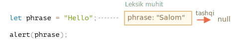

Bu butun skript bilan bog'liq bo'lgan global leksik muhit deb ataladi. Brauzerlar uchun barcha `<script>` teglari bir xil global muhitga ega.

Yuqoridagi rasmda to'rtburchak Environment Record (o'zgaruvchanlar ombori) va o'q tashqi havola degan ma'noni anglatadi. Global leksik muhitda tashqi ma'lumot yo'q, shuning uchun u `null` ga ishora qiladi.

`let` o'zgaruvchanlari qanday ishlashining kattaroq surati:

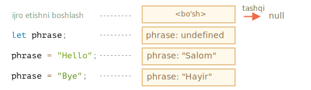

O'ng tomondagi to'rtburchaklar global leksik muhit ijro etilish jarayonida qanday o'zgarishini namoyish etadi:

1. Skript boshlanganda Leksik muhit bo'sh bo'ladi.
2. `let phrase` ta'rifi paydo bo'ladi. Unga hech qanday qiymat berilmagan, shuning uchun `undefined` saqlanadi.
3. `phrase` qiymat beriladi.
4. `phrase` yangi qiymatga ishora qiladi.

Hozircha hamma narsa oddiy ko'rinadi, shundaymi?

Xulosa qilish uchun:

- O'zgaruvchan - bu bajarilayotgan blok/funktsiya/skript bilan bog'liq bo'lgan maxsus ichki obyektning xususiyati.
- O'zgaruvchanlar bilan ishlash aslida ushbu obyektning xususiyatlari bilan ishlashdir.

### Funktsiya deklaratsiyasi

Hozirgacha biz faqat o'zgaruvchanlarni kuzatdik. Endi funktsiya deklaratsiyalarini ko'rib chiqaylik.

**`let` o'zgaruvchanlardan farqli o'laroq, ular ijro etilishi ularga etib kelganda emas, balki oldinroq, leksik muhit yaratilganda to'liq ishga tushiriladi.**

Yuqori darajadagi funktsiyalar uchun bu skript boshlangan paytni anglatadid.

Shuning uchun funktsiya deklaratsiyasini aniqlanishidan oldin chaqirishimiz mumkin.

Leksik muhit boshidanoq bo'sh emasligini quyidagi kod namoyish etadi. Bunda `say` bor, chunki bu funktsiya deklaratsiyasi. Keyinchalik esa `let` bilan e'lon qilingan `phrase`:

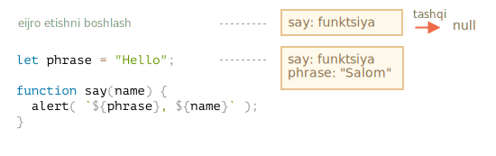


### Ichki va tashqi leksik muhit

Endi davom etamiz va funktsiya tashqi o'zgaruvchanga kirganda nima bo'lishini o'rganamiz.

Chaqiruv paytida `say()` tashqi `phrase` o'zgaruvchanni ishlatadi, nima bo'layotganining tafsilotlarini ko'rib chiqamiz.

Birinchidan, funktsiya ishga tushganda avtomatik ravishda yangi funktsiya Leksik muhit yaratiladi. Bu barcha funktsiyalar uchun umumiy qoidadir. Leksik muhit chaqiruvning mahalliy o'zgaruvchanlari va parametrlarini saqlash uchun ishlatiladi.

Masalan, `say("John")` uchun shunday ko'rinadi (ijro satrda o'q bilan belgilangan):

<!--
    ```js
    let phrase = "Salom";

    function say(name) {
     alert( `${phrase}, ${name}` );
    }

    say("John"); // Salom, John
    ```-->

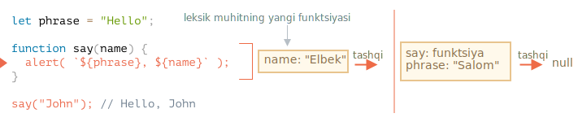

Shunday qilib, funktsiya chaqiruvi paytida biz ikkita leksik muhitga egamiz: ichki (funktsiya chaqiruvi uchun) va tashqi (global):

- Ichki leksik muhit `say` ning amaldagi bajarilishiga mos keladi.

    U bitta o'zgaruvchanga ega: `name`, funktsiya argumenti. Biz `say("John")` deb chaqirdik, shuning uchun `name` ning qiymati `"John"`.
- Tashqi leksik muhit - bu global leksik muhit.

    Unda `phrase` va funktsiyanning o'zi mavjud.

Ichki leksik muhitda tashqi muhitga havola bor.

**Kod o'zgaruvchanga kirishni xohlaganida - avval ichki leksik muhit qidiriladi, keyin tashqi, keyin undan tashqi va shunga o'xshash narsalar zanjir oxirigacha qidiriladi.**

Agar o'zgaruvchan hech qanday joyda topilmasa, bu qat'iy rejimda xato. Agar `use strict` ishlatilmasa, `undefined` o'zgaruvchanga tayinlash orqaga qarab muvofiqligi uchun yangi global o'zgaruvchanni yaratadi.

Keling, bizning misolimizda qidiruv qanday davom etishini ko'rib chiqaylik:

- Agar `alert` `say` ichidagi `name` ga kirishni xohlasa, uni darhol Leksik muhit funktsiyasida topadi.
- Agar u `phrase` ga kirishni xohlasa, va unda mahalliy `phrase` yo'q, shuning uchun u atrofdagi leksik muhitga murojaat qiladi va uni o'sha yerda topadi.

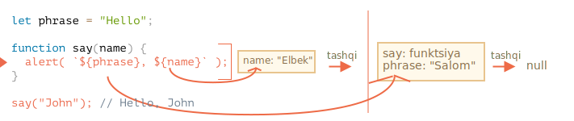

Endi bobning boshidagi birinchi savolga javob bera olamiz.

**Funktsiya hozirgi kabi tashqi o'zgaruvchanlarni oladi; u eng so'nggi qiymatlardan foydalanadi.**

Bu tasvirlangan mexanizm tufayli. Eski o'zgaruvchan qiymatlar hech qanday joyda saqlanmaydi. Agar funktsiya ularni xohlasa, u mavjud qiymatlarni o'zi yoki tashqi leksik muhitdan oladi.

Shunday qilib, birinchi savolga javob `Pete`:
=======
# Variable scope, closure

JavaScript is a very function-oriented language. It gives us a lot of freedom. A function can be created at any moment, passed as an argument to another function, and then called from a totally different place of code later.

We already know that a function can access variables outside of it ("outer" variables).

But what happens if outer variables change since a function is created? Will the function get newer values or the old ones?

And what if a function is passed along as a parameter and called from another place of code, will it get access to outer variables at the new place?

Let's expand our knowledge to understand these scenarios and more complex ones.

```smart header="We'll talk about `let/const` variables here"
In JavaScript, there are 3 ways to declare a variable: `let`, `const` (the modern ones), and `var` (the remnant of the past).

- In this article we'll use `let` variables in examples.
- Variables, declared with `const`, behave the same, so this article is about `const` too.
- The old `var` has some notable differences, they will be covered in the article <info:var>.
```

## Code blocks

If a variable is declared inside a code block `{...}`, it's only visible inside that block.

For example:

```js run
{
  // do some job with local variables that should not be seen outside

  let message = "Hello"; // only visible in this block

  alert(message); // Hello
}

alert(message); // Error: message is not defined
```

We can use this to isolate a piece of code that does its own task, with variables that only belong to it:

```js run
{
  // show message
  let message = "Hello";
  alert(message);
}

{
  // show another message
  let message = "Goodbye";
  alert(message);
}
```

````smart header="There'd be an error without blocks"
Please note, without separate blocks there would be an error, if we use `let` with the existing variable name:

```js run
// show message
let message = "Hello";
alert(message);

// show another message
*!*
let message = "Goodbye"; // Error: variable already declared
*/!*
alert(message);
```
````

For `if`, `for`, `while` and so on, variables declared in `{...}` are also only visible inside:
>>>>>>> fb4fc33a2234445808100ddc9f5e4dcec8b3d24c

```js run
if (true) {
  let phrase = "Hello!";

<<<<<<< HEAD
function sayHi() {
  alert("Salom, " + name);
=======
  alert(phrase); // Hello!
>>>>>>> fb4fc33a2234445808100ddc9f5e4dcec8b3d24c
}

alert(phrase); // Error, no such variable!
```

Here, after `if` finishes, the `alert` below won't see the `phrase`, hence the error.

<<<<<<< HEAD
Yuqoridagi kodning bajarilishi:

1. Global leksik muhit `name: "John"` ega.
2. `(*)` satrida global o'zgaruvchan o'zgartirildi, endi u `name: "Pete"`.
3. `sayHi()` funktsiyasi bajarilganda tashqaridan `name` oladi. Endi o'zgaruvchan `"Pete"` ga teng bo'lgan global leksik muhitdan.
=======
That's great, as it allows us to create block-local variables, specific to an `if` branch.
>>>>>>> fb4fc33a2234445808100ddc9f5e4dcec8b3d24c

The similar thing holds true for `for` and `while` loops:

<<<<<<< HEAD
```smart header="Bitta chaqiruv - bitta leksik muhit"
Iltimos, e'tibor bering, har bir funktsiya ishga tushganda yangi Leksik muhit yaratiladi.

Agar funktsiya bir necha marta chaqirilsa, u holda har bir chaqiruvnanng o'ziga xos Leksik muhiti bo'ladi, mahalliy o'zgaruvchanlar va parametrlar shu uchun ishlaydi.
```

```smart header="Leksik muhit - bu spetsifikatsiya obyekti"
"Leksik muhit" spetsifikatsiya obyekti. Biz ushbu obyektni kodimizga ololmaymiz va to'g'ridan-to'g'ri manipulyatsiya qilamiz. JavaScript interpretatorlari ham uni optimallashtirishi, xotirani tejash va boshqa ichki hiyla-nayranglarni bajarish uchun foydalanilmaydigan o'zgaruvchanlarni bekor qilishi mumkin, ammo ko'rinadigan xatti-harakatlar ta'riflanganidek bo'lishi kerak.
=======
```js run
for (let i = 0; i < 3; i++) {
  // the variable i is only visible inside this for
  alert(i); // 0, then 1, then 2
}

alert(i); // Error, no such variable
>>>>>>> fb4fc33a2234445808100ddc9f5e4dcec8b3d24c
```

Visually, `let i` is outside of `{...}`. But the `for` construct is special here: the variable, declared inside it, is considered a part of the block.

## Ichki funktsiyalar

Funktsiya boshqa funktsiya ichida yaratilganda "ichki" deb nomlanadi.

Buni JavaScript yordamida osonlikcha bajarish mumkin.

Biz undan quyidagi kabi kodimizni tartibga solish uchun foydalanishimiz mumkin:

```js
function sayHiBye(firstName, lastName) {

  // quyida ishlatish uchun yordamchi ichki funktsiya
  function getFullName() {
    return firstName + " " + lastName;
  }

  alert( "Hello, " + getFullName() );
  alert( "Bye, " + getFullName() );

}
```

Bu erda *ichki* `getFullName()` funktsiyasi qulaylik uchun yaratilgan. U tashqi o'zgaruvchanlarga kira oladi va to'liq ismni qaytarishi mumkin. Ichki funktsiyalar JavaScript-da juda keng tarqalgan.

<<<<<<< HEAD
Bundan ham qiziqroq narsa, ichki funktsiyani qaytarish mumkin: yoki yangi obyektning xususiyati sifatida (agar tashqi funktsiya usul bilan obyekt yaratadigan bo'lsa) yoki natijada o'zi bo'lsa. Keyin u boshqa joyda ishlatilishi mumkin. Qaerda bo'lishidan qat'i nazar, u bir xil tashqi o'zgaruvchanga kirish huquqiga ega.

Masalan, bu yerda ichki funktsiya yangi obyektga [konstruktor funktsiyasi](info:constructor-new) tomonidan tayinlanadi:

```js run
// konstruktor funktsiyasi yangi obyektni qaytaradi
function User(name) {

  // obyekt usuli ichki funktsiya sifatida yaratiladi
  this.sayHi = function() {
    alert(name);
  };
}

let user = new User("John");
user.sayHi(); // "sayHi" usuli tashqi "name" ga kirish huquqiga ega
```

Va bu yerda biz "hisoblash" funktsiyasini yaratamiz va qaytaramiz:
=======
What's much more interesting, a nested function can be returned: either as a property of a new object or as a result by itself. It can then be used somewhere else. No matter where, it still has access to the same outer variables.

Below, `makeCounter` creates the "counter" function that returns the next number on each invocation:
>>>>>>> fb4fc33a2234445808100ddc9f5e4dcec8b3d24c

```js run
function makeCounter() {
  let count = 0;

  return function() {
<<<<<<< HEAD
    return count++; // tashqi counter-ga kirish huquqiga ega
=======
    return count++;
>>>>>>> fb4fc33a2234445808100ddc9f5e4dcec8b3d24c
  };
}

let counter = makeCounter();

alert( counter() ); // 0
alert( counter() ); // 1
alert( counter() ); // 2
```

<<<<<<< HEAD
Keling, `makeCounter` misolida davom etamiz. Har bir chaqiruvda keyingi raqamni qaytaradigan "hisoblagich" funktsiyasini yaratadi. Ushbu kodning sodda bo'lishiga qaramay, biroz o'zgartirilgan variantlari, masalan, [psevdorandom tasodifiy generator](https://en.wikipedia.org/wiki/Pseudorandom_number_generator) va boshqalarda amaliy foydalanishga ega.

Hisoblagich ichki sifatida qanday ishlaydi?

Ichki funktsiya ishlaganda, `count++` o'zgaruvchani ichkaridan qidiriladi. Yuqoridagi misol uchun tartib quyidagicha bo'ladi:


1. Ichki funktsiyaning mahalliy o'zgaruvchanlari...
2. Tashqi funktsiyaning o'zgaruvchanlari...
3. Va hokazo, global o'zgaruvchanlar erishilmaguncha.

Ushbu misolda `count` `2` bosqichda topilgan. Tashqi o'zgaruvchanni o'zgartirganda, u topilgan joyda o'zgartiriladi. Shunday qilib, `count++` tashqi o'zgaruvchanni topadi va unga tegishli bo'lgan leksik muhitda oshiradi. Xuddi bizda `let count = 1` bo'lgandek.

Ko'rib chiqilishi kerak bo'lgan ikkita savol:

1. `count` hisoblagichini `makeCounter` ga tegishli bo'lmagan koddan qandaydir tarzda tushurish mumkinmi? Masalan, yuqoridagi misolda `alert` qo'ng'iroqlaridan so'ng.
2. Agar biz `makeCounter()` ni bir necha marta chaqirsak, bu juda ko'p `counter` funktsiyalarini qaytaradi. Ular mustaqilmi yoki ular bir xil `counter` bilan o'rtoqlashadimi?

O'qishni davom ettirishdan oldin ularga javob berishga harakat qiling.

...

Hammasi tugadimi?

Yaxshi, keling, javoblarni ko'rib chiqaylik.

1. Hech qanday iloj yo'q: `count` - bu mahalliy funktsiya o'zgaruvchani, biz unga tashqi tomondan kira olmaymiz.
2. `makeCounter()` ga har bir chaqiruv uchun `count` bilan yangi funktsiya leksik muhit yaratiladi. Natijada `counter` funktsiyalari mustaqil.

Mana demo:

```js run
function makeCounter() {
  let count = 0;
  return function() {
    return count++;
  };
}

let counter1 = makeCounter();
let counter2 = makeCounter();
=======
Despite being simple, slightly modified variants of that code have practical uses, for instance, as a [random number generator](https://en.wikipedia.org/wiki/Pseudorandom_number_generator) to generate random values for automated tests.

How does this work? If we create multiple counters, will they be independent? What's going on with the variables here?

Understanding such things is great for the overall knowledge of JavaScript and beneficial for more complex scenarios. So let's go a bit in-depth.

## Lexical Environment
>>>>>>> fb4fc33a2234445808100ddc9f5e4dcec8b3d24c

```warn header="Here be dragons!"
The in-depth technical explanation lies ahead.

<<<<<<< HEAD
alert( counter2() ); // 0 (mustaqil)
=======
As far as I'd like to avoid low-level language details, any understanding without them would be lacking and incomplete, so get ready.
>>>>>>> fb4fc33a2234445808100ddc9f5e4dcec8b3d24c
```

For clarity, the explanation is split into multiple steps.

<<<<<<< HEAD
Umid qilamanki, tashqi o'zgaruvchanlar bilan bog'liq vaziyatlar hozir siz uchun juda aniq. Ammo murakkab vaziyatlarda ichki narsalarni chuqurroq tushunish talab qilinishi mumkin. Shunday qilib, chuqurroq sho'ng'iylik.

## Batafsil atrof-muhit

`makeCounter` misolida nimalar sodir bo'layotganini bosqichma-bosqich ko'rib chiqing, narsalarni batafsil bilishingizga ishonch hosil qiling.

Iltimos, qo'shimcha ravishda `[[Environment]]` xususiyatiga e'tibor bering. Biz buni soddaligi uchun oldin aytib o'tmagan edik.

1. Skript yangi boshlanganda faqat global leksik muhit mavjud:

    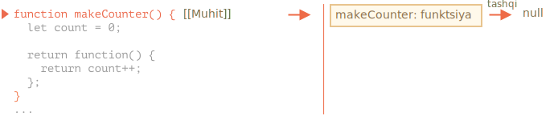

     Ushbu boshlang'ich paytida faqat `makeCounter` funktsiyasi mavjud, chunki bu funktsiya deklaratsiyasi. Hali bajarilmadi.

    **Barcha funktsiyalar "tug'ilish paytida" maxfiy xususiyatga ega bo'ladi `[[Environment]]`, ularning yaratilish leksik muhitiga ishora qiladi.** Biz bu haqda hali gaplashmadik, lekin funktsiya qayerda yaratilganligini biladi.

    Bu erda `makeCounter` global leksik muhitda yaratilgan, shuning uchun `[[Environment]]` unga havola qiladi.

    Boshqacha qilib aytganda, funktsiya tug'ilgan joyidagi leksik muhitga havola bilan "muhrlangan". Va `[[Environment]]` - bu havola mavjud bo'lgan yashirin funktsiya xususiyati.

2. Kod ishlaydi, yangi global `counter` o'zgaruvchani e'lon qilinadi va uning qiymati uchun `makeCounter()` chaqiriladi. Ijro `makeCounter()` ichidagi birinchi satrda bo'lgan momentning surati:

    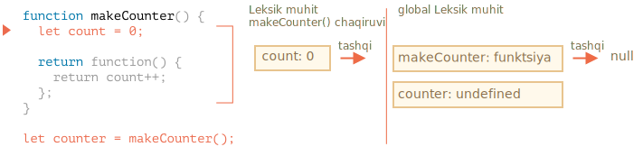

    `makeCounter()` chaqirilganda, uning o'zgaruvchanlari va argumentlarini saqlash uchun leksik muhit yaratiladi.

    Barcha leksik muhitlar singari, u ikkita narsani saqlaydi:
    1. Mahalliy o'zgaruvchanlarga ega bo'lgan muhit yozuvi. Bizning holatimizda `count` yagona mahalliy o'zgaruvchandir (`let count` satri bajarilganda paydo bo'ladi).
    2. Funktsiyaning `[[Environment]]` ga o'rnatilgan tashqi leksik havola. Bu erda `[[Environment]]` `makeCounter` global leksik muhitga murojaat qiladi.

    Shunday qilib, hozirda bizda ikkita leksik muhit mavjud: birinchisi global, ikkinchisi hozirgi `makeCounter` chaqiruvi uchun, tashqi tomoni global.

3. `makeCounter()` bajarilishida kichik ichki funktsiya hosil bo'ladi.

    Funktsiya funktsiya deklaratsiyasi yoki funktsiya ifodasi yordamida yaratilganligi muhim emas. Barcha funktsiyalar ular yaratilgan leksik muhitga tegishli bo'lgan `[[Environment]]` xususiyatiga ega. Shunday qilib, bizning kichkina ichki funktsiyamiz ham buni oladi.

    Bizning yangi ichki funktsiyamiz uchun `[[Environment]]` ning qiymati `makeCounter()`ning(qayerda tug'ilgan bo'lsa) joriy leksik muhiti :

    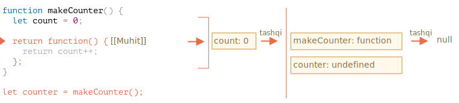

    Iltimos, ushbu qadamda ichki funktsiya yaratilgan, ammo hali chaqirilmaganligini unutmang. `function() { return count++; }` ichidagi kod ishlamayapti; tez orada qaytarib beramiz.

4. Ijro etishda `makeCounter()` ga chaqiruv tugaydi va natija (kichik ichki funktsiya) global `counter` o'zgaruvchaniga beriladi:

    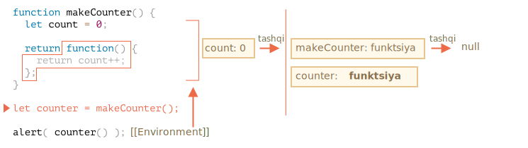

    Ushbu funktsiya faqat bitta satrga ega: `return count++`, biz uni ishga tushirganimizda bajariladi.

5. `counter()`chaqirilganda, u uchun "bo'sh" leksik muhit yaratiladi. O'z-o'zidan mahalliy o'zgaruvchanga ega emas. Ammo `counter` ning `[[Environment]]` tashqi havolasi sifatida ishlatiladi, shuning uchun u avval yaratilgan `makeCounter()` chaqiruvining o'zgaruvchanlariga kirish huquqiga ega:

    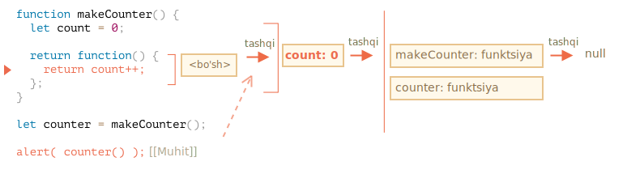

    Endi u o'zgaruvchiga murojaat qilsa, u avval o'z leksik muhitini qidiradi (bo'sh), keyin avvalgi `makeCounter()` chaqiruvning leksik muhiti, keyin global.

    `count` ni qidirganda, uni eng yaqin tashqi leksik muhitda `makeCounter` o'zgaruvchanlari orasida topadi.

    Iltimos, xotira boshqaruvi bu erda qanday ishlashiga e'tibor bering. `makeCounter()` chaqiruvi bir muncha vaqt oldin tugagan bo'lsa ham, uning leksik muhiti xotirada saqlanib qoldi, chunki `[[Environment]]` ga tegishli ichki funktsiya mavjud.

    Odatda, leksik muhit obyekti uni ishlatishi mumkin bo'lgan funktsiya mavjud bo'lganda yashaydi. Qolganlari yo'q bo'lganda, u tozalanadi.

6. `counter()` ni chaqiruv nafaqat `count` qiymatini qaytaradi, balki uni oshiradi. E'tibor bering, o'zgartirish "joyida" amalga oshiriladi. `count` qiymati aniq topilgan muhitda o'zgartiriladi.

    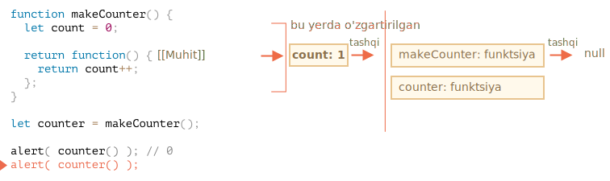

    Shunday qilib, biz oldingi bosqichga yagona o'zgarish -- `count` yangi qiymati bilan qaytamiz. Navbatdagi chaqiruvlar ham xuddi shunday.

7. Keyingi `counter()` chaqiruvlari ham xuddi shunday.

Bobning boshidan ikkinchi savolga javob endi aniq bo'lishi kerak.

Quyidagi koddagi `work()` funktsiyasi `name` ni paydo bo'lgan joyidan tashqi leksik muhit havolasi orqali ishlatadi:

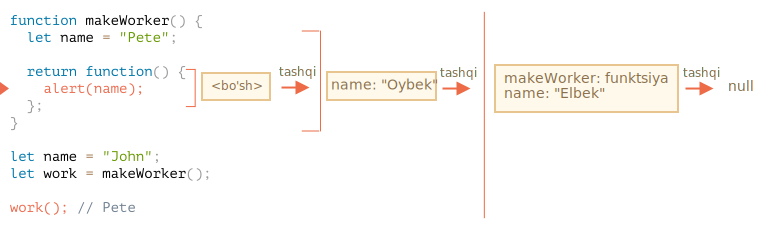

Shunday qilib, natija bu erda `"Pete"`.

Agar `makeWorker()` da `let name` bo'lmasa, qidirish tashqariga chiqib, global o'zgaruvchanni oladi yuqoridagi zanjirdan ko'rib turganizdek. Bunday holda, bu `"John"` bo'ladi.

```smart header="Yopilish"
Dasturlashchilar tomonidan umuman bililishi kerak bo'lgan "yopilish" degan umumiy dasturlash atamasi mavjud.

A [yopilish](https://en.wikipedia.org/wiki/Closure_(computer_programming)) - bu tashqi o'zgaruvchanlarni eslab qoladigan va ularga kirish imkoniyatiga ega bo'lgan funktsiya. Ba'zi tillarda bu mumkin emas yoki uni bajarish uchun funktsiya maxsus tarzda yozilishi kerak. Ammo yuqorida aytib o'tilganidek, JavaScript-da barcha funktsiyalar tabiiy ravishda yopilishlar (faqat bitta istisno mavjud, uni <info:new-function> da ko'rib chiqamiz).

Ya'ni: ular yashiringan `[[Environment]]` xususiyati yordamida qayerda yaratilganligini avtomatik ravishda eslashadi va ularning barchasi tashqi o'zgaruvchanlarga kirishlari mumkin.

Suhbat paytida frontend dasturchiga "yopilish bu nima?" degan savol tug'ilsa, javobning yopilishning ta'rifi va JavaScript-dagi barcha funktsiyalar yopilish ekanligini tushuntirish va texnik tafsilotlar haqida yana bir necha so'z bo'lishi mumkin: `[[Environment]]` xususiyati va leksik muhit qanday ishlashi.
```

## Kod bloklar va tsiklar, IIFE

Yuqoridagi misollar funktsiyalarga qaratilgan. Leksik muhit har qanday `{...}` kod bloki uchun mavjud.

Leksik muhit kod bloki ishlaganda yaratiladi va blok-lokal o'zgaruvchanlarni o'z ichiga oladi. Mana bir nechta misol.
=======
### Step 1. Variables

In JavaScript, every running function, code block `{...}`, and the script as a whole have an internal (hidden) associated object known as the *Lexical Environment*.

The Lexical Environment object consists of two parts:

1. *Environment Record* -- an object that stores all local variables as its properties (and some other information like the value of `this`).
2. A reference to the *outer lexical environment*, the one associated with the outer code.

**A "variable" is just a property of the special internal object, `Environment Record`. "To get or change a variable" means "to get or change a property of that object".**

In this simple code without functions, there is only one Lexical Environment:


This is the so-called *global* Lexical Environment, associated with the whole script.

On the picture above, the rectangle means Environment Record (variable store) and the arrow means the outer reference. The global Lexical Environment has no outer reference, that's why the arrow points to `null`.

As the code starts executing and goes on, the Lexical Environment changes.

Here's a little bit longer code:


Rectangles on the right-hand side demonstrate how the global Lexical Environment changes during the execution:

1. When the script starts, the Lexical Environment is pre-populated with all declared variables.
    - Initially, they are in the "Uninitialized" state. That's a special internal state, it means that the engine knows about the variable, but it cannot be referenced until it has been declared with `let`. It's almost the same as if the variable didn't exist.
2. Then `let phrase` definition appears. There's no assignment yet, so its value is `undefined`. We can use the variable from this point forward.
3. `phrase` is assigned a value.
4. `phrase` changes the value.

Everything looks simple for now, right?

- A variable is a property of a special internal object, associated with the currently executing block/function/script.
- Working with variables is actually working with the properties of that object.

```smart header="Lexical Environment is a specification object"
"Lexical Environment" is a specification object: it only exists "theoretically" in the [language specification](https://tc39.es/ecma262/#sec-lexical-environments) to describe how things work. We can't get this object in our code and manipulate it directly.

JavaScript engines also may optimize it, discard variables that are unused to save memory and perform other internal tricks, as long as the visible behavior remains as described.
```

### Step 2. Function Declarations

A function is also a value, like a variable.

**The difference is that a Function Declaration is instantly fully initialized.**

When a Lexical Environment is created, a Function Declaration immediately becomes a ready-to-use function (unlike `let`, that is unusable till the declaration).

That's why we can use a function, declared as Function Declaration, even before the declaration itself.

For example, here's the initial state of the global Lexical Environment when we add a function:


Naturally, this behavior only applies to Function Declarations, not Function Expressions where we assign a function to a variable, such as `let say = function(name)...`.

### Step 3. Inner and outer Lexical Environment
>>>>>>> fb4fc33a2234445808100ddc9f5e4dcec8b3d24c

When a function runs, at the beginning of the call, a new Lexical Environment is created automatically to store local variables and parameters of the call.

<<<<<<< HEAD
Quyidagi misolda `user` o'zgaruvchani faqat `if` blokida mavjud:

<!--
    ```js run
    let phrase = "Salom";

    if (true) {
        let user = "John";

        alert(`${phrase}, ${user}`); // Salom, John
=======
For instance, for `say("John")`, it looks like this (the execution is at the line, labelled with an arrow):

<!--
    ```js
    let phrase = "Hello";

    function say(name) {
     alert( `${phrase}, ${name}` );
>>>>>>> fb4fc33a2234445808100ddc9f5e4dcec8b3d24c
    }

    say("John"); // Hello, John
    ```-->

<<<<<<< HEAD
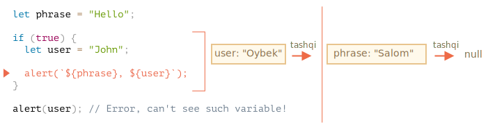

Ijro `if` blokiga kirganda, u uchun yangi "faqat-if" leksik muhit yaratiladi.

Bu tashqi tomonga ishora qiladi, shuning uchun `phrase`ni topish mumkin. Ammo `if` ichida e'lon qilingan barcha o'zgaruvchanlar va funktsiya ifodalari o'sha leksik muhitda joylashgan bo'lib, ularni tashqi tomondan ko'rish mumkin emas.

Masalan, `if` tugagandan so'ng, quyidagi `alert` `user` ni ko'rmaydi, shuning uchun xato bo'ladi.
=======

>>>>>>> fb4fc33a2234445808100ddc9f5e4dcec8b3d24c

During the function call we have two Lexical Environments: the inner one (for the function call) and the outer one (global):

<<<<<<< HEAD
Tsikl uchun har bir takrorlash alohida leksik muhitga ega. Agar o'zgaruvchan `for` da e'lon qilingan bo'lsa, u leksik muhit uchun ham mahalliy:

```js run
for (let i = 0; i < 10; i++) {
  // Har bir tsiklning o'ziga xos leksik muhiti mavjud
  // {i: value}
}
=======
- The inner Lexical Environment corresponds to the current execution of `say`. It has a single property: `name`, the function argument. We called `say("John")`, so the value of the `name` is `"John"`.
- The outer Lexical Environment is the global Lexical Environment. It has the `phrase` variable and the function itself.

The inner Lexical Environment has a reference to the `outer` one.
>>>>>>> fb4fc33a2234445808100ddc9f5e4dcec8b3d24c

**When the code wants to access a variable -- the inner Lexical Environment is searched first, then the outer one, then the more outer one and so on until the global one.**

<<<<<<< HEAD
Iltimos, diqqat qiling: `let i` `{...}` tashqarisida. Bu yerda `for` konstruktsiyasi biroz o'ziga xosdir: tsiklning har bir takrorlanishi o'zidagi `i` oqimi bilan o'ziga xos leksik muhitga ega.

Va `if` da bo'lgani kabi, tsikl ostidagi i ko'rinmas.

### Kod bloklari

O'zgaruvchanlarni "mahalliy miqyosda" ajratish uchun biz "yalang'och" kod blokidan foydalanishimiz mumkin `{…}`.

Masalan, veb-brauzerda barcha skriptlar bir xil global maydonga ega. Shunday qilib, bitta skriptda global o'zgaruvchanni yaratadigan bo'lsak, u boshqalar uchun mavjud bo'ladi. Ammo bu ikkita skript bir xil o'zgaruvchan nomdan foydalansa va bir-birining ustiga yozilsa, bu nizolarning manbasiga aylanadi.

Agar o'zgaruvchanning nomi keng tarqalgan so'z bo'lsa va skript mualliflari bir-birlarini bilmasa, bu sodir bo'lishi mumkin.

Agar biz bundan saqlanishni istasak, biz skriptni yoki uning bir qismini ajratish uchun kod blokidan foydalanishimiz mumkin:

```js run
{
  // tashqarida ko'rinmasligi kerak bo'lgan mahalliy o'zgaruvchanlar bilan bo'lgan ba'zi bir ish

  let message = "Salom";

  alert(message); // Salom
=======
If a variable is not found anywhere, that's an error in strict mode (without `use strict`, an assignment to a non-existing variable creates a new global variable, for compatibility with old code).

In this example the search proceeds as follows:

- For the `name` variable, the `alert` inside `say` finds it immediately in the inner Lexical Environment.
- When it wants to access `phrase`, then there is no `phrase` locally, so it follows the reference to the outer Lexical Environment and finds it there.


### Step 4. Returning a function

Let's return to the `makeCounter` example.

```js
function makeCounter() {
  let count = 0;

  return function() {
    return count++;
  };
>>>>>>> fb4fc33a2234445808100ddc9f5e4dcec8b3d24c
}

let counter = makeCounter();
```

<<<<<<< HEAD
Blokdan tashqaridagi kod (yoki boshqa skript ichidagi) blok ichidagi o'zgaruvchanlarni ko'rmaydi, chunki blok o'z leksik muhitiga ega.
=======
At the beginning of each `makeCounter()` call, a new Lexical Environment object is created, to store variables for this `makeCounter` run.
>>>>>>> fb4fc33a2234445808100ddc9f5e4dcec8b3d24c

So we have two nested Lexical Environments, just like in the example above:

<<<<<<< HEAD
Ilgari JavaScript-da blok darajasidagi leksik muhit mavjud emas edi.

Shunday qilib, dasturchilar biror narsa ixtiro qilishlari kerak edi. Va ular yaratgan narsa "darhol chaqiriladigan funktsiya ifodalari" (qisqartirilgan IIFE) deb nomlanadi.

Hozirgi kunda bu biz foydalanadigan narsa emas, lekin ularni eski skriptlardan topishingiz mumkin, shuning uchun ularni tushunish yaxshidir.

IIFE shunday ko'rinadi:

```js run
(function() {

  let message = "Salom";

  alert(message); // Salom
=======


What's different is that, during the execution of `makeCounter()`, a tiny nested function is created of only one line: `return count++`. We don't run it yet, only create.

All functions remember the Lexical Environment in which they were made. Technically, there's no magic here: all functions have the hidden property named `[[Environment]]`, that keeps the reference to the Lexical Environment where the function was created:


So, `counter.[[Environment]]` has the reference to `{count: 0}` Lexical Environment. That's how the function remembers where it was created, no matter where it's called. The `[[Environment]]` reference is set once and forever at function creation time.
>>>>>>> fb4fc33a2234445808100ddc9f5e4dcec8b3d24c

Later, when `counter()` is called, a new Lexical Environment is created for the call, and its outer Lexical Environment reference is taken from `counter.[[Environment]]`:

<<<<<<< HEAD
Bu yerda funktsiya ifodasi yaratiladi va darhol chaqiriladi. Shunday qilib, kod darhol bajariladi va o'zining shaxsiy o'zgaruvchanlariga ega.

Funktsiya ifodasi qavs bilan o'ralgan `(function {...})`, chunki JavaScript asosiy kod oqimida `"function"` ga to'g'ri kelganda, uni funktsiya deklaratsiyasining boshlanishi deb tushunadi. Ammo funktsiya deklaratsiyasining nomi bo'lishi kerak, shuning uchun bunday kod xato qiladi:

```js run
// Funktsiyani e'lon qilishga va darhol chaqirishga harakat qiling
function() { // <-- Error: Unexpected token (

  let message = "Salom";

  alert(message); // Salom
=======


Now when the code inside `counter()` looks for `count` variable, it first searches its own Lexical Environment (empty, as there are no local variables there), then the Lexical Environment of the outer `makeCounter()` call, where it finds and changes it.

**A variable is updated in the Lexical Environment where it lives.**

Here's the state after the execution:


>>>>>>> fb4fc33a2234445808100ddc9f5e4dcec8b3d24c

If we call `counter()` multiple times, the `count` variable will be increased to `2`, `3` and so on, at the same place.

<<<<<<< HEAD
Hatto: "yaxshi, keling, ism qo'shaylik", desak ham, bu ishlamaydi, chunki JavaScript funktsiya deklaratsiyasini darhol chaqirishga imkon bermaydi:

```js run
// sintaksis xato, quyidagi qavslar tufayli
function go() {

}(); // <-- darhol funktsiya deklaratsiyasini chaqira olmaydi
```

Shunday qilib, funktsiya atrofidagi qavslar JavaScript-ga ko'rsatishga imkon beruvchi hiyla-nayrangdir, bu xususiyat boshqa ifoda kontekstida yaratilgan va shuning uchun bu funktsiya ifodadir: unga nom kerak emas va darhol chaqirilishi mumkin.

Qavslardan tashqari JavaScript-ni funktsiya ifodasini anglatadigan boshqa usullar mavjud:

```js run
// Yaratish usullari IIFE

(function() {
  alert("Funktsiya atrofidagi qavslar");
}*!*)*/!*();

(function() {
  alert("Hamma narsa atrofida qavslar");
}()*!*)*/!*;

*!*!*/!*function() {
  alert("Bit NOT operatori ifodani boshlaydi");
}();

*!*+*/!*function() {
  alert("Unary plus ifodani boshlaydi");
}();
```

Yuqoridagi barcha holatlarda biz funktsiya ifodasini e'lon qilamiz va uni darhol ishga tushiramiz.

## Axlat yeg'uvchi

Odatda, leksik muhit funktsiya bajarilgandan keyin tozalanadi va o'chiriladi. Masalan:
=======
```smart header="Closure"
There is a general programming term "closure", that developers generally should know.

A [closure](https://en.wikipedia.org/wiki/Closure_(computer_programming)) is a function that remembers its outer variables and can access them. In some languages, that's not possible, or a function should be written in a special way to make it happen. But as explained above, in JavaScript, all functions are naturally closures (there is only one exception, to be covered in <info:new-function>).

That is: they automatically remember where they were created using a hidden `[[Environment]]` property, and then their code can access outer variables.

When on an interview, a frontend developer gets a question about "what's a closure?", a valid answer would be a definition of the closure and an explanation that all functions in JavaScript are closures, and maybe a few more words about technical details: the `[[Environment]]` property and how Lexical Environments work.
```

## Garbage collection

Usually, a Lexical Environment is removed from memory with all the variables after the function call finishes. That's because there are no references to it. As any JavaScript object, it's only kept in memory while it's reachable.
>>>>>>> fb4fc33a2234445808100ddc9f5e4dcec8b3d24c

However, if there's a nested function that is still reachable after the end of a function, then it has `[[Environment]]` property that references the lexical environment.

<<<<<<< HEAD
f();
```

Bu erda ikkita qiymat leksik muhitning texnik xususiyatlari hisoblanadi. Ammo `f()` tugagandan so'ng, leksik muhitga ulanish imkonsiz bo'lib qoladi, shuning uchun u xotiradan o'chiriladi.

...Agar `f` tugagandan keyin ham kirish mumkin bo'lgan ichki funktsiya mavjud bo'lsa, uning `[[Environment]]` havolasi tashqi leksik muhitni ham saqlab qoladi:
=======
In that case the Lexical Environment is still reachable even after the completion of the function, so it stays alive.

For example:
>>>>>>> fb4fc33a2234445808100ddc9f5e4dcec8b3d24c

```js
function f() {
  let value = 123;

  return function() {
    alert(value);
  }
}

<<<<<<< HEAD
let g = f(); // g ga erishish mumkin va tashqi leksik muhitni xotirada saqlaydi
```

Iltimos e'tibor bering, agar `f()` ko'p marta chaqirilsa va natijada paydo bo'ladigan funktsiyalar saqlanib qolsa, unda tegishli Leksik muhit obyektlari ham xotirada saqlanib qoladi. Ularning uchtasi ham quyidagi kodda:
=======
let g = f(); // g.[[Environment]] stores a reference to the Lexical Environment
// of the corresponding f() call
```

Please note that if `f()` is called many times, and resulting functions are saved, then all corresponding Lexical Environment objects will also be retained in memory. In the code below, all 3 of them:
>>>>>>> fb4fc33a2234445808100ddc9f5e4dcec8b3d24c

```js
function f() {
  let value = Math.random();

  return function() { alert(value); };
}

<<<<<<< HEAD
// Massivda 3 ta funktsiya mavjud bo'lib, ularning har biri Lekisik muhitga bog'langan
// mos keladigan f() ishidan
//         LE   LE   LE
=======
// 3 functions in array, every one of them links to Lexical Environment
// from the corresponding f() run
>>>>>>> fb4fc33a2234445808100ddc9f5e4dcec8b3d24c
let arr = [f(), f(), f()];
```

Leksik muhit obyekti ulanib bo'lmaydigan bo'lib qolganda o'ladi (xuddi boshqa narsalar singari). Boshqacha qilib aytganda, u faqat unga murojaat qilgan kamida bitta ichki funktsiya mavjud bo'lganda mavjud bo'ladi.

<<<<<<< HEAD
Quyidagi kodda `g` ga ulanib bo'lmaydigan holatga, leksik muhitni qamrab oladi (va shuning uchun `value`) xotiradan tozalanadi;
=======
In the code below, after the nested function is removed, its enclosing Lexical Environment (and hence the `value`) is cleaned from memory:
>>>>>>> fb4fc33a2234445808100ddc9f5e4dcec8b3d24c

```js
function f() {
  let value = 123;

  return function() {
    alert(value);
  }
}

<<<<<<< HEAD
let g = f(); // g tirikligida
// u yerda mos leksik muhit yashaydi
=======
let g = f(); // while g function exists, the value stays in memory
>>>>>>> fb4fc33a2234445808100ddc9f5e4dcec8b3d24c

g = null; // ...va endi xotira tozalanadi
```

### Amalda optimallashtirish

Ko'rib turganimizdek, nazariya jihatidan funktsiya tirik bo'lganda, barcha tashqi o'zgaruvchanlar saqlanib qoladi.

<<<<<<< HEAD
Ammo amalda JavaScript interpretatorlari buni optimallashtirishga harakat qilishadi. Ular o'zgaruvchan foydalanishni tahlil qiladilar va agar tashqi o'zgaruvchanning ishlatilmasligini ko'rish oson bo'lsa -- u o'chiriladi.

**V8 (Chrome, Opera) ning muhim yon ta'siri shundaki, bunday o'zgaruvchan koddagi hatoliklar tuzatish jarayonida mavjud bo'lmaydi.**
=======
But in practice, JavaScript engines try to optimize that. They analyze variable usage and if it's obvious from the code that an outer variable is not used -- it is removed.

**An important side effect in V8 (Chrome, Edge, Opera) is that such variable will become unavailable in debugging.**
>>>>>>> fb4fc33a2234445808100ddc9f5e4dcec8b3d24c

Quyidagi misolni dasturchilar uchun ko'makchi vositalari ochiq holda Chrome-da ishlatib ko'ring.

To'xtab turganda konsolda `alert(value)` yozing.

```js run
function f() {
  let value = Math.random();

  function g() {
<<<<<<< HEAD
    debugger; // konsolda: yozing alert( value ); Bunday o'zgaruvchan yo'q!
=======
    debugger; // in console: type alert(value); No such variable!
>>>>>>> fb4fc33a2234445808100ddc9f5e4dcec8b3d24c
  }

  return g;
}

let g = f();
g();
```

Ko'rib turganingizdek - bunday o'zgaruvchan yo'q! Nazariy jihatdan, unga kirish mumkin bo'lishi kerak, ammo interpretator uni optimallashtirdi.

Bu koddagi hatoliklarni tuzatuvchi bilan bog'liq kulgulik muammolarni keltirib chiqarishi mumkin (agar bunday vaqt talab qilmasa). Ulardan biri -- kutilgan o'zgaruvhan o'rniga bir xil nomdagi tashqi o'zgaruvchanni ko'rishimiz mumkin:

```js run global
let value = "Syurpriz!";

function f() {
  let value = "eng yaqin qiymat";

  function g() {
<<<<<<< HEAD
    debugger; // konsolda: yozing alert( value ); Syurpriz!
=======
    debugger; // in console: type alert(value); Surprise!
>>>>>>> fb4fc33a2234445808100ddc9f5e4dcec8b3d24c
  }

  return g;
}

let g = f();
g();
```

<<<<<<< HEAD
```warn header="Ko'rishguncha!"
V8 ning ushbu xususiyatini bilish yaxshi. Agar siz Chrome / Opera bilan koddagi hatoliklarni tuzatsangiz, ertami-kechmi uni uchratasiz.

Bu koddagi hatoliklarni tuzatuvchidagi xato emas, aksincha V8 ning o'ziga xos xususiyati. Ehtimol, u qachondir o'zgartirilishi mumkin.
Siz har doim ushbu sahifadagi misollarni ishga tushirish orqali tekshirishingiz mumkin.
```
=======
This feature of V8 is good to know. If you are debugging with Chrome/Edge/Opera, sooner or later you will meet it.

That is not a bug in the debugger, but rather a special feature of V8. Perhaps it will be changed sometime. You can always check for it by running the examples on this page.
>>>>>>> fb4fc33a2234445808100ddc9f5e4dcec8b3d24c
