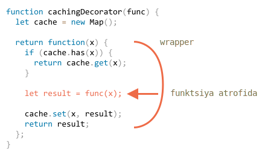

# Dekorativlar va ekspeditorlik, call/apply
.
JavaScript funktsiyalar bilan ishlashda ajoyib moslashuvchanlikni beradi. Ularni aylanib o'tish, obyektlar sifatida ishlatish mumkin va endi biz ular o'rtasida chaqiruvlarni *oldinga yo'naltirish* va ularni qanday *bezashni* ko'rib chiqamiz.

## Shaffof keshlash

Aytaylik, bizda protsessor og'ir bo'lgan `slow(x)` funktsiyasi mavjud, ammo natijalari barqaror. Boshqacha qilib aytganda, xuddi shu `x` uchun u har doim bir xil natijani beradi.

Agar funktsiya tez-tez chaqirilsa, biz qayta hisoblash uchun qo'shimcha vaqt sarflamaslik uchun har xil `x` natijalarini keshlashni (eslashni) xohlashimiz mumkin.

Ammo bu funktsiyani `slow()` ga qo'shish o'rniga biz o'ramni yaratamiz. Ko'rib turganimizdek, buni amalga oshirishning foydalari juda ko'p.

Mana kod va tushuntirishlar quyidagicha:

```js run
function slow(x) {
  // bu erda og'ir CPU talab qiladigan ish bo'lishi mumkin
  alert(`Called with ${x}`);
  return x;
}

function cachingDecorator(func) {
  let cache = new Map();

  return function(x) {
    if (cache.has(x)) { // agar natija xaritada bo'lsa
      return cache.get(x); // qaytaradi
    }

    let result = func(x); // aks holda funktsiyani chaqiradi

    cache.set(x, result); // va natijani keshlaydi (eslab qolish)
    return result;
  };
}

slow = cachingDecorator(slow);

alert( slow(1) ); // slow(1) keshlangan
alert( "Again: " + slow(1) ); // xuddi shu

alert( slow(2) ); // slow(2) keshlangan
alert( "Again: " + slow(2) ); // oldingi satr bilan bir xil
```

Yuqoridagi kodda `cachingDecorator` *dekorativ*: boshqa funktsiyani bajaradigan va uning xatti-harakatlarini o'zgartiradigan maxsus funktsiya.

G'oya shundan iboratki, biz har qanday funktsiya uchun `cachingDecorator` ni chaqira olamiz va u keshlash o'ramani qaytaradi. Bu juda yaxshi, chunki bizda bunday funktsiyani ishlatishi mumkin bo'lgan juda ko'p funktsiyalar mavjud va biz ularga faqat `cachingDecorator` dasturini qo'llashimiz kerak.

Keshlashni asosiy funktsiya kodidan ajratib, biz ham asosiy kodni soddalashtiramiz.

Endi uning qanday ishlashi haqida batafsil ma'lumotga ega bo'laylik.

`cachingDecorator(func)` ning natijasi "wrapper": `function(x)`, `func(x)` chaqiruvini keshlash mantig'iga "o'rab" oladi:



Ko'rib turganimizdek, o'rash `func(x)` natijasini "boricha" qaytaradi. Tashqi koddan o'ralgan `slow` funktsiyasi hanuzgacha xuddi shunday ishlaydi. Uning xatti-harakatlariga keshlash xususiyati qo'shildi.

Xulosa qilib aytganda, `slow` ning kodini o'zgartirish o'rniga alohida `cachingDecorator` dan foydalanishning bir qancha afzalliklari bor:

- `cachingDecorator` qayta ishlatilishi mumkin. Biz uni boshqa funktsiyaga qo'llashimiz mumkin.
- Keshlash mantig'i alohida, u `slow` ning murakkabligini oshirmadi (agar mavjud bo'lsa).
- Agar kerak bo'lsa, biz bir nechta dekorativlarni birlashtira olamiz (boshqa dekorativlar ergashadilar).


## Kontekst uchun "func.call" dan foydalanish

Yuqorida aytib o'tilgan keshlash dekorativi obyekt usullari bilan ishlashga mos kelmaydi.

Masalan, quyidagi ishchi kodida `worker.slow()` dekorativ keyin ishlashni to'xtatadi:

```js run
// biz worker.slow keshlash qilamiz
let worker = {
  someMethod() {
    return 1;
  },

  slow(x) {
    // aslida, bu yerda CPU uchun juda og'ir vazifa bo'lishi mumkin
    alert("Called with " + x);
    return x * this.someMethod(); // (*)
  }
};

// oldingi kod bilan bir xil
function cachingDecorator(func) {
  let cache = new Map();
  return function(x) {
    if (cache.has(x)) {
      return cache.get(x);
    }
*!*
    let result = func(x); // (**)
*/!*
    cache.set(x, result);
    return result;
  };
}

alert( worker.slow(1) ); // original usul ishlaydi

worker.slow = cachingDecorator(worker.slow); // endi uni keshlashni amalga oshiring

*!*
alert( worker.slow(2) ); // Whoops! Error: Cannot read property 'someMethod' of undefined
*/!*
```

Xato `this.someMethod` ga kirishga harakat qiladigan `(*)` satrida paydo bo'ladi va ishlamayapti. Nega tushunyapsizmi?

Sababi shundaki, o'ram asl funktsiyani `(**)` satrida `func(x)` deb chaqiradi. Va shunga o'xshash chaqirilganda funktsiya `this = undefined` bo'ladi.

Agar biz bajarishga harakat qilsak, shunga o'xshash alomatni kuzatardik:

```js
let func = worker.slow;
func(2);
```

Shunday qilib, o'rash chaqiruvni asl usulga o'tkazadi, ammo `this` kontekstisiz. Shuning uchun xato.

Keling, buni tuzataylik.

Maxsus o'rnatilgan funktsiya usuli [func.call(kontekst, ... args)](mdn:js/Function/call), bu funktsiyani `this` ni aniq belgilab qo'yishga imkon beradi.

Sintaksis:

```js
func.call(context, arg1, arg2, ...)
```

Birinchi argumentni `this`, keyingisini esa argument sifatida taqdim etadigan `func` ishlaydi.

Oddiy qilib aytganda, ushbu ikkita chaqiruvlar deyarli bir xil:
```js
func(1, 2, 3);
func.call(obj, 1, 2, 3)
```

Ularning ikkalasi ham `1`, `2` va `3` argumentlari bilan `func` ni chaqirishadi. Faqatgina farq shundaki, `func.call` `this` ni `obj` ga o'rnatadi.

Masalan, quyidagi kodda biz `sayHi` ni turli xil obyektlar tarkibida chaqiramiz: `sayHi.call(user)` `sayHi` ni `this=user` ni ta'minlaydi va keyingi satrda `this=admin` o'rnatiladi:

```js run
function sayHi() {
  alert(this.name);
}

let user = { name: "John" };
let admin = { name: "Admin" };

// turli xil obyektlarni "this" sifatida o'tkazish uchun chaqiruvdan foydalaning
sayHi.call( user ); // this = John
sayHi.call( admin ); // this = Admin
```

Va bu yerda biz `call` quyidagi kontekst va iboralar bilan `say` ga chaqiruv qilish uchun ishlatamiz:

```js run
function say(phrase) {
  alert(this.name + ': ' + phrase);
}

let user = { name: "John" };

// user "this" "Salom" birinchi argumentga aylanadi
say.call( user, "Salom" ); // John: Salom
```


Bizning holatimizda kontekstni asl funktsiyaga o'tkazish uchun biz `call` dan foydalanishingiz mumkin:

```js run
let worker = {
  someMethod() {
    return 1;
  },

  slow(x) {
    alert("Called with " + x);
    return x * this.someMethod(); // (*)
  }
};

function cachingDecorator(func) {
  let cache = new Map();
  return function(x) {
    if (cache.has(x)) {
      return cache.get(x);
    }
*!*
    let result = func.call(this, x); // "this" hozir to'g'ri uzatildi
*/!*
    cache.set(x, result);
    return result;
  };
}

worker.slow = cachingDecorator(worker.slow); // endi uni keshlashni amalga oshiring

alert( worker.slow(2) ); // ishlaydi
alert( worker.slow(2) ); // ishlaydi, asl nusxasini chaqirmaydi (keshlangan)
```

Endi hamma narsa yaxshi.

Barchasini aniq qilish uchun keling, `this` qanday o'tishini chuqurroq ko'rib chiqaylik:

1. Dekorativdan so'ng `worker.slow` endi `function (x) { ... }`.
2. Shunday qilib, `worker.slow(2)` bajarilganda, o'ram argument sifatida `2` va `this = worker` bo'ladi (bu nuqta oldidagi obyekt).
3. O'rama ichida, natija hali keshlanmagan deb faraz qilsak, `func.call(this, x)` joriy `this` (`= worker`) va joriy argumentni (`= 2`) asl usulga o'tkazadi.

## "func.apply" bilan ko'p argumentlarga o'tish

Endi `cachingDecorator` ni yanada universal qilaylik. Hozirgacha u faqat bitta argumentli funktsiyalar bilan ishlaydi.

Endi multi-argumentli `worker.slow` usulini qanday keshlash mumkin?

```js
let worker = {
  slow(min, max) {
    return min + max; // qo'rqinchli CPU ga qabul qilinadi
  }
};

// bir xil argumentli chaqiruvlarni eslab qolishi kerak
worker.slow = cachingDecorator(worker.slow);
```

Bu yerda ikkita vazifani hal qilishimiz kerak.

Birinchidan, `min` va `max` ikkala argumentni `cache` xaritasidagi kalit uchun qanday ishlatish kerakligi. Ilgari, bitta `x` argumenti uchun biz natijani saqlash uchun `cache.set(x, result)` va uni olish uchun `cache.get(x)` Ammo endi *argumentlarning kombinatsiyasi* `(min, max)` uchun natijani eslashimiz kerak. Mahalliy `Map` yagona kalitni faqat kalit sifatida qabul qiladi.

Ko'plab yechimlar mavjud:

1. Ko'p qirrali va ko'p kalitlarga imkon beradigan yangi (yoki uchinchi tomonlardan foydalangan holda) xaritaga o'xshash ma'lumotlar tuzilishini amalga oshiring.
2. Ichki xaritalardan foydalaning: `cache.set(min)` juftlikni saqlaydigan `Map` bo'ladi `(max, natija)`. Shunday qilib biz `result` ni `cache.get(min).get(max)` sifatida olishimiz mumkin.
3. Ikkita qiymatni biriga qo'shib qo'ying. Bizning alohida holatimizda biz `Map` kalit sifatida `min, max` matnidan foydalanishimiz mumkin. Moslashuvchanlik uchun biz dekorativ *hash funktsiyasini* taqdim etishimiz mumkin, bu ko'pchilikdan bitta qiymatni qanday yaratishni biladi.


Ko'pgina amaliy dasturlar uchun 3-variant yetarli darajada yaxshi, shuning uchun biz unga rioya qilamiz.

Yechish kerak bo'lgan ikkinchi vazifa - ko'plab funktsiyalarni `func` ga qanday o'tkazish. Hozirda `function(x)` bitta argumentni qabul qiladi va `func.call(this, x)` uni o'tkazadi.

Bu yerda biz boshqa o'rnatilgan usuldan foydalanishingiz mumkin [func.apply](mdn:js/Function/apply).

Sintaksis:

```js
func.apply(context, args)
```

U argumentlar ro'yxati sifatida `func` sozlamasini `this=context` va massivga-o'xshash obyekt `args` dan foydalanadi.


Masalan, ushbu ikkita chaqiruv deyarli bir xil:

```js
func(1, 2, 3);
func.apply(context, [1, 2, 3])
```

Ikkalasi ham `1,2,3` argumentlarini beradigan `func` ishlaydi. Ammo `apply` shuningdek `this=context` ni o'rnatadi.

Masalan, bu yerda `say` argumentlar ro'yxati sifatida `this = user` va `messageData` bilan chaqiriladi:

```js run
function say(time, phrase) {
  alert(`[${time}] ${this.name}: ${phrase}`);
}

let user = { name: "John" };

let messageData = ['10:00', 'Salom']; // vaqt va iboraga aylanadi

*!*
// foydalanuvchi shunday bo'ladi, messageData argumentlar ro'yxati (vaqt, ibora) sifatida qabul qilinadi
say.apply(user, messageData); // [10:00] John: Salom (this=user)
*/!*
```

`call` va `apply` o'rtasidagi yagona sintaksis farqi shundaki, `call` argumentlar ro'yxatini kutadi, `apply` esa ular massivga-o'xshash obyektni oladi.

Biz qatorni (yoki istalgan takrorlanadigan) argumentlar ro'yxati sifatida o'tkaza oladigan <info:rest-parametrlari-spread-operator> bobidan `...` tarqatish operatorini allaqachon bilamiz. Shunday qilib, biz uni `call` bilan ishlatsak, deyarli `apply` bilan bir xil natijalarga erishishimiz mumkin.

Ushbu ikkita chaqiruv deyarli teng:

```js
let args = [1, 2, 3];

*!*
func.call(context, ...args); // massivga tarqatish operatori bilan ro'yxat sifatida o'tkazing
func.apply(context, args);   // murojaat qilish bilan bir xil
*/!*
```

Agar batafsilroq ko'rib chiqadigan bo'lsak, `call` va `apply` ning bunday ishlatilishi o'rtasida ozgina farq bor.

- `...` tarqatish operatori chaqiriladigan ro'yxat sifatida *iterable* `args` larni o'tkazishga imkon beradi.
- `apply` faqat *massivga-o'xshash* `args` larni qabul qiladi.

Demak, bu chaqiruvlar bir-birini to'ldiradi. Qayerda takrorlanadiganni kutsak, `call` ishlaydi, qayerda biz massivga-o'xshaganni kutsak, `apply` ishlaydi.

Va agar `args` takrorlanadigan va massivga-o'xshash bo'lsa, masalan, haqiqiy massiv, biz texnik jihatdan ulardan har qandayidan foydalanishimiz mumkin, ammo `apply` tezroq bo'ladi, chunki bu bitta operatsiya. JavaScript-ning aksariyat interpretatorlari uni  `call + spread` juftligidan ko'ra yaxshiroq optimallashtiradi.

`apply` ning eng muhim usullaridan biri bu chaqiruvni boshqa funktsiyaga o'tkazishdir, masalan:

```js
let wrapper = function() {
  return anotherFunction.apply(this, arguments);
};
```

Bu *chaqiruvni yo'naltirish* deb nomlanadi. `wrapper` har bir narsani oladi: `this` kontekstini va argumentlarni `anotherFunction` ga qaytaradi va natijasini qaytaradi.

Tashqi kod bunday `wrapper` chaqirganda, uni asl funktsiya chaqiruvidan ajratib bo'lmaydi.

Keling, barchasini yanada kuchliroq `cachingDecorator` da bajaraylik:

```js run
let worker = {
  slow(min, max) {
    alert(`Called with ${min},${max}`);
    return min + max;
  }
};

function cachingDecorator(func, hash) {
  let cache = new Map();
  return function() {
*!*
    let key = hash(arguments); // (*)
*/!*
    if (cache.has(key)) {
      return cache.get(key);
    }

*!*
    let result = func.call(this, ...arguments); // (**)
*/!*

    cache.set(key, result);
    return result;
  };
}

function hash(args) {
  return args[0] + ',' + args[1];
}

worker.slow = cachingDecorator(worker.slow, hash);

alert( worker.slow(3, 5) ); // ishlaydi
alert( "Again " + worker.slow(3, 5) ); // bir xil (keshlangan)
```

Endi o'rash har qanday sonli argumentlar bilan ishlaydi.

Ikki o'zgarish mavjud:

- `(*)` satrida `argumentlardan` bitta kalit yaratish uchun `hash` chaqiriladi. Bu yerda biz "qo'shilish" funktsiyasidan foydalanamiz, bu `(3, 5)` argumentlarini `"3,5"` kalitiga aylantiradi. Keyinchalik murakkab holatlarda boshqa xeshlash funktsiyalari talab qilinishi mumkin.
- So'ngra `(**)` dastlabki funktsiyaga (qancha bo'lishidan qat'iy nazar) kontekstni va barcha argumentlarni o'tkazish uchun `func.apply` dan foydalanadi.

...And for objects that are both iterable and array-like, such as a real array, we can use any of them, but `apply` will probably be faster, because most JavaScript engines internally optimize it better.

Passing all arguments along with the context to another function is called *call forwarding*.

That's the simplest form of it:

```js
let wrapper = function() {
  return func.apply(this, arguments);
};
```

When an external code calls such `wrapper`, it is indistinguishable from the call of the original function `func`.

## Qarz olish usuli

Endi xeshlash funktsiyasida yana bir kichik yaxshilanishni amalga oshiramiz:

```js
function hash(args) {
  return args[0] + ',' + args[1];
}
```

Hozirga kelib, u faqat ikkita argument asosida ishlaydi. Agar u biron bir sonni `args` ni yopishtirsa yaxshi bo'lar edi.

Tabiiy yechim [arr.join](mdn:js/Array/join) usulidan foydalanish bo'ladi:

```js
function hash(args) {
  return args.join();
}
```

...Afsuski, bu ishlamaydi. Biz `hash(argumentlar)` va `argumentlar` obyekti deb nomlanayotganimiz uchun ham takrorlanadigan, ham massivga-o'xshash, ammo haqiqiy massiv emas.

Shunday qilib, `join` ni chaqirish muvaffaqiyatsiz tugadi, biz quyida ko'rib turganimizdek:

```js run
function hash() {
*!*
  alert( arguments.join() ); // Error: arguments.join is not a function
*/!*
}

hash(1, 2);
```

Shunga qaramay, massiv qo'shilishidan foydalanishning oson usuli mavjud:

```js run
function hash() {
*!*
  alert( [].join.call(arguments) ); // 1,2
*/!*
}

hash(1, 2);
```

Bu hiyla *usulni qarzga olish* deb nomlanadi.

Biz oddiy massivda qo'shilish usulini olamiz (qarzga olamiz) `[].join`. Va uni `argumentlar` kontekstida ishlatish uchun `[].join.call` dan foydalanamiz.

Nima uchun u ishlaydi?

Bu chunki, `arr.join(glue)` mahalliy usulining ichki algoritmi juda oddiy.

Spetsifikatsiyadan deyarli "boricha" olingan:

1. Birinchi argument `glue` bo'lsin, agar argument bo'lmasa, keyin `","` vergul bo'lsin.
2. `result` bo'sh matn bo'lsin.
3. `this[0]` ni `result` ga qo'shib qo'ying.
4. `glue` va `this[1]` qo'shing.
5. `glue` va `this[2]` qo'shing.
6. ...Buni `this.length` elementlari yopishtirilguncha bajaring.
7. `result` ni qaytaring.

Shunday qilib, texnik jihatdan bu `this` ni oladi va `this[0]`, `this[1]` ... va boshqalarni birlashtiradi. Bu ataylab har qanday massivga-o'xshash tarzda yozilgan (bu tasodif emas, ko'plab usullar ushbu amaliyotga amal qiladi). Shuning uchun u `this = arguments` bilan ham ishlaydi.

## Xulosa

*Decorator* - bu uning xatti-harakatlarini o'zgartiradigan funktsiya atrofidagi o'rash. Asosiy ish hali ham funktsiya tomonidan amalga oshiriladi.

Odatda, funktsiyani yoki usulni bezatilgan bilan almashtirish xavfsizdir, faqat bitta kichik narsa bundan mustasno. Agar asl funktsiya funktsiyalariga ega bo'lsa, masalan, `func.calledCount` yoki boshqa narsalar bo'lsa, bezatilgan narsalar ularni ta'minlamaydi. Chunki bu o'ram. Shunday qilib, ulardan biri foydalansa, ehtiyot bo'lish kerak. Ba'zi dekorativlar o'zlarining xususiyatlarini taqdim etadilar.

Dekorativlarni funktsiyaga qo'shilishi mumkin bo'lgan "xususiyatlar" yoki "jihatlar" sifatida qarash mumkin. Biz ularni bir yoki ko'p qo'shishimiz mumkin. Va bularning barchasi uning kodini o'zgartirmasdan!

`cachingDecorator` ni amalga oshirish uchun biz quyidagi usullarni o'rganib chiqdik:

- [func.call(context, arg1, arg2...)](mdn:js/Function/call) -- berilgan kontekst va argumentlar bilan `func` ni chaqiradi.
- [func.apply(context, args)](mdn:js/Function/apply) -- argumentlar ro'yxatiga `kontekstni` `this` va massivga-o'xshash `args` larni o'tkazadigan `funktsiyani` chaqiradi.

Umumiy *chaqiruvni yo'naltirish* odatda `apply` bilan amalga oshiriladi:

```js
let wrapper = function() {
  return original.apply(this, arguments);
};
```

Shuningdek, biz obyektdan usul olib, uni boshqa obyekt kontekstida "chaqirish" paytida *usulni qarzga olish* misolini ko'rdik. Massiv usullarini qo'llash va ularni argumentlarga qo'llash odatiy holdir. Shu bilan bir massivda, haqiqiy massiv bo'lgan qoldiq parametrlari obyektidan foydalanish.

U yerda yovvoyi tabiatda ko'plab dekorativlar mavjud. Ushbu bobning vazifalarini hal qilish orqali ularni qanchalik yaxshi egallaganingizni tekshiring.
