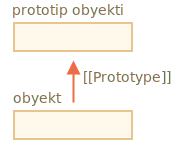

# Prototip meros

Dasturlashda biz ko'pincha biron bir narsani olishni va uni kengaytirishni xohlaymiz.

Masalan, bizda `user` obyekti, uning xususiyatlari va usullari bor, va `admin` va `mehmon` ni uning biroz o'zgartirilgan variantlari sifatida qilishni xohlaymiz. Biz `user` da mavjud bo'lgan narsalarni qayta ishlatishni istaymiz, uning usullarini nusxa ko'chirmasligimiz/amalga oshirmasligimiz kerak, shunchaki uning ustiga yangi obyekt quramiz.

*Prototipal meros* - bunga yordam beradigan til xususiyati.

## [[Prototype]]

JavaScript-da obyektlar maxfiy xususiyatga ega `[[Prototype]]` (spetsifikatsiyada ko'rsatilganidek), ya'ni `null` yoki boshqa obyektga murojaat qiladi. Ushbu obyekt "prototip" deb nomlanadi:



<<<<<<< HEAD
Bu `[[Prototype]]` "sehrli" ma'noga ega. Obyektdan xususiyatni o'qishni xohlaganimizda va u yetishmayotgan bo'lsa, JavaScript uni avtomatik ravishda prototipdan oladi. Dasturlashda bunday narsa "prototipli meros" deb nomlanadi. Ko'pgina ajoyib til xususiyatlari va dasturlash texnikasi unga asoslangan.
=======
When we read a property from `object`, and it's missing, JavaScript automatically takes it from the prototype. In programming, this is called "prototypal inheritance". And soon we'll study many examples of such inheritance, as well as cooler language features built upon it.
>>>>>>> fb4fc33a2234445808100ddc9f5e4dcec8b3d24c

`[[Prototype]]` xususiyati ichki va yashirin, ammo uni o'rnatishning ko'plab usullari mavjud.

<<<<<<< HEAD
Ulardan biri quyidagicha ``__proto__` dan foydalanish:
=======
One of them is to use the special name `__proto__`, like this:
>>>>>>> fb4fc33a2234445808100ddc9f5e4dcec8b3d24c

```js run
let animal = {
  eats: true
};
let rabbit = {
  jumps: true
};

*!*
rabbit.__proto__ = animal; // sets rabbit.[[Prototype]] = animal
*/!*
```

<<<<<<< HEAD
```smart header="`__proto__` `[[Prototype]]` uchun tarixiy qabul qiluvchi/belgilovchi"
Iltimos, `__proto__`  `[[Prototype]]` bilan *bir xil emas*. Bu u uchun getter/setter.

U tarixiy sabablarga ko'ra mavjud bo'lib, zamonaviy tilda uning o'rnini `Object.getPrototypeOf/Object.setPrototypeOf` funktsiyalari egallaydi, bu prototipni oladi/ o'rnatadi. Buning sabablarini va ushbu funktsiyalarni keyinroq o'rganib chiqamiz.

`__proto__` spetsifikatsiyasi bo'yicha faqat brauzerlar tomonidan qo'llab-quvvatlanishi kerak, ammo aslida barcha muhit, shu jumladan server tomoni uni qo'llab-quvvatlaydi. Hozircha, `__proto__` yozuvi biroz intuitiv ravishda aniq bo'lgani uchun, biz buni misollarda qo'llaymiz.
```

Agar biz `rabbit` dan xususiyat qidirsak va u yetishmayotgan bo'lsa, JavaScript uni avtomatik ravishda `animal` dan oladi.
=======
Now if we read a property from `rabbit`, and it's missing, JavaScript will automatically take it from `animal`.
>>>>>>> fb4fc33a2234445808100ddc9f5e4dcec8b3d24c

Masalan:

```js
let animal = {
  eats: true
};
let rabbit = {
  jumps: true
};

*!*
rabbit.__proto__ = animal; // (*)
*/!*

// hozir quyonda ikkala xususiyatni topishimiz mumkin:
*!*
alert( rabbit.eats ); // true (**)
*/!*
alert( rabbit.jumps ); // true
```

<<<<<<< HEAD
Bu yerda `(*)` satri `animal` `rabbit` ning prototipi sifatida o'rnatadi.
=======
Here the line `(*)` sets `animal` to be the prototype of `rabbit`.
>>>>>>> 34a80e70f8cce5794be259d25f815d7a7db7cbe3

Keyin, `alert` `rabbit.eats` `(**)` xususiyatini o'qishga harakat qiladi, u `rabbit` da mavjud emas, shuning uchun JavaScript `[[Prototype]]` ma'lumotnomasiga amal qiladi va uni `animal` da topadi (pastdan yuqoriga qarang):


Bu yerda "`animal` - bu `rabbit` ning prototipi" yoki "`rabbit` prototipik ravishda `animal` dan meros qilib olinadi".

Shunday qilib, agar `animal` juda ko'p foydali xususiyatlarga va usullarga ega bo'lsa, ular avtomatik ravishda `rabbit` da mavjud bo'ladi. Bunday xususiyatlar "meros qilib olingan" deb nomlanadi.

Agar bizda `animal` da usul bo'lsa, uni `rabbit` da chaqirish mumkin:

```js run
let animal = {
  eats: true,
*!*
  walk() {
    alert("Hayvon sayr qilyapti");
  }
*/!*
};

let rabbit = {
  jumps: true,
  __proto__: animal
};

// walk prototipidan olingan
*!*
rabbit.walk(); // Hayvon sayr qilyapti
*/!*
```

Usul prototipdan avtomatik ravishda quyidagicha olinadi:


Prototip zanjiri uzunroq bo'lishi mumkin:

```js run
let animal = {
  eats: true,
  walk() {
    alert("Hayvon sayr qilyapti");
  }
};

let rabbit = {
  jumps: true,
*!*
  __proto__: animal
*/!*
};

let longEar = {
  earLength: 10,
*!*
  __proto__: rabbit
*/!*
};

// walk prototip zanjiridan olingan
longEar.walk(); // Hayvon sayr qilyapti
alert(longEar.jumps); // true (rabbit dan)
```


<<<<<<< HEAD

Aslida faqat ikkita cheklov mavjud:

1. Havolalar doiralarda yurib bo'lmaydi. Agar doira ichida `__proto__` ni belgilashga harakat qilsak, JavaScript xatolikka yo'l qo'yadi.
2. `__proto__` qiymati obyekt yoki `null` bo'lishi mumkin, boshqa turlari (masalan, ibtidoiylar) hisobga olinmaydi.
=======

Now if we read something from `longEar`, and it's missing, JavaScript will look for it in `rabbit`, and then in `animal`.

There are only two limitations:

1. The references can't go in circles. JavaScript will throw an error if we try to assign `__proto__` in a circle.
2. The value of `__proto__` can be either an object or `null`. Other types are ignored.
>>>>>>> fb4fc33a2234445808100ddc9f5e4dcec8b3d24c

Bundan tashqari, bu aniq bo'lishi mumkin, ammo baribir: bitta `[[Prototype]]` bo'lishi mumkin. Obyekt boshqa ikkitadan meros ololmaydi.

<<<<<<< HEAD
<<<<<<< HEAD
## Yozishda prototipdan foydalanilmaydi
=======

=======
>>>>>>> 34a80e70f8cce5794be259d25f815d7a7db7cbe3
```smart header="`__proto__` is a historical getter/setter for `[[Prototype]]`"
It's a common mistake of novice developers not to know the difference between these two.

Please note that `__proto__` is *not the same* as the internal `[[Prototype]]` property. It's a getter/setter for `[[Prototype]]`. Later we'll see situations where it matters, for now let's just keep it in mind, as we build our understanding of JavaScript language.

The `__proto__` property is a bit outdated. It exists for historical reasons, modern JavaScript suggests that we should use `Object.getPrototypeOf/Object.setPrototypeOf` functions instead that get/set the prototype. We'll also cover these functions later.

By the specification, `__proto__` must only be supported by browsers. In fact though, all environments including server-side support `__proto__`, so we're quite safe using it.

As the `__proto__` notation is a bit more intuitively obvious, we use it in the examples.
```

## Writing doesn't use prototype
>>>>>>> fb4fc33a2234445808100ddc9f5e4dcec8b3d24c

Prototip faqat o'qish xususiyatlari uchun ishlatiladi.

Yozish/o'chirish operatsiyalari to'g'ridan-to'g'ri obyekt bilan ishlaydi.

Quyidagi misolda biz `walk` usulini `rabbit` ga tayinlaymiz:

```js run
let animal = {
  eats: true,
  walk() {
    /* bu usul quyon tomonidan ishlatilmaydi */  
  }
};

let rabbit = {
  __proto__: animal
};

*!*
rabbit.walk = function() {
  alert("Quyon! Sakra-sakra!");
};
*/!*

rabbit.walk(); // Quyon! Sakra-sakra!
```

Bundan buyon, `rabbit.walk()` chaqiruvi usulni darhol obyektda topadi va prototipdan foydalanmasdan amalga oshiradi:


<<<<<<< HEAD
Bu faqat ma'lumotlarning xususiyatlari uchun, lekin kiruvchilar uchun emas. Agar xususiyat getter/setter bo'lsa, u funktsiya kabi ishlaydi: getters/setters prototipda topiladi.
=======
Accessor properties are an exception, as assignment is handled by a setter function. So writing to such a property is actually the same as calling a function.
>>>>>>> fb4fc33a2234445808100ddc9f5e4dcec8b3d24c

Shu sababli `admin.fullName` quyidagi kodda to'g'ri ishlaydi:

```js run
let user = {
  name: "John",
  surname: "Smith",

  set fullName(value) {
    [this.name, this.surname] = value.split(" ");
  },

  get fullName() {
    return `${this.name} ${this.surname}`;
  }
};

let admin = {
  __proto__: user,
  isAdmin: true
};

alert(admin.fullName); // John Smith (*)

// setter triggers!
admin.fullName = "Alice Cooper"; // (**)

alert(admin.fullName); // Alice Cooper, state of admin modified
alert(user.fullName); // John Smith, state of user protected
```

`(*)` Satrida `admin.fullName` xususiyati `user` prototipida qabul qiluvchiga ega, shuning uchun u shunday nomlanadi. Va `(**)` satrida prototipda xususiyat o'rnatuvchiga ega, shuning uchun u shunday nomlanadi.

## "This" qiymati

<<<<<<< HEAD
Yuqoridagi misolda qiziq savol tug'ilishi mumkin: `fullName(value)` ichida `this` qiymati qanday? `this.name` va `this.same` xususiyatlari qayerda yozilgan: `user` yoki `admin` ga?
=======
An interesting question may arise in the example above: what's the value of `this` inside `set fullName(value)`? Where are the properties `this.name` and `this.surname` written: into `user` or `admin`?
>>>>>>> fb4fc33a2234445808100ddc9f5e4dcec8b3d24c

Javob oddiy: `this` ga prototiplar umuman ta'sir qilmaydi.

**Usul qayerda bo'lishidan qat'i nazar: obyektda yoki uning prototipida. Usul chaqiruvida `this` har doim nuqta oldidagi obyekt hisoblanadi.**

Shunday qilib, `admin.fullName=` setter chaqiruvi `user` emas, balki `admin` dan foydalanadi.

<<<<<<< HEAD
Bu aslida o'ta muhim narsa, chunki bizda ko'plab usullarga ega bo'lgan va undan meros bo'lib qolgan katta obyekt bo'lishi mumkin. Keyin meros qilib olingan obyektlar uning usullarini ishga tushirishi mumkin va ular bu obyektlarning holatini o'zgartiradi, kattani emas.
=======
That is actually a super-important thing, because we may have a big object with many methods, and have objects that inherit from it. And when the inheriting objects run the inherited methods, they will modify only their own states, not the state of the big object.
>>>>>>> fb4fc33a2234445808100ddc9f5e4dcec8b3d24c

Masalan, bu yerda `animal` "usulni saqlash" ni anglatadi va `quyon` undan foydalanadi.

`rabbit.sleep()` chaqiruvi `rabbit` obyektida `this.isSleeping` ni o'rnatadi:

```js run
// animal has methods
let animal = {
  walk() {
    if (!this.isSleeping) {
      alert(`Men sayr qilyapman`);
    }
  },
  sleep() {
    this.isSleeping = true;
  }
};

let rabbit = {
  name: "White Rabbit",
  __proto__: animal
};

// modifies rabbit.isSleeping
rabbit.sleep();

alert(rabbit.isSleeping); // true
alert(animal.isSleeping); // undefined (no such property in the prototype)
```

Natija rasmi:


<<<<<<< HEAD
Agar bizda `animal` dan meros bo'lib qolgan `qush`, `ilon` va boshqalar kabi narsalar bo'lsa, ular `animal` usullaridan ham foydalanishlari mumkin edi. Ammo `this` har bir usulda `animal` emas, balki chaqiruv vaqtida (nuqta oldidan) baholanadigan mos keladigan obyektni bo'ladi. Shunday qilib, biz ma'lumotlarni `this` ga yozganimizda, ular ushbu obyektlarda saqlanadi.
=======
If we had other objects, like `bird`, `snake`, etc., inheriting from `animal`, they would also gain access to methods of `animal`. But `this` in each method call would be the corresponding object, evaluated at the call-time (before dot), not `animal`. So when we write data into `this`, it is stored into these objects.
>>>>>>> fb4fc33a2234445808100ddc9f5e4dcec8b3d24c

Natijada, usullar birgalikda ishlatiladi, ammo obyekt holatida emas.

<<<<<<< HEAD
## Xulosa

- JavaScript-da barcha obyektlar yashiringan `[[Prototype]]` xususiyatiga ega, bu boshqa obyekt yoki `null`.
- Bunga kirish uchun `obj .__ proto__` dan foydalanishimiz mumkin (tarixiy getter/setter, boshqa usullar mavjud, yaqin orada ko'rib chiqilishi kerak).
- `[[Prototype]]` ga havola qilingan obyekt "prototip" deb nomlanadi.
- Agar biz `obj` xususiyatini o'qishni yoki usulni chaqirishni xohlasak va u mavjud bo'lmasa, JavaScript uni prototipda topishga harakat qiladi. Yozish/o'chirish operatsiyalari to'g'ridan-to'g'ri obyektda ishlaydi, ular prototipdan foydalanmaydi (agar xususiyat aslida setter bo'lmasa).
- Agar biz `obj.method()` deb nomlasak va `usul` prototipdan olingan bo'lsa, `this` `obj` ga hali ham murojaat qiladi. Shunday qilib, usullar, agar ular meros qilib olingan bo'lsa ham, har doim ham mavjud obyekt bilan ishlaydi.
=======
## for..in loop

The `for..in` loop iterates over inherited properties too.

For instance:

```js run
let animal = {
  eats: true
};

let rabbit = {
  jumps: true,
  __proto__: animal
};

*!*
// Object.keys only returns own keys
alert(Object.keys(rabbit)); // jumps
*/!*

*!*
// for..in loops over both own and inherited keys
for(let prop in rabbit) alert(prop); // jumps, then eats
*/!*
```

If that's not what we want, and we'd like to exclude inherited properties, there's a built-in method [obj.hasOwnProperty(key)](https://developer.mozilla.org/en-US/docs/Web/JavaScript/Reference/Global_Objects/Object/hasOwnProperty): it returns `true` if `obj` has its own (not inherited) property named `key`.

So we can filter out inherited properties (or do something else with them):

```js run
let animal = {
  eats: true
};

let rabbit = {
  jumps: true,
  __proto__: animal
};

for(let prop in rabbit) {
  let isOwn = rabbit.hasOwnProperty(prop);

  if (isOwn) {
    alert(`Our: ${prop}`); // Our: jumps
  } else {
    alert(`Inherited: ${prop}`); // Inherited: eats
  }
}
```

Here we have the following inheritance chain: `rabbit` inherits from `animal`, that inherits from `Object.prototype` (because `animal` is a literal object `{...}`, so it's by default), and then `null` above it:


Note, there's one funny thing. Where is the method `rabbit.hasOwnProperty` coming from? We did not define it. Looking at the chain we can see that the method is provided by `Object.prototype.hasOwnProperty`. In other words, it's inherited.

...But why does `hasOwnProperty` not appear in the `for..in` loop like `eats` and `jumps` do, if `for..in` lists inherited properties?

The answer is simple: it's not enumerable. Just like all other properties of `Object.prototype`, it has `enumerable:false` flag. And `for..in` only lists enumerable properties. That's why it and the rest of the `Object.prototype` properties are not listed.

```smart header="Almost all other key/value-getting methods ignore inherited properties"
Almost all other key/value-getting methods, such as `Object.keys`, `Object.values` and so on ignore inherited properties.

They only operate on the object itself. Properties from the prototype are *not* taken into account.
```

## Summary

- In JavaScript, all objects have a hidden `[[Prototype]]` property that's either another object or `null`.
- We can use `obj.__proto__` to access it (a historical getter/setter, there are other ways, to be covered soon).
- The object referenced by `[[Prototype]]` is called a "prototype".
- If we want to read a property of `obj` or call a method, and it doesn't exist, then JavaScript tries to find it in the prototype.
- Write/delete operations act directly on the object, they don't use the prototype (assuming it's a data property, not a setter).
- If we call `obj.method()`, and the `method` is taken from the prototype, `this` still references `obj`. So methods always work with the current object even if they are inherited.
- The `for..in` loop iterates over both its own and its inherited properties. All other key/value-getting methods only operate on the object itself.
>>>>>>> fb4fc33a2234445808100ddc9f5e4dcec8b3d24c
