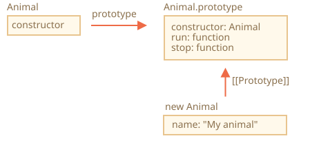
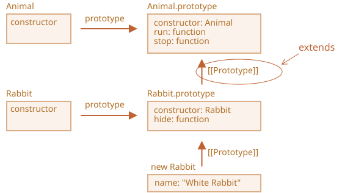
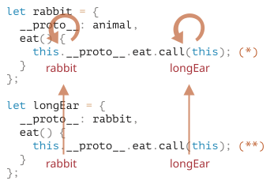

# Klass meros olish (Class inheritance)

Klass meros olish — bu bitta klassni boshqasidan kengaytirish (extend) usuli.

Shunday qilib, biz mavjud funksionallik ustiga yangi funksionallik qo‘shishimiz mumkin.

## `extends` kalit so‘zi

Keling, bizda `Animal` klassi bor, deylik:

```js
class Animal {
  constructor(name) {
    this.speed = 0;
    this.name = name;
  }
  run(speed) {
    this.speed = speed;
    alert(`${this.name} ${this.speed} tezlikda yugurmoqda.`);
  }
  stop() {
    this.speed = 0;
    alert(`${this.name} joyida to‘xtadi.`);
  }
}

let animal = new Animal("Mening hayvonim");
```

`animal` obyektini va `Animal` klassini grafik ko‘rinishda tasavvur qilishimiz mumkin:



...Endi biz `Rabbit` nomli boshqa klass yaratmoqchimiz.

Quyonlar ham hayvon bo‘lgani uchun, `Rabbit` klassi `Animal` asosida bo‘lishi kerak. Shunday qilib, u hayvon metodlariga ham ega bo‘ladi va qo‘shimcha ravishda o‘zining metodlariga ham ega bo‘ladi.

Sintaksis: `class Bola extends Ota`.

Keling, `Animal`dan meros oluvchi `Rabbit` klassini yarataylik:

```js
class Rabbit extends Animal {
  hide() {
    alert(`${this.name} yashirinmoqda!`);
  }
}

let rabbit = new Rabbit("Oq Quyon");

rabbit.run(5); // Oq Quyon 5 tezlikda yugurmoqda.
rabbit.hide(); // Oq Quyon yashirinmoqda!
```

`Rabbit` klassidan olingan obyekt ham `Rabbit` metodlariga (masalan, `rabbit.hide()`), ham `Animal` metodlariga (masalan, `rabbit.run()`) ega.

`extends` kalit so‘zi ichki ishlash jarayonida prototip mexanizmidan foydalanadi. U `Rabbit.prototype.[[Prototype]]`ni `Animal.prototype`ga o‘rnatadi. Agar metod `Rabbit.prototype`da topilmasa, JavaScript uni `Animal.prototype`dan qidiradi.



Metodni qidirish jarayoni (masalan `rabbit.run`):

1. `rabbit` obyektida qidiradi (`run` yo‘q).
2. `Rabbit.prototype`da qidiradi (`hide` bor, `run` yo‘q).
3. `Animal.prototype`da qidiradi (bu yerda `run` mavjud).

JavaScript’ning o‘zidagi built-in obyektlar ham shu meros olish mexanizmidan foydalanadi. Masalan, `Date.prototype.[[Prototype]]` bu `Object.prototype`.

## Metodni qayta yozish (Overriding a method)

Agar `Rabbit` klassida yangi metod yozmasak, u avtomatik ravishda `Animal` metodlaridan foydalanadi.  
Lekin agar biz o‘zimiz metod yozsak, u holda eski metod o‘rniga yangisi ishlatiladi:

```js
class Rabbit extends Animal {
  stop() {
    // endi bu metod `rabbit.stop()` chaqirilganda ishlatiladi
  }
}
```

<<<<<<< HEAD
Ko‘pincha biz ota metodni butunlay almashtirishni istamaymiz, balki uning ustiga qo‘shimcha logika qo‘shmoqchimiz. Buning uchun `super` kalit so‘zi ishlatiladi:
=======
Usually, however, we don't want to totally replace a parent method, but rather to build on top of it to tweak or extend its functionality. We do something in our method, but call the parent method before/after it or in the process.
>>>>>>> 51bc6d3cdc16b6eb79cb88820a58c4f037f3bf19

- `super.method(...)` → ota metodni chaqirish.
- `super(...)` → ota konstruktorga murojaat (faqat konstruktor ichida).

Misol: quyon to‘xtaganda avtomatik yashirinsin:

```js
class Rabbit extends Animal {
  hide() {
    alert(`${this.name} yashirinmoqda!`);
  }

  stop() {
<<<<<<< HEAD
    super.stop(); // ota klassning stop() metodi
    this.hide(); // qo‘shimcha xatti-harakat
=======
    super.stop(); // call parent stop
    this.hide(); // and then hide
  }
*/!*
}

let rabbit = new Rabbit("White Rabbit");

rabbit.run(5); // White Rabbit runs with speed 5.
rabbit.stop(); // White Rabbit stands still. White Rabbit hides!
```

Now `Rabbit` has the `stop` method that calls the parent `super.stop()` in the process.

````smart header="Arrow functions have no `super`"
As was mentioned in the chapter <info:arrow-functions>, arrow functions do not have `super`.

If accessed, it's taken from the outer function. For instance:

```js
class Rabbit extends Animal {
  stop() {
    setTimeout(() => super.stop(), 1000); // call parent stop after 1sec
>>>>>>> 51bc6d3cdc16b6eb79cb88820a58c4f037f3bf19
  }
}
```

## Konstruktorni qayta yozish (Overriding constructor)

<<<<<<< HEAD
Agar bola klassda konstruktor yozilmasa, u avtomatik ravishda ota konstruktorni chaqiradigan “bo‘sh” konstruktor yaratiladi:
=======
```js
// Unexpected super
setTimeout(function() { super.stop() }, 1000);
```
````

## Overriding constructor

With constructors it gets a little bit tricky.

Until now, `Rabbit` did not have its own `constructor`.

According to the [specification](https://tc39.github.io/ecma262/#sec-runtime-semantics-classdefinitionevaluation), if a class extends another class and has no `constructor`, then the following "empty" `constructor` is generated:
>>>>>>> 51bc6d3cdc16b6eb79cb88820a58c4f037f3bf19

```js
class Rabbit extends Animal {
  constructor(...args) {
    super(...args);
  }
}
```

Agar o‘zimiz konstruktor yozsak, **albatta `super(...)`ni chaqirishimiz shart**. Aks holda `this` mavjud bo‘lmaydi va xato chiqadi.

```js
class Rabbit extends Animal {
  constructor(name, earLength) {
    super(name); // ota klass konstruktorini chaqirish
    this.earLength = earLength;
  }
}
```

## Muhim eslatma: metodlar va maydonlarni (fields) qayta yozish

Metodlar qayta yozilganda ota klass konstruktori yangisini chaqiradi.  
Lekin klass maydonlari (fields) bilan bunday emas — ular faqat `super()`dan keyin ishga tushadi. Shu sababli ota konstruktor ichida doim ota klass maydoni ishlatiladi.

Misol:

```js
class Animal {
<<<<<<< HEAD
  name = "animal";
=======

  constructor(name) {
    this.speed = 0;
    this.name = name;
  }

  // ...
}

class Rabbit extends Animal {

  constructor(name, earLength) {
*!*
    super(name);
*/!*
    this.earLength = earLength;
  }

  // ...
}

*!*
// now fine
let rabbit = new Rabbit("White Rabbit", 10);
alert(rabbit.name); // White Rabbit
alert(rabbit.earLength); // 10
*/!*
```

### Overriding class fields: a tricky note

```warn header="Advanced note"
This note assumes you have a certain experience with classes, maybe in other programming languages.

It provides better insight into the language and also explains the behavior that might be a source of bugs (but not very often).

If you find it difficult to understand, just go on, continue reading, then return to it some time later.
```

We can override not only methods, but also class fields.

Although, there's a tricky behavior when we access an overridden field in parent constructor, quite different from most other programming languages.

Consider this example:

```js run
class Animal {
  name = 'animal';

>>>>>>> 51bc6d3cdc16b6eb79cb88820a58c4f037f3bf19
  constructor() {
    alert(this.name);
  }
}

class Rabbit extends Animal {
  name = "rabbit";
}

new Rabbit(); // animal
```

<<<<<<< HEAD
Metodlar esa boshqacha ishlaydi — ular qayta yozilganda yangisi ishlaydi.
=======
Here, class `Rabbit` extends `Animal` and overrides the `name` field with its own value.
>>>>>>> 51bc6d3cdc16b6eb79cb88820a58c4f037f3bf19

## Xulosa

1. Klassni kengaytirish: `class Bola extends Ota`.
   - `Bola.prototype.__proto__ = Ota.prototype`
2. Konstruktor qayta yozilganda:
   - `super()` chaqirilishi kerak va `this` dan oldin bo‘lishi shart.
3. Metodlarni qayta yozishda:
   - `super.method()` orqali ota metodni chaqirish mumkin.
4. Ichki mexanizmlar:
   - Metodlar `[[HomeObject]]`ga ega va shu orqali `super` ishlaydi.
   - `super` ishlatadigan metodni boshqa obyektga ko‘chirish mumkin emas.

<<<<<<< HEAD
> Eslatma: Arrow function’larda o‘zining `this` yoki `super`i yo‘q, ular tashqi kontekstdan foydalanadi.
=======
**In other words, the parent constructor always uses its own field value, not the overridden one.**

What's odd about it?

If it's not clear yet, please compare with methods.

Here's the same code, but instead of `this.name` field we call `this.showName()` method:

```js run
class Animal {
  showName() {  // instead of this.name = 'animal'
    alert('animal');
  }

  constructor() {
    this.showName(); // instead of alert(this.name);
  }
}

class Rabbit extends Animal {
  showName() {
    alert('rabbit');
  }
}

new Animal(); // animal
*!*
new Rabbit(); // rabbit
*/!*
```

Please note: now the output is different.

And that's what we naturally expect. When the parent constructor is called in the derived class, it uses the overridden method.

...But for class fields it's not so. As said, the parent constructor always uses the parent field.

Why is there a difference?

Well, the reason is the field initialization order. The class field is initialized:
- Before constructor for the base class (that doesn't extend anything),
- Immediately after `super()` for the derived class.

In our case, `Rabbit` is the derived class. There's no `constructor()` in it. As said previously, that's the same as if there was an empty constructor with only `super(...args)`.

So, `new Rabbit()` calls `super()`, thus executing the parent constructor, and (per the rule for derived classes) only after that its class fields are initialized. At the time of the parent constructor execution, there are no `Rabbit` class fields yet, that's why `Animal` fields are used.

This subtle difference between fields and methods is specific to JavaScript.

Luckily, this behavior only reveals itself if an overridden field is used in the parent constructor. Then it may be difficult to understand what's going on, so we're explaining it here.

If it becomes a problem, one can fix it by using methods or getters/setters instead of fields.

## Super: internals, [[HomeObject]]

```warn header="Advanced information"
If you're reading the tutorial for the first time - this section may be skipped.

It's about the internal mechanisms behind inheritance and `super`.
```

Let's get a little deeper under the hood of `super`. We'll see some interesting things along the way.

First to say, from all that we've learned till now, it's impossible for `super` to work at all!

Yeah, indeed, let's ask ourselves, how it should technically work? When an object method runs, it gets the current object as `this`. If we call `super.method()` then, the engine needs to get the `method` from the prototype of the current object. But how?

The task may seem simple, but it isn't. The engine knows the current object `this`, so it could get the parent `method` as `this.__proto__.method`. Unfortunately, such a "naive" solution won't work.

Let's demonstrate the problem. Without classes, using plain objects for the sake of simplicity.

You may skip this part and go below to the `[[HomeObject]]` subsection if you don't want to know the details. That won't harm. Or read on if you're interested in understanding things in-depth.

In the example below, `rabbit.__proto__ = animal`. Now let's try: in `rabbit.eat()` we'll call `animal.eat()`, using `this.__proto__`:

```js run
let animal = {
  name: "Animal",
  eat() {
    alert(`${this.name} eats.`);
  }
};

let rabbit = {
  __proto__: animal,
  name: "Rabbit",
  eat() {
*!*
    // that's how super.eat() could presumably work
    this.__proto__.eat.call(this); // (*)
*/!*
  }
};

rabbit.eat(); // Rabbit eats.
```

At the line `(*)` we take `eat` from the prototype (`animal`) and call it in the context of the current object. Please note that `.call(this)` is important here, because a simple `this.__proto__.eat()` would execute parent `eat` in the context of the prototype, not the current object.

And in the code above it actually works as intended: we have the correct `alert`.

Now let's add one more object to the chain. We'll see how things break:

```js run
let animal = {
  name: "Animal",
  eat() {
    alert(`${this.name} eats.`);
  }
};

let rabbit = {
  __proto__: animal,
  eat() {
    // ...bounce around rabbit-style and call parent (animal) method
    this.__proto__.eat.call(this); // (*)
  }
};

let longEar = {
  __proto__: rabbit,
  eat() {
    // ...do something with long ears and call parent (rabbit) method
    this.__proto__.eat.call(this); // (**)
  }
};

*!*
longEar.eat(); // Error: Maximum call stack size exceeded
*/!*
```

The code doesn't work anymore! We can see the error trying to call `longEar.eat()`.

It may be not that obvious, but if we trace `longEar.eat()` call, then we can see why. In both lines `(*)` and `(**)` the value of `this` is the current object (`longEar`). That's essential: all object methods get the current object as `this`, not a prototype or something.

So, in both lines `(*)` and `(**)` the value of `this.__proto__` is exactly the same: `rabbit`. They both call `rabbit.eat` without going up the chain in the endless loop.

Here's the picture of what happens:



1. Inside `longEar.eat()`, the line `(**)` calls `rabbit.eat` providing it with `this=longEar`.
    ```js
    // inside longEar.eat() we have this = longEar
    this.__proto__.eat.call(this) // (**)
    // becomes
    longEar.__proto__.eat.call(this)
    // that is
    rabbit.eat.call(this);
    ```
2. Then in the line `(*)` of `rabbit.eat`, we'd like to pass the call even higher in the chain, but `this=longEar`, so `this.__proto__.eat` is again `rabbit.eat`!

    ```js
    // inside rabbit.eat() we also have this = longEar
    this.__proto__.eat.call(this) // (*)
    // becomes
    longEar.__proto__.eat.call(this)
    // or (again)
    rabbit.eat.call(this);
    ```

3. ...So `rabbit.eat` calls itself in the endless loop, because it can't ascend any further.

The problem can't be solved by using `this` alone.

### `[[HomeObject]]`

To provide the solution, JavaScript adds one more special internal property for functions: `[[HomeObject]]`.

When a function is specified as a class or object method, its `[[HomeObject]]` property becomes that object.

Then `super` uses it to resolve the parent prototype and its methods.

Let's see how it works, first with plain objects:

```js run
let animal = {
  name: "Animal",
  eat() {         // animal.eat.[[HomeObject]] == animal
    alert(`${this.name} eats.`);
  }
};

let rabbit = {
  __proto__: animal,
  name: "Rabbit",
  eat() {         // rabbit.eat.[[HomeObject]] == rabbit
    super.eat();
  }
};

let longEar = {
  __proto__: rabbit,
  name: "Long Ear",
  eat() {         // longEar.eat.[[HomeObject]] == longEar
    super.eat();
  }
};

*!*
// works correctly
longEar.eat();  // Long Ear eats.
*/!*
```

It works as intended, due to `[[HomeObject]]` mechanics. A method, such as `longEar.eat`, knows its `[[HomeObject]]` and takes the parent method from its prototype. Without any use of `this`.

### Methods are not "free"

As we've known before, generally functions are "free", not bound to objects in JavaScript. So they can be copied between objects and called with another `this`.

The very existence of `[[HomeObject]]` violates that principle, because methods remember their objects. `[[HomeObject]]` can't be changed, so this bond is forever.

The only place in the language where `[[HomeObject]]` is used -- is `super`. So, if a method does not use `super`, then we can still consider it free and copy between objects. But with `super` things may go wrong.

Here's the demo of a wrong `super` result after copying:

```js run
let animal = {
  sayHi() {
    alert(`I'm an animal`);
  }
};

// rabbit inherits from animal
let rabbit = {
  __proto__: animal,
  sayHi() {
    super.sayHi();
  }
};

let plant = {
  sayHi() {
    alert("I'm a plant");
  }
};

// tree inherits from plant
let tree = {
  __proto__: plant,
*!*
  sayHi: rabbit.sayHi // (*)
*/!*
};

*!*
tree.sayHi();  // I'm an animal (?!?)
*/!*
```

A call to `tree.sayHi()` shows "I'm an animal". Definitely wrong.

The reason is simple:
- In the line `(*)`, the method `tree.sayHi` was copied from `rabbit`. Maybe we just wanted to avoid code duplication?
- Its `[[HomeObject]]` is `rabbit`, as it was created in `rabbit`. There's no way to change `[[HomeObject]]`.
- The code of `tree.sayHi()` has `super.sayHi()` inside. It goes up from `rabbit` and takes the method from `animal`.

Here's the diagram of what happens:


### Methods, not function properties

`[[HomeObject]]` is defined for methods both in classes and in plain objects. But for objects, methods must be specified exactly as `method()`, not as `"method: function()"`.

The difference may be non-essential for us, but it's important for JavaScript.

In the example below a non-method syntax is used for comparison. `[[HomeObject]]` property is not set and the inheritance doesn't work:

```js run
let animal = {
  eat: function() { // intentionally writing like this instead of eat() {...
    // ...
  }
};

let rabbit = {
  __proto__: animal,
  eat: function() {
    super.eat();
  }
};

*!*
rabbit.eat();  // Error calling super (because there's no [[HomeObject]])
*/!*
```

## Summary

1. To extend a class: `class Child extends Parent`:
    - That means `Child.prototype.__proto__` will be `Parent.prototype`, so methods are inherited.
2. When overriding a constructor:
    - We must call parent constructor as `super()` in `Child` constructor before using `this`.
3. When overriding another method:
    - We can use `super.method()` in a `Child` method to call `Parent` method.
4. Internals:
    - Methods remember their class/object in the internal `[[HomeObject]]` property. That's how `super` resolves parent methods.
    - So it's not safe to copy a method with `super` from one object to another.

Also:
- Arrow functions don't have their own `this` or `super`, so they transparently fit into the surrounding context.
>>>>>>> 51bc6d3cdc16b6eb79cb88820a58c4f037f3bf19
