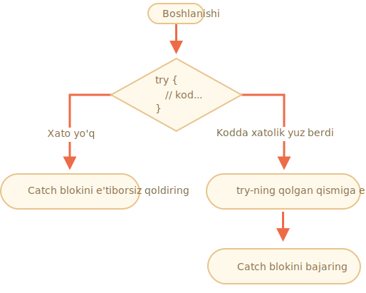

# Xatolarni qayta ishlash, "try..catch"

Dasturlashda qanchalik zo'r bo'lmasak, ba'zida bizning skriptlarimizda xatolar bo'ladi. Ular bizning xatolarimiz, kutilmagan foydalanuvchi kiritishi, serverning noto'g'ri javobi va boshqa minglab sabablarga ko'ra yuzaga kelishi mumkin.

Odatda, skript konsolga yozib, xatolik yuz berganda "o'ladi" (darhol to'xtaydi).

Ammo `try..catch` sintaksis konstruktsiyasi mavjud bo'lib, u xatolarni "ushlashga" imkon beradi va o'lish o'rniga yanada oqilona ishni bajaradi.

## "try..catch" sintaksisi

`try..catch` konstruktsiyasi ikkita asosiy blokga ega: `try` va keyin `catch`:

```js
try {

  // kod...

} catch (err) {

  // xatolarni qayta ishlash

}
```

U shunday ishlaydi:

1. Birinchidan, `try {...}` dagi kod bajariladi.
2. Agar xatolar bo'lmasa, `catch(err)` e'tiborga olinmaydi: bajarilish `try` tugashiga yetadi va keyin `catch` dan o'tib ketadi.
3. Agar xato yuzaga kelsa, `try` bajarilishi to'xtatiladi va boshqaruv `catch (err)` boshiga oqib keladi. `err` o'zgaruvchani (buning uchun istalgan nomni ishlatishiz mumkin) xatolar obyekti bo'lib, unda nima bo'lganligi haqida batafsil ma'lumot mavjud.



Shunday qilib, `try {…}` bloki ichidagi xato skriptni o'ldirmaydi: biz uni `catch` da boshqarish imkoniyatiga egamiz.

Keling, ko'proq misollarni ko'rib chiqaylik.

- Xatoliksiz misol: `alert` `(1)` va `(2)` ko'rsatadi:

    ```js run
    try {

      alert('try ning bajarilishi');  // *!*(1) <--*/!*

      // ...bu erda hech qanday xato yo'q

      alert('try ning bajarilishi tugadi');   // *!*(2) <--*/!*

    } catch (err) {

      alert("Catch e'tiborga olinmaydi, chunki xatolar yo'q"); // (3)

    }

    alert("...Keyin ijro davom etmoqda");
    ```
- Xato bilan misol: `(1)` va `(3)`:

    ```js run
    try {

      alert('try ning bajarilishi');  // *!*(1) <--*/!*

    *!*
      lalala; // error, variable is not defined!
    */!*

      alert('try ning bajarilishi tugadi (yetib bormaydi)');  // (2)

    } catch (err) {

      alert(`Xato yuz berdi!`); // *!*(3) <--*/!*

    }

    alert("...Keyin ijro davom etmoqda");
    ```


````warn header="`try..catch` faqat ish vaqtidagi xatolar uchun ishlaydi"
`try..catch` ishlashi uchun kod ishga tushirilishi kerak. Boshqacha qilib aytganda, u JavaScript-ga yaroqli bo'lishi kerak.

Agar kod sintaktik noto'g'ri bo'lsa, u ishlamaydi, masalan, unga mos kelmaydigan jingalak qavslar mavjud:

```js run
try {
  {{{{{{{{{{{{
} catch(e) {
  alert("Interpretator ushbu kodni tushunolmaydi, u yaroqsiz");
}
```

JavaScript interpretatori avval kodni o'qiydi, so'ngra uni bajaradi. O'qish iborasida yuzaga keladigan xatolar "parse-time" xatolari deb nomlanadi va ularni qaytarib bo'lmaydi (o'sha kod ichidan). Buning sababi interpretator kodni tushuna olmaydi.

Shunday qilib, `try..catch` faqat to'g'ri kodda yuzaga keladigan xatolarni ko'rib chiqishi mumkin. Bunday xatolar "ish vaqtidagi xatolar" yoki ba'zan "istisnolar" deb nomlanadi.
````


````warn header="`try..catch` sinxron ravishda ishlaydi"
Agar `setTimeout` singari "rejalashtirilgan" kodda istisno bo'lsa, `try..catch` uni ushlamaydi:

```js run
try {
  setTimeout(function() {
    noSuchVariable; // skript bu yerda o'ladi
  }, 1000);
} catch (e) {
  alert( "ishlamaydi" );
}
```

Buning sababi, `try..catch` funktsiyani rejalashtiradigan `setTimeout` chaqirig'ini aslida o'rab oladi. Ammo funktsiya o'zi keyinroq, interpretator allaqachon `try..catch` konstruktsiyasini tark etganda amalga oshiriladi.

Rejalashtirilgan funktsiyani istisno qilish uchun ushbu funktsiya ichida `try..catch` bo'lishi kerak:
```js run
setTimeout(function() {
  try {    
    noSuchVariable; // try..catch xatoni ko'rib chiqadi!
  } catch {
    alert( "xato bu yerda aniqlandi!" );
  }
}, 1000);
```
````

## Xato obyekti

Xato yuz berganda, JavaScript bu haqda batafsil ma'lumotlarni o'z ichiga olgan obyektni yaratadi. Keyin obyekt `catch` argumenti sifatida uzatiladi:

```js
try {
  // ...
} catch(err) { // <-- "xato obyekti", err o'rniga boshqa so'z ishlatishi mumkin
  // ...
}
```

O'rnatilgan barcha xatolar uchun `catch` blokidagi xato obyekti ikkita asosiy xususiyatga ega:

`name`
: Xato nomi. `ReferenceError` aniqlanmagan o'zgaruvchan uchun.

`message`
: Xato tafsilotlari haqida matnli xabar.

Ko'pgina muhitlarda boshqa nostandart xususiyatlar mavjud. Eng ko'p ishlatiladigan va qo'llab-quvvatlanadigan narsalardan biri:

`stack`
: Joriy chaqiruvlar to'plami: xatoga olib kelgan ichki chaqiruvlar ketma-ketligi haqida ma'lumotga ega matn. Nosozliklarni tuzatish maqsadida foydalaniladi.

Masalan:

```js run untrusted
try {
*!*
  lalala; // xato, o'zgaruvchan aniqlanmagan!
*/!*
} catch (err) {
  alert(err.name); // ReferenceError
  alert(err.message); // lalala aniqlanmagan
  alert(err.stack); // ReferenceError: lalala aniqlanmagan ...

  // Xatolikni ham to'liq ko'rsatishi mumkin
  // Xato "ism: xabar" sifatida matnga aylantirildi
  alert(err); // ReferenceError: lalala aniqlanmagan 
}
```

## Ixtiyoriy "catch" bloki

[recent browser=new]

Agar bizga xato tafsilotlari kerak bo'lmasa, `catch` uni o'tkazib yuborishi mumkin:

```js
try {
  // ...
} catch {
  // xato obyekti chiqarib tashlandi
}
```

## Foydalanish "try..catch"

Keling, `try..catch` ning haqiqiy hayotida ishlatilgan holatlarini ko'rib chiqaylik.

Bizga ma'lumki, JavaScript JSON bilan kodlangan qiymatlarni o'qish uchun [JSON.parse(str)](mdn:js/JSON/parse) usulini qo'llab-quvvatlaydi.

Odatda u serverdan yoki boshqa manbadan tarmoq orqali olingan ma'lumotlarni dekodlash uchun ishlatiladi.

Biz uni olamiz va `JSON.parse` ni chaqiramiz, shunga o'xshash:

```js run
let json = '{"name":"John", "age": 30}'; // serverdan olingan ma'lumotlar

*!*
let user = JSON.parse(json); // matnni JS obyektiga aylantirish
*/!*

// endi user - bu matndan xususiyatlarga ega bo'lgan obyekt
alert( user.name ); // John
alert( user.age );  // 30
```

JSON haqida batafsil ma'lumotni <info:json> bobida topishingiz mumkin.

**Agar `json` noto'g'ri tuzilgan bo'lsa, `JSON.parse` xatoga yo'l qo'yadi, shuning uchun skript "o'ladi".**

Biz bu bilan qoniqishimiz kerakmi? Albatta yo'q!

Shu tarzda, agar ma'lumotlar bilan bog'liq biror narsa noto'g'ri bo'lsa, foydalanuvchi buni hech qachon bilmaydi (agar ular dasturchi konsolini ochmasa). Hech qanday xato xabari bo'lmagan holda skript "o'lsa" odamlarga haqiqatan ham yoqmaydi.

Xatoni boshqarish uchun `try..catch` dan foydalanamiz:

```js run
let json = "{ bad json }";

try {

*!*
  let user = JSON.parse(json); // <-- xato yuzaga kelganda...
*/!*
  alert( user.name ); // ishlamaydi

} catch (err) {
*!*
  // ...ijro bu yerga sakraydi
  alert( "Kechirim so'raymiz, ma'lumotlarimizda xatolar bor, biz buni yana bir bor so'rab ko'rishga harakat qilamiz." );
  alert( e.name );
  alert( e.message );
*/!*
}
```

Bu yerda biz `catch` blokini faqat xabarni ko'rsatish uchun ishlatamiz, ammo biz bundan ham ko'proq narsani qila olamiz: yangi tarmoq so'rovini yuborish, mehmonga alternativani taklif qilish, xato haqida ma'lumotni konsolga yuborish, ... .Hammasi shunchaki o'lishdan ko'ra yaxshiroqdir.

## O'z xatolarimizni tashlaymiz

Agar `json` sintaktik jihatdan to'g'ri bo'lsa, lekin kerakli `name` xususiyatiga ega bo'lmasa-chi?

Shunga o'xshash:

```js run
let json = '{ "age": 30 }'; // to'liq bo'lmagan ma'lumotlar

try {

  let user = JSON.parse(json); // <-- xatolar yo'q
*!*
  alert( user.name ); // name yo'q!
*/!*

} catch (e) {
  alert( "ijro etmaydi" );
}
```

Bu yerda `JSON.parse` normal ishlaydi, ammo `name` yo'qligi biz uchun aslida xato.

Xato bilan ishlashni birlashtirish uchun biz `throw` operatoridan foydalanamiz.

### "Throw" operator

`throw` operatori xato hosil qiladi.

Sintaksis:

```js
throw <error object>
```

Texnik jihatdan biz har qanday narsani xato obyekti sifatida ishlatishimiz mumkin. Bu hatto raqam yoki matn kabi ibtidoiy bo'lishi mumkin, lekin moslamalarni, afzalroq `name` va `message` xususiyatlaridan foydalanish yaxshiroq (ichki xatolar bilan biroz mos kelish uchun).

JavaScript-da standart xatolar uchun ko'plab ichki konstruktorlar mavjud: `Error`, `SyntaxError`, `ReferenceError`, `TypeError` va boshqalar. Biz ulardan xato obyektlarini yaratish uchun ham foydalanishimiz mumkin.

Sintaksis:

```js
let error = new Error(message);
// or
let error = new SyntaxError(message);
let error = new ReferenceError(message);
// ...
```

O'rnatilgan xatolar uchun (biron bir obyekt uchun emas, faqat xatolar uchun) `name` xususiyati konstruktorning nomidir. Va `message` argumentdan olingan.

Masalan:

```js run
let error = new Error("Ishlar sodir bo'ladi o_O");

alert(error.name); // Xato
alert(error.message); // Ishlar sodir bo'ladi o_O
```

Keling, `JSON.parse` qanday xatoni hosil qilishini ko'rib chiqamiz:

```js run
try {
  JSON.parse("{ yomon json o_O }");
} catch(e) {
*!*
  alert(err.name); // SyntaxError
*/!*
  alert(err.message); // Unexpected token b in JSON at position 2
}
```

Ko'rib turganimizdek, bu `SyntaxError`.

Va bizning holatimizda, `name` ning yo'qligi, shuningdek, foydalanuvchilarda `name` bo'lishi kerak deb hisoblagan sintaksis xatosi sifatida qaralishi mumkin.

Biz uni ishlab chiqaramiz:

```js run
let json = '{ "age": 30 }'; // to'liq bo'lmagan ma'lumotlar

try {

  let user = JSON.parse(json); // <-- xatolar yo'q

  if (!user.name) {
*!*
    throw new SyntaxError("Incomplete data: no name"); // (*)
*/!*
  }

  alert( user.name );

} catch (err) {
  alert( "JSON Error: " + err.message ); // JSON Error: Incomplete data: no name
}
```

`(*)` satrida `throw` operatori berilgan `message` bilan `SyntaxError` hosil qiladi, xuddi JavaScript o'zi yaratganidak. `try` bajarilishi darhol to'xtaydi va boshqaruv oqimi `catch` ga o'tadi.

Endi `catch` barcha xatolarni ko'rib chiqish uchun yagona joyga aylandi: `JSON.parse` uchun ham, boshqa holatlar uchun ham.

## Istisno tarqalishi

Yuqoridagi misolda noto'g'ri ma'lumotlarga ishlov berish uchun `try..catch` dan foydalanamiz. Ammo `try {...}` blokida *kutilmagan xato* sodir bo'lishi mumkinmi? O'zgaruvchanga o'xshab, bu "noto'g'ri ma'lumotlar" emas, balki aniqlanmagan yoki boshqa narsalar.

Shunga o'xshash:

```js run
let json = '{ "age": 30 }'; // to'liq bo'lmagan ma'lumotlar

try {
  user = JSON.parse(json); // <-- foydalanuvchi oldida "let" qo'yishni unutgan

  // ...
} catch (err) {
  alert("JSON Error: " + err); // JSON Error: ReferenceError: user is not defined
  // (JSON Error emas aslida)
}
```

Albatta, hamma narsa mumkin! Dasturchilar xato qilishadi. Hatto millionlab odamlar tomonidan o'nlab yillar davomida ishlatilgan ochiq manba dasturlarida ham - to'satdan dahshatli xakerlarga olib keladigan aqldan ozgan xato topilishi mumkin (masalan, `ssh` vositasida bo'lgani kabi).

Bizning holatlarimizda, `try..catch` "noto'g'ri ma'lumotlar" xatolarini olish uchun mo'ljallangan. Ammo o'z mohiyatiga ko'ra `catch` `try` dan *barcha* xatolarni oladi. Bu yerda kutilmagan xatolik yuz beradi, ammo baribir o'sha `JSON Error` xabarini ko'rsatadi. Bu noto'g'ri va shuningdek, kodni nosozliklardan tuzatishni qiyinlashtiradi.

Yaxshiyamki, biz qanday xatoga yo'l qo'yganimizni, masalan, uning nomidan bilib olamiz:

```js run
try {
  user = { /*...*/ };
} catch (err) {
*!*
  alert(e.name); // "ReferenceError" aniqlanmagan o'zgaruvchanga kirish uchun
*/!*
    alert('ReferenceError'); // "ReferenceError" for accessing an undefined variable
  }
}
```

Qoida oddiy:

**Catch faqat o'zi bilgan xatolarni qayta ishlashi va boshqalarni "qayta tiklashi" kerak.**

"Qayta tiklash" texnikasini quyidagicha izohlash mumkin:

1. Catch barcha xatolarni oladi.
2. `catch(err) {...}` blokida biz xato obyektini tahlil qilamiz `err`.
2. Agar biz buni qanday hal qilishni bilmasak, unda biz `throw err` qilamiz.

Quyidagi kodda biz `catch` faqat `SyntaxError` ni boshqarishi uchun qayta tiklashdan foydalanamiz:

```js run
let json = '{ "age": 30 }'; // to'liq bo'lmagan ma'lumotlar
try {

  let user = JSON.parse(json);

  if (!user.name) {
    throw new SyntaxError("to'liq bo'lmagan ma'lumotlar: no name");
  }

*!*
  blabla(); // kutilmagan xato
*/!*

  alert( user.name );

} catch (err) {

*!*
  if (err instanceof SyntaxError) {
    alert( "JSON Error: " + err.message );
  } else {
    throw err; // rethrow (*)
  }
*/!*

}
```

`catch` bloki ichidan `(*)` satriga tashlashda xato `try..catch` dan tushib qoladi va uni tashqi `try..catch` konstruktsiyasi (agar mavjud bo'lsa) ushlashi mumkin, yoki u skriptni o'ldiradi.

Shunday qilib, `catch` bloki faqatgina o'zi qanday tuzatishi biladigan xatolarni hal qiladi va boshqalarni "o'tkazib yuboradi".

Quyidagi misolda bunday xatolarni yana qanday qilib `try..catch` darajasida ushlab qolish mumkinligi ko'rsatilgan:

```js run
function readData() {
  let json = '{ "age": 30 }';

  try {
    // ...
*!*
    blabla(); // xato!
*/!*
  } catch (err) {
    // ...
    if (!(err instanceof SyntaxError)) {
*!*
      throw e; // qayta tiklash (u bilan qanday kurashishni bilmayman)
*/!*
    }
  }
}

try {
  readData();
} catch (err) {
*!*
  alert( "Tashqi ovlash ushadi: " + e ); // ushladi!
*/!*
}
```

Bu yerda `readData` faqat `SyntaxError` bilan ishlashni biladi, tashqi `try..catch` esa hamma narsani qanday boshqarishni biladi.

## try...catch...finally

Kuting, bu hammasi emas.

`try..catch` konstruktsiyasida yana bitta kod bandi bo'lishi mumkin: `finally`.

Agar u mavjud bo'lsa, u barcha hollarda ishlaydi:

- `try` dan keyin, agar xatolar bo'lmasa,
- `catch` dan keyin, agar xatolar bo'lmasa,

Kengaytirilgan sintaksis quyidagicha ko'rinadi:

```js
*!*try*/!* {
   ... kodni bajarishga harakat qilish ...
} *!*catch*/!*(e) {
   ... xatolarni boshqarish ...
} *!*finally*/!* {
   ... har doim bajarish ...
}
```

Ushbu kodni ishlatib ko'ring:

```js run
try {
  alert( 'try' );
  if (confirm("Xatoga yo'l qo'ydingizmi?")) BAD_CODE();
} catch (e) {
  alert( 'catch' );
} finally {
  alert( 'finally' );
}
```

Kod bajarilishning ikkita usuliga ega:

1. Agar siz "Xatoga yo'l qo'ydingizmi?" ga "Ha" deb javob bersangiz, keyin `try -> catch -> finally`.
2. Agar siz "Yo'q" deb aytsangiz, unda `try -> finally`.

`finally` bandi ko'pincha biz `try..catch` dan oldin biror narsa qilishni boshlaganimizda va har qanday natijada uni yakunlashni xohlaganimizda ishlatiladi.

Masalan, biz Fibonachchi raqamlari `fib(n)` funktsiyasini bajaradigan vaqtni o'lchashni xohlaymiz. Tabiiyki, biz uning ishlashidan oldin o'lchashni boshlashimiz va keyin tugatishimiz mumkin. Ammo funktsiya chaqiruvi paytida xato bo'lsachi? Xususan, quyidagi kodda `fib(n)` ning bajarilishi manfiy yoki butun bo'lmagan sonlar uchun xatolikni keltirib chiqaradi.

`finally` bandi o'lchovlarni nima bo'lishidan qat'iy nazar tugatish uchun ajoyib joy.

Bu yerda `finally` har ikki holatda ham vaqtni to'g'ri o'lchashni kafolatlaydi - `fib` muvaffaqiyatli bajarilganda va unda xato bo'lganda:

```js run
let num = +prompt("Ijobiy butun sonni kiriting", 35)

let diff, result;

function fib(n) {
  if (n < 0 || Math.trunc(n) != n) {
    throw new Error("Salbiy bo'lmasligi kerak, shuningdek butun son.");
  }
  return n <= 1 ? n : fib(n - 1) + fib(n - 2);
}

let start = Date.now();

try {
  result = fib(num);
} catch (err) {
  result = 0;
*!*
} finally {
  diff = Date.now() - start;
}
*/!*

alert(result || "xato yuz berdi");

alert( `ijro etildi ${diff}ms` );
```

Kodni `prompt` ga `35` kiritib ishga tushirish orqali tekshirishingiz mumkin - u odatdagidek, `try` so'ng amalga oshiriladi. Va keyin `-1` raqamini kiriting - darhol xato bo'ladi, bajarilish `0ms` ni oladi. Ikkala o'lchov ham to'g'ri bajarilgan.

Boshqacha qilib aytganda, funktsiyadan chiqishning ikkita usuli bo'lishi mumkin: `return` yoki `throw`. `finally` bandi ikkalasini ham boshqaradi.


```smart header="O'zgaruvchanlar `try..catch..finally` ning ichki qismida joylashgan"
Yuqoridagi koddagi `result` va `diff` o'zgaruvchanlari  `try..catch` dan *oldin* e'lon qilinganligini unutmang.

Aks holda, agar `let` `{...}` bloki ichida qilingan bo'lsa, u faqat uning ichida ko'rinadi.
```

````smart header="`finally` va `return`"
`finally` bandi `try..catch` dan *har qanday* chiqish uchun ishlaydi. Bunga aniq `return` kiradi.

Quyidagi misolda `try` da `return` mavjud. Bu holda, `finally`, boshqaruv tashqi kodga qaytishidan oldin amalga oshiriladi.

```js run
function func() {

  try {
*!*
    return 1;
*/!*

  } catch (err) {
    /* ... */
  } finally {
*!*
    alert( 'finally' );
*/!*
  }
}

alert( func() ); // birinchi navbatda finally ogohlantirish ishlaydi, keyin esa bu
```
````

````smart header="`try...finally`"

`catch` bandisiz, `try..finally` konstruktsiyasi ham foydalidir. Biz bu yerda xatolarni ko'rib chiqishni xohlamasak, lekin biz boshlagan jarayonlar yakunlanganiga amin bo'lishni istasak, uni qo'llaymiz.

```js
function func() {
  // tugatish kerak bo'lgan narsani qilishni boshlang (o'lchovlar kabi)
  try {
    // ...
  } finally {
    // hammasi o'lib ketgan bo'lsa ham, bu narsani yakunlang
  }
}
```
Yuqoridagi kodda `try` ichidagi xato har doim paydo bo'ladi, chunki `catch` yo'q. Ammo `finally` ijro etilish oqimi tashqariga sakrashidan oldin ishlaydi.
````

## Global catch

```warn header="Atrof muhitga xos"
Ushbu bo'limdagi ma'lumotlar asosiy JavaScript-ning bir qismi emas.
```

Tasavvur qilaylik, biz `try..catch` dan tashqarida katta xatoga yo'l qo'ydik va skript vafot etdi. Dasturlash xatosi yoki boshqa dahshatli narsa kabi.

Bunday hodisalarga munosabat bildirishning biron bir usuli bormi? Xatolikni qayd qilishni, foydalanuvchiga biror narsani ko'rsatishni xohlashimiz mumkin (odatda ular xato xabarlarini ko'rmaydilar) va hk.

Spetsifikatsiyada hech narsa yo'q, lekin atrof-muhit odatda uni ta'minlaydi, chunki bu juda foydali. Masalan, Node.js-da [process.on('uncaughtException')](https://nodejs.org/api/process.html#process_event_uncaughtexception) mavjud. Va brauzerda biz funktsiyani maxsus [window.onerror](mdn:api/GlobalEventHandlers/onerror) xususiyatiga tayinlashimiz mumkin. Tugallanmagan xatolik yuz berganda ishlaydi.

Sintaksis:

```js
window.onerror = function(message, url, line, col, error) {
  // ...
};
```

`message`
: Xato xabari.

`url`
: Xato yuz bergan skriptning URL manzili.

`line`, `col`
: Xato yuz bergan chiziq va ustun raqamlari.

`error`
: Xato obyekti.

Masalan:

```html run untrusted refresh height=1
<script>
*!*
  window.onerror = function(message, url, line, col, error) {
    alert(`${message}\n At ${line}:${col} of ${url}`);
  };
*/!*

  function readData() {
    badFunc(); // Xato, bir narsa noto'g'ri ketdi!
  }

  readData();
</script>
```

`window.onerror` global ishlovchisining roli odatda skriptni bajarilishini tiklashdan iborat bo'ladi - bu dasturlashda xatolik yuz berganda emas, balki xato xabarini ishlab chiquvchilarga yuborishdir.

Bunday holatlarda xatolarni qayd qilishni ta'minlaydigan veb-xizmatlar ham mavjud, masalan, <https://errorception.com> yoki <http://www.muscula.com>.

Ular shunday ishlaydi:

1. Biz xizmatga ro'yxatdan o'tamiz va ulardan sahifalarga qo'shish uchun JS qismini (yoki skript URL-ni) olamiz.
2. Ushbu JS skriptida odatiy `window.onerror` funktsiyasi mavjud.
3. Xatolik yuz berganda, u bu haqda xizmatga tarmoq so'rovini yuboradi.
4. Biz xizmat veb-interfeysiga kirib, xatolarni ko'rishimiz mumkin.

## Xulosa

`try..catch` konstruktsiyasi ish vaqtidagi xatolarni ko'rib chiqishga imkon beradi. Bu so'zma-so'z ma'noda kodni ishga tushirishga va unda yuzaga kelishi mumkin bo'lgan xatolarni aniqlashga imkon beradi.

Sintaksis:

```js
try {
  // ushbu kodni ishlatadi
} catch(err) {
  // agar xato bo'lsa, bu yerga sakrab chiqadi
  // err xato obyekti
} finally {
  // har qanday holatda try/catch dan keyin qiling
}
```

`catch` bo'limi yoki `finally` bo'lmasligi mumkin, shuning uchun `try..catch` va `try..finally` ham amal qiladi.

Xato obyektlari quyidagi xususiyatlarga ega:

- `message` -- inson tomonidan o'qiladigan xato xabari.
- `name` -- xato nomi bo'lgan matn (xato tuzuvchisi nomi).
- `stack` (nostandart) - xato yaratish paytidagi stek.

Agar xato kerak bo'lmasa, `catch(err) {` o'rniga `catch {` ni ishlatib, uni tashlab qo'yishimiz mumkin.

Bundan tashqari, `throw` operatori yordamida o'z xatolarimizni keltirib chiqarishimiz mumkin. Texnik jihatdan, `throw` argumenti har qanday narsa bo'lishi mumkin, lekin odatda bu o'rnatilgan `Error` klassidan meros bo'lib o'tgan xato obyekti. Xatolarni kengaytirish bo'yicha keyingi bobda batafsilroq o'rganamiz.

Qayta tiklash xatolarni ko'rib chiqishning asosiy namunasidir: `catch` bloki odatda ma'lum bir xato turini qanday ishlashni kutadi va biladi, shuning uchun u bilmagan xatolarni qayta tiklashi kerak.

Agar bizda `try..catch` bo'lmasa ham, aksariyat muhitlar "tushib ketgan" xatolar uchun "global" xatolarni tuzatuvchini o'rnatishga imkon beradi. Brauzerda bu `window.onerror`.
