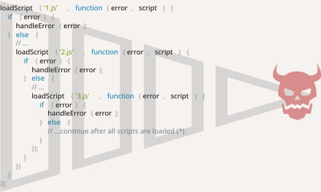

# Kirish: callbacklar

```warn header="Bu yerda misollarda brauzer metodlarini ishlatamiz"
Callbacklar, promiselar va boshqa abstrakt tushunchalardan foydalanishni ko'rsatish uchun biz ba'zi brauzer metodlarini ishlatamiz: xususan, skriptlarni yuklash va oddiy hujjat manipulatsiyalari.

Agar bu metodlar bilan tanish bo'lmasangiz va misollarda ulardan foydalanish chalkashlik tug'dirsa, darslikning [keyingi qismi](/document)dan bir nechta boblarni o'qishni xohlashingiz mumkin.

Biroq, baribir narsalarni aniq qilishga harakat qilamiz. Brauzer nuqtai nazaridan haqiqatan ham murakkab narsa bo'lmaydi.
```

JavaScript host muhitlari tomonidan *asinxron* harakatlarni rejalashtirish imkonini beruvchi ko'plab funktsiyalar taqdim etiladi. Boshqacha qilib aytganda, biz hozir boshlagan, lekin keyinroq tugaydigan harakatlar.

Masalan, bunday funktsiyalardan biri `setTimeout` funktsiyasidir.

Asinxron harakatlarning boshqa real dunyo misollari mavjud, masalan skriptlar va modullarni yuklash (biz ularni keyingi boblarda ko'rib chiqamiz).

Berilgan `src` bilan skriptni yuklaydigan `loadScript(src)` funktsiyasiga qarang:

```js
function loadScript(src) {
  // <script> tegini yaratadi va uni sahifaga qo'shadi
  // bu berilgan src bilan skriptni yuklashni boshlaydi va tugagach ishga tushiradi
  let script = document.createElement('script');
  script.src = src;
  document.head.append(script);
}
```

<<<<<<< HEAD
U hujjatga berilgan `src` bilan yangi, dinamik yaratilgan `<script src="…">` tegini kiritadi. Brauzer uni avtomatik ravishda yuklashni boshlaydi va tugagach bajaradi.
=======
It inserts into the document a new, dynamically created, tag `<script src="…">` with the given `src`. The browser automatically starts loading it and executes when complete.
>>>>>>> 725653fd99b19d42195e837ac3bb23c1784f8f6e

Biz bu funktsiyani shunday ishlatishimiz mumkin:

```js
// berilgan yo'ldagi skriptni yuklash va bajarish
loadScript('/my/script.js');
```

Skript "asinxron" bajariladi, chunki u hozir yuklashni boshlaydi, lekin funktsiya tugagandan keyin ishga tushadi.

Agar `loadScript(…)` ostida biron kod bo'lsa, u skript yuklash tugashini kutmaydi.

```js
loadScript('/my/script.js');
// loadScript ostidagi kod
// skript yuklash tugashini kutmaydi
// ...
```

Aytaylik, yangi skriptni u yuklanishi bilanoq ishlatishimiz kerak. U yangi funktsiyalarni e'lon qiladi va biz ularni ishga tushirishni xohlaymiz.

Lekin agar buni `loadScript(…)` chaqiruvidan keyin darhol qilsak, bu ishlamaydi:

```js
loadScript('/my/script.js'); // skriptda "function newFunction() {…}" mavjud

*!*
newFunction(); // bunday funktsiya yo'q!
*/!*
```

Tabiiyki, brauzer skriptni yuklashga vaqt topmagan bo'lishi mumkin. Hozircha `loadScript` funktsiyasi yuklash tugashini kuzatish usulini taqdim etmaydi. Skript yuklanadi va oxir-oqibat ishga tushadi, hammasi shu. Lekin biz bu qachon sodir bo'lishini bilishni xohlaymiz, o'sha skriptdagi yangi funktsiyalar va o'zgaruvchilardan foydalanish uchun.

Skript yuklanganida bajarilishi kerak bo'lgan ikkinchi argument sifatida `loadScript` ga `callback` funktsiyasini qo'shaylik:

```js
function loadScript(src, *!*callback*/!*) {
  let script = document.createElement('script');
  script.src = src;

*!*
  script.onload = () => callback(script);
*/!*

  document.head.append(script);
}
```

<<<<<<< HEAD
`onload` hodisasi <info:onload-onerror#loading-a-script> maqolasida tasvirlangan, u asosan skript yuklangandan va bajarilagandan keyin funktsiyani bajaradi.

Endi agar skriptdan yangi funktsiyalarni chaqirishni xohlasak, buni callbackda yozishimiz kerak:
=======
The `onload` event is described in the article <info:onload-onerror#loading-a-script>, it basically executes a function after the script is loaded and executed.

Now if we want to call new functions from the script, we should write that in the callback:
>>>>>>> 725653fd99b19d42195e837ac3bb23c1784f8f6e

```js
loadScript('/my/script.js', function() {
  // callback skript yuklanganidan keyin ishga tushadi
  newFunction(); // endi bu ishlaydi
  ...
});
```

Bu g'oya: ikkinchi argument funktsiya (odatda anonim) bo'lib, harakat tugallanganda ishga tushadi.

Mana haqiqiy skript bilan ishlaydigan misol:

```js run
function loadScript(src, callback) {
  let script = document.createElement('script');
  script.src = src;
  script.onload = () => callback(script);
  document.head.append(script);
}

*!*
loadScript('https://cdnjs.cloudflare.com/ajax/libs/lodash.js/3.2.0/lodash.js', script => {
<<<<<<< HEAD
  alert(`Ajoyib, ${script.src} skripti yuklandi`);
  alert( _ ); // _ yuklangan skriptda e'lon qilingan funktsiya
=======
  alert(`Cool, the script ${script.src} is loaded`);
  alert( _ ); // _ is a function declared in the loaded script
>>>>>>> 725653fd99b19d42195e837ac3bb23c1784f8f6e
});
*/!*
```

Bu asinxron dasturlashning "callback-asosidagi" uslubi deb ataladi. Biror narsani asinxron bajaradigan funktsiya `callback` argumentini taqdim etishi kerak, bu yerda biz tugagandan keyin ishga tushadigan funktsiyani joylashtiramiz.

Bu yerda biz buni `loadScript` da qildik, lekin albatta bu umumiy yondashuv.

## Callback ichida callback

Ikki skriptni ketma-ket qanday yuklashimiz mumkin: birinchi, keyin ikkinchisini undan keyin?

Tabiiy yechim ikkinchi `loadScript` chaqiruvini callback ichiga qo'yish bo'ladi:

```js
loadScript('/my/script.js', function(script) {

  alert(`Ajoyib, ${script.src} yuklandi, keling yana birini yuklaylik`);

*!*
  loadScript('/my/script2.js', function(script) {
    alert(`Ajoyib, ikkinchi skript yuklandi`);
  });
*/!*

});
```

Tashqi `loadScript` tugagandan keyin, callback ichki birini ishga tushiradi.

Agar yana bitta skript kerak bo'lsa...?

```js
loadScript('/my/script.js', function(script) {

  loadScript('/my/script2.js', function(script) {

*!*
    loadScript('/my/script3.js', function(script) {
      // ...barcha skriptlar yuklangandan keyin davom etish
    });
*/!*

  });

});
```

Shunday qilib, har bir yangi harakat callback ichida. Bu kam harakatlar uchun yaxshi, lekin ko'p uchun yaxshi emas, shuning uchun tez orada boshqa variantlarni ko'ramiz.

## Xatolarni hal qilish

Yuqoridagi misollarda biz xatolarni hisobga olmadik. Agar skript yuklash muvaffaqiyatsiz bo'lsa-chi? Bizning callbackimiz bunga javob bera olishi kerak.

Mana yuklash xatolarini kuzatadigan `loadScript` ning yaxshilangan versiyasi:

```js
function loadScript(src, callback) {
  let script = document.createElement('script');
  script.src = src;

*!*
  script.onload = () => callback(null, script);
  script.onerror = () => callback(new Error(`${src} uchun skript yuklash xatosi`));
*/!*

  document.head.append(script);
}
```

U muvaffaqiyatli yuklash uchun `callback(null, script)` ni, aks holda `callback(error)` ni chaqiradi.

Foydalanish:
```js
loadScript('/my/script.js', function(error, script) {
  if (error) {
    // xatoni hal qilish
  } else {
    // skript muvaffaqiyatli yuklandi
  }
});
```

Yana bir bor, `loadScript` uchun ishlatgan retsept aslida juda keng tarqalgan. Bu "error-first callback" uslubi deb ataladi.

Konventsiya:
1. `callback` ning birinchi argumenti agar xato yuz bersa, unga ajratilgan. Keyin `callback(err)` chaqiriladi.
2. Ikkinchi argument (va kerak bo'lsa keyingilari) muvaffaqiyatli natija uchun. Keyin `callback(null, result1, result2…)` chaqiriladi.

Shunday qilib bitta `callback` funktsiyasi ham xatolarni bildirish, ham natijalarni uzatish uchun ishlatiladi.

## Halokat piramidasi

<<<<<<< HEAD
Birinchi qarashda, bu asinxron kodlash uchun mumkin bo'lgan yondashuv ko'rinadi. Va haqiqatan ham shunday. Bir yoki ehtimol ikki ichki chaqiruv uchun yaxshi ko'rinadi.

Lekin bir-biridan keyin keladigan ko'plab asinxron harakatlar uchun bizda bunday kod bo'ladi:
=======
At first glance, it looks like a viable approach to asynchronous coding. And indeed it is. For one or maybe two nested calls it looks fine.

But for multiple asynchronous actions that follow one after another, we'll have code like this:
>>>>>>> 725653fd99b19d42195e837ac3bb23c1784f8f6e

```js
loadScript('1.js', function(error, script) {

  if (error) {
    handleError(error);
  } else {
    // ...
    loadScript('2.js', function(error, script) {
      if (error) {
        handleError(error);
      } else {
        // ...
        loadScript('3.js', function(error, script) {
          if (error) {
            handleError(error);
          } else {
  *!*
            // ...barcha skriptlar yuklangandan keyin davom etish (*)
  */!*
          }
        });

      }
    });
  }
});
```

<<<<<<< HEAD
Yuqoridagi kodda:
1. Biz `1.js` ni yuklaymiz, agar xato bo'lmasa...
2. Biz `2.js` ni yuklaymiz, agar xato bo'lmasa...
3. Biz `3.js` ni yuklaymiz, agar xato bo'lmasa -- boshqa narsa qilamiz `(*)`.
=======
In the code above:
1. We load `1.js`, then if there's no error...
2. We load `2.js`, then if there's no error...
3. We load `3.js`, then if there's no error -- do something else `(*)`.
>>>>>>> 725653fd99b19d42195e837ac3bb23c1784f8f6e

Chaqiruvlar ko'proq ichki bo'lgan sari, kod chuqurroq va tobora boshqarish qiyinroq bo'ladi, ayniqsa agar bizda `...` o'rniga ko'proq sikl, shartli ifodalar va boshqalarni o'z ichiga olgan haqiqiy kod bo'lsa.

Bu ba'zan "callback do'zax" yoki "halokat piramidasi" deb ataladi.

<!--
loadScript('1.js', function(error, script) {
  if (error) {
    handleError(error);
  } else {
    // ...
    loadScript('2.js', function(error, script) {
      if (error) {
        handleError(error);
      } else {
        // ...
        loadScript('3.js', function(error, script) {
          if (error) {
            handleError(error);
          } else {
            // ...
          }
        });
      }
    });
  }
});
-->



Ichma-ich chaqiruvlarning "piramidasi" har bir asinxron harakat bilan o'ngga o'sib boradi. Tez orada u nazoratdan chiqadi.

Shuning uchun bunday kodlash usuli unchalik yaxshi emas.

Har bir harakatni mustaqil funktsiya qilish orqali muammoni engillashtirishga harakat qilishimiz mumkin:

```js
loadScript('1.js', step1);

function step1(error, script) {
  if (error) {
    handleError(error);
  } else {
    // ...
    loadScript('2.js', step2);
  }
}

function step2(error, script) {
  if (error) {
    handleError(error);
  } else {
    // ...
    loadScript('3.js', step3);
  }
}

function step3(error, script) {
  if (error) {
    handleError(error);
  } else {
    // ...barcha skriptlar yuklangandan keyin davom etish (*)
  }
}
```

<<<<<<< HEAD
Ko'ryapsizmi? Bu bir xil narsani qiladi va endi chuqur ichki chaqiruvlar yo'q, chunki biz har bir harakatni alohida yuqori darajali funktsiya qildik.
=======
See? It does the same thing, and there's no deep nesting now because we made every action a separate top-level function.
>>>>>>> 725653fd99b19d42195e837ac3bb23c1784f8f6e

Bu ishlaydi, lekin kod yirtilib ketgan elektron jadval kabi ko'rinadi. Uni o'qish qiyin va siz ehtimol fark qilgansiz, o'qish paytida qismlar orasida ko'z bilan sakrash kerak. Bu noqulay, ayniqsa o'quvchi kod bilan tanish bo'lmasa va qayerga sakrashni bilmasa.

Bundan tashqari, `step*` deb nomlangan funktsiyalarning barchasi faqat bir marta ishlatiladi, ular faqat "halokat piramidasi"dan qochish uchun yaratilgan. Ularni harakat zanjiridan tashqarida hech kim qayta ishlatmaydi. Shuning uchun bu yerda biroz namespace ifloslanishi bor.

Bizda yaxshiroq narsa bo'lishini xohlaymiz.

<<<<<<< HEAD
Baxtga qarshi, bunday piramidalardan qochishning boshqa usullari ham bor. Eng yaxshi usullardan biri keyingi bobda tasvirlangan "promiselar"dan foydalanishdir.
=======
Luckily, there are other ways to avoid such pyramids. One of the best ways is to use "promises", described in the next chapter.
>>>>>>> 725653fd99b19d42195e837ac3bb23c1784f8f6e
