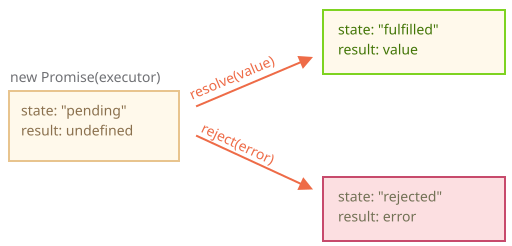

# Promise

Tasavvur qiling-a, siz top qo'shiqchisiz va muxlislar kechayu kunduz kelayotgan qo'shiqingizni so'rashyapti.

Biroz tinchlik olish uchun siz uni nashr qilinganda ularga yuborishga va'da berasiz. Siz muxlislaringizga ro'yxat berasiz. Ular o'zlarining email manzillarini to'ldirishlari mumkin, shunda qo'shiq mavjud bo'lganda, barcha obuna bo'lganlar darhol uni olishadi. Va hatto biror narsa juda noto'g'ri ketsa, aytaylik studiyada yong'in bo'lsa va siz qo'shiqni nashr qila olmasangiz ham, ularga xabar beriladi.

Hamma xursand: siz, chunki odamlar sizni endi bezovta qilmaydi, va muxlislar, chunki ular qo'shiqni o'tkazib yubormaydi.

Bu dasturlashda tez-tez uchratiladigan narsalar uchun hayotiy o'xshashlik:

1. Nimadir qiladigan va vaqt talab qiladigan "ishlab chiqaruvchi kod". Masalan, ma'lumotlarni tarmoq orqali yuklaydigan kod. Bu "qo'shiqchi".
2. "Ishlab chiqaruvchi kod"ning natijasini tayyor bo'lganda xohlaydigan "iste'mol qiluvchi kod". Ko'plab funktsiyalar bu natijaga muhtoj bo'lishi mumkin. Bular "muxlislar".
3. **Promise** - bu "ishlab chiqaruvchi kod" va "iste'mol qiluvchi kod"ni bog'laydigan maxsus JavaScript obyekti. Bizning o'xshashligimizda: bu "obuna ro'yxati". "Ishlab chiqaruvchi kod" va'da qilingan natijani ishlab chiqarish uchun qancha vaqt kerak bo'lsa, shuncha vaqt oladi va **promise** bu natijani tayyor bo'lganda barcha obuna bo'lgan kodlarga taqdim etadi.

O'xshashlik unchalik aniq emas, chunki JavaScript promise'lari oddiy obuna ro'yxatidan murakkabroq: ularda qo'shimcha xususiyatlar va cheklovlar bor. Lekin boshlash uchun yaxshi.

Promise obyekti uchun constructor sintaksisi:

```js
let promise = new Promise(function (resolve, reject) {
  // executor (ishlab chiqaruvchi kod)
});
```

`new Promise`ga uzatilgan funktsiya **executor** deb ataladi. `new Promise` yaratilganda, executor avtomatik ravishda ishlaydi. U oxir-oqibat natijani ishlab chiqarishi kerak bo'lgan ishlab chiqaruvchi kodini o'z ichiga oladi. Yuqoridagi o'xshashlikda: executor "qo'shiqchi".

Uning `resolve` va `reject` argumentlari JavaScript'ning o'zi tomonidan taqdim etilgan callback'lar. Bizning kodimiz faqat executor ichida.

Executor natijani olganda, tez bo'lsin yoki kech, muhim emas, u ushbu callback'lardan birini chaqirishi kerak:

- `resolve(value)` — agar ish muvaffaqiyatli tugatilgan bo'lsa, `value` natijasi bilan.
- `reject(error)` — agar xato yuz bergan bo'lsa, `error` xato obyekti.

Xulosa qilish uchun: executor avtomatik ravishda ishlaydi va ishni bajarishga harakat qiladi. Harakat tugaganda, muvaffaqiyatli bo'lsa `resolve`ni, xato bo'lsa `reject`ni chaqiradi.

`new Promise` constructor tomonidan qaytarilgan `promise` obyekti quyidagi ichki property'larga ega:

<<<<<<< HEAD
- `state` — dastlab `"pending"`, keyin `resolve` chaqirilganda `"fulfilled"`ga yoki `reject` chaqirilganda `"rejected"`ga o'zgaradi.
- `result` — dastlab `undefined`, keyin `resolve(value)` chaqirilganda `value`ga yoki `reject(error)` chaqirilganda `error`ga o'zgaradi.
=======
- `state` — initially `"pending"`, then changes to either `"fulfilled"` when `resolve` is called or `"rejected"` when `reject` is called.
- `result` — initially `undefined`, then changes to `value` when `resolve(value)` is called or `error` when `reject(error)` is called.
>>>>>>> 725653fd99b19d42195e837ac3bb23c1784f8f6e

Shunday qilib executor oxir-oqibat `promise`ni quyidagi holatlardan biriga o'tkazadi:



Keyinroq biz "muxlislar" qanday qilib bu o'zgarishlarga obuna bo'lishlarini ko'ramiz.

<<<<<<< HEAD
Mana promise constructor va vaqt talab qiladigan "ishlab chiqaruvchi kod" bilan oddiy executor funktsiyaning misoli (`setTimeout` orqali):
=======
Here's an example of a promise constructor and a simple executor function with  "producing code" that takes time (via `setTimeout`):

```js
let promise = new Promise(function(resolve, reject) {
  // the function is executed automatically when the promise is constructed

  // after 1 second signal that the job is done with the result "done"
  setTimeout(() => *!*resolve("done")*/!*, 1000);
});
```

We can see two things by running the code above:

1. The executor is called automatically and immediately (by `new Promise`).
2. The executor receives two arguments: `resolve` and `reject`. These functions are pre-defined by the JavaScript engine, so we don't need to create them. We should only call one of them when ready.

    After one second of "processing", the executor calls `resolve("done")` to produce the result. This changes the state of the `promise` object:

    

That was an example of a successful job completion, a "fulfilled promise".

And now an example of the executor rejecting the promise with an error:
>>>>>>> 725653fd99b19d42195e837ac3bb23c1784f8f6e

```js
let promise = new Promise(function(resolve, reject) {
  // funktsiya promise yaratilganda avtomatik ravishda bajariladi

  // 1 soniyadan keyin ish "done" natijasi bilan tugaganligini bildirish
  setTimeout(() => resolve("done"), 1000);
});
```

Yuqoridagi kodni ishga tushirish orqali ikkita narsani ko'rishimiz mumkin:

1. Executor avtomatik va darhol chaqiriladi (`new Promise` tomonidan).
2. Executor ikkita argument oladi: `resolve` va `reject`. Bu funktsiyalar JavaScript mexanizmi tomonidan oldindan belgilangan, shuning uchun biz ularni yaratishimiz shart emas. Tayyor bo'lganda ulardan faqat birini chaqirishimiz kerak.

   Bir soniyalik "qayta ishlash"dan keyin executor natijani ishlab chiqarish uchun `resolve("done")`ni chaqiradi. Bu `promise` obyektining holatini o'zgartiradi:

   

Bu muvaffaqiyatli ish tugallash, "bajarilgan promise"ning misoli edi.

Endi executor promise'ni xato bilan rad etish misoli:

```js
let promise = new Promise(function(resolve, reject) {
  // 1 soniyadan keyin ish xato bilan tugaganligini bildirish
  setTimeout(() => reject(new Error("Whoops!")), 1000);
});
```

`reject(...)`ga chaqiruv promise obyektini `"rejected"` holatiga o'tkazadi:


Xulosa qilish uchun, executor ish bajarishi kerak (odatda vaqt talab qiladigan narsa) va keyin tegishli promise obyektning holatini o'zgartirish uchun `resolve` yoki `reject`ni chaqirishi kerak.

Resolved yoki rejected promise **"settled"** deb ataladi, dastlabki `"pending"` promise'dan farqli o'laroq.

````smart header="Faqat bitta natija yoki xato bo'lishi mumkin"
Executor faqat bitta `resolve` yoki bitta `reject`ni chaqirishi kerak. Har qanday holat o'zgarishi yakuniy.

`resolve` va `reject`ning barcha keyingi chaqiruvlari e'tiborga olinmaydi:

```js
let promise = new Promise(function(resolve, reject) {
*!*
  resolve("done");
*/!*

  reject(new Error("…")); // e'tiborga olinmaydi
  setTimeout(() => resolve("…")); // e'tiborga olinmaydi
});
```

G'oya shundaki, executor tomonidan bajarilgan ish faqat bitta natija yoki xatoga ega bo'lishi mumkin.

Shuningdek, `resolve`/`reject` faqat bitta argumentni kutadi (yoki hech birini) va qo'shimcha argumentlarni e'tiborsiz qoldiradi.
````

```smart header="`Error` obyektlari bilan rad etish"
Biror narsa noto'g'ri ketganda, executor `reject`ni chaqirishi kerak. Bu har qanday turdagi argument bilan qilinishi mumkin (`resolve` kabi). Lekin `Error` obyektlarini (yoki `Error`dan meros olgan obyektlarni) ishlatish tavsiya etiladi. Buning sababi tez orada aniq bo'ladi.
```

````smart header="Darhol `resolve`/`reject` chaqirish"
Amalda executor odatda biror narsani asinxron qiladi va bir muncha vaqtdan keyin `resolve`/`reject`ni chaqiradi, lekin bu majburiy emas. Biz `resolve` yoki `reject`ni darhol ham chaqirishimiz mumkin:

```js
let promise = new Promise(function(resolve, reject) {
  // ishni bajarish uchun vaqt sarflamaydi
  resolve(123); // darhol natijani berish: 123
});
```

Masalan, bu ishni boshlashga harakat qilganimizda, lekin hamma narsa allaqachon tugallangan va keshlangan bo'lsa sodir bo'lishi mumkin.

Bu yaxshi. Biz darhol resolved promise'ga ega bo'lamiz.
````

```smart header="`state` va `result` ichki property'lar"
Promise obyektining `state` va `result` property'lari ichki. Biz ularga to'g'ridan-to'g'ri kira olmaymiz. Buning uchun `.then`/`.catch`/`.finally` metodlaridan foydalanishimiz mumkin. Ular quyida tasvirlangan.
```

<<<<<<< HEAD
## Iste'molchilar: then, catch

Promise obyekti executor ("ishlab chiqaruvchi kod" yoki "qo'shiqchi") va natija yoki xatoni qabul qiladigan iste'mol qiluvchi funktsiyalar ("muxlislar") o'rtasidagi bog'lanish vazifasini bajaradi. Iste'mol qiluvchi funktsiyalar `.then` va `.catch` metodlari yordamida ro'yxatga olinishi (obuna bo'lishi) mumkin.
=======
## Consumers: then, catch

A Promise object serves as a link between the executor (the "producing code" or "singer") and the consuming functions (the "fans"), which will receive the result or error. Consuming functions can be registered (subscribed) using the methods `.then` and `.catch`.
>>>>>>> 725653fd99b19d42195e837ac3bb23c1784f8f6e

### then

Eng muhim, asosiy biri `.then`dir.

Sintaksis:

```js
promise.then(
  function(result) { /* muvaffaqiyatli natijani hal qilish */ },
  function(error) { /* xatoni hal qilish */ }
);
```

<<<<<<< HEAD
`.then`ning birinchi argumenti promise resolved bo'lganda ishlaydigan va natijani qabul qiladigan funktsiya.

`.then`ning ikkinchi argumenti promise rejected bo'lganda ishlaydigan va xatoni qabul qiladigan funktsiya.
=======
The first argument of `.then` is a function that runs when the promise is resolved and receives the result.

The second argument of `.then` is a function that runs when the promise is rejected and receives the error.
>>>>>>> 725653fd99b19d42195e837ac3bb23c1784f8f6e

Masalan, mana muvaffaqiyatli resolved promise'ga javob:

```js
let promise = new Promise(function(resolve, reject) {
  setTimeout(() => resolve("done!"), 1000);
});

// resolve .then dagi birinchi funktsiyani ishga tushiradi
promise.then(
  result => alert(result), // 1 soniyadan keyin "done!" ni ko'rsatadi
  error => alert(error) // ishlamaydi
);
```

Birinchi funktsiya bajarildi.

Va rejection holatida, ikkinchisi:

```js
let promise = new Promise(function(resolve, reject) {
  setTimeout(() => reject(new Error("Whoops!")), 1000);
});

// reject .then dagi ikkinchi funktsiyani ishga tushiradi
promise.then(
  result => alert(result), // ishlamaydi
  error => alert(error) // 1 soniyadan keyin "Error: Whoops!" ni ko'rsatadi
);
```

Agar biz faqat muvaffaqiyatli tugashlar bilan qiziqsak, u holda `.then`ga faqat bitta funktsiya argumentini taqdim etishimiz mumkin:

```js
let promise = new Promise(resolve => {
  setTimeout(() => resolve("done!"), 1000);
});

promise.then(alert); // 1 soniyadan keyin "done!" ni ko'rsatadi
```

### catch

Agar biz faqat xatolar bilan qiziqsak, u holda birinchi argument sifatida `null`dan foydalanishimiz mumkin: `.then(null, errorHandlingFunction)`. Yoki `.catch(errorHandlingFunction)`dan foydalanishimiz mumkin, bu aynan bir xil:

```js
let promise = new Promise((resolve, reject) => {
  setTimeout(() => reject(new Error("Whoops!")), 1000);
});

// .catch(f) promise.then(null, f) bilan bir xil
promise.catch(alert); // 1 soniyadan keyin "Error: Whoops!" ni ko'rsatadi
```

`.catch(f)` chaqiruvi `.then(null, f)`ning to'liq analogi, bu faqat qisqartma.

<<<<<<< HEAD
## Tozalash: finally
=======
## Cleanup: finally
>>>>>>> 725653fd99b19d42195e837ac3bb23c1784f8f6e

Oddiy `try {...} catch {...}`da `finally` bo'limi bo'lgani kabi, promise'larda ham `finally` bor.

<<<<<<< HEAD
`.finally(f)` chaqiruvi `.then(f, f)`ga o'xshash ma'noda, ya'ni `f` har doim ishlaydi, promise bajarilganda: resolved yoki rejected bo'lsin.

`finally`ning g'oyasi oldingi amallar tugagandan keyin tozalash/yakunlash bajarish uchun handler o'rnatishdir.

Masalan, loading indikatorlarini to'xtatish, endi kerak bo'lmagan ulanishlarni yopish va boshqalar.

Buni ziyofat yakunlovchisi sifatida tasavvur qiling. Ziyofat yaxshi yoki yomon bo'lishidan, qancha do'stlar ishtirok etganidan qat'i nazar, biz baribir undan keyin tozalash qilishimiz kerak (yoki hech bo'lmaganda qilishimiz kerak).

Kod shunday ko'rinishi mumkin:

```js
new Promise((resolve, reject) => {
  /* vaqt talab qiladigan biror narsa qiling, keyin resolve yoki reject ni chaqiring */
})
  // promise bajarilganda ishlaydi, muvaffaqiyatli yoki yo'qligi muhim emas
  .finally(() => loading indikatorini to'xtatish)
  // shuning uchun loading indikatori har doim davom etishdan oldin to'xtatiladi
  .then(result => natijani ko'rsatish, err => xatoni ko'rsatish)
```

E'tibor bering, `finally(f)` aynan `then(f,f)`ning taxallusi emas.

Muhim farqlar bor:

1. `finally` handler argumentlarga ega emas. `finally`da biz promise muvaffaqiyatli yoki yo'qligini bilmaymiz. Bu normal, chunki bizning vazifamiz odatda "umumiy" yakunlash tartib-qoidalarini bajarishdir.

   Yuqoridagi misolga qarang: ko'rib turganingizdek, `finally` handler argumentlarga ega emas va promise natijasi keyingi handler tomonidan hal qilinadi.

2. `finally` handler natija yoki xatoni keyingi mos handlerga "o'tkazadi".

   Masalan, bu yerda natija `finally` orqali `then`ga o'tkaziladi:

   ```js
   new Promise((resolve, reject) => {
     setTimeout(() => resolve("value"), 2000);
   })
     .finally(() => alert("Promise tayyor")) // birinchi bo'lib ishga tushadi
     .then(result => alert(result)); // <-- .then "value" ni ko'rsatadi
   ```

   Ko'rib turganingizdek, birinchi promise tomonidan qaytarilgan `value` `finally` orqali keyingi `then`ga o'tkaziladi.

   Bu juda qulay, chunki `finally` promise natijasini qayta ishlash uchun mo'ljallanmagan. Aytilganidek, bu natija qanday bo'lishidan qat'i nazar, umumiy tozalash qilish joyi.
=======
The call `.finally(f)` is similar to `.then(f, f)` in the sense that `f` runs always, when the promise is settled: be it resolve or reject.

The idea of `finally` is to set up a handler for performing cleanup/finalizing after the previous operations are complete.

E.g. stopping loading indicators, closing no longer needed connections, etc.

Think of it as a party finisher. Irresepective of whether a party was good or bad, how many friends were in it, we still need (or at least should) do a cleanup after it.

The code may look like this:

```js
new Promise((resolve, reject) => {
  /* do something that takes time, and then call resolve or maybe reject */
})
*!*
  // runs when the promise is settled, doesn't matter successfully or not
  .finally(() => stop loading indicator)
  // so the loading indicator is always stopped before we go on
*/!*
  .then(result => show result, err => show error)
```

Please note that `finally(f)` isn't exactly an alias of `then(f,f)` though.

There are important differences:

1. A `finally` handler has no arguments. In `finally` we don't know whether the promise is successful or not. That's all right, as our task is usually to perform "general" finalizing procedures.

    Please take a look at the example above: as you can see, the `finally` handler has no arguments, and the promise outcome is handled by the next handler.
2. A `finally` handler "passes through" the result or error to the next suitable handler.

    For instance, here the result is passed through `finally` to `then`:

    ```js run
    new Promise((resolve, reject) => {
      setTimeout(() => resolve("value"), 2000);
    })
      .finally(() => alert("Promise ready")) // triggers first
      .then(result => alert(result)); // <-- .then shows "value"
    ```

    As you can see, the `value` returned by the first promise is passed through `finally` to the next `then`.

    That's very convenient, because `finally` is not meant to process a promise result. As said, it's a place to do generic cleanup, no matter what the outcome was.

    And here's an example of an error, for us to see how it's passed through `finally` to `catch`:

    ```js run
    new Promise((resolve, reject) => {
      throw new Error("error");
    })
      .finally(() => alert("Promise ready")) // triggers first
      .catch(err => alert(err));  // <-- .catch shows the error
    ```

3. A `finally` handler also shouldn't return anything. If it does, the returned value is silently ignored.

    The only exception to this rule is when a `finally` handler throws an error. Then this error goes to the next handler, instead of any previous outcome.

To summarize:

- A `finally` handler doesn't get the outcome of the previous handler (it has no arguments). This outcome is passed through instead, to the next suitable handler.
- If a `finally` handler returns something, it's ignored.
- When `finally` throws an error, then the execution goes to the nearest error handler.

These features are helpful and make things work just the right way if we use `finally` how it's supposed to be used: for generic cleanup procedures.

````smart header="We can attach handlers to settled promises"
If a promise is pending, `.then/catch/finally` handlers wait for its outcome.

Sometimes, it might be that a promise is already settled when we add a handler to it.

In such case, these handlers just run immediately:
>>>>>>> 725653fd99b19d42195e837ac3bb23c1784f8f6e

   Va mana xato misoli, uni `finally` orqali `catch`ga qanday o'tkazilishini ko'rish uchun:

   ```js
   new Promise((resolve, reject) => {
     throw new Error("error");
   })
     .finally(() => alert("Promise tayyor")) // birinchi bo'lib ishga tushadi
     .catch(err => alert(err));  // <-- .catch xatoni ko'rsatadi
   ```

3. `finally` handler ham hech narsa qaytarmasligi kerak. Agar qaytarsa, qaytarilgan qiymat jimgina e'tiborsiz qolinadi.

   Bu qoidaning yagona istisnosi `finally` handler xato tashlaganda. Keyin bu xato oldingi natija o'rniga keyingi handlerga boradi.

Xulosa qilish uchun:

- `finally` handler oldingi handlerning natijasini olmaydi (argumentlari yo'q). Bu natija o'rniga keyingi mos handlerga o'tkaziladi.
- Agar `finally` handler biror narsa qaytarsa, u e'tiborsiz qolinadi.
- `finally` xato tashlaganda, bajarilish eng yaqin error handlerga boradi.

Bu xususiyatlar foydali va agar biz `finally`ni mo'ljallangan tarzda ishlatsak, ya'ni umumiy tozalash tartib-qoidalari uchun, narsalarni to'g'ri ishlashiga yordam beradi.

````smart header="Biz resolved promise'larga handlerlarni biriktira olamiz"
Agar promise kutilayotgan bo'lsa (pending), `.then/catch/finally` handlerlari uning natijasini kutadi.

Ba'zan promise'ga handler qo'shganimizda u allaqachon resolved bo'lgan bo'lishi mumkin.

Bunday holatda, bu handlerlar shunchaki darhol ishlaydi:

```js
// promise yaratilishi bilanoq darhol resolved bo'ladi
let promise = new Promise(resolve => resolve("done!"));

promise.then(alert); // done! (hozir ko'rinadi)
```

E'tibor bering, bu promise'larni haqiqiy hayotdagi "obuna ro'yxati" stsenariyasidan kuchliroq qiladi. Agar qo'shiqchi allaqachon qo'shiqni chiqargan bo'lsa va keyin kimdir obuna ro'yxatiga ro'yxatdan o'tsa, ular bu qo'shiqni olmaydi. Haqiqiy hayotda obuna voqea oldidan amalga oshirilishi kerak.

Promise'lar yanada moslashuvchan. Biz istalgan vaqtda handlerlarni qo'shishimiz mumkin: agar natija allaqachon mavjud bo'lsa, ular shunchaki bajariladi.
````

<<<<<<< HEAD
## Misol: loadScript [#loadscript]

Keyinchalik, promise'lar asinxron kodni yozishda qanday yordam berishining ko'proq amaliy misollarini ko'raylik.

Bizda oldingi bobdan skript yuklash uchun `loadScript` funktsiyasi bor.
=======
## Example: loadScript [#loadscript]

Next, let's see more practical examples of how promises can help us write asynchronous code.

We've got the `loadScript` function for loading a script from the previous chapter.
>>>>>>> 725653fd99b19d42195e837ac3bb23c1784f8f6e

Mana callback-asosidagi variant, uni esga olish uchun:

```js
function loadScript(src, callback) {
  let script = document.createElement("script");
  script.src = src;

  script.onload = () => callback(null, script);
  script.onerror = () =>
    callback(new Error(`${src} uchun skript yuklash xatosi`));

  document.head.append(script);
}
```

Uni Promise'lar yordamida qayta yozaylik.

Yangi `loadScript` funktsiyasi callback talab qilmaydi. Buning o'rniga, u yuklash tugallanganda resolved bo'ladigan Promise obyektini yaratadi va qaytaradi. Tashqi kod unga `.then` yordamida handlerlar (obuna funktsiyalari) qo'shishi mumkin:

```js
function loadScript(src) {
  return new Promise(function (resolve, reject) {
    let script = document.createElement("script");
    script.src = src;

    script.onload = () => resolve(script);
    script.onerror = () =>
      reject(new Error(`${src} uchun skript yuklash xatosi`));

    document.head.append(script);
  });
}
```

Foydalanish:

```js
let promise = loadScript(
  "https://cdnjs.cloudflare.com/ajax/libs/lodash.js/4.17.11/lodash.js"
);

promise.then(
  (script) => alert(`${script.src} yuklandi!`),
  (error) => alert(`Xato: ${error.message}`)
);

promise.then((script) => alert("Boshqa handler..."));
```

Biz darhol callback-asosidagi naqshdan bir nechta afzalliklarni ko'rishimiz mumkin:

| Promise'lar | Callback'lar |
|-------------|--------------|
| Promise'lar bizga narsalarni tabiiy tartibda qilish imkonini beradi. Birinchidan, biz `loadScript(script)`ni ishga tushiramiz va `.then` natija bilan nima qilishni yozamiz. | Biz `loadScript(script, callback)`ni chaqirishda `callback` funktsiyasiga ega bo'lishimiz kerak. Boshqacha qilib aytganda, `loadScript` chaqirilgunga _qadar_ natija bilan nima qilishni bilishimiz kerak. |
| Biz Promise'da `.then`ni xohlaganimizcha ko'p marta chaqirishimiz mumkin. Har safar biz yangi "muxlis", yangi obuna funktsiyasini "obuna ro'yxati"ga qo'shyapmiz. Bu haqida ko'proq keyingi bobda: [Promise Chaining](info:promise-chaining). | Faqat bitta callback bo'lishi mumkin. |

Shunday qilib promise'lar bizga yaxshiroq kod oqimi va moslashuvchanlik beradi. Lekin yana ko'p narsa bor. Buni keyingi boblarda ko'ramiz.