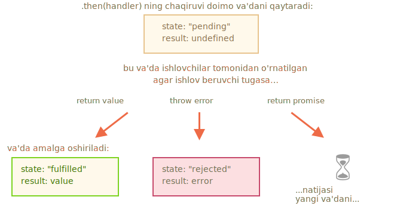

# Va'dalar zanjiri

<info:callbacks> bobida aytib o'tilgan muammoga qaytaylik: bizda birin-ketin bajariladigan asinxron vazifalar ketma-ketligi mavjud. Masalan, skriptlarni yuklash. Qanday qilib biz uni yaxshi kodlashimiz mumkin?

Buning uchun va'dalar bir nechta retseptlarni taqdim etadi.

Ushbu bobda biz va'da zanjirini yoritamiz.

Bu shunday ko'rinadi:

```js run
new Promise(function(resolve, reject) {

  setTimeout(() => resolve(1), 1000); // (*)

}).then(function(result) { // (**)

  alert(result); // 1
  return result * 2;

}).then(function(result) { // (***)

  alert(result); // 2
  return result * 2;

}).then(function(result) {

  alert(result); // 4
  return result * 2;

});
```

G'oya shundan iboratki, natija `.then` ishlovchilar zanjiri orqali o'tadi.

Mana oqim:
1. Dastlabki va'da 1 soniyada hal qilinadi `(*)`,
2. Keyin `.then` ishlov beruvchisi `(**)` chaqiriladi.
3. Qaytgan qiymat keyingi `.then` ishlov beruvchiga `(***)` uzatiladi
4. ...va hokazo.

Natijada ishlovchilar zanjiri bo'ylab uzatilganda biz `alert` chaqiruvlari ketma-ketligini ko'rishimiz mumkin: `1` -> `2` -> `4`.


Hammasi ishlaydi, chunki `promise.then` degan chaqiriq va'dani qaytaradi, shunda biz keyingi `.then` ni chaqira olamiz.

Qayta ishlovchi qiymatni qaytarganda, bu va'daning natijasi bo'ladi, shuning uchun keyingi `.then` u bilan chaqiriladi.

Ushbu so'zlarni aniqroq qilish uchun, mana zanjirning boshlanishi:

```js run
new Promise(function(resolve, reject) {

  setTimeout(() => resolve(1), 1000);

}).then(function(result) {

  alert(result);
  return result * 2; // <-- (1)

}) // <-- (2)
// .then…
```

`.then` tomonidan qaytarilgan qiymat va'da, shuning uchun biz `(2)` da yana bir `.then` qo'sha olamiz. Qiymat `(1)` ga qaytarilganda, bu va'da hal qilinadi, shuning uchun keyingi ishlov beruvchi qiymat bilan ishlaydi.

**Klassik yangilar xatosi: texnik jihatdan biz bitta va'daga ko'p `.then` qo'sha olamiz. Bu zanjir emas.**

Masalan:
```js run
let promise = new Promise(function(resolve, reject) {
  setTimeout(() => resolve(1), 1000);
});

promise.then(function(result) {
  alert(result); // 1
  return result * 2;
});

promise.then(function(result) {
  alert(result); // 1
  return result * 2;
});

promise.then(function(result) {
  alert(result); // 1
  return result * 2;
});
```

Bu yerda qilgan narsamiz bu bitta va'daga bir nechta ishlovchilar qo'yganimiz. Ular natijani bir-biriga yetkazishmaydi, aksincha uni mustaqil ravishda qayta ishlashadi.

Mana rasm (yuqoridagi zanjir bilan taqqoslang):


Barchasi `.then`, bitta va'da bo'yicha bir xil natijaga erishiladi - bu va'da natijasi. Shunday qilib, yuqoridagi kodda `alert` bir xil bo'ladi: `1`.

Amalda biz kamdan-kam hollarda bitta va'da uchun bir nechta ishlov beruvchiga muhtojmiz. Zanjirlash juda tez-tez ishlatiladi.

## Va'dalarni qaytarish

Odatda, `.then` ishlov beruvchisi tomonidan qaytarilgan qiymat darhol keyingi ishlov beruvchiga uzatiladi. Ammo istisno mavjud.

Agar qaytarib berilgan qiymat va'da bo'lsa, unda keyingi ijro to'xtaguncha to'xtatiladi. Shundan so'ng, ushbu va'daning natijasi keyingi `.then` ishlov beruvchiga beriladi.

Masalan:

```js run
new Promise(function(resolve, reject) {

  setTimeout(() => resolve(1), 1000);

}).then(function(result) {

  alert(result); // 1

*!*
  return new Promise((resolve, reject) => { // (*)
    setTimeout(() => resolve(result * 2), 1000);
  });
*/!*

}).then(function(result) { // (**)

  alert(result); // 2

  return new Promise((resolve, reject) => {
    setTimeout(() => resolve(result * 2), 1000);
  });

}).then(function(result) {

  alert(result); // 4

});
```

Bu yerda birinchi `.then` `1` `(*)` satrida `new Promise(…)` ni qaytaradi. Bir soniyadan so'ng u hal bo'ladi va natija (`resolve` argumenti, bu yerda `result*2`) `(**)` satridagi ikkinchi `.then` ishlov beruvchiga uzatiladi. Bu `2` ni ko'rsatadi va xuddi shu narsani qiladi.

Shunday qilib, chiqish yana 1 -> 2 -> 4 ni tashkil qiladi, ammo endi `alert` chaqiruvlari o'rtasida 1 soniya kechikish mavjud.

Va'dalarni qaytarish bizga asinxron harakatlar zanjirlarini yaratishga imkon beradi.

## Misol: loadScript

Skriptlarni navbatma-navbat yuklash uchun ushbu funktsiyani `loadScript` bilan ishlatamiz:

```js run
loadScript("/article/promise-chaining/one.js")
  .then(function(script) {
    return loadScript("/article/promise-chaining/two.js");
  })
  .then(function(script) {
    return loadScript("/article/promise-chaining/three.js");
  })
  .then(function(script) {
    // skriptlarda e'lon qilingan funktsiyalardan foydalaning
    // haqiqatan ham yuklanganligini ko'rsatish uchun
    one();
    two();
    three();
  });
```

Ushbu kod o'q funktsiyalari bilan biroz qisqartirilishi mumkin:

```js run
loadScript("/article/promise-chaining/one.js")
  .then(script => loadScript("/article/promise-chaining/two.js"))
  .then(script => loadScript("/article/promise-chaining/three.js"))
  .then(script => {
    // skriptlar yuklangan, biz u erda e'lon qilingan funktsiyalardan foydalanishimiz mumkin
    one();
    two();
    three();
  });
```


Bu yerda har bir `loadScript` chaqiruvi va'da qaytaradi va keyingi `.then` hal bo'lganda ishlaydi. So'ng u keyingi skriptni yuklashni boshlaydi. Shunday qilib, skriptlar birin-ketin yuklanadi.

Biz zanjirga ko'proq asinxron harakatlarni qo'shishimiz mumkin. Iltimos, unutmangki, kod hali ham "tekis" bo'lib, u o'ngga emas, pastga qarab o'sadi. "Halokat piramidasi" ning alomatlari yo'q.

Iltimos, shuni e'tiborga olingki, texnik jihatdan biz har bir `loadScript` ga to'g'ridan-to'g'ri `.then` qo'sha olamiz:

```js run
loadScript("/article/promise-chaining/one.js").then(script1 => {
  loadScript("/article/promise-chaining/two.js").then(script2 => {
    loadScript("/article/promise-chaining/three.js").then(script3 => {
      // bu funktsiya script1, script2 va script3 o'zgaruvchanlarga kirish huquqiga ega
      one();
      two();
      three();
    });
  });
});
```

Ushbu kod ham xuddi shunday: 3 ta skriptni ketma-ket yuklaydi. Ammo u "o'ng tomonga o'sadi". Shunday qilib, biz chaqiruvlarni qaytarish bilan bir xil muammolarga duch kelamiz.

Va'dalardan foydalanishni boshlagan odamlar ba'zida zanjirlash haqida bilishmaydi, shuning uchun ular shunday yozadilar. Odatda, zanjirlash afzaldir.

Ba'zan to'g'ridan-to'g'ri `.then` yozish yaxshi bo'ladi, chunki ichki funktsiya tashqi doiraga kirish huquqiga ega. Yuqoridagi misolda eng uyali qayta chaqirish `skript1`, `skript2`, `skript3` barcha o'zgaruvchanlariga kirish huquqiga ega. Ammo bu qoidadan ko'ra istisno.


````smart header="Thenables"
Aniqroq qilib aytganda, `.then` tasodifiy "thenable" obyektni qaytarishi mumkin va unga va'da kabi munosabatda bo'lishadi.

"Thenable" obyekt `.then` usuli bo'lgan har qanday obyekt.

Ushbu g'oya shundan iboratki, uchinchi tomon kutubxonalari o'zlariga tegishli "va'dalarga mos" obyektlarni amalga oshirishi mumkin. Ular kengaytirilgan usullar to'plamiga ega bo'lishi mumkin, shuningdek, mahalliy va'dalarga mos kelishi mumkin, chunki ular `.then` ni amalga oshiradilar.

Thenable obyektga misol:

```js run
class Thenable {
  constructor(num) {
    this.num = num;
  }
  then(resolve, reject) {
    alert(resolve); // function() { native code }
    // resolve with this.num*2 after the 1 second
    setTimeout(() => resolve(this.num * 2), 1000); // (**)
  }
}

new Promise(resolve => resolve(1))
  .then(result => {
*!*
    return new Thenable(result); // (*)
*/!*
  })
  .then(alert); // 1000ms dan keyin 2 ni ko'rsatadi
```

JavaScript `.then` `(*)` satridagi `.then` ishlov beruvchisi tomonidan qaytarilgan obyektni tekshiradi: agar u `then` deb nomlanadigan usulga ega bo'lsa, u holda bu tabiiy funktsiyalarni taqdim etadigan ushbu usulni `resolve`, `reject` argument sifatida chaqiradi (ijrochiga o'xshash) va ulardan biri chaqirilguncha kutadi. Yuqoridagi misolda `resolve(2)` 1 soniyadan so'ng chaqiriladi `(**)`. Keyin natija zanjirning pastki qismiga uzatiladi.

Ushbu xususiyat `Promise` dan meros olmasdan, moslashtirilgan moslamalarni va'da zanjirlari bilan birlashtirishga imkon beradi.
````


## Kattaroq misol: fetch

Frontend dasturlash va'dalari ko'pincha tarmoq so'rovlari uchun ishlatiladi. Keling, buning kengaytirilgan namunasini ko'rib chiqaylik.

Uzoq serverdan foydalanuvchi haqidagi ma'lumotlarni yuklash uchun [fetch](mdn:api/WindowOrWorkerGlobalScope/fetch) usulidan foydalanamiz. Usul juda murakkab, ko'plab ixtiyoriy parametrlarga ega, ammo asosiy foydalanish juda oddiy:

```js
let promise = fetch(url);
```

Bu `url` ga tarmoq so'rovini yuboradi va va'da qaytaradi. Masofaviy server sarlavhalar bilan javob berganida, va *to'liq javob yuklab olinmasdan oldin* va'da `response` obyekti bilan hal qilinadi.

To'liq javobni o'qish uchun biz `response.text()` usulini chaqirishimiz kerak: bu to'liq matnni uzoq serverdan yuklab olganda va natijada ushbu matn bilan hal qilinadigan va'dani qaytaradi.

Quyidagi kod `user.json` ga so'rov yuboradi va uning matnini serverdan yuklaydi:

```js run
fetch('/article/promise-chaining/user.json')
  // .then masofaviy server javob berganida quyida ishlaydi
  .then(function(response) {
    // response.text() javobning to'liq matni bilan hal qilinadigan yangi va'dani qaytaradi
    // uni yuklab olishni tugatgandan so'ng
    return response.text();
  })
  .then(function(text) {
    // ...va bu erda masofaviy faylning mazmuni
    alert(text); // {"name": "iliakan", isAdmin: true}
  });
```

Masofaviy ma'lumotlarni o'qiydigan va ularni JSON sifatida tahlil qiladigan `response.json()` usuli ham mavjud. Bizning holatda bu yanada qulayroq, shuning uchun unga o'taylik.

Qisqartirish uchun biz o'q funktsiyalaridan foydalanamiz:

```js run
// yuqoridagi kabi, ammo response.json() masofaviy tarkibni JSON sifatida ajratadi
fetch('/article/promise-chaining/user.json')
  .then(response => response.json())
  .then(user => alert(user.name)); // iliakan, got user name
```

Endi yuklangan foydalanuvchi bilan nimadir qilaylik.

Masalan, github-ga yana bir so'rov yuborishimiz, foydalanuvchi profilini yuklashimiz va avatarni ko'rsatishimiz mumkin:

```js run
// User.json uchun so'rov yuboring
fetch('/article/promise-chaining/user.json')
  // Json sifatida yuklang
  .then(response => response.json())
  // Github-ga so'rov yuboring
  .then(user => fetch(`https://api.github.com/users/${user.name}`))
  // Javobni json sifatida yuklang
  .then(response => response.json())
  // Avatar rasmini ko'rsating (githubUser.avatar_url) 3 soniya davomida (balki uni jonlantirish mumkin)
  .then(githubUser => {
    let img = document.createElement('img');
    img.src = githubUser.avatar_url;
    img.className = "promise-avatar-example";
    document.body.append(img);

    setTimeout(() => img.remove(), 3000); // (*)
  });
```

Kod ishlaydi, tafsilotlar haqidagi sharhlarni ko'ring, lekin u o'zi tavsiflovchi bo'lishi kerak. Garchi unda potentsial muammo mavjud bo'lsa ham, va'da ishlatishni boshlaganlar uchun odatiy xato.

`(*)` satriga qarang: avatar ko'rsatilgandan so'ng va olib tashlanganidan *keyin* qanday qilib biron bir narsa qilishimiz mumkin? Masalan, biz ushbu foydalanuvchini yoki boshqa biron bir narsani tahrirlash uchun shaklni ko'rsatmoqchimiz. Hozircha iloj yo'q.

Zanjirni uzaytiradigan qilish uchun, biz avatarni ko'rsatishni tugatgandan so'ng hal qiladigan va'dani qaytarishimiz kerak.

Shunga o'xshash:

```js run
fetch('/article/promise-chaining/user.json')
  .then(response => response.json())
  .then(user => fetch(`https://api.github.com/users/${user.name}`))
  .then(response => response.json())
*!*
  .then(githubUser => new Promise(function(resolve, reject) { // (*)
*/!*
    let img = document.createElement('img');
    img.src = githubUser.avatar_url;
    img.className = "promise-avatar-example";
    document.body.append(img);

    setTimeout(() => {
      img.remove();
*!*
      resolve(githubUser); // (**)
*/!*
    }, 3000);
  }))
  // 3 soniyadan keyin namoyish etadi
  .then(githubUser => alert(`Namoyishni tugadi ${githubUser.name}`));
```

Endi `setTimeout` `img.remove()` ni ishga tushirgandan so'ng, `resolve(githubUser)` ni chaqiradi, shu bilan boshqaruvni zanjirdagi keyingi `.then` ga uzatadi va foydalanuvchi ma'lumotlarini uzatadi.

Qoida tariqasida, asinxron harakat har doim va'dani qaytarishi kerak.

Bu undan keyin harakatlarni rejalashtirishga imkon beradi. Agar biz hozirda zanjirni kengaytirishni rejalashtirmagan bo'lsak ham, keyinroq kerak bo'lishi mumkin.

Va nihoyat, biz kodni qayta ishlatiladigan funktsiyalarga bo'lishimiz mumkin:

```js run
function loadJson(url) {
  return fetch(url)
    .then(response => response.json());
}

function loadGithubUser(name) {
  return fetch(`https://api.github.com/users/${name}`)
    .then(response => response.json());
}

function showAvatar(githubUser) {
  return new Promise(function(resolve, reject) {
    let img = document.createElement('img');
    img.src = githubUser.avatar_url;
    img.className = "promise-avatar-example";
    document.body.append(img);

    setTimeout(() => {
      img.remove();
      resolve(githubUser);
    }, 3000);
  });
}

// Ulardan foydalaning:
loadJson('/article/promise-chaining/user.json')
  .then(user => loadGithubUser(user.name))
  .then(showAvatar)
  .then(githubUser => alert(`Namoyish tugadi ${githubUser.name}`));
  // ...
```

## Xulosa

Agar `.then` (yoki `catch/finally` ahamiyati yo'q) ishlov beruvchisi va'da bersa, qolgan zanjir o'rnashguncha kutadi. Qachonki u bajarilsa, uning natijasi (yoki xatosi) yana uzatiladi.

Mana to'liq rasm:


