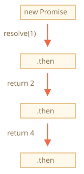
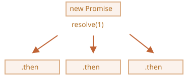
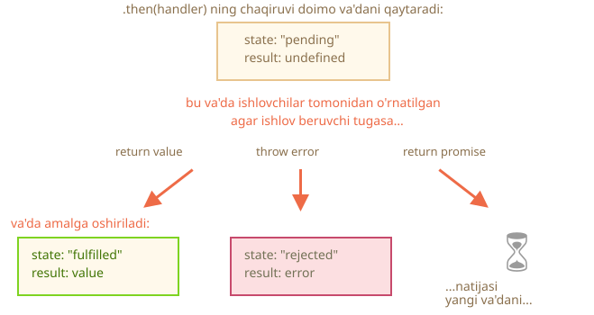

# Promise Chaining

<info:callbacks> bobida aytib o'tilgan muammoga qaytaylik: bizda birin-ketin bajariladigan asinxron vazifalar ketma-ketligi mavjud. Masalan, skriptlarni yuklash. Qanday qilib biz uni yaxshi kodlashimiz mumkin?

Buning uchun promise'lar bir nechta yechimlarni taqdim etadi.

Ushbu bobda biz promise chaining'ni yoritamiz.

Bu shunday ko'rinadi:

```js run
new Promise(function(resolve, reject) {

  setTimeout(() => resolve(1), 1000); // (*)

}).then(function(result) { // (**)

  alert(result); // 1
  return result * 2;

}).then(function(result) { // (***)

  alert(result); // 2
  return result * 2;

}).then(function(result) {

  alert(result); // 4
  return result * 2;

});
```

G'oya shundan iboratki, natija `.then` handlerlar zanjiri orqali o'tadi.

<<<<<<< HEAD
Mana oqim:
1. Dastlabki promise 1 soniyada resolved bo'ladi `(*)`,
2. Keyin `.then` handler `(**)` chaqiriladi.
3. Qaytarilgan qiymat keyingi `.then` handlerga `(***)` uzatiladi
4. ...va hokazo.
=======
Here the flow is:
1. The initial promise resolves in 1 second `(*)`,
2. Then the `.then` handler is called `(**)`, which in turn creates a new promise (resolved with `2` value).
3. The next `then` `(***)` gets the result of the previous one, processes it (doubles) and passes it to the next handler.
4. ...and so on.
>>>>>>> ff804bc19351b72bc5df7766f4b9eb8249a3cb11

Natija handlerlar zanjiri bo'ylab uzatilganda biz `alert` chaqiruvlari ketma-ketligini ko'rishimiz mumkin: `1` -> `2` -> `4`.



<<<<<<< HEAD
Hammasi ishlaydi, chunki `promise.then` chaqiruvi promise qaytaradi, shunda biz keyingi `.then`ni chaqira olamiz.
=======
The whole thing works, because every call to a `.then` returns a new promise, so that we can call the next `.then` on it.
>>>>>>> ff804bc19351b72bc5df7766f4b9eb8249a3cb11

Handler qiymat qaytarganda, bu promise'ning natijasi bo'ladi, shuning uchun keyingi `.then` u bilan chaqiriladi.

**Klassik yangi boshlovchilar xatosi: texnik jihatdan biz bitta promise'ga ko'plab `.then`larni qo'shishimiz mumkin. Bu chaining emas.**

Masalan:
```js run
let promise = new Promise(function(resolve, reject) {
  setTimeout(() => resolve(1), 1000);
});

promise.then(function(result) {
  alert(result); // 1
  return result * 2;
});

promise.then(function(result) {
  alert(result); // 1
  return result * 2;
});

promise.then(function(result) {
  alert(result); // 1
  return result * 2;
});
```

<<<<<<< HEAD
Bu yerda qilgan narsamiz - bitta promise'ga bir nechta handlerlar qo'shdik. Ular natijani bir-biriga uzatmaydi, aksincha uni mustaqil ravishda qayta ishlaydi.
=======
What we did here is just adding several handlers to one promise. They don't pass the result to each other; instead they process it independently.
>>>>>>> ff804bc19351b72bc5df7766f4b9eb8249a3cb11

Mana rasm (yuqoridagi chain bilan taqqoslang):



Bir xil promise'dagi barcha `.then`lar bir xil natijani oladi - o'sha promise'ning natijasini. Shunday qilib, yuqoridagi kodda barcha `alert`lar bir xil qiymatni ko'rsatadi: `1`.

Amalda biz kamdan-kam hollarda bitta promise uchun bir nechta handlerga muhtojmiz. Chaining juda ko'proq ishlatiladi.

## Promise'larni qaytarish

Odatda, `.then` handler tomonidan qaytarilgan qiymat darhol keyingi handlerga uzatiladi. Ammo istisno mavjud.

Agar qaytarilgan qiymat promise bo'lsa, keyingi bajarilish u settled bo'lguncha to'xtatiladi. Shundan so'ng, o'sha promise'ning natijasi keyingi `.then` handlerga beriladi.

Masalan:

```js run
new Promise(function(resolve, reject) {

  setTimeout(() => resolve(1), 1000);

}).then(function(result) {

  alert(result); // 1

*!*
  return new Promise((resolve, reject) => { // (*)
    setTimeout(() => resolve(result * 2), 1000);
  });
*/!*

}).then(function(result) { // (**)

  alert(result); // 2

  return new Promise((resolve, reject) => {
    setTimeout(() => resolve(result * 2), 1000);
  });

}).then(function(result) {

  alert(result); // 4

});
```

<<<<<<< HEAD
Bu yerda birinchi `.then` `1`ni ko'rsatadi va `(*)` satrida `new Promise(…)`ni qaytaradi. Bir soniyadan so'ng u resolved bo'ladi va natija (`resolve`ning argumenti, bu yerda `result * 2`) `(**)` satridagi ikkinchi `.then` handlerga uzatiladi. Bu handler `2`ni ko'rsatadi va xuddi shu narsani qiladi.
=======
Here the first `.then` shows `1` and returns `new Promise(…)` in the line `(*)`. After one second it resolves, and the result (the argument of `resolve`, here it's `result * 2`) is passed on to the handler of the second `.then`. That handler is in the line `(**)`, it shows `2` and does the same thing.
>>>>>>> ff804bc19351b72bc5df7766f4b9eb8249a3cb11

Shunday qilib, chiqish yana 1 -> 2 -> 4 ni tashkil qiladi, ammo endi `alert` chaqiruvlari o'rtasida 1 soniya kechikish mavjud.

Promise'larni qaytarish bizga asinxron harakatlar zanjirlarini yaratishga imkon beradi.

## Misol: loadScript

Skriptlarni navbatma-navbat yuklash uchun oldingi bobdagi `loadScript` funktsiyasidan foydalanamiz:

```js run
loadScript("/article/promise-chaining/one.js")
  .then(function(script) {
    return loadScript("/article/promise-chaining/two.js");
  })
  .then(function(script) {
    return loadScript("/article/promise-chaining/three.js");
  })
  .then(function(script) {
    // skriptlarda e'lon qilingan funktsiyalardan foydalaning
    // haqiqatan ham yuklanganligini ko'rsatish uchun
    one();
    two();
    three();
  });
```

Ushbu kod arrow funktsiyalar bilan biroz qisqartirilishi mumkin:

```js run
loadScript("/article/promise-chaining/one.js")
  .then(script => loadScript("/article/promise-chaining/two.js"))
  .then(script => loadScript("/article/promise-chaining/three.js"))
  .then(script => {
    // skriptlar yuklangan, biz ularda e'lon qilingan funktsiyalardan foydalanishimiz mumkin
    one();
    two();
    three();
  });
```

Bu yerda har bir `loadScript` chaqiruvi promise qaytaradi va keyingi `.then` u resolved bo'lganda ishlaydi. Keyin u keyingi skriptni yuklashni boshlaydi. Shunday qilib, skriptlar birin-ketin yuklanadi.

Biz zanjirga ko'proq asinxron harakatlarni qo'shishimiz mumkin. Iltimos, unutmangki, kod hali ham "tekis" bo'lib, u o'ngga emas, pastga qarab o'sadi. "Doom piramidasi"ning alomatlari yo'q.

Texnik jihatdan, biz har bir `loadScript`ga to'g'ridan-to'g'ri `.then` qo'shishimiz mumkin:

```js run
loadScript("/article/promise-chaining/one.js").then(script1 => {
  loadScript("/article/promise-chaining/two.js").then(script2 => {
    loadScript("/article/promise-chaining/three.js").then(script3 => {
      // bu funktsiya script1, script2 va script3 o'zgaruvchilariga kirish huquqiga ega
      one();
      two();
      three();
    });
  });
});
```

Ushbu kod ham xuddi shunday ishlaydi: 3 ta skriptni ketma-ket yuklaydi. Ammo u "o'ng tomonga o'sadi". Shunday qilib, biz callback'lar bilan bir xil muammolarga duch kelamiz.

Promise'lardan foydalanishni boshlagan odamlar ba'zan chaining haqida bilishmaydi, shuning uchun ular shunday yozadilar. Odatda, chaining afzaldir.

Ba'zan to'g'ridan-to'g'ri `.then` yozish yaxshi bo'ladi, chunki ichki funktsiya tashqi scope'ga kirish huquqiga ega. Yuqoridagi misolda eng ichki callback `script1`, `script2`, `script3` barcha o'zgaruvchilariga kirish huquqiga ega. Ammo bu qoidadan ko'ra istisno.

````smart header="Thenable'lar"
Aniqroq qilib aytganda, handler tasodifiy "thenable" obyektni qaytarishi mumkin va unga promise kabi munosabatda bo'linadi.

"Thenable" obyekt - `.then` metodi bo'lgan har qanday obyekt.

Ushbu g'oya shundan iboratki, uchinchi tomon kutubxonalar o'zlariga tegishli "promise-compatible" obyektlarni amalga oshirishi mumkin. Ular kengaytirilgan metodlar to'plamiga ega bo'lishi mumkin, shuningdek, native promise'lar bilan mos kelishi mumkin, chunki ular `.then`ni implement qiladi.

Thenable obyektga misol:

```js run
class Thenable {
  constructor(num) {
    this.num = num;
  }
  then(resolve, reject) {
    alert(resolve); // function() { native code }
    // resolve with this.num*2 after the 1 second
    setTimeout(() => resolve(this.num * 2), 1000); // (**)
  }
}

new Promise(resolve => resolve(1))
  .then(result => {
*!*
    return new Thenable(result); // (*)
*/!*
  })
  .then(alert); // 1000ms dan keyin 2 ni ko'rsatadi
```

JavaScript `(*)` satrida `.then` handler tomonidan qaytarilgan obyektni tekshiradi: agar unda `then` deb nomlangan method bo'lsa, u holda bu method `resolve`, `reject` ni argument sifatida qabul qiladigan native funktsiyalar bilan chaqiriladi (executor'ga o'xshash) va ulardan biri chaqirilguncha kutadi. Yuqoridagi misolda `resolve(2)` 1 soniyadan so'ng `(**)` da chaqiriladi. Keyin natija zanjirning pastki qismiga uzatiladi.

Ushbu xususiyat `Promise`dan meros olmasdan, custom obyektlarni promise chainlariga integratsiya qilishga imkon beradi.
````

## Kattaroq misol: fetch

Frontend dasturlashda promise'lar ko'pincha tarmoq so'rovlari uchun ishlatiladi. Keling, buning kengaytirilgan namunasini ko'rib chiqaylik.

<<<<<<< HEAD
Uzoq serverdan foydalanuvchi haqidagi ma'lumotlarni yuklash uchun [fetch](mdn:api/WindowOrWorkerGlobalScope/fetch) metodidan foydalanamiz. Method juda ko'p ixtiyoriy parametrlarga ega, ammo asosiy foydalanish juda oddiy:
=======
In frontend programming, promises are often used for network requests. So let's see an extended example of that.

We'll use the [fetch](info:fetch) method to load the information about the user from the remote server. It has a lot of optional parameters covered in [separate chapters](info:fetch), but the basic syntax is quite simple:
>>>>>>> ff804bc19351b72bc5df7766f4b9eb8249a3cb11

```js
let promise = fetch(url);
```

Bu `url`ga tarmoq so'rovini yuboradi va promise qaytaradi. Remote server headerlar bilan javob berganida, *to'liq javob yuklab olinmasdan oldin* promise `response` obyekti bilan resolved bo'ladi.

To'liq javobni o'qish uchun biz `response.text()` metodini chaqirishimiz kerak: u to'liq matnni remote serverdan yuklab olganda resolved bo'ladigan promise qaytaradi.

Quyidagi kod `user.json`ga so'rov yuboradi va uning matnini serverdan yuklaydi:

```js run
fetch('/article/promise-chaining/user.json')
  // .then quyida remote server javob berganida ishlaydi
  .then(function(response) {
    // response.text() javobning to'liq matni bilan resolved bo'ladigan yangi promise qaytaradi
    // yuklab olishni tugatgandan so'ng
    return response.text();
  })
  .then(function(text) {
    // ...va bu erda remote faylning tarkibi
    alert(text); // {"name": "iliakan", "isAdmin": true}
  });
```

`fetch` tomonidan qaytarilgan `response` obyekti remote ma'lumotlarni JSON sifatida o'qiydigan va parse qiladigan `response.json()` metodini ham o'z ichiga oladi. Bizning holatda bu yanada qulayroq, shuning uchun unga o'taylik.

Qisqartirish uchun arrow funktsiyalardan foydalanamiz:

```js run
// yuqoridagi kabi, ammo response.json() remote tarkibni JSON sifatida parse qiladi
fetch('/article/promise-chaining/user.json')
  .then(response => response.json())
  .then(user => alert(user.name)); // iliakan, foydalanuvchi ismini oldik
```

Endi yuklangan foydalanuvchi bilan nimadir qilaylik.

Masalan, GitHub'ga yana bir so'rov yuborishimiz, foydalanuvchi profilini yuklashimiz va avatarni ko'rsatishimiz mumkin:

```js run
// user.json uchun so'rov yuboring
fetch('/article/promise-chaining/user.json')
  // json sifatida yuklang
  .then(response => response.json())
  // GitHub'ga so'rov yuboring
  .then(user => fetch(`https://api.github.com/users/${user.name}`))
  // javobni json sifatida yuklang
  .then(response => response.json())
  // avatar rasmini ko'rsating (githubUser.avatar_url) 3 soniya davomida (balki uni animate qilish mumkin)
  .then(githubUser => {
    let img = document.createElement('img');
    img.src = githubUser.avatar_url;
    img.className = "promise-avatar-example";
    document.body.append(img);

    setTimeout(() => img.remove(), 3000); // (*)
  });
```

Kod ishlaydi, tafsilotlar haqidagi izohlarni ko'ring, lekin u o'zi-o'zidan tushunarli bo'lishi kerak. Garchi unda potentsial muammo mavjud bo'lsa ham - promise'larni ishlatishni boshlaganlar uchun odatiy xato.

`(*)` satriga qarang: avatar ko'rsatilgandan va olib tashlanganidan *keyin* qanday qilib biron narsa qilishimiz mumkin? Masalan, biz ushbu foydalanuvchini tahrirlash uchun forma ko'rsatmoqchimiz yoki boshqa biron narsa. Hozircha iloj yo'q.

Zanjirni davom ettirish uchun, biz avatar ko'rsatilishini tugatgandan so'ng resolved bo'ladigan promise qaytarishimiz kerak.

Shunga o'xshash:

```js run
fetch('/article/promise-chaining/user.json')
  .then(response => response.json())
  .then(user => fetch(`https://api.github.com/users/${user.name}`))
  .then(response => response.json())
*!*
  .then(githubUser => new Promise(function(resolve, reject) { // (*)
*/!*
    let img = document.createElement('img');
    img.src = githubUser.avatar_url;
    img.className = "promise-avatar-example";
    document.body.append(img);

    setTimeout(() => {
      img.remove();
*!*
      resolve(githubUser); // (**)
*/!*
    }, 3000);
  }))
  // 3 soniyadan keyin ishlaydi
  .then(githubUser => alert(`${githubUser.name} uchun ko'rsatish tugadi`));
```

Endi `setTimeout` `img.remove()`ni ishga tushirgandan so'ng, `resolve(githubUser)`ni chaqiradi, shu bilan boshqaruvni zanjirdagi keyingi `.then`ga uzatadi va foydalanuvchi ma'lumotlarini uzatadi.

Qoida tariqasida, asinxron harakat har doim promise qaytarishi kerak. Bu undan keyin harakatlarni rejalashtirishga imkon beradi; hozirda zanjirni kengaytirishni rejalashtirmasak ham, keyinroq kerak bo'lishi mumkin.

Va nihoyat, biz kodni qayta foydalaniladigan funktsiyalarga bo'lishimiz mumkin:

```js run
function loadJson(url) {
  return fetch(url)
    .then(response => response.json());
}

function loadGithubUser(name) {
  return loadJson(`https://api.github.com/users/${name}`);
}

function showAvatar(githubUser) {
  return new Promise(function(resolve, reject) {
    let img = document.createElement('img');
    img.src = githubUser.avatar_url;
    img.className = "promise-avatar-example";
    document.body.append(img);

    setTimeout(() => {
      img.remove();
      resolve(githubUser);
    }, 3000);
  });
}

// Ulardan foydalaning:
loadJson('/article/promise-chaining/user.json')
  .then(user => loadGithubUser(user.name))
  .then(showAvatar)
  .then(githubUser => alert(`${githubUser.name} uchun ko'rsatish tugadi`));
  // ...
```

## Xulosa

Agar `.then` (yoki `catch/finally`, farqi yo'q) handler promise qaytarsa, qolgan zanjir u settled bo'lguncha kutadi. U settled bo'lganda, uning natijasi (yoki xatosi) keyingi handlerga uzatiladi.

Mana to'liq rasm:

