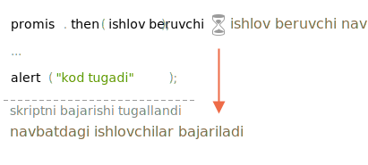
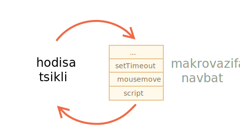

# Mikrovazifalar va hodisalar tsikli

`.then`/`.catch`/`.finally` ishlovchilari doimo asinxrondir.

Promis zudlik bilan hal qilingan taqdirda ham, sizning `.then`/`.catch`/`.finally` satrlaringizdagidan *quyidagi* kod birinchi bo'lib bajariladi.

Buni ko'rsatadigan kod:

```js run
let promise = Promise.resolve();

promise.then(() => alert("promis bajarildi"));

alert("kod tugadi"); // birinchi navbatda ushbu ogohlantirish ko'rsatiladi
```

Agar siz uni ishlatsangiz, avval `kod tugadi`, so'ngra `promis tugadi` ni ko'rasiz.

Bu g'alati, chunki promis boshidanoq albatta amalga oshiriladi.

Nima uchun `.then` keyin bajariladi? Nima bo'lyapti?

# Mikrovazifalar

Asinxron vazifalar to'g'ri boshqaruvga muhtoj. Buning uchun standart `PromiseJobs` ichki navbatini belgilaydi, ko'pincha "mikrovazifa navbat" deb nomlanadi (v8 atama).

[Spetsifikatsiyada](https://tc39.github.io/ecma262/#sec-jobs-and-job-queues) aytilganidek:

- Navbat birinchi bo'lib amalga oshiriladi: birinchi navbatda vazifalar bo'lib bajariladi.
- Vazifani bajarish faqat boshqa hech narsa ishlamay qolganda boshlanadi.

Yoki sodda qilib aytganda, promis tayyor bo'lganda, uning `.then/catch/finally` ishlovchilari navbatga qo'yiladi. Ular hali bajarilmagan. JavaScript interpretatori navbatdan vazifani oladi va joriy koddan qutilganda uni bajaradi.

Shuning uchun yuqoridagi misolda "kod tugadi" birinchi bo'lib ko'rsatilgan.



Promis beruvchilar doimo ushbu ichki navbatdan o'tadilar.

Agar bir nechta `.then/catch/finally` zanjiri mavjud bo'lsa, unda ularning har biri asinxron tarzda bajariladi. Ya'ni, u avval navbatga qo'yiladi va joriy kod tugagandan va avval navbatda turgan ishlovchilar tugagandan so'ng bajariladi.

**Agar navbat biz uchun muhim bo'lsachi? Qanday qilib `kod tugadi` ni `promis bajarilgandan` keyin ishlashimiz mumkin?**

Oson, uni `.then` bilan navbatga qo'ying.

```js run
Promise.resolve()
  .then(() => alert("promis bajarilgandan!"))
  .then(() => alert("kod tugadi"));
```

Endi navbat maqsadga muvofiq.

## Hodisa tsikli

Brauzer ichidagi JavaScript, shuningdek Node.js *hodisa tsikliga* asoslangan.

"Hodisa tsikli" - bu interpretator uxlab yotgan va hodisalarni kutib turadgan, keyin ularga javob beradigan va yana uxlaydigan jarayon.

Hodisalar misollari:
- `mousemove`, foydalanuvchi sichqonchani harakatga keltirdi.
- `setTimeout` ishlov beruvchi chaqirildi.
- tashqi `<script src ="...">` yuklangan, bajarishga tayyor.
- tarmoq operatsiyasi, masalan. `fetch` tugallandi.
- ...va hk.

Hodisalar sodir bo'ladi - interpretator ularni boshqaradi - va yana ko'p narsalar bo'lishini kutadi (uxlash paytida va nolga yaqin CPU iste'mol qilganda).



Ko'rib turganingizdek, bu yerda ham navbat bor. "Makrovazifa navbat" deb nomlangan (v8 atama).

Hodisa sodir bo'lganda, interpretator band bo'lganda, uni boshqarish qulay bo'ladi.

Masalan, interpretator `fetch` tarmog'ini qayta ishlash bilan band bo'lganida, foydalanuvchi sichqonchani siljitib, `mousemove` keltirib chiqarishi mumkin, va `setTimeout` xuddi yuqoridagi rasmda tasvirlanganidek bo'lishi kerak.

Makrovazifa navbatidagi hodisalar "birinchi kelish - birinchi xizmat" tamoyili asosida qayta ishlanadi. Interpretator brauzeri `fetch` tugagandan so'ng, u `mousemove` hodisasini, keyin `setTimeout` ishlov beruvchisini va boshqalarni boshqaradi.

Hozircha juda sodda, to'g'rimi? Interpretator band, shuning uchun boshqa vazifalar navbatda turadi.

Endi muhim narsalar.

**Mikrovazifa navbatida makrovazifa navbatiga qaraganda ustunlik yuqori.**

Boshqacha qilib aytganda, interpretator avval barcha mikrovazifalarni bajaradi, so'ngra makrovazifalarni oladi. Promis bilan ishlash har doim birinchi o'ringa ega.

Masalan, qarang:

```js run
setTimeout(() => alert("timeout"));

Promise.resolve()
  .then(() => alert("promise"));

alert("code");
```

Navbat qanday?

1. `code` birinchi navbatda ko'rsatiladi, chunki bu muntazam sinxron chaqiruv.
2. `promise` ikkinchi bo'lib ko'rsatiladi, chunki `.then` mikrovazifa navbatidan o'tadi va joriy koddan keyin ishlaydi.
3. `timeout` oxirgi o'rinda ko'rsatiladi, chunki bu makrovazifa.

Ehtimol, makrovazifada ishlash paytida yangi promislar paydo bo'lishi mumkin.

Yoki, aksincha, mikrovazifa makrovazifani rejalashtiradi (masalan, `setTimeout`).

Masalan, `.then` `setTimeout` ni rejalashtiradi:

```js run
Promise.resolve()
  .then(() => {
    setTimeout(() => alert("timeout"), 0);
  })
  .then(() => {
    alert("promise");
  });
```

Tabiiyki, avval `promise` paydo bo'ladi, chunki `setTimeout` makrovazifani unchalik ahamiyatga ega bo'lmagan makrovazifa navbatida kutmoqda.

Mantiqiy natija sifatida makrovazifalar faqat interpretatorga "bo'sh vaqt" berganda amalga oshiriladi. Shunday qilib, agar bizda hech narsa kutmaydigan promis zanjiri bo'lsa, unda `setTimeout` yoki hodisa ishlovchilari kabi narsalar hech qachon o'rtaga kira olmaydi.


## Ishlov berilmagan rad etish

<info:promise-error-handling> bobidagi "ishlov berilmagan rad etish" hodisasini eslaysizmi?

Endi mikrovazifalarni tushunish bilan biz uni rasmiylashtira olamiz.

**"Ishlov berilmagan rad etish" - bu mikrovazifa navbatining oxirida promis xatosi ko'rib chiqilmaganda sodir bo'ladi.**

Masalan, ushbu kodni ko'rib chiqing:

```js run
let promise = Promise.reject(new Error("Promise Failed!"));

window.addEventListener('unhandledrejection', event => {
  alert(event.reason); // Promise Failed!
});
```

Biz rad etilgan `promise` ni yaratamiz va xatoni ko'rib chiqmaymiz. Shunday qilib bizda "ishlov berilmagan rad etish" hodisasi mavjud (brauzer konsolida ham yozilgan).

Agar `.catch` qo'shsak, bizda bunday bo'lmaydi:

```js run
let promise = Promise.reject(new Error("Promise Failed!"));
*!*
promise.catch(err => alert('caught'));
*/!*

// hech qanday xato yo'q, hammasi tinch
window.addEventListener('unhandledrejection', event => alert(event.reason));
```

Endi aytaylik, biz xatoga yo'l qo'yamiz, ammo `etTimeout` dan keyin:

```js run
let promise = Promise.reject(new Error("Promise Failed!"));
*!*
setTimeout(() => promise.catch(err => alert('caught')));
*/!*

// Error: Promise Failed!
window.addEventListener('unhandledrejection', event => alert(event.reason));
```

Endi ishlov berilmagan rad etish yana paydo bo'ladi. Nima uchun? Mikrovazifada navbat tugagandan so'ng, "ishlov berilmagan rad etish" paydo bo'ladi. Interpretator promislarni tekshiradi va agar ulardan biri "rad etilgan" holatda bo'lsa, unda hodisa sodir bo'ladi.

Masalan, `setTimeout` tomonidan qo'shilgan `.catch` ham ishga tushadi, albatta, lekin `unhandledrejection` allaqachon sodir bo'lgandan so'ng.

## Xulosa

- Promislarni boshqarish har doim ham mos kelmaydi, chunki barcha promis qilingan harakatlar "mikrovazifa navbati" (v8 atama) deb nomlangan ichki "promis ishi" navbatidan o'tadi.

    **Shunday qilib, `.then/catch/finally` joriy kod tugagandan so'ng chaqiriladi.**

    Agar kodning bir qismi `.then/catch/finally` dan keyin bajarilishini kafolatlashimiz kerak bo'lsa, uni zanjirlangan `.then` chaqiruviga qo'shganimiz ma'qul.

- Shuningdek, turli xil hodisalarni, tarmoq ish natijalarini,`"setTimeout` rejalashtirilgan chaqiruvlarni va boshqalarni saqlaydigan "makrovazifa navbati" mavjud. Ular "makrovazifalar" (v8 atama) deb ham ataladi.

    Interpretator ularni tashqi ko'rinish tartibida boshqarish uchun makrovazifalrdan foydalanadi.

    **Makrovazifalar kod tugagandan so'ng ishlaydi *va* mikrovazifalar navbati bo'sh bo'lgandan keyin.**

    Boshqacha qilib aytganda, ularning ustunligi pastroq.

Shunday qilib, navbat quyidagicha: odatdagi kod, keyin promis bilan ishlash, so'ngra hamma narsa, masalan hodisalar va boshqalar.
