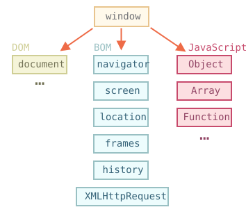

# Brauzer muhiti, xususiyatlari

<<<<<<< HEAD
JavaScript tili dastlab veb-brauzerlar uchun yaratilgan. O'shandan beri u rivojlanib, ko'plab foydalanish va platformalarga ega tilga aylandi.

Platforma JavaScript-ni ishga tushira olsa, brauzer yoki veb-server yoki boshqa _host_, hatto "aqlli" qahva mashinasi bo'lishi mumkin. Ularning har biri platformaga xos funksiyalarni taqdim etadi. JavaScript spetsifikatsiyasi buni _host muhiti_ deb ataydi.

Xost muhiti til yadrosiga qo'shimcha ravishda o'z ob'ektlari va funktsiyalarini ta'minlaydi. Veb-brauzerlar veb-sahifalarni boshqarish vositalarini beradi. Node.js server tomonidagi xususiyatlarni taqdim etadi va hokazo.
=======
The JavaScript language was initially created for web browsers. Since then, it has evolved into a language with many uses and platforms.

A platform may be a browser, or a web-server or another *host*, or even a "smart" coffee machine if it can run JavaScript. Each of these provides platform-specific functionality. The JavaScript specification calls that a *host environment*.

A host environment provides its own objects and functions in addition to the language core. Web browsers give a means to control web pages. Node.js provides server-side features, and so on.
>>>>>>> ff804bc19351b72bc5df7766f4b9eb8249a3cb11

JavaScript veb-brauzerda ishlayotganida bizda nima borligini qushning nazari bilan ko'rib chiqamiz:



`Oyna` deb nomlangan "ildiz" ob'ekti mavjud. Uning ikkita roli bor:

1. Birinchidan, bu <info:global-object> bobida tasvirlanganidek, JavaScript kodi uchun global obyektdir.
2. Ikkinchidan, u "brauzer oynasi" ni ifodalaydi va uni boshqarish usullarini taqdim etadi.

<<<<<<< HEAD
Masalan, biz uni global ob'ekt sifatida ishlatamiz:
=======
For instance, we can use it as a global object:
>>>>>>> ff804bc19351b72bc5df7766f4b9eb8249a3cb11

```js run global
function sayHi() {
  alert("Hello");
}

// global funktsiyalar global ob'ektning usullari:
window.sayHi();
```

<<<<<<< HEAD
Va bu erda biz uni brauzer oynasi sifatida ishlatamiz, oyna balandligini ko'rish uchun:
=======
And we can use it as a browser window, to show the window height:
>>>>>>> ff804bc19351b72bc5df7766f4b9eb8249a3cb11

```js run
alert(window.innerHeight); // oynaning ichki balandligi
```

<<<<<<< HEAD
Ko'proq oynaga xos usullar va xususiyatlar mavjud, biz ularni keyinroq ko'rib chiqamiz.

## DOM (Document Object Model)

Hujjat ob'ekt modeli yoki qisqacha DOM barcha sahifa mazmunini o'zgartirish mumkin bo'lgan ob'ektlar sifatida ifodalaydi.
=======
There are more window-specific methods and properties, which we'll cover later.

## DOM (Document Object Model)

The Document Object Model, or DOM for short, represents all page content as objects that can be modified.
>>>>>>> ff804bc19351b72bc5df7766f4b9eb8249a3cb11

`Hujjat` ob'ekti sahifaning asosiy "kirish nuqtasi" hisoblanadi. Uning yordamida biz sahifadagi biror narsani o'zgartirishimiz yoki yaratishimiz mumkin.

Masalan:

```js run
// fon rangini qizil rangga o'zgartiring
document.body.style.background = "red";

// 1 soniyadan keyin uni qayta o'zgartiring
setTimeout(() => (document.body.style.background = ""), 1000);
```

<<<<<<< HEAD
Bu erda biz `document.body.style` dan foydalandik, lekin yana ko'p narsalar bor. Xususiyatlar va usullar spetsifikatsiyada tasvirlangan: [DOM Living Standard](https://dom.spec.whatwg.org).
=======
Here, we used `document.body.style`, but there's much, much more. Properties and methods are described in the specification: [DOM Living Standard](https://dom.spec.whatwg.org).
>>>>>>> ff804bc19351b72bc5df7766f4b9eb8249a3cb11

```smart header="DOM faqat brauzerlar uchun emas"
DOM spetsifikatsiyasi hujjatning tuzilishini tushuntiradi va uni boshqarish uchun ob'ektlarni taqdim etadi. DOM-dan foydalanadigan brauzer bo'lmagan asboblar ham mavjud.

<<<<<<< HEAD
Masalan, HTML-sahifalarni yuklaydigan va ularni qayta ishlovchi server tomonidagi skriptlar ham DOM-dan foydalanishi mumkin. Ular spetsifikatsiyaning faqat bir qismini qo'llab-quvvatlashi mumkin.
=======
For instance, server-side scripts that download HTML pages and process them can also use the DOM. They may support only a part of the specification though.
>>>>>>> ff804bc19351b72bc5df7766f4b9eb8249a3cb11
```

```smart header="Styling uchun CSSOM"
Shuningdek, CSS qoidalari va uslublar jadvallari uchun [CSS Object Model (CSSOM)](https://www.w3.org/TR/cssom-1/) alohida spetsifikatsiya mavjud bo'lib, ular qanday ob'ektlar sifatida taqdim etilishini, ularni qanday o'qish va yozishni tushuntiradi.

<<<<<<< HEAD
Hujjat uchun uslub qoidalarini o'zgartirganda CSSOM DOM bilan birgalikda ishlatiladi. Amalda, CSSOM kamdan-kam talab qilinadi, chunki biz kamdan-kam hollarda JavaScript-dan CSS qoidalarini o'zgartirishimiz kerak (odatda biz CSS sinflarini qo'shamiz/o'chiramiz, ularning CSS qoidalarini o'zgartirmaymiz), lekin bu ham mumkin.
=======
The CSSOM is used together with the DOM when we modify style rules for the document. In practice though, the CSSOM is rarely required, because we rarely need to modify CSS rules from JavaScript (usually we just add/remove CSS classes, not modify their CSS rules), but that's also possible.
>>>>>>> ff804bc19351b72bc5df7766f4b9eb8249a3cb11
```

## BOM (Browser Object Model)

Brauzer ob'ekt modeli (BOM) hujjatdan tashqari hamma narsa bilan ishlash uchun brauzer (xost muhiti) tomonidan taqdim etilgan qo'shimcha ob'ektlarni ifodalaydi.

Masalan:

<<<<<<< HEAD
- [navigator](mdn:api/Window/navigator) obyekti brauzer va operatsion tizim haqida fon maʼlumotlarini taqdim etadi. Ko'pgina xususiyatlar mavjud, lekin eng ko'p ma'lum bo'lgan ikkitasi: `navigator.userAgent` -- joriy brauzer haqida va `navigator.platform` -- platforma haqida (Windows/Linux/Mac va boshqalar o'rtasidagi farqni aniqlashga yordam beradi).
- [location](mdn:api/Window/location) obyekti bizga joriy URL manzilini o‘qish imkonini beradi va brauzerni yangisiga yo‘naltirishi mumkin.
=======
- The [navigator](mdn:api/Window/navigator) object provides background information about the browser and the operating system. There are many properties, but the two most widely known are: `navigator.userAgent` -- about the current browser, and `navigator.platform` -- about the platform (can help to differentiate between Windows/Linux/Mac etc).
- The [location](mdn:api/Window/location) object allows us to read the current URL and can redirect the browser to a new one.
>>>>>>> ff804bc19351b72bc5df7766f4b9eb8249a3cb11

`location` obyektidan shunday foydalanishimiz mumkin:

```js run
alert(location.href); // hozirgi urlni ko'rsatadi
if (confirm("Go to Wikipedia?")) {
  location.href = "https://wikipedia.org"; // boshqa url ga yo'naltiradi
}
```

<<<<<<< HEAD
`alert/confirm/prompt` funksiyalari ham BOMning bir qismidir: ular hujjat bilan bevosita bog'liq emas, lekin foydalanuvchi bilan muloqot qilishning sof brauzer usullarini ifodalaydi.

```smart header="Xususiyatlar"
BOM umumiy [HTML spetsifikatsiyasi] (https://html.spec.whatwg.org) qismidir.

Ha, siz buni to'g'ri eshitdingiz. <https://html.spec.whatwg.org> saytidagi HTML spetsifikatsiyasi nafaqat "HTML tili" (teglar, atributlar), balki bir qator ob'ektlar, usullar va brauzerga xos DOM kengaytmalarini ham qamrab oladi. Bu "keng ma'noda HTML". Shuningdek, ba'zi qismlarda <https://spec.whatwg.org> ro'yxatida qo'shimcha xususiyatlar mavjud.
=======
The functions `alert/confirm/prompt` are also a part of the BOM: they are not directly related to the document, but represent pure browser methods for communicating with the user.

```smart header="Specifications"
The BOM is a part of the general [HTML specification](https://html.spec.whatwg.org).

Yes, you heard that right. The HTML spec at <https://html.spec.whatwg.org> is not only about the "HTML language" (tags, attributes), but also covers a bunch of objects, methods, and browser-specific DOM extensions. That's "HTML in broad terms". Also, some parts have additional specs listed at <https://spec.whatwg.org>.
>>>>>>> ff804bc19351b72bc5df7766f4b9eb8249a3cb11
```

## Xulosa

Standartlar haqida gapiradigan bo'lsak, bizda:

<<<<<<< HEAD
DOM spetsifikatsiyasi
: Hujjat tuzilishi, manipulyatsiyalar va hodisalarni tavsiflaydi, qarang: <https://dom.spec.whatwg.org>.

CSSOM spetsifikatsiyasi
: Uslublar jadvallari va uslublar qoidalarini, ular bilan manipulyatsiyalarni va ularni hujjatlarga bog'lashni tavsiflaydi, qarang: <https://www.w3.org/TR/cssom-1/>.
=======
DOM specification
: Describes the document structure, manipulations, and events, see <https://dom.spec.whatwg.org>.

CSSOM specification
: Describes stylesheets and style rules, manipulations with them, and their binding to documents, see <https://www.w3.org/TR/cssom-1/>.
>>>>>>> ff804bc19351b72bc5df7766f4b9eb8249a3cb11

HTML spetsifikatsiyasi
: HTML tilini (masalan, teglar) va shuningdek, BOMni (brauzer ob'ekt modeli) tavsiflaydi -- turli xil brauzer funktsiyalari: `setTimeout`, `alert`, `location` va boshqalar, qarang: <https://html.spec.whatwg.org>. U DOM spetsifikatsiyasini oladi va uni ko'plab qo'shimcha xususiyatlar va usullar bilan kengaytiradi.

Bundan tashqari, ba'zi sinflar <https://spec.whatwg.org/> da alohida tasvirlangan.

<<<<<<< HEAD
Iltimos, ushbu havolalarga e'tibor bering, chunki o'rganish uchun juda ko'p narsa bor, hamma narsani qamrab olish va eslab qolish mumkin emas.

Xususiyat yoki usul haqida oʻqishni istasangiz, <https://developer.mozilla.org/en-US/search> sahifasidagi Mozilla qoʻllanmasi ham yaxshi manba boʻlib xizmat qiladi, ammo mos keladigan xususiyat yaxshiroq boʻlishi mumkin: u murakkabroq va oʻqish uchun uzoqroq, lekin asosiy bilimlaringizni mustahkam va toʻliq qiladi.
=======
Please note these links, as there's so much to learn that it's impossible to cover everything and remember it all.

When you'd like to read about a property or a method, the Mozilla manual at <https://developer.mozilla.org/en-US/> is also a nice resource, but the corresponding spec may be better: it's more complex and longer to read, but will make your fundamental knowledge sound and complete.
>>>>>>> ff804bc19351b72bc5df7766f4b9eb8249a3cb11

Biror narsani topish uchun "WHATWG [term]" yoki "MDN [term]" kabi internet qidiruvidan foydalanish qulay, masalan, <https://google.com?q=whatwg+localstorage>, <https://google.com?q=mdn+localstorage>.

<<<<<<< HEAD
Endi biz DOMni o'rganishga kirishamiz, chunki hujjat UIda markaziy rol o'ynaydi.
=======
Now, we'll get down to learning the DOM, because the document plays the central role in the UI.
>>>>>>> ff804bc19351b72bc5df7766f4b9eb8249a3cb11
