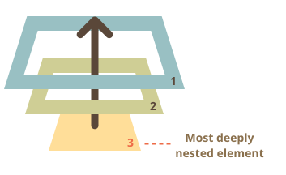
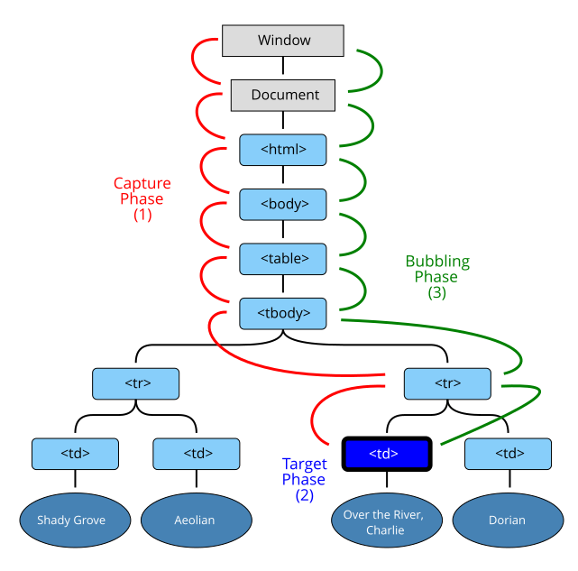

# Bubbling va Capturing

Misoldan boshlaylik.

Bu ishlov beruvchi `<div>` ga tayinlangan, lekin siz `<em>` yoki `<code>` kabi ichki tegga bosganda ham ishlaydi:

```html autorun height=60
<div onclick="alert('Ishlov beruvchi!')">
  <em>Agar siz <code>EM</code> ga bossangiz, <code>DIV</code> dagi ishlov beruvchi ishlaydi.</em>
</div>
```

Bu biroz g'alati emasmi? Nega haqiqiy bosish `<em>` da bo'lgan bo'lsa ham, `<div>` dagi ishlov beruvchi ishlaydi?

## Bubbling

Bubbling printsipi oddiy.

**Element ustida hodisa sodir bo'lganda, u avval undagi ishlov beruvchilarni ishga tushiradi, keyin ota-elementdagi, so'ngra barcha ajdodlarda yuqoriga qarab.**

Aytaylik, bizda 3 ta ichki element `FORM > DIV > P` bor va har birida ishlov beruvchi bor:

```html run autorun
<style>
  body * {
    margin: 10px;
    border: 1px solid blue;
  }
</style>

<form onclick="alert('form')">FORM
  <div onclick="alert('div')">DIV
    <p onclick="alert('p')">P</p>
  </div>
</form>
```

Ichki `<p>` ga bosish avval `onclick` ni ishga tushiradi:
1. O'sha `<p>` da.
2. Keyin tashqi `<div>` da.
3. Keyin tashqi `<form>` da.
4. Va hokazo `document` obyektiga qadar yuqoriga.



Shuning uchun agar biz `<p>` ga bossak, 3 ta ogohlantirish ko'ramiz: `p` -> `div` -> `form`.

Bu jarayon "bubbling" deb ataladi, chunki hodisalar ichki elementdan ota-elementlar orqali suvdagi pufakcha kabi "puflanadi".

```warn header="*Deyarli* barcha hodisalar bubble qiladi."
Bu jumlada asosiy so'z "deyarli".

Masalan, `focus` hodisasi bubble qilmaydi. Boshqa misollar ham bor, biz ularga duch kelamiz. Lekin bu istisno, qoida emas, ko'pchilik hodisalar bubble qiladi.
```

## event.target

Ota element ustidagi ishlov beruvchi doim qayerda sodir bo'lganligi haqidagi tafsilotlarni olishi mumkin.

**Hodisani keltirib chiqargan eng chuqur ichki element *target* element deb ataladi va `event.target` orqali kirish mumkin.**

`this` (`=event.currentTarget`) dan farqlarni qayd eting:

- `event.target` -- hodisani boshlagan "target" element, u bubbling jarayonida o'zgarmaydi.
- `this` -- "joriy" element, hozirda ishlov beruvchi ishlab turgan element.

Masalan, agar bizda bitta `form.onclick` ishlov beruvchi bo'lsa, u forma ichidagi barcha bosilishlarni "ushlab" olishi mumkin. Bosish qayerda sodir bo'lishidan qat'i nazar, u `<form>` ga bubble qiladi va ishlov beruvchini ishga tushiradi.

`form.onclick` ishlov beruvchisida:

- `this` (`=event.currentTarget`) `<form>` elementi, chunki ishlov beruvchi unda ishlaydi.
- `event.target` forma ichida bosilgan haqiqiy element.

Buni tekshirib ko'ring:

[codetabs height=220 src="bubble-target"]

`event.target` `this` ga teng bo'lishi mumkin -- bu bosish to'g'ridan-to'g'ri `<form>` elementida amalga oshirilganda sodir bo'ladi.

## Bubbling ni to'xtatish

Bubble qilayotgan hodisa target elementdan to'g'ri yuqoriga boradi. Odatda u `<html>` gacha, keyin `document` obyektiga boradi va ba'zi hodisalar hatto `window` ga yetadi, yo'lda barcha ishlov beruvchilarni chaqiradi.

Lekin har qanday ishlov beruvchi hodisa to'liq qayta ishlanganligini hal qilishi va bubbling ni to'xtatishi mumkin.

Buning usuli `event.stopPropagation()`.

Masalan, bu yerda agar siz `<button>` ga bossangiz, `body.onclick` ishlamaydi:

```html run autorun height=60
<body onclick="alert(`bubbling bu yerga yetmaydi`)">
  <button onclick="event.stopPropagation()">Menga bosing</button>
</body>
```

```smart header="event.stopImmediatePropagation()"
Agar elementda bitta hodisa uchun bir nechta ishlov beruvchi bo'lsa, ulardan biri bubbling ni to'xtatgan bo'lsa ham, qolganlar bajariladi.

Boshqacha qilib aytganda, `event.stopPropagation()` yuqoriga harakatni to'xtatadi, lekin joriy elementda barcha boshqa ishlov beruvchilar ishlaydi.

Bubbling ni to'xtatish va joriy elementdagi ishlov beruvchilarni ishga tushirmaslik uchun `event.stopImmediatePropagation()` metodi mavjud. Bundan keyin boshqa hech qanday ishlov beruvchi bajarilmaydi.
```

```warn header="Zaruratsiz bubbling ni to'xtatmang!"
Bubbling qulay. Haqiqiy zarurat bo'lmasa uni to'xtatmang: aniq va arxitektur jihatdan yaxshi o'ylangan.

Ba'zan `event.stopPropagation()` yashirin tuzoqlar yaratadi, ular keyinchalik muammolarga aylanishi mumkin.

Masalan:

1. Biz ichki menyu yaratamiz. Har bir pastki menyu o'z elementlarida bosilishlarni qayta ishlaydi va tashqi menyu ishga tushmaslik uchun `stopPropagation` chaqiradi.
2. Keyinchalik biz foydalanuvchilar xatti-harakatlarini kuzatish uchun (odamlar qayerga bosishini) butun oyna bo'ylab bosilishlarni ushlashga qaror qilamiz. Ba'zi analitik tizimlar buni qiladi. Odatda kod barcha bosilishlarni ushlash uchun `document.addEventListener('click'…)` dan foydalanadi.
3. Bizning analitik `stopPropagation` tomonidan to'xtatilgan hududda ishlamaydi. Afsuski, bizda "o'lik zona" paydo bo'ldi.

Bubbling ni oldini olishning haqiqiy zarurati odatda yo'q. Bu talab qilinadigan vazifa boshqa usullar bilan hal qilinishi mumkin. Ulardan biri maxsus hodisalardan foydalanish, buni keyinroq ko'rib chiqamiz. Shuningdek, biz bir ishlov beruvchida ma'lumotlarni `event` obyektiga yozishimiz va boshqasida o'qishimiz mumkin, shuning uchun pastdagi qayta ishlash haqidagi ma'lumotlarni ota-elementlardagi ishlov beruvchilarga uzatishimiz mumkin.
```

## Capturing

"Capturing" deb ataladigan hodisa qayta ishlashning yana bir fazasi mavjud. U haqiqiy kodda kamdan-kam qo'llaniladi, lekin ba'zan foydali bo'lishi mumkin.

<<<<<<< HEAD
Standart [DOM Events](http://www.w3.org/TR/DOM-Level-3-Events/) hodisa tarqalishining 3 fazasini tasvirlaydi:
=======
The standard [DOM Events](https://www.w3.org/TR/DOM-Level-3-Events/) describes 3 phases of event propagation:
>>>>>>> 51bc6d3cdc16b6eb79cb88820a58c4f037f3bf19

1. Capturing fazasi -- hodisa elementga pastga boradi.
2. Target fazasi -- hodisa target elementga yetdi.
3. Bubbling fazasi -- hodisa elementdan yuqoriga bubble qiladi.

<<<<<<< HEAD
Mana jadval ichidagi `<td>` ga bosishning spetsifikatsiyadan olingan rasmi:
=======
Here's the picture, taken from the specification, of the capturing `(1)`, target `(2)` and bubbling `(3)` phases for a click event on a `<td>` inside a table:
>>>>>>> 51bc6d3cdc16b6eb79cb88820a58c4f037f3bf19



Ya'ni: `<td>` ga bosish uchun hodisa avval ajdodlar zanjiri orqali elementga pastga boradi (capturing fazasi), keyin target ga yetadi va u yerda ishga tushadi (target fazasi), so'ngra yuqoriga boradi (bubbling fazasi), yo'lda ishlov beruvchilarni chaqiradi.

<<<<<<< HEAD
**Ilgari biz faqat bubbling haqida gapirdik, chunki capturing fazasi kamdan-kam ishlatiladi. Odatda u bizga ko'rinmaydi.**

`on<event>`-xossasi yoki HTML atributlari yordamida yoki ikki argumentli `addEventListener(event, handler)` dan foydalanib qo'shilgan ishlov beruvchilar capturing haqida hech narsa bilmaydi, ular faqat 2-chi va 3-chi fazalarda ishlaydi.
=======
Until now, we only talked about bubbling, because the capturing phase is rarely used.

In fact, the capturing phase was invisible for us, because handlers added using `on<event>`-property or using HTML attributes or using two-argument `addEventListener(event, handler)` don't know anything about capturing, they only run on the 2nd and 3rd phases.
>>>>>>> 51bc6d3cdc16b6eb79cb88820a58c4f037f3bf19

Capturing fazasida hodisani ushlash uchun ishlov beruvchining `capture` parametrini `true` qilib o'rnatishimiz kerak:

```js
elem.addEventListener(..., {capture: true})
<<<<<<< HEAD
// yoki, shunchaki "true" {capture: true} ning taxallusi
=======

// or, just "true" is an alias to {capture: true}
>>>>>>> 51bc6d3cdc16b6eb79cb88820a58c4f037f3bf19
elem.addEventListener(..., true)
```

`capture` parametrining ikki mumkin bo'lgan qiymati bor:

- Agar u `false` (sukut bo'yicha) bo'lsa, ishlov beruvchi bubbling fazasida o'rnatiladi.
- Agar u `true` bo'lsa, ishlov beruvchi capturing fazasida o'rnatiladi.

E'tibor bering, rasmiy ravishda 3 faza bo'lsa-da, 2-chi faza ("target fazasi": hodisa elementga yetdi) alohida qayta ishlanmaydi: capturing va bubbling fazalaridagi ishlov beruvchilar o'sha fazada ishga tushadi.

Capturing va bubbling ni amalda ko'raylik:

```html run autorun height=140 edit
<style>
  body * {
    margin: 10px;
    border: 1px solid blue;
  }
</style>

<form>FORM
  <div>DIV
    <p>P</p>
  </div>
</form>

<script>
  for(let elem of document.querySelectorAll('*')) {
    elem.addEventListener("click", e => alert(`Capturing: ${elem.tagName}`), true);
    elem.addEventListener("click", e => alert(`Bubbling: ${elem.tagName}`));
  }
</script>
```

Kod hujjatdagi *har* elementga bosish ishlov beruvchisini o'rnatadi, qaysi biri ishlayotganini ko'rish uchun.

Agar siz `<p>` ga bossangiz, ketma-ketlik quyidagicha bo'ladi:

<<<<<<< HEAD
1. `HTML` -> `BODY` -> `FORM` -> `DIV` (capturing fazasi, birinchi tinglovchi):
2. `P` (target fazasi, ikki marta ishga tushadi, chunki biz ikkita tinglovchi o'rnatdik: capturing va bubbling)
3. `DIV` -> `FORM` -> `BODY` -> `HTML` (bubbling fazasi, ikkinchi tinglovchi).
=======
1. `HTML` -> `BODY` -> `FORM` -> `DIV -> P` (capturing phase, the first listener):
2. `P` -> `DIV` -> `FORM` -> `BODY` -> `HTML` (bubbling phase, the second listener).

Please note, the `P` shows up twice, because we've set two listeners: capturing and bubbling. The target triggers at the end of the first and at the beginning of the second phase.
>>>>>>> 51bc6d3cdc16b6eb79cb88820a58c4f037f3bf19

`event.eventPhase` xossasi mavjud bo'lib, u hodisa qaysi fazada ushlanganligining raqamini aytadi. Lekin u kamdan-kam ishlatiladi, chunki biz odatda buni ishlov beruvchida bilamiz.

```smart header="Ishlov beruvchini olib tashlash uchun, `removeEventListener` ga bir xil faza kerak"
Agar biz `addEventListener(..., true)` qilsak, ishlov beruvchini to'g'ri olib tashlash uchun `removeEventListener(..., true)` da bir xil fazani eslatishimiz kerak.
```

<<<<<<< HEAD
````smart header="Bir elementda va bir fazada tinglovchilar o'rnatilgan tartibda ishlaydi"
Agar bizda `addEventListener` bilan bir xil elementga tayinlangan bir xil fazada bir nechta hodisa ishlov beruvchi bo'lsa, ular yaratilgan tartibda ishlaydi:
=======
````smart header="Listeners on the same element and same phase run in their set order"
If we have multiple event handlers on the same phase, assigned to the same element with `addEventListener`, they run in the same order as they are created:
>>>>>>> 51bc6d3cdc16b6eb79cb88820a58c4f037f3bf19

```js
elem.addEventListener("click", e => alert(1)); // birinchi bo'lib ishga tushishi kafolatlanagan
elem.addEventListener("click", e => alert(2));
```
````

<<<<<<< HEAD
## Xulosa
=======
```smart header="The `event.stopPropagation()` during the capturing also prevents the bubbling"
The `event.stopPropagation()` method and its sibling `event.stopImmediatePropagation()` can also be called on the capturing phase. Then not only the futher capturing is stopped, but the bubbling as well.

In other words, normally the event goes first down ("capturing") and then up ("bubbling"). But if `event.stopPropagation()` is called during the capturing phase, then the event travel stops, no bubbling will occur.
```

>>>>>>> 51bc6d3cdc16b6eb79cb88820a58c4f037f3bf19

Hodisa sodir bo'lganda -- u sodir bo'lgan eng ichki element "target element" (`event.target`) sifatida belgilanadi.

- Keyin hodisa hujjat ildizidan `event.target` ga pastga harakat qiladi, yo'lda `addEventListener(..., true)` bilan tayinlangan ishlov beruvchilarni chaqiradi (`true` `{capture: true}` ning qisqartmasi).
- Keyin ishlov beruvchilar target elementning o'zida chaqiriladi.
- Keyin hodisa `event.target` dan ildizga bubble qiladi, `on<event>`, HTML atributlari va 3-chi argumentsiz yoki 3-chi argument `false/{capture:false}` bilan `addEventListener` yordamida tayinlangan ishlov beruvchilarni chaqiradi.

Har bir ishlov beruvchi `event` obyekti xossalariga kirishi mumkin:

- `event.target` -- hodisani boshlagan eng chuqur element.
- `event.currentTarget` (=`this`) -- hodisani qayta ishlovchi joriy element (ishlov beruvchi bo'lgan element)
- `event.eventPhase` -- joriy faza (capturing=1, target=2, bubbling=3).

Har qanday hodisa ishlov beruvchi `event.stopPropagation()` ni chaqirib hodisani to'xtatishi mumkin, lekin bu tavsiya etilmaydi, chunki biz yuqorida kerak bo'lmasligiga ishonch hosil qila olmaymiz, balki butunlay boshqa narsalar uchun.

Capturing fazasi juda kamdan-kam ishlatiladi, odatda biz hodisalarni bubbling da qayta ishlaymiz. Va buning ortida mantiq bor.

<<<<<<< HEAD
Haqiqiy dunyoda baxtsiz hodisa sodir bo'lganda, mahalliy hokimiyat avval javob beradi. Ular hodisa sodir bo'lgan hududni eng yaxshi biladi. Keyin kerak bo'lsa yuqori darajadagi hokimiyat.
=======
The capturing phase is used very rarely, usually we handle events on bubbling. And there's a logical explanation for that.
>>>>>>> 51bc6d3cdc16b6eb79cb88820a58c4f037f3bf19

Hodisa ishlov beruvchilari uchun ham xuddi shunday. Ma'lum bir elementga ishlov beruvchi o'rnatgan kod element va uning nima qilishi haqida maksimal tafsilotlarni biladi. Ma'lum bir `<td>` dagi ishlov beruvchi aynan o'sha `<td>` uchun mos kelishi mumkin, u haqida hamma narsani biladi, shuning uchun birinchi imkoniyatni olishi kerak. Keyin uning bevosita ota-onasi ham kontekst haqida biladi, lekin biroz kamroq, va hokazo umumiy tushunchalarni qayta ishlovchi va oxirgi ishlaydigan eng yuqori elementgacha.

Bubbling va capturing keyingi bobda o'rganiladigan "hodisa delegatsiyasi" -- hodisalarni qayta ishlashning juda kuchli shakli uchun poydevor yaratadi.