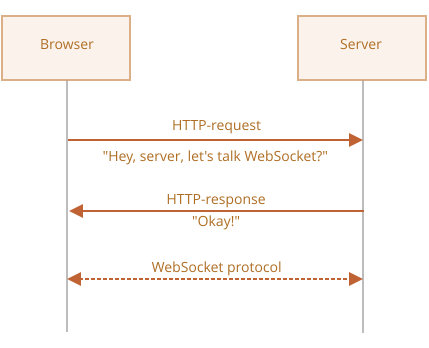

# WebSocket

<<<<<<< HEAD
[RFC 6455](http://tools.ietf.org/html/rfc6455) spetsifikatsiyasida tasvirlangan `WebSocket` protokoli brauzer va server o'rtasida doimiy ulanish orqali ma'lumot almashinuv imkonini beradi. Ma'lumotlar ulanishni uzmasdan va qo'shimcha HTTP-so'rovlarsiz "paketlar" sifatida ikki tomonga ham uzatilishi mumkin.
=======
The `WebSocket` protocol, described in the specification [RFC 6455](https://datatracker.ietf.org/doc/html/rfc6455), provides a way to exchange data between browser and server via a persistent connection. The data can be passed in both directions as "packets", without breaking the connection and the need of additional HTTP-requests.
>>>>>>> 52c1e61915bc8970a950a3f59bd845827e49b4bf

WebSocket doimiy ma'lumot almashuvni talab qiladigan xizmatlar uchun ayniqsa ajoyib, masalan onlayn o'yinlar, real-time savdo tizimlari va hokazo.

## Oddiy misol

Websocket ulanishini ochish uchun url'da maxsus `ws` protokolidan foydalanib `new WebSocket` yaratishimiz kerak:

```js
let socket = new WebSocket("*!*ws*/!*://javascript.info");
```

Shifrlangan `wss://` protokoli ham mavjud. Bu websocket'lar uchun HTTPS kabi.

```smart header="Har doim `wss://` ni afzal ko'ring"
`wss://` protokoli nafaqat shifrlangan, balki yanada ishonchliroq.

Buning sababi `ws://` ma'lumotlari shifrlanmagan, har qanday vositachi uchun ko'rinadi. Eski proksi serverlar WebSocket haqida bilmaydi, ular "g'alati" header'larni ko'rib, ulanishni to'xtatishi mumkin.

<<<<<<< HEAD
Boshqa tomondan, `wss://` - bu TLS ustidagi WebSocket (xuddi HTTPS ning HTTP ustidagi TLS kabi), transport xavfsizlik qatlami ma'lumotlarni yuboruvchida shifrlaydi va qabul qiluvchida ochadi. Shuning uchun ma'lumot paketlari proksilar orqali shifrlangan holda o'tadi. Ular ichida nima borligini ko'ra olmaydi va ularni o'tkazib yuboradi.
=======
On the other hand, `wss://` is WebSocket over TLS, (same as HTTPS is HTTP over TLS), the transport security layer encrypts the data at the sender and decrypts it at the receiver. So data packets are passed encrypted through proxies. They can't see what's inside and let them through.
>>>>>>> 52c1e61915bc8970a950a3f59bd845827e49b4bf
```

Socket yaratilgandan keyin, uning event'larini tinglashimiz kerak. Jami 4 ta event bor:
- **`open`** -- ulanish o'rnatildi,
- **`message`** -- ma'lumot qabul qilindi,
- **`error`** -- websocket xatosi,
- **`close`** -- ulanish yopildi.

...Va agar biror narsa yubormoqchi bo'lsak, `socket.send(data)` buni amalga oshiradi.

Mana misol:

```js run
let socket = new WebSocket("wss://javascript.info/article/websocket/demo/hello");

socket.onopen = function(e) {
  alert("[open] Ulanish o'rnatildi");
  alert("Serverga yuborish");
  socket.send("Mening ismim John");
};

socket.onmessage = function(event) {
  alert(`[message] Serverdan ma'lumot qabul qilindi: ${event.data}`);
};

socket.onclose = function(event) {
  if (event.wasClean) {  
    alert(`[close] Ulanish toza yopildi, kod=${event.code} sabab=${event.reason}`);
  } else {
    // masalan server jarayoni o'ldirilgan yoki tarmoq uzilgan
    // event.code odatda bu holatda 1006 bo'ladi
    alert('[close] Ulanish uzildi');
  }
};

socket.onerror = function(error) {
  alert(`[error]`);
};
```

Demo maqsadida yuqoridagi misol uchun Node.js da yozilgan kichik server [server.js](demo/server.js) ishlamoqda. U "Hello from server, John" deb javob beradi, keyin 5 soniya kutadi va ulanishni yopadi.

Shunday qilib, siz `open` -> `message` -> `close` event'larini ko'rasiz.

Aslida shu, biz allaqachon WebSocket bilan gaplasha olamiz. Juda oddiy, shunday emasmi?

Endi chuqurroq gaplashaylik.

## Websocket ochish

`new WebSocket(url)` yaratilganda, u darhol ulanishni boshlaydi.

<<<<<<< HEAD
Ulanish davomida brauzer (header'lar yordamida) serverdan so'raydi: "Siz Websocket'ni qo'llab-quvvatlaysizmi?" Va agar server "ha" deb javob bersa, suhbat WebSocket protokolida davom etadi, bu umuman HTTP emas.



Mana `new WebSocket("wss://javascript.info/chat")` tomonidan qilingan so'rov uchun brauzer header'larining misoli.
=======
During the connection, the browser (using headers) asks the server: "Do you support Websocket?" And if the server replies "yes", then the talk continues in WebSocket protocol, which is not HTTP at all.


Here's an example of browser headers for a request made by `new WebSocket("wss://javascript.info/chat")`.
>>>>>>> 52c1e61915bc8970a950a3f59bd845827e49b4bf

```
GET /chat
Host: javascript.info
Origin: https://javascript.info
Connection: Upgrade
Upgrade: websocket
Sec-WebSocket-Key: Iv8io/9s+lYFgZWcXczP8Q==
Sec-WebSocket-Version: 13
```

<<<<<<< HEAD
- `Origin` -- mijoz sahifasining origin'i, masalan `https://javascript.info`. WebSocket obyektlari o'z tabiatiga ko'ra cross-origin. Maxsus header'lar yoki boshqa cheklovlar yo'q. Eski serverlar baribir WebSocket bilan ishlay olmaydi, shuning uchun moslashuv muammolari yo'q. Lekin `Origin` header muhim, chunki u serverga ushbu veb-sayt bilan WebSocket gaplashish yoki yo'qligini hal qilish imkonini beradi.
- `Connection: Upgrade` -- mijoz protokolni o'zgartirmoqchi ekanligini bildiradi.
- `Upgrade: websocket` -- so'ralgan protokol "websocket".
- `Sec-WebSocket-Key` -- xavfsizlik uchun brauzer tomonidan yaratilgan tasodifiy kalit.
- `Sec-WebSocket-Version` -- WebSocket protokol versiyasi, 13 joriy versiya.
=======
- `Origin` -- the origin of the client page, e.g. `https://javascript.info`. WebSocket objects are cross-origin by nature. There are no special headers or other limitations. Old servers are unable to handle WebSocket anyway, so there are no compatibility issues. But the `Origin` header is important, as it allows the server to decide whether or not to talk WebSocket with this website.
- `Connection: Upgrade` -- signals that the client would like to change the protocol.
- `Upgrade: websocket` -- the requested protocol is "websocket".
- `Sec-WebSocket-Key` -- a random browser-generated key, used to ensure that the server supports WebSocket protocol. It's random to prevent proxies from caching any following communication.
- `Sec-WebSocket-Version` -- WebSocket protocol version, 13 is the current one.
>>>>>>> 52c1e61915bc8970a950a3f59bd845827e49b4bf

```smart header="WebSocket handshake'ni taqlid qilib bo'lmaydi"
Bunday HTTP-so'rovni qilish uchun `XMLHttpRequest` yoki `fetch` dan foydalana olmaymiz, chunki JavaScript'ga bu header'larni o'rnatishga ruxsat berilmagan.
```

Agar server WebSocket'ga o'tishga rozi bo'lsa, u 101 javob kodini yuborishi kerak:

```
101 Switching Protocols
Upgrade: websocket
Connection: Upgrade
Sec-WebSocket-Accept: hsBlbuDTkk24srzEOTBUlZAlC2g=
```

<<<<<<< HEAD
Bu yerda `Sec-WebSocket-Accept` - bu maxsus algoritm yordamida qayta kodlangan `Sec-WebSocket-Key`. Brauzer buni javob so'rovga mos kelishiga ishonch hosil qilish uchun ishlatadi.

Shundan so'ng ma'lumotlar WebSocket protokoli yordamida uzatiladi, tez orada uning tuzilishini ("frame'lar") ko'ramiz. Va bu umuman HTTP emas.
=======
Here `Sec-WebSocket-Accept` is `Sec-WebSocket-Key`, recoded using a special algorithm. Upon seeing it, the browser understands that the server really does support the WebSocket protocol.

Afterwards, the data is transferred using the WebSocket protocol, we'll see its structure ("frames") soon. And that's not HTTP at all.
>>>>>>> 52c1e61915bc8970a950a3f59bd845827e49b4bf

### Kengaytmalar va subprotokol'lar

`Sec-WebSocket-Extensions` va `Sec-WebSocket-Protocol` kengaytmalar va subprotokol'larni tasvirlaydigan qo'shimcha header'lar bo'lishi mumkin.

Masalan:

<<<<<<< HEAD
- `Sec-WebSocket-Extensions: deflate-frame` brauzer ma'lumot siqilishini qo'llab-quvvatlashini bildiradi. Kengaytma - bu ma'lumot uzatish bilan bog'liq narsa, WebSocket protokolini kengaytiradigan funksionallik. `Sec-WebSocket-Extensions` header'i brauzer tomonidan qo'llab-quvvatlaydigan barcha kengaytmalar ro'yxati bilan avtomatik yuboriladi.

- `Sec-WebSocket-Protocol: soap, wamp` biz faqat har qanday ma'lumot emas, balki [SOAP](http://en.wikipedia.org/wiki/SOAP) yoki WAMP ("The WebSocket Application Messaging Protocol") protokollaridagi ma'lumotlarni uzatmoqchi ekanligimizni bildiradi. WebSocket subprotokol'lari [IANA katalog](http://www.iana.org/assignments/websocket/websocket.xml)ida ro'yxatga olingan. Shunday qilib, bu header biz foydalanadigan ma'lumot formatlarini tasvirlaydi.
=======
- `Sec-WebSocket-Extensions: deflate-frame` means that the browser supports data compression. An extension is something related to transferring the data, functionality that extends the WebSocket protocol. The header `Sec-WebSocket-Extensions` is sent automatically by the browser, with the list of all extensions it supports.

- `Sec-WebSocket-Protocol: soap, wamp` means that we'd like to transfer not just any data, but the data in [SOAP](https://en.wikipedia.org/wiki/SOAP) or WAMP ("The WebSocket Application Messaging Protocol") protocols. WebSocket subprotocols are registered in the [IANA catalogue](https://www.iana.org/assignments/websocket/websocket.xml). So, this header describes the data formats that we're going to use.
>>>>>>> 52c1e61915bc8970a950a3f59bd845827e49b4bf

    Bu ixtiyoriy header `new WebSocket`ning ikkinchi parametri yordamida o'rnatiladi. Bu subprotokol'lar massivi, masalan agar biz SOAP yoki WAMP dan foydalanmoqchi bo'lsak:

    ```js
    let socket = new WebSocket("wss://javascript.info/chat", ["soap", "wamp"]);
    ```

Server foydalanishga rozi bo'lgan protokol va kengaytmalar ro'yxati bilan javob berishi kerak.

Masalan, so'rov:

```
GET /chat
Host: javascript.info
Upgrade: websocket
Connection: Upgrade
Origin: https://javascript.info
Sec-WebSocket-Key: Iv8io/9s+lYFgZWcXczP8Q==
Sec-WebSocket-Version: 13
*!*
Sec-WebSocket-Extensions: deflate-frame
Sec-WebSocket-Protocol: soap, wamp
*/!*
```

Javob:

```
101 Switching Protocols
Upgrade: websocket
Connection: Upgrade
Sec-WebSocket-Accept: hsBlbuDTkk24srzEOTBUlZAlC2g=
*!*
Sec-WebSocket-Extensions: deflate-frame
Sec-WebSocket-Protocol: soap
*/!*
```

Bu yerda server "deflate-frame" kengaytmasini qo'llab-quvvatlashini va so'ralgan subprotokol'lardan faqat SOAP'ni javob berdi.

## Ma'lumot uzatish

WebSocket aloqasi "frame'lar"dan iborat -- bu ikki tomondan yuborilishi mumkin bo'lgan ma'lumot qismlari va bir nechta turga ega bo'lishi mumkin:

- "text frame'lar" -- tomonlar bir-biriga yuboradigan matn ma'lumotlarini o'z ichiga oladi.
- "binary data frame'lar" -- tomonlar bir-biriga yuboradigan ikkilik ma'lumotlarni o'z ichiga oladi.
- "ping/pong frame'lar" ulanishni tekshirish uchun ishlatiladi, serverdan yuboriladi, brauzer ularga avtomatik javob beradi.
- "connection close frame" va bir nechta boshqa xizmat frame'lari ham bor.

Brauzerde biz faqat matn yoki ikkilik frame'lar bilan bevosita ishlaymiz.

**WebSocket `.send()` metodi matn yoki ikkilik ma'lumotlarni yuborishi mumkin.**

<<<<<<< HEAD
`socket.send(body)` chaqiruvi `body` ni string yoki ikkilik formatda, jumladan `Blob`, `ArrayBuffer` va boshqalarda qabul qiladi. Hech qanday sozlash kerak emas: shunchaki har qanday formatda yuboring.
=======
A call `socket.send(body)` allows `body` in string or a binary format, including `Blob`, `ArrayBuffer`, etc. No settings are required: just send it out in any format.
>>>>>>> 52c1e61915bc8970a950a3f59bd845827e49b4bf

**Ma'lumot qabul qilganimizda, matn har doim string sifatida keladi. Ikkilik ma'lumotlar uchun `Blob` va `ArrayBuffer` formatlari o'rtasida tanlov qilishimiz mumkin.**

Bu `socket.binaryType` xususiyati bilan o'rnatiladi, sukut bo'yicha u `"blob"`, shuning uchun ikkilik ma'lumotlar `Blob` obyektlari sifatida keladi.

[Blob](info:blob) - bu yuqori darajali ikkilik obyekt, u `<a>`, `` va boshqa teglar bilan bevosita integratsiyalashadi, shuning uchun bu mantiqiy standart. Lekin ikkilik ishlov berish uchun, alohida ma'lumot baytlariga kirish uchun uni `"arraybuffer"` ga o'zgartirishimiz mumkin:

```js
socket.binaryType = "arraybuffer";
socket.onmessage = (event) => {
  // event.data string (agar matn bo'lsa) yoki arraybuffer (agar ikkilik bo'lsa)
};
```

## Tezlik cheklash

Tasavvur qiling, bizning ilovamiz yuborish uchun juda ko'p ma'lumot ishlab chiqarmoqda. Lekin foydalanuvchining sekin tarmoq ulanishi bor, ehtimol mobil internetda, shahardan tashqarida.

Biz `socket.send(data)` ni qayta-qayta chaqirishimiz mumkin. Lekin ma'lumotlar xotirada buferlashtiriladi (saqlanadi) va faqat tarmoq tezligi ruxsat bergani qadar tez yuboriladi.

`socket.bufferedAmount` xususiyati hozirgi paytda tarmoq orqali yuborilishini kutayotgan necha bayt buferlashtirilganini saqlaydi.

Biz socket haqiqatan ham uzatish uchun mavjudligini ko'rish uchun uni tekshirishimiz mumkin.

```js
// har 100ms da socket'ni tekshiring va ko'proq ma'lumot yuboring  
// faqat mavjud ma'lumotlar yuborilgan bo'lsa
setInterval(() => {
  if (socket.bufferedAmount == 0) {
    socket.send(moreData());
  }
}, 100);
```

## Ulanishni yopish

Odatda, tomon ulanishni yopmoqchi bo'lganda (brauzer ham, server ham teng huquqlarga ega), ular raqamli kod va matnli sabab bilan "connection close frame" yuboradi.

Buning uchun metod:
```js
socket.close([code], [reason]);
```

- `code` - maxsus WebSocket yopish kodi (ixtiyoriy)
- `reason` - yopish sababini tasvirlaydigan string (ixtiyoriy)

<<<<<<< HEAD
Keyin boshqa tomon `close` event handler'ida kod va sababni oladi, masalan:
=======
Then the other party in the `close` event handler gets the code and the reason, e.g.:
>>>>>>> 52c1e61915bc8970a950a3f59bd845827e49b4bf

```js
// yopuvchi tomon:
socket.close(1000, "Ish tugallandi");

// boshqa tomon
socket.onclose = event => {
  // event.code === 1000
  // event.reason === "Ish tugallandi"
  // event.wasClean === true (toza yopish)
};
```

Eng keng tarqalgan kod qiymatlari:

- `1000` -- standart, oddiy yopish (agar `code` berilmagan bo'lsa ishlatiladi),
- `1006` -- bunday kodni qo'lda o'rnatishning yo'li yo'q, ulanish yo'qolganini bildiradi (yopish frame'i yo'q).

Boshqa kodlar ham bor:

- `1001` -- tomon ketmoqda, masalan server o'chirilyapti, yoki brauzer sahifani tark etmoqda,
- `1009` -- xabar qayta ishlash uchun juda katta,
- `1011` -- serverda kutilmagan xato,
- ...va hokazo.

To'liq ro'yxatni [RFC6455, §7.4.1](https://tools.ietf.org/html/rfc6455#section-7.4.1) da topishingiz mumkin.

<<<<<<< HEAD
WebSocket kodlari HTTP kodlariga o'xshash, lekin farqli. Xususan, `1000` dan kichik har qanday kodlar zaxiralangan, bunday kodni o'rnatishga harakat qilsak xato bo'ladi.
=======
WebSocket codes are somewhat like HTTP codes, but different. In particular, codes lower than `1000` are reserved, there'll be an error if we try to set such a code.
>>>>>>> 52c1e61915bc8970a950a3f59bd845827e49b4bf

```js
// ulanish uzilgan holatda
socket.onclose = event => {
  // event.code === 1006
  // event.reason === ""
  // event.wasClean === false (yopish frame'i yo'q)
};
```

## Ulanish holati

Ulanish holatini olish uchun qiymatlar bilan `socket.readyState` xususiyati ham bor:

- **`0`** -- "CONNECTING": ulanish hali o'rnatilmagan,
- **`1`** -- "OPEN": muloqot qilmoqda,
- **`2`** -- "CLOSING": ulanish yopilmoqda,
- **`3`** -- "CLOSED": ulanish yopilgan.

## Chat misoli

Brauzer WebSocket API va Node.js WebSocket moduli <https://github.com/websockets/ws> dan foydalangan holda chat misolini ko'rib chiqaylik. Biz asosiy e'tiborni mijoz tomoniga qaratamiz, lekin server ham oddiy.

HTML: xabar yuborish uchun `<form>` va keluvchi xabarlar uchun `<div>` kerak:

```html
<!-- xabar shakli -->
<form name="publish">
  <input type="text" name="message">
  <input type="submit" value="Yuborish">
</form>

<!-- xabarlar bilan div -->
<div id="messages"></div>
```

JavaScript'dan biz uchta narsa istayamiz:
1. Ulanishni ochish.
2. Shakl yuborilib-- xabar uchun `socket.send(message)`.
3. Keluvchi xabarda -- uni `div#messages` ga qo'shish.

Mana kod:

```js
let socket = new WebSocket("wss://javascript.info/article/websocket/chat/ws");

// shakldan xabar yuborish
document.forms.publish.onsubmit = function() {
  let outgoingMessage = this.message.value;

  socket.send(outgoingMessage);
  return false;
};

// xabar qabul qilindi - xabarni div#messages da ko'rsatish
socket.onmessage = function(event) {
  let message = event.data;

  let messageElem = document.createElement('div');
  messageElem.textContent = message;
  document.getElementById('messages').prepend(messageElem);
}
```

Server-side kodi bizning doiramizdan biroz tashqarida. Bu yerda biz Node.js dan foydalanamiz, lekin shart emas. Boshqa platformalar ham WebSocket bilan ishlashning o'z vositalariga ega.

Server-side algoritmi quyidagicha bo'ladi:

<<<<<<< HEAD
1. `clients = new Set()` yaratish -- socketlar to'plami.
2. Har bir qabul qilingan websocket uchun uni to'plamga qo'shing `clients.add(socket)` va xabarlarini olish uchun `message` event listener o'rnating.
3. Xabar qabul qilinganda: mijozlar bo'ylab takrorlang va hammaga yuboring.
4. Ulanish yopilganda: `clients.delete(socket)`.
=======
1. Create `clients = new Set()` -- a set of sockets.
2. For each accepted websocket, add it to the set `clients.add(socket)` and set `message` event listener to get its messages.
3. When a message is received: iterate over clients and send it to everyone.
4. When a connection is closed: `clients.delete(socket)`.
>>>>>>> 52c1e61915bc8970a950a3f59bd845827e49b4bf

```js
const ws = new require('ws');
const wss = new ws.Server({noServer: true});

const clients = new Set();

http.createServer((req, res) => {
  // bu yerda biz faqat websocket ulanishlarini boshqaramiz
  // haqiqiy loyihada bizda websocket bo'lmagan so'rovlarni boshqarish uchun boshqa kodlar bo'lar edi
  wss.handleUpgrade(req, req.socket, Buffer.alloc(0), onSocketConnect);
});

function onSocketConnect(ws) {
  clients.add(ws);

  ws.on('message', function(message) {
    message = message.slice(0, 50); // maksimal xabar uzunligi 50 bo'ladi

    for(let client of clients) {
      client.send(message);
    }
  });

  ws.on('close', function() {
    clients.delete(ws);
  });
}
```

Mana ishlaydigan misol:

[iframe src="chat" height="100" zip]

<<<<<<< HEAD
Siz uni yuklab olishingiz (iframe'dagi yuqori-o'ng tugma) va mahalliy ishga tushirishingiz ham mumkin. Faqat ishga tushirishdan oldin [Node.js](https://nodejs.org/en/) va `npm install ws` o'rnatishni unutmang.
=======
You can also download it (upper-right button in the iframe) and run it locally. Just don't forget to install [Node.js](https://nodejs.org/en/) and `npm install ws` before running.
>>>>>>> 52c1e61915bc8970a950a3f59bd845827e49b4bf

## Xulosa

WebSocket doimiy brauzer-server ulanishiga ega bo'lishning zamonaviy usuli.

- WebSocket'lar cross-origin cheklovlariga ega emas.
- Ular brauzerlarda yaxshi qo'llab-quvvatlanadi.
- String va ikkilik ma'lumotlarni yuborish/qabul qilish mumkin.

API oddiy.

Metodlar:
- `socket.send(data)`,
- `socket.close([code], [reason])`.

Event'lar:
- `open`,
- `message`,
- `error`,
- `close`.

WebSocket o'zi qayta ulanish, autentifikatsiya va boshqa ko'plab yuqori darajadagi mexanizmlarni o'z ichiga olmaydi. Shuning uchun buning uchun mijoz/server kutubxonalari mavjud va bu imkoniyatlarni qo'lda ham amalga oshirish mumkin.

<<<<<<< HEAD
Ba'zan WebSocket'ni mavjud loyihaga integratsiya qilish uchun odamlar WebSocket serverni asosiy HTTP-server bilan parallel ishga tushiradilar va ular bitta ma'lumotlar bazasini baham ko'radiadi. WebSocket'ga so'rovlar WebSocket serverga olib boradigan `wss://ws.site.com` subdomainidan foydalanadi, `https://site.com` esa asosiy HTTP-serverga boradi.
=======
Sometimes, to integrate WebSocket into existing projects, people run a WebSocket server in parallel with the main HTTP-server, and they share a single database. Requests to WebSocket use `wss://ws.site.com`, a subdomain that leads to the WebSocket server, while `https://site.com` goes to the main HTTP-server.
>>>>>>> 52c1e61915bc8970a950a3f59bd845827e49b4bf

Albatta, integratsiyaning boshqa usullari ham mumkin.