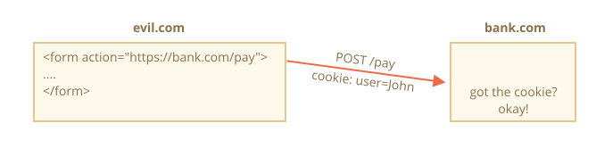
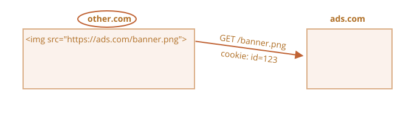

# Cookies, document.cookie

Cookie'lar to'g'ridan-to'g'ri brauzerde saqlanadigan kichik ma'lumot satr'laridir. Ular [RFC 6265](https://tools.ietf.org/html/rfc6265) spetsifikatsiyasi bilan belgilangan HTTP protokolining bir qismidir.

<<<<<<< HEAD
Cookie'lar odatda veb-server tomonidan `Set-Cookie` HTTP-header javobidan foydalanib o'rnatiladi. Keyin brauzer ularni bir xil domanga deyarli har bir so'rovga `Cookie` HTTP-header yordamida avtomatik qo'shadi.
=======
Cookies are usually set by a web server using the response `Set-Cookie` HTTP header. Then, the browser automatically adds them to (almost) every request to the same domain using the `Cookie` HTTP header.
>>>>>>> 5e893cffce8e2346d4e50926d5148c70af172533

Eng keng tarqalgan foydalanish holatlaridan biri autentifikatsiya:

<<<<<<< HEAD
1. Tizimga kirishda server javobda noyob "sessiya identifikatori" bilan cookie o'rnatish uchun `Set-Cookie` HTTP-header'idan foydalanadi.
2. Keyingi safar bir xil domanga so'rov yuborilganda, brauzer `Cookie` HTTP-header yordamida cookie'ni tarmoq orqali yuboradi.
3. Shuning uchun server kim so'rov qilganini biladi.
=======
1. Upon sign-in, the server uses the `Set-Cookie` HTTP header in the response to set a cookie with a unique "session identifier".
2. Next time the request is sent to the same domain, the browser sends the cookie over the net using the `Cookie` HTTP header.
3. So the server knows who made the request.
>>>>>>> 5e893cffce8e2346d4e50926d5148c70af172533

Biz cookie'larga brauzerdan ham `document.cookie` xususiyati orqali kira olamiz.

<<<<<<< HEAD
Cookie'lar va ularning opsiyalari haqida ko'plab murakkab narsalar bor. Ushbu bobda biz ularni batafsil ko'rib chiqamiz.
=======
There are many tricky things about cookies and their attributes. In this chapter, we'll cover them in detail.
>>>>>>> 5e893cffce8e2346d4e50926d5148c70af172533

## document.cookie dan o'qish

```online
Sizning brauzeringiz ushbu saytdan biron cookie'larni saqlaydimi? Keling, ko'raylik:
```

```offline
Veb-saytda ekanligingizni hisobga olsak, undan cookie'larni ko'rishingiz mumkin:
```

```js run
// javascript.info da biz statistika uchun Google Analytics ishlatamiz,
// shuning uchun ba'zi cookie'lar bo'lishi kerak
alert( document.cookie ); // cookie1=value1; cookie2=value2;...
```

`document.cookie` ning qiymati `; ` bilan ajratilgan `name=value` juftliklaridan iborat. Har biri alohida cookie.

<<<<<<< HEAD
Ma'lum bir cookie'ni topish uchun `document.cookie` ni `; ` bo'yicha ajratib, keyin to'g'ri nomni topishimiz mumkin. Buning uchun regular expression yoki array funktsiyalaridan foydalanishimiz mumkin.

Buni o'quvchi uchun mashq sifatida qoldiramiz. Bundan tashqari, bob oxirida cookie'larni boshqarish uchun yordamchi funktsiyalarni topasiz.

## document.cookie ga yozish
=======
The value of `document.cookie` consists of `name=value` pairs, delimited by `; `. Each one is a separate cookie.

To find a particular cookie, we can split `document.cookie` by `; `, and then find the right name. We can use either a regular expression or array functions to do that.

We leave it as an exercise for the reader. Also, at the end of the chapter, you'll find helper functions to manipulate cookies.
>>>>>>> 5e893cffce8e2346d4e50926d5148c70af172533

Biz `document.cookie` ga yoza olamiz. Lekin bu ma'lumot xususiyati emas, bu accessor (getter/setter). Unga tayinlash maxsus ravishda qaraladi.

<<<<<<< HEAD
**`document.cookie` ga yozish operatsiyasi faqat unda eslatilgan cookie'larni yangilaydi, lekin boshqa cookie'larga tegmaydi.**

Masalan, bu chaqiruv `user` nomi va `John` qiymati bilan cookie o'rnatadi:
=======
We can write to `document.cookie`. But it's not a data property, it's an [accessor (getter/setter)](info:property-accessors). An assignment to it is treated specially.

**A write operation to `document.cookie` updates only the cookie mentioned in it and doesn't touch other cookies.**

For instance, this call sets a cookie with the name `user` and value `John`:
>>>>>>> 5e893cffce8e2346d4e50926d5148c70af172533

```js run
document.cookie = "user=John"; // faqat 'user' nomli cookie'ni yangilash
alert(document.cookie); // barcha cookie'larni ko'rsatish
```

<<<<<<< HEAD
Agar siz buni ishga tushirsangiz, ehtimol bir nechta cookie'larni ko'rasiz. Buning sababi `document.cookie=` operatsiyasi barcha cookie'larni qayta yozmaydi. U faqat eslatilgan `user` cookie'sini o'rnatadi.
=======
If you run it, you will likely see multiple cookies. That's because the `document.cookie=` operation does not overwrite all cookies. It only sets the mentioned cookie `user`.
>>>>>>> 5e893cffce8e2346d4e50926d5148c70af172533

Texnik jihatdan, nom va qiymat har qanday belgilarga ega bo'lishi mumkin. To'g'ri formatni saqlash uchun ular o'rnatilgan `encodeURIComponent` funktsiyasi yordamida kodlanishi kerak:

```js run
<<<<<<< HEAD
// maxsus belgilar (bo'shliqlar), kodlash kerak
let name = "mening ismim";
=======
// special characters (spaces) need encoding
let name = "my name";
>>>>>>> 5e893cffce8e2346d4e50926d5148c70af172533
let value = "John Smith"

// cookie'ni my%20name=John%20Smith sifatida kodlaydi
document.cookie = encodeURIComponent(name) + '=' + encodeURIComponent(value);

alert(document.cookie); // ...; my%20name=John%20Smith
```

<<<<<<< HEAD
```warn header="Cheklovlar"
Bir nechta cheklovlar bor:
- `encodeURIComponent` dan keyingi `name=value` juftligi 4KB dan oshmasligi kerak. Shuning uchun cookie'da juda katta narsalarni saqlay olmaymiz.
- Har bir domen uchun cookie'larning umumiy soni taxminan 20+ ga cheklangan, aniq chegara brauzerga bog'liq.
```

Cookie'lar bir nechta opsiyalarga ega, ularning ko'pchiligi muhim va o'rnatilishi kerak.

Opsiyalar `key=value` dan keyin, `;` bilan ajratilgan holda ro'yxatlanadi:
=======

```warn header="Limitations"
There are a few limitations:
- You can only set/update a single cookie at a time using `document.cookie`.
- The `name=value` pair, after `encodeURIComponent`, should not exceed 4KB. So we can't store anything huge in a cookie.
- The total number of cookies per domain is limited to around 20+, the exact limit depends on the browser.
```

Cookies have several attributes, many of which are important and should be set.

The attributes are listed after `key=value`, delimited by `;`, like this:
>>>>>>> 5e893cffce8e2346d4e50926d5148c70af172533

```js run
document.cookie = "user=John; path=/; expires=Tue, 19 Jan 2038 03:14:07 GMT"
```

<<<<<<< HEAD
## path

- **`path=/mypath`**

URL yo'l prefiksi mutlaq bo'lishi kerak. Bu cookie'ni o'sha yo'l ostidagi sahifalar uchun kirish mumkin qiladi. Sukut bo'yicha, bu joriy yo'l.

Agar cookie `path=/admin` bilan o'rnatilgan bo'lsa, u `/admin` va `/admin/something` sahifalarida ko'rinadi, lekin `/home` yoki `/adminpage` da emas.

Odatda biz `path` ni ildizga o'rnatishimiz kerak: `path=/` cookie'ni barcha veb-sayt sahifalaridan kirish mumkin qilish uchun.

=======
>>>>>>> 5e893cffce8e2346d4e50926d5148c70af172533
## domain

- **`domain=site.com`**

Domen cookie qayerda kirish mumkinligini belgilaydi. Amalda cheklovlar bor. Biz har qanday domenni o'rnata olmaymiz.

<<<<<<< HEAD
Sukut bo'yicha, cookie faqat uni o'rnatgan domenda kirish mumkin. Shunday qilib, agar cookie `site.com` tomonidan o'rnatilgan bo'lsa, biz uni `other.com` da olmaymiz.

...Lekin yanada murakkabi, biz cookie'ni subdomen `forum.site.com` da ham olmaymiz!

```js
// site.com da
document.cookie = "user=John"

// forum.site.com da
alert(document.cookie); // user yo'q
```

**Cookie'ni boshqa 2-darajali domendan kirish mumkin qilishning yo'li yo'q, shuning uchun `other.com` hech qachon `site.com` da o'rnatilgan cookie'ni olmaydi.**

Bu xavfsizlik cheklovi, bizga cookie'larda maxfiy ma'lumotlarni saqlash imkonini beradi, bu faqat bitta saytda mavjud bo'lishi kerak.

...Lekin agar biz `forum.site.com` kabi subdomenlarning cookie olishiga ruxsat bermoqchi bo'lsak, bu mumkin. `site.com` da cookie o'rnatishda `domain` opsiyasini ildiz domenga aniq o'rnatishimiz kerak: `domain=site.com`:

```js
// site.com da
// cookie'ni har qanday subdomen *.site.com da kirish mumkin qilish:
document.cookie = "user=John; domain=site.com"
=======
**There's no way to let a cookie be accessible from another 2nd-level domain, so `other.com` will never receive a cookie set at `site.com`.**

It's a safety restriction, to allow us to store sensitive data in cookies that should be available only on one site.

By default, a cookie is accessible only at the domain that set it.

Please note, by default, a cookie is not shared with a subdomain, such as `forum.site.com`.

```js
// if we set a cookie at site.com website...
document.cookie = "user=John"

// ...we won't see it at forum.site.com
alert(document.cookie); // no user
```

...But this can be changed. If we'd like to allow subdomains like `forum.site.com` to get a cookie set at `site.com`, that's possible.

For that to happen, when setting a cookie at `site.com`, we should explicitly set the `domain` attribute to the root domain: `domain=site.com`. Then all subdomains will see such a cookie.

For example:

```js
// at site.com
// make the cookie accessible on any subdomain *.site.com:
document.cookie = "user=John; *!*domain=site.com*/!*"
>>>>>>> 5e893cffce8e2346d4e50926d5148c70af172533

// keyinroq

// forum.site.com da
alert(document.cookie); // user=John cookie'si mavjud
```

<<<<<<< HEAD
Tarixiy sabablarga ko'ra, `domain=.site.com` (`site.com` dan oldingi nuqta) ham xuddi shu tarzda ishlaydi, subdomenlardan cookie'ga kirishga imkon beradi. Bu eski yozuv va agar juda eski brauzerlarni qo'llab-quvvatlashimiz kerak bo'lsa, ishlatilishi kerak.

Shunday qilib, `domain` opsiyasi cookie'ni subdomenlardan kirish mumkin qilish imkonini beradi.

## expires, max-age

Sukut bo'yicha, agar cookie'da ushbu opsiyalardan biri bo'lmasa, brauzer yopilganda u yo'qoladi. Bunday cookie'lar "sessiya cookie'lari" deb ataladi.

Cookie'larning brauzer yopilishidan omon qolishi uchun `expires` yoki `max-age` opsiyasini o'rnatishimiz mumkin.

- **`expires=Tue, 19 Jan 2038 03:14:07 GMT`**

Cookie amal qilish muddati brauzer uni avtomatik o'chiradigan vaqtni belgilaydi.
=======
```warn header="Legacy syntax"
Historically, `domain=.site.com` (with a dot before `site.com`) used to work the same way, allowing access to the cookie from subdomains. Leading dots in domain names are now ignored, but some browsers may decline to set the cookie containing such dots.
```

To summarize, the `domain` attribute allows to make a cookie accessible at subdomains.

## path

- **`path=/mypath`**

The URL path prefix must be absolute. It makes the cookie accessible for pages under that path. By default, it's the current path.

If a cookie is set with `path=/admin`, it's visible on pages `/admin` and `/admin/something`, but not at `/home`, `/home/admin` or `/`.

Usually, we should set `path` to the root: `path=/` to make the cookie accessible from all website pages. If this attribute is not set the default is calculated using [this method](https://developer.mozilla.org/en-US/docs/Web/HTTP/Cookies#path_default_value).

## expires, max-age

By default, if a cookie doesn't have one of these attributes, it disappears when the browser/tab is closed. Such cookies are called "session cookies"

To let cookies survive a browser close, we can set either the `expires` or `max-age` attribute. `max-Age` has precedence if both are set.

- **`expires=Tue, 19 Jan 2038 03:14:07 GMT`**

The cookie expiration date defines the time when the browser will automatically delete it (according to the browser's time zone).
>>>>>>> 5e893cffce8e2346d4e50926d5148c70af172533

Sana aynan shu formatda, GMT vaqt zonasida bo'lishi kerak. Uni olish uchun `date.toUTCString` dan foydalanishimiz mumkin. Masalan, cookie'ni 1 kun ichida tugashiga o'rnatishimiz mumkin:

```js
// hozirgidan +1 kun
let date = new Date(Date.now() + 86400e3);
date = date.toUTCString();
document.cookie = "user=John; expires=" + date;
```

Agar `expires` ni o'tmishdagi sanaga o'rnatsak, cookie o'chiriladi.

-  **`max-age=3600`**

<<<<<<< HEAD
`expires` ga alternativ bo'lib, cookie'ning joriy momentdan boshlab soniyalarda amal qilish muddatini belgilaydi.
=======
It's an alternative to `expires` and specifies the cookie's expiration in seconds from the current moment.
>>>>>>> 5e893cffce8e2346d4e50926d5148c70af172533

Agar nol yoki manfiy qiymatga o'rnatilsa, cookie o'chiriladi:

```js
// cookie hozirgidan +1 soat ichida o'ladi
document.cookie = "user=John; max-age=3600";

// cookie'ni o'chirish (hoziroq tugashini)
document.cookie = "user=John; max-age=0";
```

## secure

- **`secure`**

Cookie faqat HTTPS orqali uzatilishi kerak.

**Sukut bo'yicha, agar biz `http://site.com` da cookie o'rnatsak, u `https://site.com` da ham paydo bo'ladi va aksincha.**

Ya'ni, cookie'lar domenlarga asoslangan, ular protokollarni ajratmaydi.

<<<<<<< HEAD
Ushbu opsiya bilan, agar cookie `https://site.com` tomonidan o'rnatilgan bo'lsa, bir xil sayt HTTP orqali `http://site.com` sifatida kirilganda paydo bo'lmaydi. Shunday qilib, agar cookie'da shifrlash orqali yuborilmasligi kerak bo'lgan maxfiy kontent bo'lsa, `secure` bayrog'i to'g'ri narsa.
=======
With this attribute, if a cookie is set by `https://site.com`, then it doesn't appear when the same site is accessed by HTTP, as `http://site.com`. So if a cookie has sensitive content that should never be sent over unencrypted HTTP, the `secure` flag is the right thing.
>>>>>>> 5e893cffce8e2346d4e50926d5148c70af172533

```js
// https:// da ekanligimizni taxmin qilib
// cookie'ni secure qilish (faqat HTTPS orqali kirish mumkin)
document.cookie = "user=John; secure";
```

## samesite

<<<<<<< HEAD
Bu yana bir xavfsizlik atributi `samesite`. U XSRF (cross-site request forgery) hujumlaridan himoyalash uchun mo'ljallangan.
=======
This is another security attribute `samesite`. It's designed to protect from so-called XSRF (cross-site request forgery) attacks.
>>>>>>> 5e893cffce8e2346d4e50926d5148c70af172533

Uning qanday ishlashini va qachon foydali ekanligini tushunish uchun XSRF hujumlariga qaraylik.

### XSRF hujumi

<<<<<<< HEAD
Tasavvur qiling, siz `bank.com` saytiga kirgansiz. Ya'ni: o'sha saytdan autentifikatsiya cookie'si bor. Sizning brauzeringiz uni har so'rov bilan `bank.com` ga yuboradi, shuning uchun u sizni taniydi va barcha maxfiy moliyaviy operatsiyalarni bajaradi.
=======
Imagine, you are logged into the site `bank.com`. That is: you have an authentication cookie from that site. Your browser sends it to `bank.com` with every request so that it recognizes you and performs all sensitive financial operations.
>>>>>>> 5e893cffce8e2346d4e50926d5148c70af172533

Endi boshqa oynada vebni ko'rib chiqayotganda siz tasodifan boshqa sayt `evil.com` ga keldingiz. O'sha saytda hakerning hisobiga tranzaksiyani boshlaydigan maydonlar bilan `bank.com` ga `<form action="https://bank.com/pay">` shakli yuboradigan JavaScript kodi bor.

<<<<<<< HEAD
Brauzer `bank.com` saytiga har safar kirganingizda cookie'larni yuboradi, hatto forma `evil.com` dan yuborilgan bo'lsa ham. Shuning uchun bank sizni taniydi va to'lovni haqiqatan ham amalga oshiradi.



Bu "Cross-Site Request Forgery" (qisqacha XSRF) hujumi deb ataladi.

Haqiqiy banklar albatta bundan himoyalangan. `bank.com` tomonidan yaratilgan barcha formalarda maxsus maydon, "XSRF himoya tokeni" deb ataladigan narsalar bor, yomon sahifa buni yarata olmaydi yoki masofaviy sahifadan ajrata olmaydi. U formani yuborishi mumkin, lekin ma'lumotni qaytarib ololmaydi. `bank.com` sayt qabul qiladigan har bir formada bunday tokenni tekshiradi.
=======
The browser sends cookies every time you visit the site `bank.com`, even if the form was submitted from `evil.com`. So the bank recognizes you and performs the payment.


This is a so-called "Cross-Site Request Forgery" (in short, XSRF) attack.

Real banks are protected from it of course. All forms generated by `bank.com` have a special field, a so-called "XSRF protection token", that an evil page can't generate or extract from a remote page. It can submit a form there, but can't get the data back. The site `bank.com` checks for such a token in every form it receives.
>>>>>>> 5e893cffce8e2346d4e50926d5148c70af172533

Bunday himoya amalga oshirish vaqt talab qiladi. Har bir formada kerakli token maydoni borligini ta'minlashimiz va barcha so'rovlarni ham tekshirishimiz kerak.

<<<<<<< HEAD
### Cookie samesite opsiyasi

Cookie `samesite` opsiyasi bunday hujumlardan himoyalanishning yana bir usulini taqdim etadi, bu (nazariy jihatdan) "xsrf himoya tokenlarini" talab qilmasligi kerak.
=======
### Use cookie samesite attribute

The cookie `samesite` attribute provides another way to protect from such attacks, that (in theory) should not require "xsrf protection tokens".
>>>>>>> 5e893cffce8e2346d4e50926d5148c70af172533

Uning ikkita mumkin bo'lgan qiymati bor:

<<<<<<< HEAD
- **`samesite=strict` (`samesite` qiymatsiz bilan bir xil)**
=======
- **`samesite=strict`**
>>>>>>> 5e893cffce8e2346d4e50926d5148c70af172533

`samesite=strict` bilan cookie foydalanuvchi bir xil saytdan tashqaridan kelsa hech qachon yuborilmaydi.

<<<<<<< HEAD
Boshqacha qilib aytganda, foydalanuvchi o'z pochtasidan havolaga amal qilsa yoki `evil.com` dan forma yubor sa, yoki boshqa domendan boshqa operatsiyani bajaris , cookie yuborilmaydi.

Agar autentifikatsiya cookie'larida `samesite` opsiyasi bo'lsa, XSRF hujumi muvaffaq bo'lish imkoni yo'q, chunki `evil.com` dan yuborish cookie'larsiz keladi. Shuning uchun `bank.com` foydalanuvchini tanimaydi va to'lov bilan davom etmaydi.

Himoya ancha ishonchli. Faqat `bank.com` dan kelgan operatsiyalar `samesite` cookie'sini yuboradi, masalan `bank.com` dagi boshqa sahifadan forma yuborish.
=======
In other words, whether a user follows a link from their email, submits a form from `evil.com`, or does any operation that originates from another domain, the cookie is not sent.

If authentication cookies have the `samesite=strict` attribute, then an XSRF attack has no chance of succeeding, because a submission from `evil.com` comes without cookies. So `bank.com` will not recognize the user and will not proceed with the payment.

The protection is quite reliable. Only operations that come from `bank.com` will send the `samesite=strict` cookie, e.g. a form submission from another page at `bank.com`.
>>>>>>> 5e893cffce8e2346d4e50926d5148c70af172533

Garchi, kichik noqulaylik bor.

<<<<<<< HEAD
Foydalanuvchi o'z eslatmalaridan kabi `bank.com` ga qonuniy havolaga amal qilganda, `bank.com` uni tanimasligidan hayron bo'ladi. Haqiqatan ham, `samesite=strict` cookie'lari bunday holatda yuborilmaydi.

Biz buni ikkita cookie ishlatib hal qilishimiz mumkin: biri "umumiy tanish" uchun, faqat "Salom, John" deyish maqsadi uchun, ikkinchisi esa `samesite=strict` bilan ma'lumot o'zgartiradigan operatsiyalar uchun. Keyin saytdan tashqaridan kelgan odam xush kelibsizni ko'radi, lekin to'lovlar ikkinchi cookie yuborilishi uchun bank veb-saytidan boshlanishi kerak.
=======
When a user follows a legitimate link to `bank.com`, like from their notes, they'll be surprised that `bank.com` does not recognize them. Indeed, `samesite=strict` cookies are not sent in that case.

We could work around that by using two cookies: one for "general recognition", only to say: "Hello, John", and the other one for data-changing operations with `samesite=strict`. Then, a person coming from outside of the site will see a welcome, but payments must be initiated from the bank's website, for the second cookie to be sent.
>>>>>>> 5e893cffce8e2346d4e50926d5148c70af172533

- **`samesite=lax` (same as `samesite` without value)**

XSRF dan himoyaladigan va foydalanuvchi tajribasini buzmaydigan yanada yumshoq yondashuv.

Lax rejimi, xuddi `strict` kabi, brauzerni saytdan tashqaridan kelganda cookie'lar yuborishni taqiqlaydi, lekin istisno qo'shadi.

`samesite=lax` cookie agar ikkala shart ham to'g'ri bo'lsa yuboriladi:
1. HTTP metodi "xavfsiz" (masalan GET, lekin POST emas).

<<<<<<< HEAD
    Xavfsiz HTTP metodlarning to'liq ro'yxati [RFC7231 spetsifikatsiyasi](https://tools.ietf.org/html/rfc7231) da. Asosan, bular o'qish uchun ishlatilishi kerak bo'lgan metodlar, yozish uchun emas. Ular hech qanday ma'lumot o'zgartiradigan operatsiyalarni bajarmasligi kerak. Havolaga amal qilish har doim GET, xavfsiz metod.
=======
    The full list of safe HTTP methods is in the [RFC7231 specification](https://tools.ietf.org/html/rfc7231#section-4.2.1). These are the methods that should be used for reading, but not writing the data. They must not perform any data-changing operations. Following a link is always GET, the safe method.
>>>>>>> 5e893cffce8e2346d4e50926d5148c70af172533

2. Operatsiya yuqori darajali navigatsiyani amalga oshiradi (brauzer manzil satrida URL ni o'zgartiradi).

<<<<<<< HEAD
    Bu odatda to'g'ri, lekin navigatsiya `<iframe>` da amalga oshirilsa, u yuqori darajada emas. Shuningdek, tarmoq so'rovlari uchun JavaScript metodlari hech qanday navigatsiyani amalga oshirmaydi, shuning uchun ular mos kelmaydi.

Shunday qilib, `samesite=lax` ning qilishi asosan eng keng tarqalgan "URL ga o'tish" operatsiyasiga cookie'lar bo'lishiga ruxsat beradi. Masalan, bu shartlarni qanoatlantiruvchi eslatmalardan veb-sayt havolasini ochish.
=======
    This is usually true, but if the navigation is performed in an `<iframe>`, then it is not top-level. Additionally, JavaScript methods for network requests do not perform any navigation.

So, what `samesite=lax` does, is to allow the most common "go to URL" operation to have cookies. E.g. opening a website link from notes that satisfy these conditions.
>>>>>>> 5e893cffce8e2346d4e50926d5148c70af172533

Lekin yanada murakkab narsa, boshqa saytdan tarmoq so'rovi yoki forma yuborish kabi, cookie'larni yo'qotadi.

Agar bu sizga mos kelsa, `samesite=lax` qo'shish ehtimol foydalanuvchi tajribasini buzmaydi va himoya qo'shadi.

<<<<<<< HEAD
Umuman olganda, `samesite` ajoyib opsiya.
=======
Overall, `samesite` is a great attribute.
>>>>>>> 5e893cffce8e2346d4e50926d5148c70af172533

Kamchiligi bor:

<<<<<<< HEAD
- `samesite` juda eski brauzerlar tomonidan e'tiborga olinmaydi (qo'llab-quvvatlanmaydi), 2017-yil atrofida.
=======
- `samesite` is ignored (not supported) by very old browsers, the year 2017 or so.
>>>>>>> 5e893cffce8e2346d4e50926d5148c70af172533

**Shuning uchun agar biz faqat himoya berish uchun `samesite` ga tayanadigan bo'lsak, eski brauzerlar zaif bo'ladi.**

<<<<<<< HEAD
Lekin biz himoyaning qo'shimcha qatlamini qo'shish uchun `samesite` ni xsrf tokenlari kabi boshqa himoya choralari bilan birga ishlatishimiz mumkin va keyin, kelajakda eski brauzerlar yo'q bo'lganda, ehtimol xsrf tokenlarini tashlab qo'ya olamiz.

## httpOnly

Bu opsiyaning JavaScript bilan hech qanday aloqasi yo'q, lekin to'liqlik uchun uni eslatishimiz kerak.

Veb-server cookie o'rnatish uchun `Set-Cookie` header'idan foydalanadi. Shuningdek, u `httpOnly` opsiyasini o'rnatishi mumkin.

Bu opsiya cookie'ga har qanday JavaScript kirishni taqiqlaydi. Biz bunday cookie'ni ko'ra olmaymiz yoki `document.cookie` yordamida manipulyatsiya qila olmaymiz.

Bu haker sahifaga o'z JavaScript kodini kiritib, foydalanuvchi o'sha sahifaga tashrif buyurishini kutganida ba'zi hujumlardan himoyalanish uchun ehtiyot chorasi sifatida ishlatiladi. Bu umuman mumkin bo'lmasligi kerak, hakerlar bizning saytimizga o'z kodlarini kirita olmasligi kerak, lekin buni amalga oshirishga imkon beruvchi xatolar bo'lishi mumkin.
=======
But we can use `samesite` together with other protection measures, like xsrf tokens, to add a layer of defence and then, in the future, when old browsers die out, we'll probably be able to drop xsrf tokens.

## httpOnly

This attribute has nothing to do with JavaScript, but we have to mention it for completeness.

The web server uses the `Set-Cookie` header to set a cookie. Also, it may set the `httpOnly` attribute.

This attribute forbids any JavaScript access to the cookie. We can't see such a cookie or manipulate it using `document.cookie`.

This is used as a precautionary measure, to protect from certain attacks when a hacker injects his own JavaScript code into a page and waits for a user to visit that page. That shouldn't be possible at all, hackers should not be able to inject their code into our site, but there may be bugs that let them do it.
>>>>>>> 5e893cffce8e2346d4e50926d5148c70af172533

Odatda, agar bunday narsa sodir bo'lsa va foydalanuvchi haker JavaScript kodi bilan veb-sahifaga tashrif buyursa, o'sha kod ijro etiladi va autentifikatsiya ma'lumotlarini o'z ichiga olgan foydalanuvchi cookie'lari bilan `document.cookie` ga kirishni oladi. Bu yomon.

<<<<<<< HEAD
Lekin agar cookie `httpOnly` bo'lsa, `document.cookie` uni ko'rmaydi, shuning uchun u himoyalangan.
=======
Normally, if such a thing happens, and a user visits a web-page with a hacker's JavaScript code, then that code executes and gains access to `document.cookie` with user cookies containing authentication information. That's bad.
>>>>>>> 5e893cffce8e2346d4e50926d5148c70af172533

## Ilova: Cookie funktsiyalari

Mana cookie'lar bilan ishlash uchun kichik funktsiyalar to'plami, `document.cookie` ni qo'lda o'zgartirishdan ko'ra qulayroq.

<<<<<<< HEAD
Buning uchun ko'plab cookie kutubxonalari mavjud, shuning uchun bular demo maqsadlari uchun. Garchi to'liq ishlaydigan.

=======
>>>>>>> 5e893cffce8e2346d4e50926d5148c70af172533
### getCookie(name)

Cookie'ga kirishning eng qisqa yo'li [regular expression](info:regular-expressions) dan foydalanish.

`getCookie(name)` funktsiyasi berilgan `name` bilan cookie'ni qaytaradi:

```js
// berilgan nomdagi cookie'ni qaytaradi,
// topilmasa undefined
function getCookie(name) {
  let matches = document.cookie.match(new RegExp(
    "(?:^|; )" + name.replace(/([\.$?*|{}\(\)\[\]\\\/\+^])/g, '\\$1') + "=([^;]*)"
  ));
  return matches ? decodeURIComponent(matches[1]) : undefined;
}
```

Bu yerda `new RegExp` dinamik ravishda yaratiladi, `; name=<value>` ga mos kelish uchun.

Diqqat qiling, cookie qiymati kodlangan, shuning uchun `getCookie` uni dekodlash uchun o'rnatilgan `decodeURIComponent` funktsiyasidan foydalanadi.

### setCookie(name, value, attributes)

Cookie'ning `name` ini berilgan `value` ga sukut bo'yicha `path=/` bilan o'rnatadi (boshqa standartlarni qo'shish uchun o'zgartirilishi mumkin):

```js run
function setCookie(name, value, attributes = {}) {

  attributes = {
    path: '/',
<<<<<<< HEAD
    // kerak bo'lsa bu yerga boshqa standartlarni qo'shing
    ...options
=======
    // add other defaults here if necessary
    ...attributes
>>>>>>> 5e893cffce8e2346d4e50926d5148c70af172533
  };

  if (attributes.expires instanceof Date) {
    attributes.expires = attributes.expires.toUTCString();
  }

  let updatedCookie = encodeURIComponent(name) + "=" + encodeURIComponent(value);

  for (let attributeKey in attributes) {
    updatedCookie += "; " + attributeKey;
    let attributeValue = attributes[attributeKey];
    if (attributeValue !== true) {
      updatedCookie += "=" + attributeValue;
    }
  }

  document.cookie = updatedCookie;
}

// Foydalanish misoli:
setCookie('user', 'John', {secure: true, 'max-age': 3600});
```

### deleteCookie(name)

Cookie'ni o'chirish uchun uni manfiy amal qilish sanasi bilan chaqirishimiz mumkin:

```js
function deleteCookie(name) {
  setCookie(name, "", {
    'max-age': -1
  })
}
```

<<<<<<< HEAD
```warn header="Yangilash yoki o'chirish bir xil path va domain ishlatishi kerak"
Diqqat qiling: cookie'ni yangilaganimizda yoki o'chirganimizda, uni o'rnatganimizda ishlatgan path va domain opsiyalarini aynan bir xil ishlatishimiz kerak.
=======
```warn header="Updating or deleting must use same path and domain"
Please note: when we update or delete a cookie, we should use exactly the same path and domain attributes as when we set it.
>>>>>>> 5e893cffce8e2346d4e50926d5148c70af172533
```

Birga: [cookie.js](cookie.js).

## Ilova: Uchinchi tomon cookie'lari

Cookie foydalanuvchi tashrif buyurayotgan sahifadan boshqa domen tomonidan joylashtirilgan bo'lsa, "uchinchi tomon" deb ataladi.

Masalan:
1. `site.com` dagi sahifa boshqa saytdan banner yuklaydi: ``.
2. Banner bilan birga, `ads.com` dagi masofaviy server `id=1234` kabi cookie bilan `Set-Cookie` header'ini o'rnatishi mumkin. Bunday cookie `ads.com` domenidan kelib chiqadi va faqat `ads.com` da ko'rinadi:

    

3. Keyingi safar `ads.com` ga kirilganda, masofaviy server `id` cookie'sini oladi va foydalanuvchini taniydi:

    

4. Yanada muhimi, foydalanuvchi `site.com` dan banneri ham bo'lgan boshqa sayt `other.com` ga o'tganda, `ads.com` cookie'ni oladi, chunki u `ads.com` ga tegishli, shuning uchul tashrif buyuruvchini taniydi va u saytlar orasida harakatlanayotganda kuzatib boradi:

    

Uchinchi tomon cookie'lari an'anaviy ravishda kuzatuv va reklama xizmatlari uchun ishlatiladi, ularning tabiatiga ko'ra. Ular kelib chiqqan domenga bog'langan, shuning uchun `ads.com` turli saytlar orasida bir xil foydalanuvchini kuzatib borishi mumkin, agar ularning barchasi unga kirsa.

<<<<<<< HEAD
Tabiiyki, ba'zi odamlar kuzatuvni yoqtirmaydi, shuning uchun brauzerlar bunday cookie'larni o'chirishga imkon beradi.
=======
Third-party cookies are traditionally used for tracking and ads services, due to their nature. They are bound to the originating domain, so `ads.com` can track the same user between different sites, if they all access it.

Naturally, some people don't like being tracked, so browsers allow them to disable such cookies.

Also, some modern browsers employ special policies for such cookies:
- Safari does not allow third-party cookies at all.
- Firefox comes with a "black list" of third-party domains where it blocks third-party cookies.
>>>>>>> 5e893cffce8e2346d4e50926d5148c70af172533

Shuningdek, ba'zi zamonaviy brauzerlar bunday cookie'lar uchun maxsus siyosatlar ishlatadi:
- Safari uchinchi tomon cookie'lariga umuman ruxsat bermaydi.
- Firefox uchinchi tomon cookie'larini bloklaydigan uchinchi tomon domenlarining "qora ro'yxati" bilan keladi.

```smart
Agar biz uchinchi tomon domenidan script yuklasakuchinchi tomon domenidan script yuklasak, masalan `<script src="https://google-analytics.com/analytics.js">`, va bu script cookie o'rnatish uchun `document.cookie` dan foydalansa, bunday cookie uchinchi tomon emas.

Agar script cookie o'rnatsa, script qayerdan kelganidan qat'i nazar -- cookie joriy veb-sahifa domeniga tegishli.
```

## Ilova: GDPR

<<<<<<< HEAD
Bu mavzu JavaScript bilan umuman bog'liq emas, faqat cookie'lar o'rnatishda yodda tutish kerak bo'lgan narsa.

Evropada foydalanuvchilar shaxsiyligini hurmat qilish uchun veb-saytlar qoididlari majmini majburlash uchun GDPR deb ataladigan qonun bor. Bu qoidalardan biri foydalanuvchidan kuzatuv cookie'lari uchun aniq ruxsatni talab qiladi.
=======
This topic is not related to JavaScript at all, it is just something to keep in mind when setting cookies.

There's a legislation in Europe called GDPR, that enforces a set of rules for websites to respect the users' privacy. One of these rules is to require explicit permission for tracking cookies from the user.
>>>>>>> 5e893cffce8e2346d4e50926d5148c70af172533

Diqqat qiling, bu faqat kuzatuv/identifikatsiya/avtorizatsiya cookie'lari haqida.

Shunday qilib, agar biz faqat ba'zi ma'lumotlarni saqlaydigan, lekin foydalanuvchini kuzatmaydigan yoki identifikatsiya qilmaydigan cookie o'rnatsak, uni erkin qilishimiz mumkin.

<<<<<<< HEAD
Lekin agar biz autentifikatsiya sessiyasi yoki kuzatuv id'si bilan cookie o'rnatmoqchi bo'lsak, foydalanuvchi bunga ruxsat berishi kerak.

Veb-saytlarda odatda GDPR ga rioya qilishning ikkita varianti bor. Ikkalasini ham vebda allaqachon ko'rganingiz kerak:
=======
But if we are going to set a cookie with an authentication session or a tracking ID, then a user must allow that.

Websites generally have two variants of complying with GDPR. You are likely to have seen them both on the web:
>>>>>>> 5e893cffce8e2346d4e50926d5148c70af172533

1. Agar veb-sayt kuzatuv cookie'larini faqat autentifikatsiya qilingan foydalanuvchilar uchun o'rnatmoqchi bo'lsa.

    Buning uchun ro'yxatdan o'tish formasida "shaxsiy hayot siyosatini qabul qilaman" (cookie'lar qanday ishlatilishini tasvirlaydigan) kabi checkbox bo'lishi kerak, foydalanuvchi uni belgilashi kerak, keyin veb-sayt auth cookie'larini o'rnatishda erkin.

2. Agar veb-sayt hamma uchun kuzatuv cookie'larini o'rnatmoqchi bo'lsa.

<<<<<<< HEAD
    Buni qonuniy qilish uchun veb-sayt yangi kelganlar uchun modal "splash screen" ko'rsatadi va ulardan cookie'larga rozi bo'lishni talab qiladi. Keyin veb-sayt ularni o'rnatishi va odamlarga kontentni ko'rishga imkon berishi mumkin. Bu yangi tashrif buyuruvchilar uchun bezovta qiluvchi bo'lishi mumkin. Hech kim kontent o'rniga bunday "bosish kerak" modal splash screen'larni ko'rishni yoqtirmaydi. Lekin GDPR aniq kelishuvni talab qiladi.
=======
    To do so legally, a website shows a modal "splash screen" for newcomers and requires them to agree to the cookies. Then the website can set them and let people see the content. That can be disturbing for new visitors though. No one likes to see such "must-click" modal splash screens instead of the content. But GDPR requires an explicit agreement.
>>>>>>> 5e893cffce8e2346d4e50926d5148c70af172533

GDPR faqat cookie'lar haqida emas, balki boshqa shaxsiy hayot bilan bog'liq masalalar haqida ham, lekin bu bizning doiramizdan juda tashqarida.

<<<<<<< HEAD
## Xulosa
=======
GDPR is not only about cookies, it is about other privacy-related issues too, but that is beyond our scope.
>>>>>>> 5e893cffce8e2346d4e50926d5148c70af172533

`document.cookie` cookie'larga kirish imkonini beradi
- yozish operatsiyalari faqat unda eslatilgan cookie'larni o'zgartiradi.
- nom/qiymat kodlanishi kerak.
- bitta cookie 4KB dan oshmasligi kerak, har bir sayt uchun 20+ cookie (brauzerga bog'liq).

Cookie opsiyalari:
- `path=/`, sukut bo'yicha joriy yo'l, cookie'ni faqat o'sha yo'l ostida ko'rinishini ta'minlaydi.
- `domain=site.com`, sukut bo'yicha cookie faqat joriy domenda ko'rinadi. Agar domen aniq o'rnatilgan bo'lsa, cookie subdomenlarda ko'rinadigan bo'ladi.
- `expires` yoki `max-age` cookie amal qilish vaqtini o'rnatadi. Ularsiz cookie brauzer yopilganda o'ladi.
- `secure` cookie'ni faqat HTTPS ga aylantiradi.
- `samesite` brauzerni saytdan tashqaridan kelayotgan so'rovlar bilan cookie yuborishni taqiqlaydi. Bu XSRF hujumlarining oldini olishga yordam beradi.

<<<<<<< HEAD
Qo'shimcha:
- Uchinchi tomon cookie'lari brauzer tomonidan taqiqlanishi mumkin, masalan Safari buni sukut bo'yicha qiladi.
- Yevropa fuqarolari uchun kuzatuv cookie'sini o'rnatishda GDPR ruxsat so'rashni talab qiladi.
=======
`document.cookie` provides access to cookies.
- Write operations modify only the cookie mentioned in it.
- Name/value must be encoded.
- One cookie may not exceed 4KB in size. The number of cookies allowed on a domain is around 20+ (varies by browser).

Cookie attributes:
- `path=/`, by default current path, makes the cookie visible only under that path.
- `domain=site.com`, by default a cookie is visible on the current domain only. If the domain is set explicitly, the cookie becomes visible on subdomains.
- `expires` or `max-age` sets the cookie expiration time. Without them, the cookie dies when the browser is closed.
- `secure` makes the cookie HTTPS-only.
- `samesite` forbids the browser to send the cookie with requests coming from outside the site. This helps to prevent XSRF attacks.

Additionally:
- The browser may forbid third-party cookies, e.g. Safari does that by default. There is also work in progress to implement this in Chrome.
- When setting a tracking cookie for EU citizens, GDPR requires to ask for permission.
>>>>>>> 5e893cffce8e2346d4e50926d5148c70af172533
