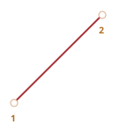
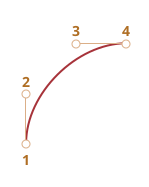
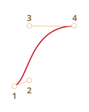
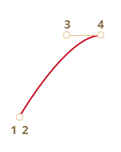
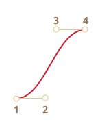
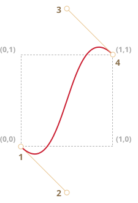

# CSS animatsiyalari

CSS animatsiyalari JavaScript'siz oddiy animatsiyalar yaratish imkonini beradi.

JavaScript CSS animatsiyalarini boshqarish va ularni ozgina kod bilan yanada yaxshilash uchun ishlatilishi mumkin.

## CSS o'tishlar [#css-transition]

CSS o'tishlari g'oyasi oddiy. Biz xususiyatni va uning o'zgarishlarini qanday animatsiya qilish kerakligini tavsiflaymiz. Xususiyat o'zgartirilganda, brauzer animatsiyani chizadi.

Ya'ni, bizga kerak bo'lgan narsa - xususiyatni o'zgartirish, suyuq o'tish esa brauzer tomonidan amalga oshiriladi.

Masalan, quyidagi CSS `background-color` o'zgarishlarini 3 soniya davomida animatsiya qiladi:

```css
.animated {
  transition-property: background-color;
  transition-duration: 3s;
}
```

Endi agar element `.animated` klassiga ega bo'lsa, `background-color` ning har qanday o'zgarishi 3 soniya davomida animatsiya qilinadi.

Fonga animatsiya berish uchun quyidagi tugmani bosing:

```html run autorun height=60
<button id="color">Meni bosing</button>

<style>
  #color {
    transition-property: background-color;
    transition-duration: 3s;
  }
</style>

<script>
  color.onclick = function() {
    this.style.backgroundColor = 'red';
  };
</script>
```

CSS o'tishlarini tavsiflash uchun 4 ta xususiyat mavjud:

- `transition-property`
- `transition-duration`
- `transition-timing-function`
- `transition-delay`

Ularni bir zumda ko'rib chiqamiz, hozircha umumiy `transition` xususiyati ularni birgalikda `property duration timing-function delay` tartibida e'lon qilish imkonini beradi va bir vaqtning o'zida bir nechta xususiyatni animatsiya qilish imkonini beradi.

Masalan, bu tugma ham `color`, ham `font-size`ni animatsiya qiladi:

```html run height=80 autorun no-beautify
<button id="growing">Meni bosing</button>

<style>
#growing {
*!*
  transition: font-size 3s, color 2s;
*/!*
}
</style>

<script>
growing.onclick = function() {
  this.style.fontSize = '36px';
  this.style.color = 'red';
};
</script>
```

Endi keling, animatsiya xususiyatlarini birma-bir ko'rib chiqamiz.

## transition-property

`transition-property`da biz animatsiya qilinadigan xususiyatlar ro'yxatini yozamiz, masalan: `left`, `margin-left`, `height`, `color`. Yoki biz `all` yozishimiz mumkin, bu "barcha xususiyatlarni animatsiya qil" degani.

Shuni ta'kidlaymizki, animatsiya qilinmaydigan xususiyatlar mavjud. Ammo, [ko'pgina odatda ishlatiladigan xususiyatlar animatsiya qilish mumkin](https://developer.mozilla.org/en-US/docs/Web/CSS/CSS_animated_properties).

## transition-duration

<<<<<<< HEAD
`transition-duration`da biz animatsiya qancha davom etishini belgilashimiz mumkin. Vaqt [CSS vaqt formatida](http://www.w3.org/TR/css3-values/#time) bo'lishi kerak: soniyalarda `s` yoki millisioniyalarda `ms`.
=======
In `transition-duration` we can specify how long the animation should take. The time should be in [CSS time format](https://www.w3.org/TR/css3-values/#time): in seconds `s` or milliseconds `ms`.
>>>>>>> 51bc6d3cdc16b6eb79cb88820a58c4f037f3bf19

## transition-delay

`transition-delay`da biz animatsiya *oldidan* kechikishni belgilashimiz mumkin. Masalan, agar `transition-delay` `1s` va `transition-duration` `2s` bo'lsa, animatsiya xususiyat o'zgarishidan 1 soniya keyin boshlanadi va umumiy davomiyligi 2 soniya bo'ladi.

<<<<<<< HEAD
Manfiy qiymatlar ham mumkin. Keyin animatsiya darhol ko'rsatiladi, lekin animatsiyaning boshlang'ich nuqtasi berilgan qiymatdan (vaqt) keyin bo'ladi. Masalan, agar `transition-delay` `-1s` va `transition-duration` `2s` bo'lsa, animatsiya yarim yo'ldan boshlanadi va umumiy davomiyligi 1 soniya bo'ladi.
=======
Negative values are also possible. Then the animation is shown immediately, but the starting point of the animation will be after given value (time). For example, if `transition-delay` is `-1s` and `transition-duration` is `2s`, then animation starts from the halfway point and total duration will be 1 second.
>>>>>>> 51bc6d3cdc16b6eb79cb88820a58c4f037f3bf19

Bu yerda animatsiya CSS `translate` xususiyatidan foydalanib raqamlarni `0`dan `9`gacha siljitadi:

[codetabs src="digits"]

`transform` xususiyati quyidagicha animatsiya qilinadi:

```css
#stripe.animate {
  transform: translate(-90%);
  transition-property: transform;
  transition-duration: 9s;
}
```

Yuqoridagi misolda JavaScript elementga `.animate` klassini qo'shadi -- va animatsiya boshlanadi:

```js
stripe.classList.add('animate');
```

Shuningdek, biz uni o'tishning o'rtasidan, aniq raqamdan, masalan, joriy soniyaga mos keluvchi, manfiy `transition-delay` yordamida boshlashimiz mumkin.

Bu yerda raqamni bossangiz -- u joriy soniyadan animatsiyani boshlaydi:

[codetabs src="digits-negative-delay"]

JavaScript buni qo'shimcha satr bilan qiladi:

```js
stripe.onclick = function() {
  let sec = new Date().getSeconds() % 10;
*!*
  // masalan, bu yerda -3s animatsiyani 3-soniyadan boshlaydi
  stripe.style.transitionDelay = '-' + sec + 's';
*/!*
  stripe.classList.add('animate');
};
```

## transition-timing-function

Timing funksiyasi animatsiya jarayoni uning vaqt chizig'i bo'yicha qanday taqsimlanishini tavsiflaydi. U sekin boshlanib, keyin tez boradimi yoki aksincha.

Dastlab eng murakkab xususiyat bo'lib ko'rinadi. Lekin agar biz unga ozgina vaqt ajratsak, u juda oddiy bo'ladi.

Bu xususiyat ikki xil qiymatni qabul qiladi: Bezier egri chizig'i yoki qadamlar. Keling, egri chiziqdan boshlaylik, chunki u tez-tez ishlatiladi.

### Bezier egri chizig'i

Timing funksiyasi quyidagi shartlarni qondiradigan 4 ta nazorat nuqtasi bilan [Bezier egri chizig'i](/bezier-curve) sifatida o'rnatilishi mumkin:

1. Birinchi nazorat nuqtasi: `(0,0)`.
2. Oxirgi nazorat nuqtasi: `(1,1)`.
3. Oraliq nuqtalar uchun `x` qiymatlari `0..1` intervalida bo'lishi kerak, `y` har qanday bo'lishi mumkin.

CSS da Bezier egri chizig'i sintaksisi: `cubic-bezier(x2, y2, x3, y3)`. Bu yerda biz faqat 2-chi va 3-chi nazorat nuqtalarini belgilashimiz kerak, chunki 1-chi `(0,0)`ga, 4-chisi esa `(1,1)`ga mahkamlangan.

Timing funksiyasi animatsiya jarayoni qanchalik tez borishini tavsiflaydi.

- `x` o'qi vaqt: `0` -- boshlanish, `1` -- `transition-duration` oxiri.
- `y` o'qi jarayonning tugallanishini bildiradi: `0` -- xususiyatning boshlang'ich qiymati, `1` -- yakuniy qiymat.

Eng oddiy variant animatsiya bir xil chiziqli tezlik bilan bir tekis borishidir. Bu `cubic-bezier(0, 0, 1, 1)` egri chizig'i bilan belgilanishi mumkin.

Bu egri chiziq quyidagicha ko'rinadi:



...Ko'rib turganingizdek, bu shunchaki to'g'ri chiziq. Vaqt (`x`) o'tishi bilan animatsiyaning tugallanishi (`y`) barqaror ravishda `0`dan `1`gacha boradi.

Quyidagi misoldagi poyezd chapdan o'ngga doimiy tezlik bilan boradi (uni bosing):

[codetabs src="train-linear"]

CSS `transition` shu egri chiziqqa asoslangan:

```css
.train {
  left: 0;
  transition: left 5s cubic-bezier(0, 0, 1, 1);
<<<<<<< HEAD
  /* JavaScript left ni 450px ga o'rnatadi */
=======
  /* click on a train sets left to 450px, thus triggering the animation */
>>>>>>> 51bc6d3cdc16b6eb79cb88820a58c4f037f3bf19
}
```

...Va poyezdning sekinlashuvini qanday ko'rsatishimiz mumkin?

Biz boshqa Bezier egri chizig'idan foydalanishimiz mumkin: `cubic-bezier(0.0, 0.5, 0.5 ,1.0)`.

Grafik:



Ko'rib turganingizdek, jarayon tez boshlanadi: egri chiziq yuqoriga ko'tariladi, keyin sekinroq va sekinroq.

Timing funksiyasi amalda (poyezdni bosing):

[codetabs src="train"]

CSS:
```css
.train {
  left: 0;
  transition: left 5s cubic-bezier(0, .5, .5, 1);
<<<<<<< HEAD
  /* JavaScript left ni 450px ga o'rnatadi */
=======
  /* click on a train sets left to 450px, thus triggering the animation */
>>>>>>> 51bc6d3cdc16b6eb79cb88820a58c4f037f3bf19
}
```

Bir nechta o'rnatilgan egri chiziqlar mavjud: `linear`, `ease`, `ease-in`, `ease-out` va `ease-in-out`.

`linear` - `cubic-bezier(0, 0, 1, 1)` uchun qisqartma -- to'g'ri chiziq, yuqorida tasvirlagan.

Boshqa nomlar quyidagi `cubic-bezier` uchun qisqartmalar:

| <code>ease</code><sup>*</sup> | <code>ease-in</code> | <code>ease-out</code> | <code>ease-in-out</code> |
|-------------------------------|----------------------|-----------------------|--------------------------|
| <code>(0.25, 0.1, 0.25, 1.0)</code> | <code>(0.42, 0, 1.0, 1.0)</code> | <code>(0, 0, 0.58, 1.0)</code> | <code>(0.42, 0, 0.58, 1.0)</code> |
|  |  |  |  |

`*` -- sukut bo'yicha, agar timing funksiyasi bo'lmasa, `ease` ishlatiladi.

<<<<<<< HEAD
Shunday qilib, sekinlashayotgan poyezd uchun `ease-out` ishlatishimiz mumkin:

=======
>>>>>>> 51bc6d3cdc16b6eb79cb88820a58c4f037f3bf19
```css
.train {
  left: 0;
  transition: left 5s ease-out;
  /* same as transition: left 5s cubic-bezier(0, .5, .5, 1); */
}
```

Lekin u biroz boshqacha ko'rinadi.

**Bezier egri chizig'i animatsiyani o'z oralig'idan oshirib yuborishi mumkin.**

Egri chiziqdagi nazorat nuqtalari har qanday `y` koordinatlariga ega bo'lishi mumkin: hatto manfiy yoki kattaroq. Keyin Bezier egri chizig'i ham juda past yoki baland cho'ziladi va animatsiya normal oralig'idan tashqariga chiqadi.

<<<<<<< HEAD
Quyidagi misolda animatsiya kodi:
=======
In the example below the animation code is:

>>>>>>> 51bc6d3cdc16b6eb79cb88820a58c4f037f3bf19
```css
.train {
  left: 100px;
  transition: left 5s cubic-bezier(.5, -1, .5, 2);
<<<<<<< HEAD
  /* JavaScript left ni 400px ga o'rnatadi */
=======
  /* click on a train sets left to 450px */
>>>>>>> 51bc6d3cdc16b6eb79cb88820a58c4f037f3bf19
}
```

`left` xususiyati `100px`dan `400px`gacha animatsiya qilinishi kerak.

Lekin poyezdni bossangiz, quyidagini ko'rasiz:

- Avval poyezd *orqaga* boradi: `left` `100px`dan kam bo'ladi.
- Keyin u oldinga, `400px`dan biroz uzoqroq boradi.
- Va keyin yana orqaga -- `400px`gacha.

[codetabs src="train-over"]

Nima uchun bu sodir bo'lishi berilgan Bezier egri chizig'ining grafikiga qarash bilan aniq:



Biz 2-nuqtaning `y` koordinatasini noldan pastga surdik va 3-nuqta uchun uni `1`dan yuqori qildik, shuning uchun egri chiziq "oddiy" kvadrantdan chiqadi. `y` "standart" `0..1` oralig'idan tashqarida.

Bilganimizdek, `y` "animatsiya jarayonining tugallanishini" o'lchaydi. `y = 0` qiymati boshlang'ich xususiyat qiymatiga, `y = 1` esa yakuniy qiymatga mos keladi. Shunday qilib, `y<0` qiymatlar xususiyatni boshlang'ich `left`dan tashqariga, `y>1` esa yakuniy `left`dan tashqariga siljitadi.

Bu, albatta, "yumshoq" variant. Agar biz `-99` va `99` kabi `y` qiymatlarini qo'ysak, poyezd oraliqdan ancha tashqariga chiqib ketardi.

<<<<<<< HEAD
Lekin muayyan vazifa uchun Bezier egri chizig'ini qanday yaratamiz? Ko'pgina vositalar mavjud. Masalan, buni <http://cubic-bezier.com/> saytida qilishimiz mumkin.
=======
But how do we make a Bezier curve for a specific task? There are many tools.

- For instance, we can do it on the site <https://cubic-bezier.com>.
- Browser developer tools also have special support for Bezier curves in CSS:
    1. Open the developer tools with `key:F12` (Mac: `key:Cmd+Opt+I`).
    2. Select the `Elements` tab, then pay attention to the `Styles` sub-panel at the right side.
    3. CSS properties with a word `cubic-bezier` will have an icon before this word.
    4. Click this icon to edit the curve.

>>>>>>> 51bc6d3cdc16b6eb79cb88820a58c4f037f3bf19

### Qadamlar

<<<<<<< HEAD
Timing funksiyasi `steps(qadamlar soni[, start/end])` animatsiyani qadamlarga bo'lish imkonini beradi.
=======
The timing function `steps(number of steps[, start/end])` allows splitting an transition into multiple steps.
>>>>>>> 51bc6d3cdc16b6eb79cb88820a58c4f037f3bf19

Keling, buni raqamlar misolida ko'raylik.

Mana animatsiyasiz raqamlar ro'yxati, faqat manba sifatida:

[codetabs src="step-list"]

<<<<<<< HEAD
Biz raqamlarni diskret tarzda paydo qilish uchun qizil "oyna"dan tashqaridagi ro'yxat qismini ko'rinmas qilamiz va har qadamda ro'yxatni chapga siljitamiz.
=======
In the HTML, a stripe of digits is enclosed into a fixed-length `<div id="digits">`:

```html
<div id="digit">
  <div id="stripe">0123456789</div>
</div>
```

The `#digit` div has a fixed width and a border, so it looks like a red window.

We'll make a timer: the digits will appear one by one, in a discrete way.

To achieve that, we'll hide the `#stripe` outside of `#digit` using `overflow: hidden`, and then shift the `#stripe` to the left step-by-step.
>>>>>>> 51bc6d3cdc16b6eb79cb88820a58c4f037f3bf19

9 qadam bo'ladi, har bir raqam uchun qadam-harakat:

```css
#stripe.animate  {
  transform: translate(-90%);
  transition: transform 9s *!*steps(9, start)*/!*;
}
```

<<<<<<< HEAD
Amalda:

[codetabs src="step"]

`steps(9, start)` ning birinchi argumenti qadamlar soni. Transformatsiya 9 qismga bo'linadi (har biri 10%). Vaqt intervali ham avtomatik ravishda 9 qismga bo'linadi, shuning uchun `transition: 9s` bizga butun animatsiya uchun 9 soniya beradi -- har raqam uchun 1 soniya.
=======
The first argument of `steps(9, start)` is the number of steps. The transform will be split into 9 parts (10% each). The time interval is automatically divided into 9 parts as well, so `transition: 9s` gives us 9 seconds for the whole animation – 1 second per digit.
>>>>>>> 51bc6d3cdc16b6eb79cb88820a58c4f037f3bf19

Ikkinchi argument ikkita so'zdan biri: `start` yoki `end`.

`start` degani, animatsiya boshida biz birinchi qadamni darhol qilishimiz kerak.

<<<<<<< HEAD
Buni animatsiya davomida kuzatishimiz mumkin: raqamni bossak, u darhol `1`ga o'zgaradi (birinchi qadam), keyin keyingi soniya boshida o'zgaradi.
=======
In action:

[codetabs src="step"]

A click on the digit changes it to `1` (the first step) immediately, and then changes in the beginning of the next second.
>>>>>>> 51bc6d3cdc16b6eb79cb88820a58c4f037f3bf19

Jarayon quyidagicha boradi:

- `0s` -- `-10%` (1-soniyaning boshida birinchi o'zgarish, darhol)
- `1s` -- `-20%`
- ...
<<<<<<< HEAD
- `8s` -- `-80%`
- (oxirgi soniya yakuniy qiymatni ko'rsatadi).

Muqobil qiymat `end` o'zgarish har soniyaning boshida emas, balki oxirida qo'llanilishi kerakligini bildiradi.

Shunday qilib, jarayon quyidagicha boradi:

- `0s` -- `0`
- `1s` -- `-10%` (1-soniya oxirida birinchi o'zgarish)
=======
- `8s` -- `-90%`
- (the last second shows the final value).

Here, the first change was immediate because of `start` in the `steps`.

The alternative value `end` would mean that the change should be applied not in the beginning, but at the end of each second.

So the process for `steps(9, end)` would go like this:

- `0s` -- `0` (during the first second nothing changes)
- `1s` -- `-10%` (first change at the end of the 1st second)
>>>>>>> 51bc6d3cdc16b6eb79cb88820a58c4f037f3bf19
- `2s` -- `-20%`
- ...
- `9s` -- `-90%`

<<<<<<< HEAD
Mana `steps(9, end)` amalda (birinchi raqam o'zgarishi orasidagi pauza'ga e'tibor bering):

[codetabs src="step-end"]

Qisqartma qiymatlari ham mavjud:
=======
Here's `steps(9, end)` in action (note the pause before the first digit change):

[codetabs src="step-end"]

There are also some pre-defined shorthands for `steps(...)`:
>>>>>>> 51bc6d3cdc16b6eb79cb88820a58c4f037f3bf19

- `step-start` -- `steps(1, start)` bilan bir xil. Ya'ni, animatsiya darhol boshlanadi va 1 qadam oladi. Shunday qilib, u darhol boshlanadi va tugaydi, go'yo animatsiya yo'qdek.
- `step-end` -- `steps(1, end)` bilan bir xil: animatsiyani `transition-duration` oxirida bitta qadamda amalga oshiring.

<<<<<<< HEAD
Bu qiymatlar kamdan-kam ishlatiladi, chunki bu haqiqatan ham animatsiya emas, balki bitta qadam o'zgarishi.

## transitionend hodisasi

CSS animatsiyasi tugaganda `transitionend` hodisasi ishga tushadi.
=======
These values are rarely used, as they represent not a real animation, but rather a single-step change. We mention them here for completeness.

## Event: "transitionend"

When the CSS animation finishes, the `transitionend` event triggers.
>>>>>>> 51bc6d3cdc16b6eb79cb88820a58c4f037f3bf19

U animatsiya tugagandan keyin harakat qilish uchun keng qo'llaniladi. Shuningdek, biz animatsiyalarni birlashtirishimiz mumkin.

Masalan, quyidagi misoldagi kema bosilganda u yerga va qaytganda suzib boradi, har safar o'ngga qarab uzoqroq va uzoqroq:

[iframe src="boat" height=300 edit link]

Animatsiya har safar o'tish tugaganda qayta ishlaydigan va yo'nalishni o'zgartiradigan `go` funksiyasi tomonidan boshlanadi:

```js
boat.onclick = function() {
  //...
  let times = 1;

  function go() {
    if (times % 2) {
      // o'ngga suzish
      boat.classList.remove('back');
      boat.style.marginLeft = 100 * times + 200 + 'px';
    } else {
      // chapga suzish
      boat.classList.add('back');
      boat.style.marginLeft = 100 * times - 200 + 'px';
    }

  }

  go();

  boat.addEventListener('transitionend', function() {
    times++;
    go();
  });
};
```

`transitionend` uchun hodisa ob'ekti bir nechta maxsus xususiyatlarga ega:

`event.propertyName`
: Animatsiyasi tugagan xususiyat. Bir vaqtning o'zida bir nechta xususiyatni animatsiya qilsak foydali bo'lishi mumkin.

`event.elapsedTime`
: Animatsiya olgan vaqt (soniyalarda), `transition-delay`siz.

## Keyframes

Biz `@keyframes` CSS qoidasidan foydalanib bir nechta oddiy animatsiyalarni birlashtirishimiz mumkin.

U animatsiyaning "nomi"ni va qoidalarni belgilaydi - nimani, qachon va qayerda animatsiya qilishni. Keyin `animation` xususiyatidan foydalanib, biz animatsiyani elementga biriktirish va uning uchun qo'shimcha parametrlarni belgilashimiz mumkin.

Mana tushuntirishlar bilan misol:

```html run height=60 autorun="no-epub" no-beautify
<div class="progress"></div>

<style>
*!*
  @keyframes go-left-right {        /* unga nom bering: "go-left-right" */
    from { left: 0px; }             /* left: 0px dan animatsiya qiling */
    to { left: calc(100% - 50px); } /* left: 100%-50px gacha animatsiya qiling */
  }
*/!*

  .progress {
*!*
    animation: go-left-right 3s infinite alternate;
    /* "go-left-right" animatsiyasini elementga qo'llang
       davomiyligi 3 soniya
       marta soni: cheksiz
       har safar yo'nalishni o'zgartiring
    */
*/!*

    position: relative;
    border: 2px solid green;
    width: 50px;
    height: 20px;
    background: lime;
  }
</style>
```

`@keyframes` haqida ko'plab maqolalar va [batafsil spetsifikatsiya](https://drafts.csswg.org/css-animations/) mavjud.

Saytlaringizda hamma narsa doimiy harakatda bo'lmasa, ehtimol sizga `@keyframes` tez-tez kerak bo'lmaydi.

<<<<<<< HEAD
## Xulosa

CSS animatsiyalari bitta yoki bir nechta CSS xususiyatlarining silliq (yoki yo'q) animatsiya o'zgarishlariga imkon beradi.
=======
## Performance

Most CSS properties can be animated, because most of them are numeric values. For instance, `width`, `color`, `font-size` are all numbers. When you animate them, the browser gradually changes these numbers frame by frame, creating a smooth effect.

However, not all animations will look as smooth as you'd like, because different CSS properties cost differently to change.

In more technical details, when there's a style change, the browser goes through 3 steps to render the new look:

1. **Layout**: re-compute the geometry and position of each element, then
2. **Paint**: re-compute how everything should look like at their places, including background, colors,
3. **Composite**: render the final results into pixels on screen, apply CSS transforms if they exist.

During a CSS animation, this process repeats every frame. However, CSS properties that never affect geometry or position, such as `color`, may skip the Layout step. If a `color` changes, the browser  doesn't calculate any new geometry, it goes to Paint -> Composite. And there are few properties that directly go to Composite. You can find a longer list of CSS properties and which stages they trigger at <https://csstriggers.com>.

The calculations may take time, especially on pages with many elements and a complex layout. And the delays are actually visible on most devices, leading to "jittery", less fluid animations.

Animations of properties that skip the Layout step are faster. It's even better if Paint is skipped too.

The `transform` property is a great choice, because:
- CSS transforms affect the target element box as a whole (rotate, flip, stretch, shift it).
- CSS transforms never affect neighbour elements.

...So browsers apply `transform` "on top" of existing Layout and Paint calculations, in the Composite stage.

In other words, the browser calculates the Layout (sizes, positions), paints it with colors, backgrounds, etc at the Paint stage, and then applies `transform` to element boxes that need it.

Changes (animations) of the `transform` property never trigger Layout and Paint steps. More than that, the browser  leverages the graphics accelerator (a special chip on the CPU or graphics card) for CSS transforms, thus making them very efficient.

Luckily, the `transform` property is very powerful. By using `transform` on an element, you could rotate and flip it, stretch and shrink it, move it around, and [much more](https://developer.mozilla.org/docs/Web/CSS/transform#syntax). So instead of `left/margin-left` properties we can use `transform: translateX(…)`, use `transform: scale` for increasing element size, etc.

The `opacity` property also never triggers Layout (also skips Paint in Mozilla Gecko). We can use it for show/hide or fade-in/fade-out effects.

Paring `transform` with `opacity` can usually solve most of our needs, providing fluid, good-looking animations.

For example, here clicking on the `#boat` element adds the class with `transform: translateX(300px)` and `opacity: 0`, thus making it move `300px` to the right and disappear:

```html run height=260 autorun no-beautify


<style>
#boat {
  cursor: pointer;
  transition: transform 2s ease-in-out, opacity 2s ease-in-out;
}

.move {
  transform: translateX(300px);
  opacity: 0;
}
</style>
<script>
  boat.onclick = () => boat.classList.add('move');
</script>
```

Here's a more complex example, with `@keyframes`:

```html run height=80 autorun no-beautify
<h2 onclick="this.classList.toggle('animated')">click me to start / stop</h2>
<style>
  .animated {
    animation: hello-goodbye 1.8s infinite;
    width: fit-content;
  }
  @keyframes hello-goodbye {
    0% {
      transform: translateY(-60px) rotateX(0.7turn);
      opacity: 0;
    }
    50% {
      transform: none;
      opacity: 1;
    }
    100% {
      transform: translateX(230px) rotateZ(90deg) scale(0.5);
      opacity: 0;
    }
  }
</style>
```

## Summary

CSS animations allow smoothly (or step-by-step) animated changes of one or multiple CSS properties.
>>>>>>> 51bc6d3cdc16b6eb79cb88820a58c4f037f3bf19

Ular ko'pchilik animatsiya vazifalari uchun yaxshi. Shuningdek, biz animatsiyalar uchun JavaScript'dan foydalanishimiz mumkin, keyingi bob bunga bag'ishlangan.

JavaScript animatsiyalariga nisbatan CSS animatsiyalarining cheklovlari:

```compare plus="CSS animatsiyalari" minus="JavaScript animatsiyalari"
+ Oddiy ishlar oddiy amalga oshiriladi.
+ CPU uchun tez va yengil.
- JavaScript animatsiyalari moslashuvchan. Ular element "portlashi" kabi har qanday animatsiya mantiqini amalga oshirishi mumkin.
- Faqat xususiyat o'zgarishlari emas. Biz JavaScript'da animatsiyaning bir qismi sifatida yangi elementlar yaratishimiz mumkin.
```

<<<<<<< HEAD
Animatsiyalarning aksariyati ushbu bobda tasvirlanganidek CSS yordamida amalga oshirilishi mumkin. Va `transitionend` hodisasi animatsiyadan keyin JavaScript'ni ishga tushirish imkonini beradi, shuning uchun u kod bilan yaxshi integratsiya qilinadi.
=======
In early examples in this chapter, we animate `font-size`, `left`, `width`, `height`, etc. In real life projects, we should use `transform: scale()` and `transform: translate()` for better performance.

The majority of animations can be implemented using CSS as described in this chapter. And the `transitionend` event allows JavaScript to be run after the animation, so it integrates fine with the code.
>>>>>>> 51bc6d3cdc16b6eb79cb88820a58c4f037f3bf19

Lekin keyingi bobda biz murakkabroq holatlarni qamrab olish uchun JavaScript animatsiyalarini qilamiz.